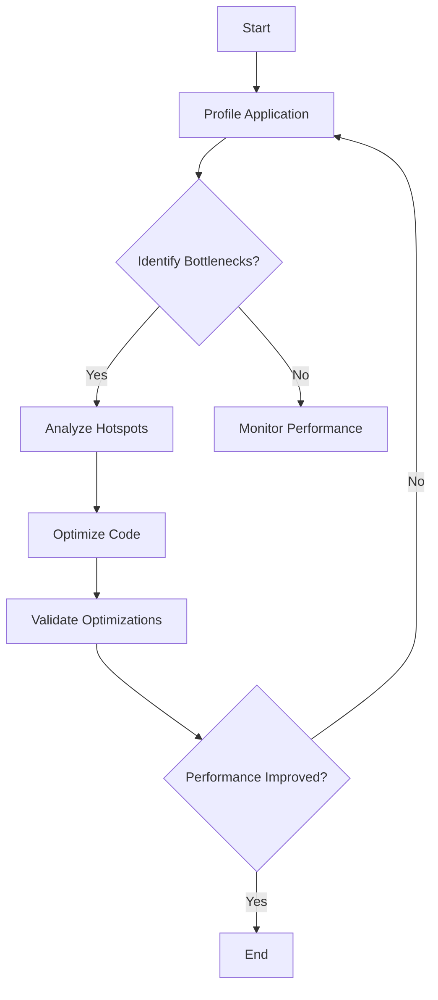

## 22.6. Dealing with Bottlenecks

In the world of software development, performance is a critical factor that can make or break an application. Clojure, with its functional programming paradigm and immutable data structures, offers unique advantages for building efficient applications. However, like any other language, Clojure applications can suffer from performance bottlenecks. In this section, we will explore what bottlenecks are, how they affect performance, and the methodologies and strategies for identifying and resolving them in Clojure applications.

### Understanding Bottlenecks

**Bottlenecks** are points in a system where the performance is limited or constrained, causing the entire system to slow down. They can occur in various parts of an application, such as CPU, memory, I/O operations, or network communication. Identifying and resolving bottlenecks is crucial for optimizing performance and ensuring that applications run smoothly and efficiently.

#### How Bottlenecks Affect Performance

Bottlenecks can lead to several performance issues, including:

- **Increased Latency**: Delays in processing requests or executing tasks.
- **Reduced Throughput**: Lower number of operations or transactions processed per unit of time.
- **Resource Contention**: Competition for limited resources, leading to inefficiencies.
- **System Instability**: Increased likelihood of crashes or failures under load.

### Methodologies for Locating Bottlenecks

Identifying bottlenecks requires a systematic approach and the use of profiling tools to analyze the performance of your application. Here are some methodologies to help locate bottlenecks:

#### 1. Profiling Tools

Profiling tools are essential for analyzing the performance of Clojure applications. They provide insights into how resources are being used and help identify areas that need optimization. Some popular profiling tools for Clojure include:

- **VisualVM**: A visual tool for monitoring and profiling Java applications, including those written in Clojure.
- **YourKit**: A powerful profiler for Java and .NET applications, offering detailed performance analysis.
- **Criterium**: A Clojure library for benchmarking code, providing accurate measurements of execution time.

#### 2. Analyzing Execution Time

Measure the execution time of different parts of your application to identify slow functions or processes. Use Clojure's `time` function or the `criterium` library to benchmark specific code blocks.

```clojure
(require '[criterium.core :as crit])

(defn slow-function []
  (Thread/sleep 1000)
  (+ 1 1))

(crit/quick-bench (slow-function))
```

#### 3. Monitoring Resource Usage

Monitor CPU, memory, and I/O usage to identify resource-intensive operations. Use tools like `jconsole` or `jvisualvm` to track JVM resource consumption.

#### 4. Identifying Hotspots

Hotspots are areas of code that consume a significant amount of resources. Use profiling tools to identify these hotspots and focus optimization efforts on them.

### Strategies for Eliminating or Mitigating Bottlenecks

Once bottlenecks have been identified, the next step is to eliminate or mitigate them. Here are some strategies to consider:

#### 1. Optimize Algorithms and Data Structures

Review and optimize algorithms and data structures to improve efficiency. Consider using more efficient data structures or algorithms that reduce time complexity.

#### 2. Leverage Concurrency

Clojure offers powerful concurrency primitives, such as atoms, refs, agents, and core.async channels, to manage parallel execution and shared state. Use these tools to distribute workloads and reduce contention.

```clojure
(def counter (atom 0))

(defn increment-counter []
  (swap! counter inc))

(dotimes [_ 1000]
  (future (increment-counter)))
```

#### 3. Reduce I/O Operations

Minimize I/O operations, such as disk reads/writes and network requests, as they can be significant bottlenecks. Use caching strategies to store frequently accessed data in memory.

#### 4. Optimize Memory Usage

Reduce memory consumption by using efficient data structures and avoiding unnecessary object creation. Consider using transients for temporary data structures that require mutation.

```clojure
(defn process-data [data]
  (persistent!
    (reduce conj! (transient []) data)))
```

#### 5. Use Lazy Evaluation

Clojure's lazy sequences allow for efficient processing of large data sets by evaluating elements only when needed. Use lazy evaluation to defer computation and reduce memory usage.

```clojure
(defn lazy-sequence []
  (lazy-seq (cons 1 (lazy-sequence))))

(take 10 (lazy-sequence))
```

### Common Bottleneck Scenarios and Solutions

Let's explore some common bottleneck scenarios in Clojure applications and their solutions:

#### Scenario 1: Slow Database Queries

**Solution**: Optimize database queries by indexing frequently accessed columns, using efficient query structures, and caching results when possible.

#### Scenario 2: High CPU Usage

**Solution**: Profile the application to identify CPU-intensive tasks and optimize algorithms or distribute workloads using concurrency primitives.

#### Scenario 3: Memory Leaks

**Solution**: Use memory profiling tools to identify memory leaks and optimize object creation and lifecycle management. Consider using weak references for caching.

#### Scenario 4: Network Latency

**Solution**: Minimize network requests by batching operations, using asynchronous I/O, and caching responses.

### Iterative Testing and Validation of Optimizations

Optimization is an iterative process that requires continuous testing and validation. Follow these steps to ensure that optimizations are effective:

1. **Benchmark Baseline Performance**: Measure the current performance of your application to establish a baseline.
2. **Implement Optimizations**: Apply the identified optimizations to your code.
3. **Re-benchmark Performance**: Measure the performance after optimizations to evaluate their impact.
4. **Validate Results**: Ensure that optimizations do not introduce new issues or regressions.
5. **Repeat**: Continuously monitor and optimize as needed.

### Visualizing Bottleneck Identification and Resolution

To better understand the process of identifying and resolving bottlenecks, let's visualize it using a flowchart:



This flowchart illustrates the iterative process of profiling, identifying bottlenecks, optimizing code, and validating improvements.

### Conclusion

Dealing with bottlenecks in Clojure applications requires a systematic approach to identifying and resolving performance issues. By leveraging profiling tools, optimizing algorithms, and using Clojure's concurrency primitives, you can significantly improve the performance of your applications. Remember, optimization is an ongoing process, and continuous monitoring and testing are essential to maintaining optimal performance.

## **Ready to Test Your Knowledge?**



### What is a bottleneck in software performance?

- [x] A point where performance is limited or constrained
- [ ] An error in the code
- [ ] A type of data structure
- [ ] A feature of Clojure

> **Explanation:** A bottleneck is a point in a system where performance is limited or constrained, causing the entire system to slow down.

### Which tool is used for profiling Clojure applications?

- [x] VisualVM
- [ ] Git
- [ ] Docker
- [ ] Kubernetes

> **Explanation:** VisualVM is a tool used for monitoring and profiling Java applications, including those written in Clojure.

### What is the purpose of using lazy sequences in Clojure?

- [x] To defer computation and reduce memory usage
- [ ] To increase execution time
- [ ] To create mutable data structures
- [ ] To simplify syntax

> **Explanation:** Lazy sequences in Clojure allow for efficient processing of large data sets by evaluating elements only when needed, thus reducing memory usage.

### How can high CPU usage be addressed in Clojure applications?

- [x] By optimizing algorithms and distributing workloads using concurrency primitives
- [ ] By increasing the number of threads
- [ ] By using more memory
- [ ] By reducing the number of functions

> **Explanation:** High CPU usage can be addressed by optimizing algorithms and distributing workloads using concurrency primitives like atoms, refs, and agents.

### What is the role of transients in Clojure?

- [x] To provide temporary mutable data structures for performance optimization
- [ ] To create immutable data structures
- [ ] To handle exceptions
- [ ] To manage namespaces

> **Explanation:** Transients in Clojure provide temporary mutable data structures that can be used for performance optimization.

### Which of the following is a common bottleneck scenario?

- [x] Slow database queries
- [ ] Fast network communication
- [ ] Efficient memory usage
- [ ] Low CPU usage

> **Explanation:** Slow database queries are a common bottleneck scenario that can affect application performance.

### What is the first step in the iterative optimization process?

- [x] Benchmark baseline performance
- [ ] Implement optimizations
- [ ] Validate results
- [ ] Re-benchmark performance

> **Explanation:** The first step in the iterative optimization process is to benchmark the baseline performance to establish a reference point.

### How can network latency be minimized?

- [x] By batching operations and using asynchronous I/O
- [ ] By increasing the number of network requests
- [ ] By using synchronous I/O
- [ ] By reducing the number of servers

> **Explanation:** Network latency can be minimized by batching operations, using asynchronous I/O, and caching responses.

### What is the purpose of using weak references in caching?

- [x] To prevent memory leaks by allowing cached objects to be garbage collected
- [ ] To increase memory usage
- [ ] To create strong references
- [ ] To simplify code

> **Explanation:** Weak references in caching allow cached objects to be garbage collected, preventing memory leaks.

### True or False: Optimization is a one-time process.

- [ ] True
- [x] False

> **Explanation:** Optimization is an ongoing process that requires continuous monitoring and testing to maintain optimal performance.



Remember, this is just the beginning. As you progress, you'll build more complex and interactive applications. Keep experimenting, stay curious, and enjoy the journey!
