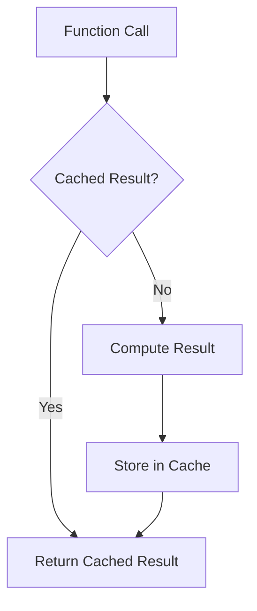

## 22.7. Caching Strategies with Memoization

In the world of software development, performance optimization is a critical aspect that can significantly impact the efficiency and responsiveness of applications. One of the most effective techniques for enhancing performance is caching, which involves storing the results of expensive function calls and reusing them when the same inputs occur again. In this section, we will delve into the concept of memoization, a specific caching strategy, and explore how it can be implemented in Clojure to optimize performance.

### Understanding Memoization

Memoization is a technique used to improve the performance of functions by caching their results. When a memoized function is called with a particular set of arguments, it checks if the result for those arguments is already cached. If so, it returns the cached result instead of recomputing it. This can lead to significant performance gains, especially for functions that are computationally expensive or called frequently with the same arguments.

#### Use Cases for Memoization

Memoization is particularly beneficial in scenarios where:

- **Functions are Pure**: Memoization works best with pure functions, which always produce the same output for the same input and have no side effects.
- **Expensive Computations**: Functions that involve complex calculations or data processing can benefit from memoization by avoiding redundant computations.
- **Repetitive Calls**: Functions that are called multiple times with the same arguments can see performance improvements through memoization.

### Using Clojure's `memoize` Function

Clojure provides a built-in `memoize` function that makes it easy to apply memoization to any function. Let's explore how to use this function effectively.

```clojure
(defn expensive-computation [x]
  (Thread/sleep 1000) ; Simulate a time-consuming operation
  (* x x))

(def memoized-computation (memoize expensive-computation))

;; Example usage
(time (println (memoized-computation 10))) ; Takes time on first call
(time (println (memoized-computation 10))) ; Returns instantly on subsequent calls
```

In the example above, the `expensive-computation` function simulates a time-consuming operation. By memoizing it with `memoize`, subsequent calls with the same argument return instantly, as the result is retrieved from the cache.

### Custom Caching Strategies

While Clojure's `memoize` function is convenient, it uses a simple cache that may not be suitable for all use cases. Custom caching strategies can be implemented to provide more control over cache behavior, such as cache size limits, eviction policies, and expiration times.

#### Implementing a Custom Cache

Let's implement a custom caching strategy using Clojure's data structures.

```clojure
(defn custom-memoize [f]
  (let [cache (atom {})]
    (fn [& args]
      (if-let [cached-result (get @cache args)]
        cached-result
        (let [result (apply f args)]
          (swap! cache assoc args result)
          result)))))

(def custom-memoized-computation (custom-memoize expensive-computation))

;; Example usage
(time (println (custom-memoized-computation 10)))
(time (println (custom-memoized-computation 10)))
```

In this implementation, we use an `atom` to store the cache, allowing us to update it atomically. The `custom-memoize` function checks if the result is already cached and returns it if available. Otherwise, it computes the result, stores it in the cache, and returns it.

### Cache Invalidation

Cache invalidation is a crucial aspect of caching strategies, ensuring that stale or outdated data is not served. In Clojure, cache invalidation can be handled by implementing policies such as:

- **Time-Based Expiration**: Automatically remove cache entries after a certain period.
- **Size-Based Eviction**: Limit the cache size and evict the least recently used (LRU) entries when the limit is reached.
- **Manual Invalidation**: Provide mechanisms to manually clear or update cache entries.

#### Implementing Time-Based Expiration

Let's extend our custom cache to support time-based expiration.

```clojure
(defn custom-memoize-with-expiration [f expiration-ms]
  (let [cache (atom {})]
    (fn [& args]
      (let [current-time (System/currentTimeMillis)
            cached-entry (get @cache args)]
        (if (and cached-entry
                 (< (- current-time (:timestamp cached-entry)) expiration-ms))
          (:result cached-entry)
          (let [result (apply f args)]
            (swap! cache assoc args {:result result :timestamp current-time})
            result))))))

(def memoized-with-expiration (custom-memoize-with-expiration expensive-computation 5000))

;; Example usage
(time (println (memoized-with-expiration 10)))
(Thread/sleep 6000) ; Wait for expiration
(time (println (memoized-with-expiration 10))) ; Recomputes after expiration
```

In this example, each cache entry includes a timestamp, and entries are invalidated if they exceed the specified expiration time.

### When to Use Memoization

Memoization can be a powerful tool, but it's essential to use it judiciously. Consider memoization when:

- **Function Calls are Expensive**: If a function involves heavy computation or I/O operations, memoization can reduce the load.
- **Arguments are Limited**: Functions with a small set of possible arguments benefit more from memoization.
- **Thread Safety is Managed**: Ensure that memoization does not introduce concurrency issues in multi-threaded environments.

### Potential Pitfalls

While memoization offers performance benefits, it also comes with potential drawbacks:

- **Memory Overhead**: Caching results can lead to increased memory usage, especially for functions with a large number of unique arguments.
- **Thread Safety**: In concurrent applications, ensure that cache access is thread-safe to avoid race conditions.
- **Stale Data**: Without proper invalidation strategies, memoization can serve outdated results.

### Visualizing Memoization

To better understand how memoization works, let's visualize the process using a flowchart.



**Figure 1**: Memoization Flowchart - This diagram illustrates the decision-making process in a memoized function, where it checks for a cached result before computing.

### Try It Yourself

Experiment with the provided code examples by:

- Modifying the `expensive-computation` function to simulate different workloads.
- Implementing additional cache invalidation strategies, such as size-based eviction.
- Testing the memoized functions in a multi-threaded environment to explore thread safety considerations.

### Further Reading

For more information on memoization and caching strategies, consider exploring the following resources:

- [Clojure Documentation on Memoization](https://clojure.org/reference/memoization)
- [MDN Web Docs on Caching Strategies](https://developer.mozilla.org/en-US/docs/Web/HTTP/Caching)
- [Wikipedia on Memoization](https://en.wikipedia.org/wiki/Memoization)

### Key Takeaways

- Memoization is a caching technique that stores the results of expensive function calls for reuse.
- Clojure's `memoize` function provides a simple way to apply memoization.
- Custom caching strategies offer more control over cache behavior and invalidation.
- Consider memory overhead, thread safety, and data staleness when using memoization.

Remember, this is just the beginning. As you progress, you'll discover more advanced caching techniques and optimizations. Keep experimenting, stay curious, and enjoy the journey!

## **Ready to Test Your Knowledge?**



### What is memoization primarily used for in Clojure?

- [x] Caching the results of expensive function calls
- [ ] Improving code readability
- [ ] Enhancing security
- [ ] Simplifying syntax

> **Explanation:** Memoization is a technique used to cache the results of expensive function calls to improve performance by avoiding redundant computations.

### Which Clojure function is used for memoization?

- [x] `memoize`
- [ ] `cache`
- [ ] `store`
- [ ] `remember`

> **Explanation:** Clojure provides the `memoize` function to easily apply memoization to any function.

### What is a potential drawback of memoization?

- [x] Increased memory usage
- [ ] Improved performance
- [ ] Simplified code
- [ ] Enhanced security

> **Explanation:** Memoization can lead to increased memory usage due to storing cached results.

### How can cache entries be invalidated based on time?

- [x] Implement time-based expiration
- [ ] Use a larger cache
- [ ] Increase computation time
- [ ] Disable caching

> **Explanation:** Time-based expiration involves automatically removing cache entries after a specified period.

### What is a key consideration when using memoization in concurrent applications?

- [x] Thread safety
- [ ] Code readability
- [ ] Syntax simplicity
- [ ] Security

> **Explanation:** Ensuring thread safety is crucial when using memoization in concurrent applications to avoid race conditions.

### Which of the following is NOT a use case for memoization?

- [ ] Expensive computations
- [ ] Repetitive calls
- [x] Functions with side effects
- [ ] Pure functions

> **Explanation:** Memoization is not suitable for functions with side effects, as it relies on consistent outputs for the same inputs.

### What is a common strategy for limiting cache size?

- [x] Size-based eviction
- [ ] Increasing memory
- [ ] Disabling caching
- [ ] Using larger data structures

> **Explanation:** Size-based eviction involves limiting the cache size and removing the least recently used entries when the limit is reached.

### What is the primary benefit of memoization?

- [x] Performance improvement
- [ ] Code simplification
- [ ] Enhanced security
- [ ] Syntax enhancement

> **Explanation:** Memoization primarily improves performance by caching and reusing results of expensive function calls.

### Which data structure is commonly used for implementing custom caches in Clojure?

- [x] Atom
- [ ] List
- [ ] Vector
- [ ] Set

> **Explanation:** An `atom` is commonly used for implementing custom caches in Clojure due to its ability to update state atomically.

### True or False: Memoization is only beneficial for functions with a large number of unique arguments.

- [ ] True
- [x] False

> **Explanation:** Memoization is more beneficial for functions with a limited set of possible arguments, as it reduces redundant computations for repeated calls.


