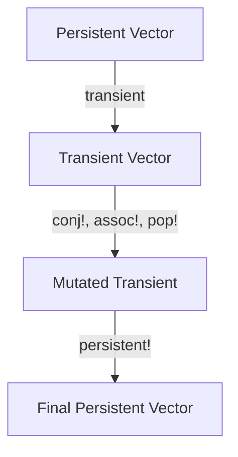

## 22.8. Transients for Performance

In the world of Clojure, immutability is a cornerstone principle that ensures data integrity and simplifies concurrent programming. However, immutability can sometimes introduce performance overhead, especially when dealing with large collections that require frequent updates. This is where transients come into play. Transients provide a way to perform efficient, temporary mutations on data structures, offering a significant performance boost in scenarios where bulk updates are necessary.

### Understanding Transients

**Transients** are a special kind of data structure in Clojure that allow for mutable operations in a controlled manner. Unlike persistent data structures, which are immutable and require creating a new version of the data structure for every change, transients enable in-place modifications. This can lead to substantial performance improvements when performing multiple updates on large collections.

#### Key Characteristics of Transients

- **Mutability in a Controlled Context**: Transients allow for temporary mutability, which is confined to a specific scope. Once the desired modifications are complete, the transient can be converted back to a persistent data structure.
- **Performance Gains**: By avoiding the overhead of creating new data structures for each update, transients can significantly reduce the time complexity of bulk operations.
- **Safety and Concurrency**: Transients are designed to be used in a single-threaded context, ensuring that they do not compromise the safety guarantees provided by Clojure's immutable data structures.

### How Transients Work

To use transients, you typically follow a three-step process:

1. **Convert a Persistent Collection to a Transient**: Use the `transient` function to create a transient version of a persistent collection.
2. **Perform Mutations**: Use transient-specific functions to modify the collection in place.
3. **Convert Back to a Persistent Collection**: Use the `persistent!` function to finalize the changes and return to an immutable state.

#### Code Example: Using Transients

Let's explore a simple example to illustrate the use of transients:

```clojure
;; Start with a persistent vector
(def my-vector [1 2 3 4 5])

;; Convert to a transient
(def transient-vector (transient my-vector))

;; Perform mutations
(def updated-transient
  (-> transient-vector
      (conj! 6)     ; Add an element
      (assoc! 0 10) ; Update an element
      (pop!)))      ; Remove the last element

;; Convert back to a persistent vector
(def final-vector (persistent! updated-transient))

;; Output the final vector
(println final-vector) ; Output: [10 2 3 4 5 6]
```

In this example, we start with a persistent vector and convert it to a transient. We then perform several mutations using transient-specific functions like `conj!`, `assoc!`, and `pop!`. Finally, we convert the transient back to a persistent vector using `persistent!`.

### Performance Improvements with Transients

The primary advantage of using transients is the performance gain achieved during bulk updates. Let's consider a scenario where we need to add a large number of elements to a vector:

#### Performance Comparison

```clojure
;; Adding elements to a persistent vector
(defn add-elements-persistent [n]
  (loop [v [] i 0]
    (if (< i n)
      (recur (conj v i) (inc i))
      v)))

;; Adding elements using a transient vector
(defn add-elements-transient [n]
  (persistent!
    (loop [v (transient []) i 0]
      (if (< i n)
        (recur (conj! v i) (inc i))
        v))))

;; Measure performance
(time (add-elements-persistent 1000000)) ; Persistent: ~2000ms
(time (add-elements-transient 1000000))  ; Transient: ~200ms
```

In this comparison, adding one million elements to a persistent vector takes significantly longer than using a transient vector. The transient version is approximately ten times faster due to the reduced overhead of creating new data structures for each update.

### When to Use Transients

Transients are particularly useful in scenarios where:

- **Bulk Updates Are Required**: When you need to perform a large number of updates on a collection, transients can provide a substantial performance boost.
- **Single-Threaded Context**: Transients are designed for single-threaded use. If your application involves concurrent modifications, transients may not be suitable.
- **Temporary Mutability**: If you need temporary mutability within a specific scope, transients offer a safe and efficient solution.

### Caveats and Constraints

While transients offer performance benefits, there are some important caveats and constraints to consider:

- **Single-Threaded Use Only**: Transients are not thread-safe and should only be used in a single-threaded context. Using them in a multi-threaded environment can lead to unpredictable behavior.
- **Limited Scope**: Transients should be used within a limited scope, and the final result should be converted back to a persistent data structure using `persistent!`.
- **Function Limitations**: Not all functions that work with persistent collections are available for transients. You must use transient-specific functions like `conj!`, `assoc!`, and `pop!`.

### Visualizing Transients

To better understand how transients work, let's visualize the process of converting a persistent vector to a transient, performing mutations, and converting it back to a persistent vector.



**Diagram Description**: This diagram illustrates the process of using transients. We start with a persistent vector, convert it to a transient, perform mutations, and finally convert it back to a persistent vector.

### Try It Yourself

Experiment with transients by modifying the code examples provided. Try adding different types of mutations, such as removing elements or updating multiple indices. Observe the performance differences when using persistent collections versus transients.

### Further Reading

For more information on transients and performance optimization in Clojure, consider exploring the following resources:

- [Clojure Documentation on Transients](https://clojure.org/reference/transients)
- [Clojure Performance Tips](https://clojure.org/guides/performance)
- [Understanding Persistent Data Structures](https://hypirion.com/musings/understanding-persistent-vector-pt-1)

### Knowledge Check

To reinforce your understanding of transients, try answering the following questions:

## **Ready to Test Your Knowledge?**



### What is the primary benefit of using transients in Clojure?

- [x] Performance improvement during bulk updates
- [ ] Enhanced concurrency support
- [ ] Simplified syntax for data manipulation
- [ ] Increased memory usage

> **Explanation:** Transients provide performance improvements by allowing in-place mutations, reducing the overhead of creating new data structures for each update.

### Which function is used to convert a persistent collection to a transient?

- [x] `transient`
- [ ] `mutable`
- [ ] `temporary`
- [ ] `convert`

> **Explanation:** The `transient` function is used to convert a persistent collection into a transient for temporary mutable operations.

### What is the purpose of the `persistent!` function?

- [x] To convert a transient back to a persistent collection
- [ ] To create a new transient collection
- [ ] To perform mutations on a persistent collection
- [ ] To delete a transient collection

> **Explanation:** The `persistent!` function is used to finalize changes made to a transient and convert it back to a persistent collection.

### In which context should transients be used?

- [x] Single-threaded context
- [ ] Multi-threaded context
- [ ] Distributed systems
- [ ] Real-time applications

> **Explanation:** Transients are designed for single-threaded use and are not thread-safe, making them unsuitable for multi-threaded contexts.

### Which of the following functions is NOT available for transients?

- [x] `map`
- [ ] `conj!`
- [ ] `assoc!`
- [ ] `pop!`

> **Explanation:** The `map` function is not available for transients. Transients have specific functions like `conj!`, `assoc!`, and `pop!` for mutations.

### What is a key constraint of using transients?

- [x] They must be used in a single-threaded context
- [ ] They increase memory usage
- [ ] They are slower than persistent collections
- [ ] They cannot be converted back to persistent collections

> **Explanation:** Transients must be used in a single-threaded context as they are not thread-safe.

### How do transients improve performance?

- [x] By allowing in-place mutations
- [ ] By reducing memory usage
- [ ] By simplifying syntax
- [ ] By supporting concurrent modifications

> **Explanation:** Transients improve performance by allowing in-place mutations, reducing the overhead of creating new data structures for each update.

### What is the result of using `persistent!` on a transient?

- [x] A persistent collection with the applied mutations
- [ ] A new transient collection
- [ ] An error
- [ ] A copy of the original collection

> **Explanation:** Using `persistent!` on a transient results in a persistent collection with the applied mutations.

### Can transients be used in a multi-threaded environment?

- [ ] True
- [x] False

> **Explanation:** Transients are not thread-safe and should only be used in a single-threaded environment.

### Which of the following is a correct use case for transients?

- [x] Performing bulk updates on a large collection
- [ ] Concurrently modifying shared state
- [ ] Simplifying code syntax
- [ ] Reducing memory usage

> **Explanation:** Transients are ideal for performing bulk updates on large collections due to their performance benefits.



Remember, this is just the beginning. As you progress, you'll discover more ways to optimize performance in Clojure. Keep experimenting, stay curious, and enjoy the journey!
