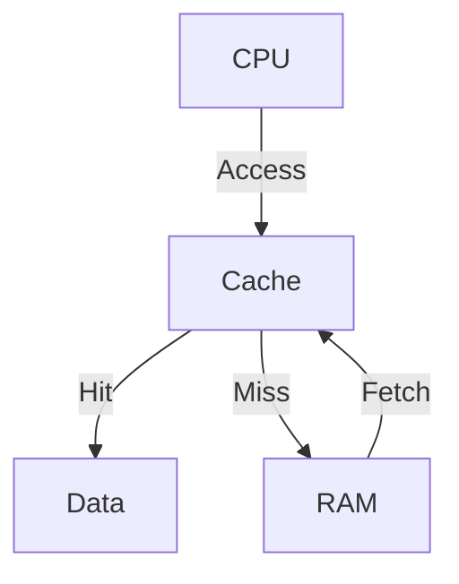

## 22.9. Optimizing for Cache Locality

In the realm of high-performance computing, optimizing for cache locality is a crucial technique that can significantly enhance the speed and efficiency of your applications. This section delves into the concept of CPU cache, the importance of cache locality, and how you can leverage these ideas in Clojure to write more performant code.

### Understanding CPU Cache and Cache Locality

#### What is CPU Cache?

The CPU cache is a small, high-speed storage layer located close to the CPU cores. It stores copies of frequently accessed data from the main memory (RAM), allowing the CPU to access this data much faster than if it had to retrieve it from RAM. The cache is organized into multiple levels (L1, L2, and sometimes L3), with L1 being the smallest and fastest.

#### Why Cache Locality Matters

Cache locality refers to the use of data elements within relatively close storage locations. There are two types of cache locality:

- **Temporal Locality**: If a memory location is accessed, it is likely to be accessed again in the near future.
- **Spatial Locality**: If a memory location is accessed, nearby memory locations are likely to be accessed soon.

Improving cache locality can reduce cache misses, where the CPU has to fetch data from the slower main memory, thus improving overall performance.

### Data Layout Strategies for Improved Cache Performance

#### Structuring Data for Spatial Locality

To enhance spatial locality, consider how data is laid out in memory. Group related data together so that when one piece is accessed, the others are likely to be accessed soon after.

```clojure
;; Example of grouping related data in a vector
(def person-data
  [{:name "Alice" :age 30 :location "New York"}
   {:name "Bob" :age 25 :location "San Francisco"}
   {:name "Charlie" :age 35 :location "Chicago"}])
```

In this example, each person's data is stored together in a map, and all maps are stored in a vector. Accessing one person's data will likely lead to accessing others, benefiting from spatial locality.

#### Optimizing Data Access Patterns

Access patterns can significantly impact cache performance. Sequential access patterns are generally more cache-friendly than random access patterns.

```clojure
;; Sequential access pattern
(doseq [person person-data]
  (println (:name person)))

;; Random access pattern
(println (:name (nth person-data 2)))
```

The sequential access pattern iterates through the data linearly, which is more cache-efficient compared to jumping to random indices.

### Optimizing Loops and Data Access Patterns

#### Loop Unrolling

Loop unrolling is a technique where the loop body is expanded to reduce the overhead of loop control. This can also improve cache performance by accessing more data in a single iteration.

```clojure
;; Regular loop
(dotimes [i 100]
  (println i))

;; Unrolled loop
(dotimes [i 25]
  (println (* 4 i))
  (println (+ 1 (* 4 i)))
  (println (+ 2 (* 4 i)))
  (println (+ 3 (* 4 i))))
```

By unrolling the loop, we reduce the number of iterations and potentially improve cache performance by accessing more data in each iteration.

#### Prefetching Data

Prefetching involves loading data into the cache before it is actually needed, reducing cache misses. While Clojure does not provide explicit prefetching instructions, you can design your algorithms to access data in predictable patterns that the CPU can prefetch.

### Immutability and Cache Locality in Clojure

Clojure's emphasis on immutability can have both positive and negative effects on cache locality. Immutable data structures are often persistent, meaning they share structure between versions, which can lead to non-contiguous memory layouts.

#### Benefits of Immutability

- **Concurrency**: Immutable data structures are inherently thread-safe, which simplifies concurrent programming.
- **Predictability**: Immutable data structures do not change state, making them easier to reason about.

#### Challenges with Cache Locality

- **Non-contiguous Memory**: Persistent data structures may not be stored contiguously in memory, potentially leading to more cache misses.
- **Copy-on-Write**: Modifying an immutable structure often involves creating a new version, which can disrupt cache locality.

### Guidelines for Writing Cache-Friendly Code

1. **Use Vectors for Sequential Access**: Vectors provide efficient indexed access and are stored contiguously in memory, making them more cache-friendly than lists.

2. **Batch Operations**: Perform operations in batches to reduce the overhead of repeated function calls and improve cache locality.

3. **Minimize Indirection**: Avoid excessive use of pointers or references, which can lead to scattered memory access patterns.

4. **Profile and Measure**: Use profiling tools to measure cache performance and identify bottlenecks in your code.

5. **Consider Transients**: For performance-critical sections, consider using transients, which provide mutable versions of Clojure's persistent data structures.

### Visualizing Cache Locality

To better understand how cache locality works, let's visualize the memory access patterns using a simple diagram.



**Diagram Description**: This diagram illustrates the flow of data access from the CPU to the cache and, in case of a cache miss, to the RAM. Optimizing for cache locality aims to maximize cache hits and minimize cache misses.

### Try It Yourself

Experiment with the following code examples to see how different data layouts and access patterns affect performance. Try modifying the data structures and access patterns to observe the impact on cache locality.

```clojure
(defn process-data [data]
  (doseq [item data]
    (println (:value item))))

(def data (vec (map #(hash-map :value %) (range 1000))))

;; Sequential access
(time (process-data data))

;; Random access
(time (doseq [i (shuffle (range 1000))]
        (println (:value (nth data i)))))
```

### Knowledge Check

- What is the primary purpose of the CPU cache?
- How does spatial locality differ from temporal locality?
- Why might immutable data structures pose challenges for cache locality?
- What are some strategies for improving cache locality in Clojure?

### Summary

Optimizing for cache locality is a powerful technique for enhancing the performance of your Clojure applications. By understanding the principles of cache locality and applying strategies to improve data layout and access patterns, you can write more efficient and performant code. Remember, this is just the beginning. As you continue to explore and experiment, you'll discover even more ways to optimize your applications for cache locality.

## **Ready to Test Your Knowledge?**



### What is the primary purpose of the CPU cache?

- [x] To store frequently accessed data for faster retrieval
- [ ] To increase the CPU's clock speed
- [ ] To manage power consumption
- [ ] To handle input/output operations

> **Explanation:** The CPU cache stores frequently accessed data to allow for faster retrieval compared to accessing data from the main memory (RAM).

### How does spatial locality differ from temporal locality?

- [x] Spatial locality refers to accessing nearby memory locations, while temporal locality refers to accessing the same memory location repeatedly.
- [ ] Spatial locality refers to accessing the same memory location repeatedly, while temporal locality refers to accessing nearby memory locations.
- [ ] Both refer to accessing memory locations randomly.
- [ ] Both refer to accessing memory locations sequentially.

> **Explanation:** Spatial locality involves accessing memory locations that are close to each other, while temporal locality involves accessing the same memory location multiple times over a short period.

### Why might immutable data structures pose challenges for cache locality?

- [x] They may lead to non-contiguous memory layouts.
- [ ] They are always stored in the CPU cache.
- [ ] They require more CPU cycles to access.
- [ ] They are inherently slower than mutable structures.

> **Explanation:** Immutable data structures, especially persistent ones, may not be stored contiguously in memory, which can lead to more cache misses.

### What is a benefit of using vectors for sequential access in Clojure?

- [x] Vectors provide efficient indexed access and are stored contiguously in memory.
- [ ] Vectors are always faster than lists.
- [ ] Vectors automatically optimize cache locality.
- [ ] Vectors require less memory than maps.

> **Explanation:** Vectors in Clojure are stored contiguously in memory, making them more cache-friendly for sequential access patterns.

### What is loop unrolling?

- [x] A technique to expand the loop body to reduce loop control overhead.
- [ ] A method to decrease the number of iterations in a loop.
- [ ] A way to increase the number of iterations in a loop.
- [ ] A technique to optimize memory usage.

> **Explanation:** Loop unrolling involves expanding the loop body to reduce the overhead of loop control, potentially improving cache performance by accessing more data in each iteration.

### How can prefetching data improve cache performance?

- [x] By loading data into the cache before it is needed, reducing cache misses.
- [ ] By increasing the size of the cache.
- [ ] By decreasing the size of the cache.
- [ ] By storing data in the main memory.

> **Explanation:** Prefetching involves loading data into the cache before it is actually needed, which can reduce cache misses and improve performance.

### What is a transient in Clojure?

- [x] A mutable version of a persistent data structure for performance-critical sections.
- [ ] A temporary variable that is automatically garbage collected.
- [ ] A type of loop optimization.
- [ ] A method for handling exceptions.

> **Explanation:** Transients in Clojure are mutable versions of persistent data structures, used to improve performance in critical sections.

### What is the impact of excessive indirection on cache locality?

- [x] It can lead to scattered memory access patterns, reducing cache efficiency.
- [ ] It always improves cache locality.
- [ ] It has no impact on cache locality.
- [ ] It increases the size of the cache.

> **Explanation:** Excessive indirection can lead to scattered memory access patterns, which can reduce cache efficiency and increase cache misses.

### What is the role of profiling tools in optimizing cache locality?

- [x] To measure cache performance and identify bottlenecks.
- [ ] To increase the size of the cache.
- [ ] To automatically optimize code for cache locality.
- [ ] To manage memory allocation.

> **Explanation:** Profiling tools help measure cache performance and identify bottlenecks, allowing developers to optimize their code for better cache locality.

### True or False: Immutable data structures in Clojure are always stored contiguously in memory.

- [ ] True
- [x] False

> **Explanation:** Immutable data structures, especially persistent ones, may not be stored contiguously in memory, which can affect cache locality.




