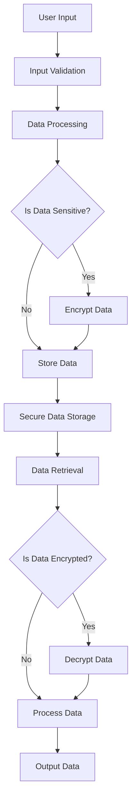

## 23.1. Secure Coding Practices in Clojure

In today's digital landscape, security is paramount. As developers, we must ensure that our applications are robust against potential threats. Clojure, with its functional programming paradigm and immutable data structures, offers unique advantages for secure coding. However, it also requires a mindful approach to security practices. In this section, we will explore secure coding practices in Clojure, focusing on principles like least privilege, input validation, secure defaults, and more.

### Principles of Secure Coding

#### Least Privilege

The principle of least privilege dictates that a system should operate using the least set of privileges necessary to complete its tasks. This minimizes the potential damage from accidents or malicious actions.

- **Implement Role-Based Access Control (RBAC):** Define roles and assign permissions based on the minimum necessary access.
- **Use Clojure's Namespaces:** Leverage namespaces to encapsulate functionality and restrict access to sensitive functions.

#### Input Validation

Input validation is crucial to prevent injection attacks and ensure data integrity.

- **Sanitize Inputs:** Always sanitize inputs from users or external systems. Use libraries like `clojure.string` to clean and validate data.
- **Regular Expressions:** Utilize regular expressions to enforce input formats and constraints.

```clojure
(defn validate-email [email]
  (let [email-regex #"^[^\s@]+@[^\s@]+\.[^\s@]+$"]
    (re-matches email-regex email)))

;; Example usage
(validate-email "example@example.com") ; => true
(validate-email "invalid-email") ; => nil
```

#### Secure Defaults

Secure defaults ensure that applications are safe out of the box.

- **Default to Secure Configurations:** Ensure that default settings are secure, such as enabling HTTPS and disabling unnecessary services.
- **Fail Securely:** Design systems to fail securely, ensuring that errors do not expose sensitive information.

### Handling Data Securely

#### Data Encryption

Encrypt sensitive data both at rest and in transit to protect against unauthorized access.

- **Use Libraries:** Utilize libraries like Buddy for encryption and decryption in Clojure.

```clojure
(require '[buddy.core.crypto :as crypto])

(def secret-key (crypto/generate-key :aes 256))

(defn encrypt-data [data]
  (crypto/encrypt data secret-key))

(defn decrypt-data [encrypted-data]
  (crypto/decrypt encrypted-data secret-key))

;; Example usage
(def encrypted (encrypt-data "Sensitive Information"))
(def decrypted (decrypt-data encrypted))
```

#### Secure Data Storage

Store data securely by using databases with built-in security features and ensuring proper access controls.

- **Database Security:** Use databases that support encryption and access controls. Ensure that database credentials are stored securely.
- **Environment Variables:** Store sensitive configuration data in environment variables instead of hardcoding them in the source code.

### Dependency Management

Keeping dependencies up to date is crucial for maintaining security.

- **Regular Updates:** Regularly update libraries and dependencies to patch known vulnerabilities.
- **Use Dependency Management Tools:** Tools like Leiningen and Deps.edn can help manage dependencies and ensure they are up to date.

### Common Security Mistakes to Avoid

#### Overexposure of Sensitive Data

Avoid exposing sensitive data through logs, error messages, or APIs.

- **Redact Sensitive Information:** Ensure that logs and error messages do not contain sensitive information.
- **API Security:** Use authentication and authorization mechanisms to protect APIs.

#### Inadequate Error Handling

Poor error handling can lead to information leakage and system instability.

- **Graceful Error Handling:** Implement error handling that provides minimal information to the user while logging detailed information for developers.
- **Use `try-catch` Blocks:** Use `try-catch` blocks to handle exceptions and prevent application crashes.

```clojure
(defn safe-divide [a b]
  (try
    (/ a b)
    (catch ArithmeticException e
      (println "Cannot divide by zero"))))

;; Example usage
(safe-divide 10 0) ; => "Cannot divide by zero"
```

### Integrating Security Throughout Development

Security should be an integral part of the development lifecycle.

- **Security Reviews:** Conduct regular security reviews and audits of your codebase.
- **Threat Modeling:** Identify potential threats and design countermeasures early in the development process.
- **Continuous Integration (CI):** Integrate security checks into your CI pipeline to catch vulnerabilities early.

### Visualizing Secure Coding Practices

To better understand secure coding practices, let's visualize the flow of secure data handling in a Clojure application.



**Diagram Description:** This flowchart illustrates the process of handling user input securely in a Clojure application. It includes steps for input validation, data encryption, secure storage, and data retrieval.

### Try It Yourself

To reinforce your understanding, try modifying the code examples provided. Experiment with different input validation rules, encryption algorithms, and error handling strategies. Consider how these changes impact the security of your application.

### References and Links

- [Clojure Documentation](https://clojure.org/)
- [Buddy Library for Clojure](https://funcool.github.io/buddy/latest/)
- [OWASP Secure Coding Practices](https://owasp.org/www-project-secure-coding-practices-quick-reference-guide/)

### Knowledge Check

To ensure you've grasped the key concepts, let's test your knowledge with some questions.

## **Ready to Test Your Knowledge?**



### What is the principle of least privilege?

- [x] Granting the minimum necessary permissions to users and systems
- [ ] Allowing users to access all system resources
- [ ] Providing maximum permissions to administrators
- [ ] Disabling all permissions by default

> **Explanation:** The principle of least privilege involves granting only the permissions necessary for users and systems to perform their tasks, minimizing potential damage from accidents or malicious actions.

### Why is input validation important?

- [x] To prevent injection attacks and ensure data integrity
- [ ] To increase application performance
- [ ] To reduce code complexity
- [ ] To enhance user experience

> **Explanation:** Input validation is crucial for preventing injection attacks and ensuring that data is clean and conforms to expected formats, thereby maintaining data integrity.

### What is a secure default?

- [x] A configuration that ensures safety out of the box
- [ ] A setting that maximizes performance
- [ ] A user-defined configuration
- [ ] A temporary setting for testing

> **Explanation:** Secure defaults are configurations that ensure an application is safe without requiring additional configuration, such as enabling HTTPS by default.

### How should sensitive data be stored?

- [x] Encrypted and with proper access controls
- [ ] In plain text for easy access
- [ ] In a shared folder
- [ ] In the source code

> **Explanation:** Sensitive data should be encrypted and stored with proper access controls to prevent unauthorized access.

### What is the purpose of dependency management?

- [x] To keep libraries and dependencies up to date
- [ ] To reduce application size
- [ ] To simplify code structure
- [ ] To improve user interface

> **Explanation:** Dependency management ensures that libraries and dependencies are up to date, which is crucial for patching known vulnerabilities and maintaining security.

### What should be avoided in error handling?

- [x] Exposing sensitive information
- [ ] Logging errors
- [ ] Using `try-catch` blocks
- [ ] Providing user-friendly messages

> **Explanation:** Error handling should avoid exposing sensitive information to users, while still logging detailed information for developers.

### How can security be integrated into development?

- [x] Through security reviews, threat modeling, and CI integration
- [ ] By focusing solely on performance
- [ ] By ignoring security until deployment
- [ ] By using only open-source tools

> **Explanation:** Security should be integrated throughout the development lifecycle via regular security reviews, threat modeling, and incorporating security checks into the CI pipeline.

### What is the role of encryption in data security?

- [x] To protect data from unauthorized access
- [ ] To increase data processing speed
- [ ] To simplify data storage
- [ ] To enhance user experience

> **Explanation:** Encryption protects data from unauthorized access by converting it into a secure format that can only be read by authorized parties.

### What is a common security mistake?

- [x] Overexposure of sensitive data
- [ ] Using secure defaults
- [ ] Regularly updating dependencies
- [ ] Implementing input validation

> **Explanation:** A common security mistake is overexposing sensitive data through logs, error messages, or APIs, which can lead to data breaches.

### True or False: Security should be considered only during the deployment phase.

- [ ] True
- [x] False

> **Explanation:** Security should be considered throughout the entire development lifecycle, not just during deployment, to ensure robust and secure applications.



Remember, secure coding is an ongoing process. As you continue to develop in Clojure, keep these practices in mind to build applications that are not only functional but also secure. Stay curious, keep learning, and embrace the journey of secure software development!
