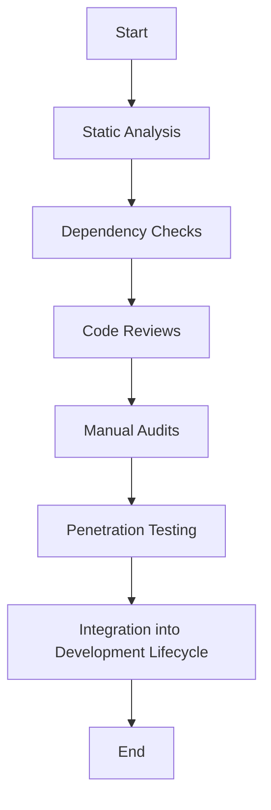

## 23.10. Security Auditing Tools

In today's digital landscape, ensuring the security of software applications is paramount. Clojure, with its functional programming paradigm and robust ecosystem, offers unique opportunities and challenges in maintaining secure applications. This section delves into the essential tools and techniques for auditing Clojure applications, focusing on identifying security weaknesses and ensuring compliance with industry standards.

### Introduction to Security Auditing

Security auditing involves systematically examining an application to identify vulnerabilities, weaknesses, and compliance issues. It encompasses various techniques, including static analysis, dependency checks, code reviews, and penetration testing. By integrating security audits into the development lifecycle, developers can proactively address potential threats and enhance the overall security posture of their applications.

### Static Analysis Tools

Static analysis tools are essential for identifying security issues in code without executing it. These tools analyze the source code to detect vulnerabilities, coding errors, and deviations from best practices.

#### Benefits of Static Analysis

- **Early Detection**: Identify vulnerabilities during the development phase, reducing the cost and effort of fixing them later.
- **Automated Scanning**: Perform comprehensive scans of the codebase to uncover hidden issues.
- **Continuous Integration**: Integrate with CI/CD pipelines to ensure ongoing security checks.

#### Popular Static Analysis Tools for Clojure

1. **Eastwood**: A Clojure lint tool that helps identify potential issues in code, such as unused variables, deprecated functions, and more. It can be integrated into the development workflow to maintain code quality.

   ```clojure
   ;; Example usage of Eastwood
   (defproject my-project "0.1.0-SNAPSHOT"
     :dependencies [[org.clojure/clojure "1.10.3"]]
     :plugins [[jonase/eastwood "0.3.5"]])
   ```

2. **Kibit**: A static analysis tool that suggests idiomatic Clojure code improvements. While primarily focused on code style, it can indirectly enhance security by promoting clearer and more maintainable code.

   ```clojure
   ;; Example usage of Kibit
   (defproject my-project "0.1.0-SNAPSHOT"
     :dependencies [[org.clojure/clojure "1.10.3"]]
     :plugins [[lein-kibit "0.1.8"]])
   ```

3. **clj-kondo**: A linter for Clojure that provides static analysis to catch errors and enforce best practices. It offers features like unused variable detection, type checking, and more.

   ```clojure
   ;; Example usage of clj-kondo
   (defproject my-project "0.1.0-SNAPSHOT"
     :dependencies [[org.clojure/clojure "1.10.3"]]
     :plugins [[clj-kondo "2023.10.01"]])
   ```

### Dependency Checks for Known Vulnerabilities

Dependencies are a critical part of any software project, but they can also introduce vulnerabilities. Regularly checking dependencies for known vulnerabilities is crucial for maintaining a secure application.

#### Using nvd-clojure

**nvd-clojure** is a tool that integrates with the National Vulnerability Database (NVD) to check for known vulnerabilities in project dependencies. It scans the dependencies and reports any vulnerabilities found, allowing developers to take corrective action.

- **Installation and Setup**: Add nvd-clojure as a plugin in your project.

  ```clojure
  ;; Example project.clj configuration
  (defproject my-project "0.1.0-SNAPSHOT"
    :dependencies [[org.clojure/clojure "1.10.3"]]
    :plugins [[lein-nvd "1.4.0"]])
  ```

- **Running a Scan**: Execute the following command to perform a vulnerability scan.

  ```bash
  lein nvd check
  ```

- **Interpreting Results**: Review the generated report to identify and address any vulnerabilities.

### Code Reviews and Manual Audits

Code reviews and manual audits are essential components of a comprehensive security strategy. They involve human inspection of the code to identify potential security issues that automated tools might miss.

#### Best Practices for Code Reviews

- **Peer Reviews**: Encourage team members to review each other's code to gain diverse perspectives.
- **Security Focus**: Include security-specific checks in the review process, such as input validation, authentication, and authorization.
- **Documentation**: Maintain detailed documentation of the review process and findings for future reference.

#### Conducting Manual Audits

Manual audits involve a thorough examination of the codebase to identify security weaknesses. This process requires expertise in security principles and a deep understanding of the application.

- **Checklist Approach**: Use a checklist to ensure all critical areas are covered, such as data handling, error management, and access controls.
- **Threat Modeling**: Identify potential threats and assess the application's resilience against them.

### Penetration Testing

Penetration testing, or ethical hacking, involves simulating attacks on an application to identify vulnerabilities. It provides insights into how an attacker might exploit weaknesses and helps prioritize remediation efforts.

#### Steps in Penetration Testing

1. **Planning**: Define the scope and objectives of the test, including the systems and components to be tested.
2. **Reconnaissance**: Gather information about the target application, such as network architecture and software versions.
3. **Exploitation**: Attempt to exploit identified vulnerabilities to assess their impact.
4. **Reporting**: Document findings and provide recommendations for remediation.

#### Tools for Penetration Testing

- **OWASP ZAP**: An open-source tool for finding vulnerabilities in web applications.
- **Burp Suite**: A comprehensive platform for web application security testing.

### Integrating Security Audits into the Development Lifecycle

Incorporating security audits into the development lifecycle ensures that security is a continuous process rather than a one-time activity. This approach helps maintain a secure application over time.

#### Strategies for Integration

- **Shift Left**: Incorporate security checks early in the development process to catch issues sooner.
- **Continuous Monitoring**: Use automated tools to perform regular security scans and audits.
- **Training and Awareness**: Educate developers about security best practices and emerging threats.

### Visualizing the Security Audit Process

To better understand the security audit process, let's visualize the workflow using a flowchart.



**Figure 1**: Security Audit Process Flowchart

### References and Further Reading

- [Clojure Security Best Practices](https://clojure.org/guides/security)
- [OWASP Top Ten](https://owasp.org/www-project-top-ten/)
- [National Vulnerability Database](https://nvd.nist.gov/)

### Knowledge Check

Let's reinforce your understanding of security auditing tools and techniques with a quiz.

## **Ready to Test Your Knowledge?**



### What is the primary benefit of using static analysis tools in security auditing?

- [x] Early detection of vulnerabilities
- [ ] Reducing code complexity
- [ ] Enhancing application performance
- [ ] Improving user interface design

> **Explanation:** Static analysis tools help identify vulnerabilities during the development phase, allowing for early detection and remediation.

### Which tool is used for checking known vulnerabilities in Clojure project dependencies?

- [ ] Eastwood
- [ ] Kibit
- [x] nvd-clojure
- [ ] clj-kondo

> **Explanation:** nvd-clojure integrates with the National Vulnerability Database to check for known vulnerabilities in project dependencies.

### What is the role of code reviews in security auditing?

- [x] Identifying potential security issues through human inspection
- [ ] Automating security checks
- [ ] Enhancing application performance
- [ ] Reducing code size

> **Explanation:** Code reviews involve human inspection of the code to identify potential security issues that automated tools might miss.

### What is penetration testing?

- [x] Simulating attacks to identify vulnerabilities
- [ ] Automating code reviews
- [ ] Enhancing application performance
- [ ] Reducing code complexity

> **Explanation:** Penetration testing involves simulating attacks on an application to identify vulnerabilities and assess their impact.

### Which tool is commonly used for web application security testing?

- [x] OWASP ZAP
- [ ] Eastwood
- [ ] Kibit
- [ ] clj-kondo

> **Explanation:** OWASP ZAP is an open-source tool for finding vulnerabilities in web applications.

### What does "shift left" mean in the context of security audits?

- [x] Incorporating security checks early in the development process
- [ ] Delaying security checks until deployment
- [ ] Focusing on user interface design
- [ ] Reducing code complexity

> **Explanation:** "Shift left" refers to incorporating security checks early in the development process to catch issues sooner.

### Why is continuous monitoring important in security auditing?

- [x] To perform regular security scans and audits
- [ ] To enhance application performance
- [ ] To reduce code size
- [ ] To improve user interface design

> **Explanation:** Continuous monitoring involves using automated tools to perform regular security scans and audits, ensuring ongoing security.

### What is the purpose of threat modeling in manual audits?

- [x] Identifying potential threats and assessing resilience
- [ ] Automating code reviews
- [ ] Enhancing application performance
- [ ] Reducing code complexity

> **Explanation:** Threat modeling involves identifying potential threats and assessing the application's resilience against them.

### Which of the following is a benefit of integrating security audits into the development lifecycle?

- [x] Maintaining a secure application over time
- [ ] Reducing code size
- [ ] Enhancing application performance
- [ ] Improving user interface design

> **Explanation:** Integrating security audits into the development lifecycle ensures that security is a continuous process, maintaining a secure application over time.

### True or False: Security audits should only be performed once before deployment.

- [ ] True
- [x] False

> **Explanation:** Security audits should be an ongoing process, integrated into the development lifecycle to ensure continuous security.



Remember, security is an ongoing journey. By incorporating these tools and techniques into your development process, you can build robust, secure, and compliant Clojure applications. Keep exploring, stay vigilant, and embrace the challenge of creating secure software!
