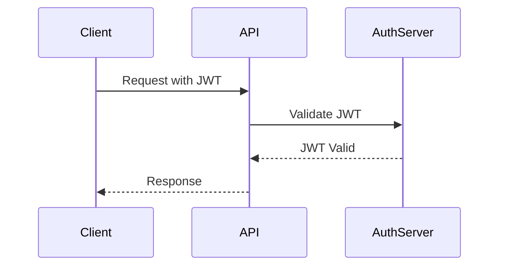

## 23.11. Patterns for Building Secure APIs

In today's interconnected world, building secure APIs is paramount for protecting sensitive data and ensuring the integrity of your applications. Clojure, with its functional programming paradigm and robust ecosystem, provides powerful tools for implementing secure APIs. In this section, we will explore key patterns and practices for designing secure APIs in Clojure, focusing on authentication, authorization, data protection, and more.

### Principles of Secure API Design

Before diving into specific implementations, it's crucial to understand the foundational principles of secure API design:

1. **Authentication and Authorization**: Ensure that only authenticated users can access your API and that they have the appropriate permissions for their actions.
2. **Data Protection**: Protect sensitive data both in transit and at rest using encryption and secure storage practices.
3. **Input Validation**: Validate all incoming data to prevent injection attacks and ensure data integrity.
4. **Rate Limiting**: Implement rate limiting to protect your API from abuse and denial-of-service attacks.
5. **Secure Communication**: Use HTTPS to encrypt data in transit and secure headers to protect against common web vulnerabilities.
6. **Error Handling**: Provide secure error responses that do not leak sensitive information.

### Using Ring Middleware for Security

Ring is a Clojure library that provides a simple and flexible way to build web applications. It uses middleware to handle various aspects of request processing, including security. Let's explore how to use Ring middleware to enhance the security of your APIs.

#### Example: Adding HTTPS and Secure Headers

To ensure secure communication, it's essential to use HTTPS and set secure headers. Here's how you can achieve this with Ring middleware:

```clojure
(ns myapp.middleware
  (:require [ring.middleware.ssl :refer [wrap-ssl-redirect]]
            [ring.middleware.headers :refer [wrap-headers]]))

(defn secure-headers [handler]
  (wrap-headers handler
                {"Strict-Transport-Security" "max-age=31536000; includeSubDomains"
                 "X-Content-Type-Options" "nosniff"
                 "X-Frame-Options" "DENY"
                 "X-XSS-Protection" "1; mode=block"}))

(def app
  (-> my-handler
      (wrap-ssl-redirect)
      (secure-headers)))
```

In this example, `wrap-ssl-redirect` ensures that all HTTP requests are redirected to HTTPS, while `wrap-headers` adds several security headers to protect against common vulnerabilities.

### Implementing Token-Based Authentication with JWT

Token-based authentication is a popular method for securing APIs. JSON Web Tokens (JWT) are a compact, URL-safe means of representing claims to be transferred between two parties. Let's see how to implement JWT authentication in a Clojure API.

#### Example: JWT Authentication Middleware

```clojure
(ns myapp.auth
  (:require [buddy.auth :refer [authenticated?]]
            [buddy.auth.middleware :refer [wrap-authentication]]
            [buddy.auth.backends.token :refer [jws-backend]]))

(def secret "my-secret-key")

(def auth-backend
  (jws-backend {:secret secret}))

(defn my-handler [request]
  (if (authenticated? request)
    {:status 200 :body "Welcome!"}
    {:status 401 :body "Unauthorized"}))

(def app
  (wrap-authentication my-handler auth-backend))
```

In this example, we use the `buddy` library to create a JWT authentication backend. The `wrap-authentication` middleware checks if the request is authenticated and allows access accordingly.

### Rate Limiting and Input Validation

To protect your API from abuse, it's essential to implement rate limiting and input validation.

#### Example: Rate Limiting Middleware

```clojure
(ns myapp.rate-limit
  (:require [ring.middleware.throttle :refer [wrap-throttle]]))

(def app
  (-> my-handler
      (wrap-throttle {:limit 100 :interval 60000}))) ; 100 requests per minute
```

#### Example: Input Validation

```clojure
(ns myapp.validation
  (:require [schema.core :as s]))

(def UserSchema
  {:username s/Str
   :password s/Str})

(defn validate-user [user]
  (s/validate UserSchema user))
```

In these examples, `wrap-throttle` limits the number of requests a client can make, while `schema.core` is used to validate incoming data against a predefined schema.

### Secure Error Responses

When handling errors, it's important to avoid leaking sensitive information. Here's how you can provide secure error responses:

```clojure
(ns myapp.error
  (:require [ring.middleware.defaults :refer [wrap-defaults site-defaults]]))

(defn error-handler [handler]
  (fn [request]
    (try
      (handler request)
      (catch Exception e
        {:status 500 :body "Internal Server Error"}))))

(def app
  (-> my-handler
      (error-handler)
      (wrap-defaults site-defaults)))
```

### Importance of HTTPS and Secure Headers

Using HTTPS and secure headers is crucial for protecting data in transit and preventing common web vulnerabilities. Always ensure that your API is accessible only over HTTPS and that secure headers are set to protect against attacks such as XSS and clickjacking.

### Visualizing Secure API Architecture

To better understand the flow of secure API requests, let's visualize the architecture using a sequence diagram:



This diagram illustrates the process of a client making a request to an API with a JWT, the API validating the token with an authentication server, and then responding to the client.

### References and Further Reading

- [Ring Middleware Documentation](https://github.com/ring-clojure/ring)
- [Buddy Authentication Library](https://funcool.github.io/buddy-auth/latest/)
- [OWASP Secure Headers Project](https://owasp.org/www-project-secure-headers/)

### Knowledge Check

Let's reinforce what we've learned with some questions and exercises.

1. **What is the purpose of using HTTPS in API communication?**
2. **How does JWT authentication work in Clojure?**
3. **Why is input validation important for API security?**
4. **What are some common security headers you should include in your API responses?**

### Embrace the Journey

Remember, building secure APIs is an ongoing process. As you continue to develop and refine your APIs, keep security at the forefront of your design and implementation decisions. Stay curious, keep learning, and enjoy the journey of creating robust and secure applications!

## **Ready to Test Your Knowledge?**



### What is the primary purpose of using HTTPS in API communication?

- [x] To encrypt data in transit
- [ ] To improve API performance
- [ ] To simplify API development
- [ ] To reduce server load

> **Explanation:** HTTPS encrypts data in transit, ensuring that sensitive information is protected from interception.

### Which library is commonly used for JWT authentication in Clojure?

- [x] Buddy
- [ ] Ring
- [ ] Compojure
- [ ] Aleph

> **Explanation:** The Buddy library provides tools for implementing JWT authentication in Clojure applications.

### What is the role of input validation in API security?

- [x] To prevent injection attacks
- [ ] To enhance API performance
- [ ] To simplify code maintenance
- [ ] To reduce server load

> **Explanation:** Input validation helps prevent injection attacks by ensuring that incoming data meets expected criteria.

### Which of the following is a common security header?

- [x] X-Content-Type-Options
- [ ] Content-Length
- [ ] User-Agent
- [ ] Accept-Language

> **Explanation:** The X-Content-Type-Options header is used to prevent MIME type sniffing.

### What is the purpose of rate limiting in API security?

- [x] To prevent abuse and denial-of-service attacks
- [ ] To improve API performance
- [ ] To simplify API development
- [ ] To reduce server load

> **Explanation:** Rate limiting helps prevent abuse and denial-of-service attacks by limiting the number of requests a client can make.

### How does the `wrap-ssl-redirect` middleware enhance API security?

- [x] By redirecting HTTP requests to HTTPS
- [ ] By validating JWT tokens
- [ ] By compressing API responses
- [ ] By logging API requests

> **Explanation:** The `wrap-ssl-redirect` middleware ensures that all HTTP requests are redirected to HTTPS, enhancing security.

### What is a benefit of using secure error responses?

- [x] To avoid leaking sensitive information
- [ ] To improve API performance
- [ ] To simplify code maintenance
- [ ] To reduce server load

> **Explanation:** Secure error responses prevent the leakage of sensitive information that could be exploited by attackers.

### Which middleware is used for setting security headers in Ring?

- [x] wrap-headers
- [ ] wrap-authentication
- [ ] wrap-throttle
- [ ] wrap-defaults

> **Explanation:** The `wrap-headers` middleware is used to set security headers in Ring applications.

### What is the function of the `jws-backend` in JWT authentication?

- [x] To validate JWT tokens
- [ ] To compress API responses
- [ ] To log API requests
- [ ] To redirect HTTP requests to HTTPS

> **Explanation:** The `jws-backend` is used to validate JWT tokens in authentication processes.

### True or False: Secure APIs should only be accessible over HTTP.

- [ ] True
- [x] False

> **Explanation:** Secure APIs should be accessible over HTTPS to ensure data is encrypted in transit.


