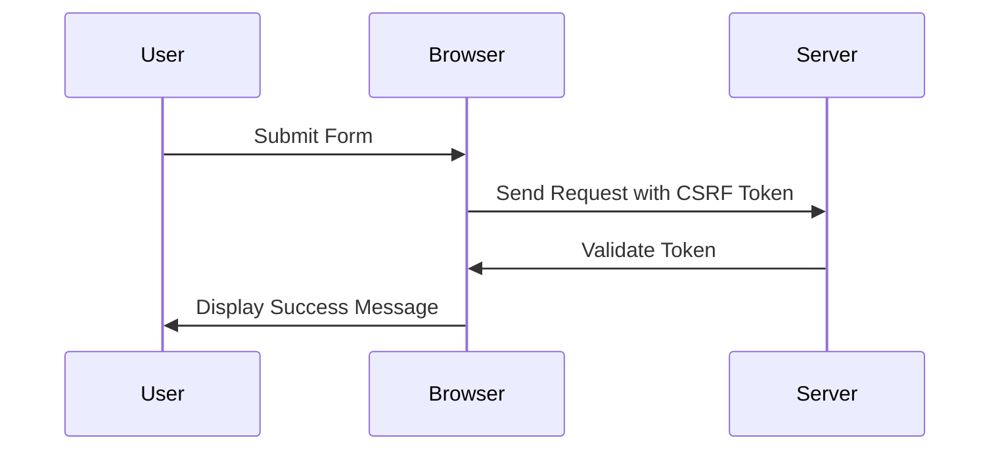

## 23.12. Dealing with XSS and CSRF in Web Applications

### Introduction

In the realm of web security, Cross-Site Scripting (XSS) and Cross-Site Request Forgery (CSRF) are two of the most prevalent vulnerabilities that can compromise the integrity and security of web applications. As developers, understanding these threats and implementing robust defenses is crucial. In this section, we will explore how XSS and CSRF attacks work, and how to protect your Clojure web applications from these threats using best practices and tools like the Ring Anti-Forgery middleware.

### Understanding XSS and CSRF Attacks

#### Cross-Site Scripting (XSS)

XSS attacks occur when an attacker injects malicious scripts into content from otherwise trusted websites. These scripts can execute in the context of a user's browser, allowing attackers to steal cookies, session tokens, or other sensitive information.

**Types of XSS Attacks:**

1. **Stored XSS**: Malicious scripts are stored on the server (e.g., in a database) and served to users.
2. **Reflected XSS**: Malicious scripts are reflected off a web server, often via URL parameters.
3. **DOM-based XSS**: The attack is executed in the client-side code, manipulating the DOM.

#### Cross-Site Request Forgery (CSRF)

CSRF attacks trick a user into executing unwanted actions on a web application where they are authenticated. This is done by exploiting the trust that a site has in the user's browser.

**How CSRF Works:**

1. An attacker crafts a request to a web application that performs a sensitive action.
2. The attacker tricks the victim into executing this request, often by embedding it in an image tag or a hidden form.

### Preventing XSS Attacks

To protect against XSS, we need to ensure that any data rendered in the browser is safe. This involves output encoding and content filtering.

#### Output Encoding

Output encoding is the process of converting user input into a safe format before rendering it in the browser. This prevents malicious scripts from being executed.

**Example of Output Encoding in Clojure:**

```clojure
(ns myapp.security
  (:require [ring.util.response :refer [response]]
            [hiccup.core :refer [html]]
            [hiccup.util :refer [escape-html]]))

(defn safe-render [user-input]
  (response (html [:div (escape-html user-input)])))

;; Usage
(safe-render "<script>alert('XSS');</script>")
```

In this example, `escape-html` is used to encode potentially dangerous characters, preventing the execution of scripts.

#### Content Filtering

Content filtering involves sanitizing input data to remove potentially harmful content. Libraries like OWASP Java HTML Sanitizer can be used in Clojure applications to achieve this.

**Example of Content Filtering:**

```clojure
(ns myapp.security
  (:import [org.owasp.html HtmlPolicyBuilder]))

(def policy (-> (HtmlPolicyBuilder.)
                (.allowElements "p" "b" "i")
                (.toFactory)))

(defn sanitize-input [input]
  (.sanitize policy input))

;; Usage
(sanitize-input "<script>alert('XSS');</script><p>Safe content</p>")
```

### Preventing CSRF Attacks

CSRF protection involves ensuring that requests to perform sensitive actions are genuine and originate from the authenticated user.

#### Using CSRF Tokens

A common method to prevent CSRF is to use tokens that are unique to each session and included in forms and AJAX requests.

**Implementing CSRF Tokens with Ring Anti-Forgery:**

```clojure
(ns myapp.core
  (:require [ring.middleware.anti-forgery :refer [wrap-anti-forgery]]
            [ring.util.response :refer [response]]))

(defn handler [request]
  (response "Secure content"))

(def app
  (wrap-anti-forgery handler))

;; In your HTML form
[:form {:method "post" :action "/submit"}
  [:input {:type "hidden" :name "__anti-forgery-token" :value (anti-forgery-field)}]
  [:input {:type "submit" :value "Submit"}]]
```

The `wrap-anti-forgery` middleware automatically checks for the presence of a valid CSRF token in requests, rejecting those without it.

### Best Practices for Secure Session Management

Secure session management is crucial for protecting user data and preventing unauthorized access.

1. **Use Secure Cookies**: Ensure cookies are marked as `Secure` and `HttpOnly` to prevent access via JavaScript.
2. **Implement Session Timeouts**: Automatically log users out after a period of inactivity.
3. **Regenerate Session IDs**: Change session IDs after login to prevent session fixation attacks.

### Configuring Security Headers

Security headers provide an additional layer of protection by instructing the browser on how to handle content.

#### Content Security Policy (CSP)

CSP helps prevent XSS by specifying which sources are allowed to load content on your site.

**Example CSP Header Configuration:**

```clojure
(ns myapp.security
  (:require [ring.middleware.content-security-policy :refer [wrap-content-security-policy]]))

(defn handler [request]
  {:status 200
   :headers {"Content-Type" "text/html"}
   :body "<h1>Secure Page</h1>"})

(def app
  (wrap-content-security-policy handler
    {:default-src "'self'"
     :script-src "'self' 'unsafe-inline'"
     :style-src "'self'"}))
```

### Visualizing the Security Workflow



### References and Further Reading

- [OWASP XSS Prevention Cheat Sheet](https://owasp.org/www-project-cheat-sheets/cheatsheets/Cross_Site_Scripting_Prevention_Cheat_Sheet.html)
- [OWASP CSRF Prevention Cheat Sheet](https://owasp.org/www-project-cheat-sheets/cheatsheets/Cross-Site_Request_Forgery_Prevention_Cheat_Sheet.html)
- [Ring Anti-Forgery GitHub Repository](https://github.com/ring-clojure/ring-anti-forgery)

### Knowledge Check

Let's reinforce what we've learned with some questions and exercises.

## **Ready to Test Your Knowledge?**



### What is the primary purpose of output encoding?

- [x] To convert user input into a safe format before rendering it in the browser
- [ ] To encrypt user data for secure transmission
- [ ] To compress data for faster loading
- [ ] To format data for database storage

> **Explanation:** Output encoding ensures that user input is rendered safely in the browser, preventing XSS attacks.

### Which type of XSS attack involves scripts stored on the server?

- [x] Stored XSS
- [ ] Reflected XSS
- [ ] DOM-based XSS
- [ ] Local XSS

> **Explanation:** Stored XSS involves scripts that are stored on the server and served to users.

### What is a common method to prevent CSRF attacks?

- [x] Using CSRF tokens
- [ ] Encrypting all data
- [ ] Using HTTPS
- [ ] Implementing a firewall

> **Explanation:** CSRF tokens are used to verify that requests are genuine and originate from the authenticated user.

### What does CSP stand for in web security?

- [x] Content Security Policy
- [ ] Cross-Site Protection
- [ ] Cookie Security Protocol
- [ ] Client-Side Protection

> **Explanation:** CSP stands for Content Security Policy, which helps prevent XSS by specifying allowed content sources.

### Which of the following is a best practice for secure session management?

- [x] Use Secure Cookies
- [x] Implement Session Timeouts
- [ ] Store passwords in cookies
- [ ] Disable HTTPS

> **Explanation:** Secure cookies and session timeouts are best practices for secure session management.

### What is the role of the `wrap-anti-forgery` middleware in Clojure?

- [x] To check for the presence of a valid CSRF token in requests
- [ ] To encrypt user passwords
- [ ] To compress HTTP responses
- [ ] To log user activity

> **Explanation:** The `wrap-anti-forgery` middleware checks for a valid CSRF token in requests, rejecting those without it.

### How can you prevent XSS attacks in Clojure applications?

- [x] Output encoding
- [x] Content filtering
- [ ] Using plain text for all responses
- [ ] Disabling JavaScript

> **Explanation:** Output encoding and content filtering are effective methods to prevent XSS attacks.

### What is a key feature of CSRF attacks?

- [x] They exploit the trust that a site has in the user's browser
- [ ] They involve stealing user credentials
- [ ] They require physical access to the server
- [ ] They are only possible over HTTP

> **Explanation:** CSRF attacks exploit the trust that a site has in the user's browser to perform unwanted actions.

### Which library can be used for content filtering in Clojure?

- [x] OWASP Java HTML Sanitizer
- [ ] Ring Core
- [ ] Compojure
- [ ] Hiccup

> **Explanation:** The OWASP Java HTML Sanitizer can be used for content filtering to remove harmful content.

### True or False: CSRF tokens are only necessary for GET requests.

- [ ] True
- [x] False

> **Explanation:** CSRF tokens are necessary for POST requests and other state-changing operations, not GET requests.



Remember, this is just the beginning. As you progress, you'll build more secure and robust web applications. Keep experimenting, stay curious, and enjoy the journey!
