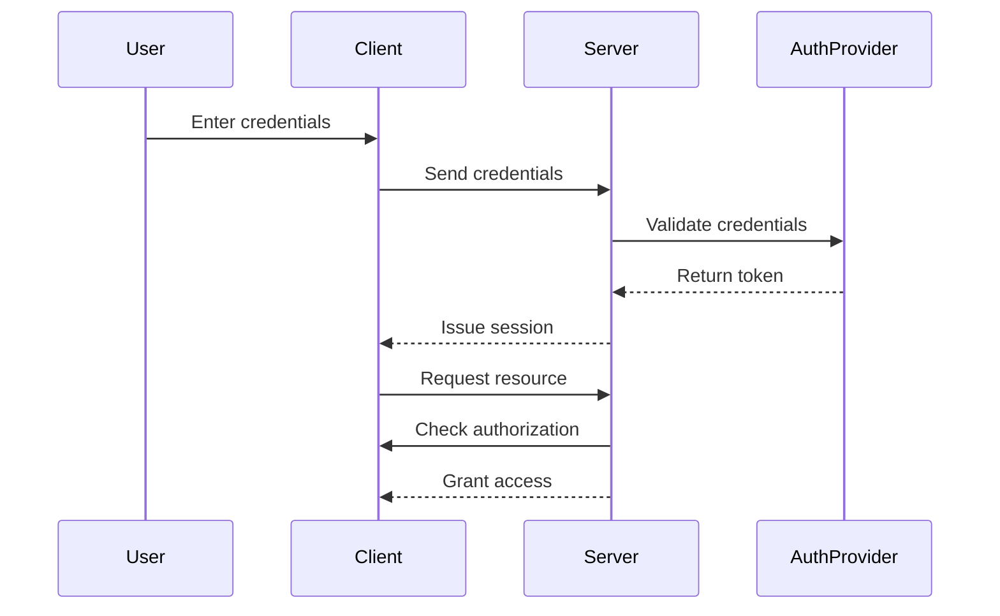

## 23.13. Authentication and Authorization in Clojure Applications

In the realm of software security, authentication and authorization are two critical components that ensure only legitimate users can access resources and perform actions within an application. In this section, we'll explore how to implement these mechanisms in Clojure applications using the powerful **[Buddy](https://funcool.github.io/buddy/)** library. We'll delve into password hashing, session management, role-based access control, and integration with external identity providers like OAuth and SAML. Additionally, we'll discuss advanced security features such as multi-factor authentication and the secure storage of user credentials.

### Understanding Authentication and Authorization

Before diving into implementation, it's essential to understand the distinction between authentication and authorization:

- **Authentication** is the process of verifying the identity of a user or system. It answers the question, "Who are you?" Common methods include passwords, biometrics, and tokens.

- **Authorization** determines what an authenticated user is allowed to do. It answers the question, "What can you do?" This often involves checking permissions or roles assigned to the user.

### Using Buddy for Authentication and Authorization

Buddy is a comprehensive security library for Clojure that provides tools for cryptography, authentication, and authorization. Let's explore how to use Buddy to implement these security features in a Clojure application.

#### Password Hashing

Password hashing is a fundamental aspect of authentication. It ensures that even if a database is compromised, the actual passwords remain secure. Buddy provides robust support for password hashing using algorithms like bcrypt.

```clojure
(ns myapp.auth
  (:require [buddy.hashers :as hashers]))

;; Hash a password
(defn hash-password [password]
  (hashers/derive password))

;; Verify a password
(defn verify-password [password hash]
  (hashers/check password hash))

;; Example usage
(let [password "mysecretpassword"
      hashed-password (hash-password password)]
  (println "Password matches:" (verify-password password hashed-password)))
```

In this example, we use `hashers/derive` to hash a password and `hashers/check` to verify it against a stored hash.

#### Session Management

Session management is crucial for maintaining user state across multiple requests. Buddy provides middleware for handling sessions securely.

```clojure
(ns myapp.session
  (:require [ring.middleware.session :refer [wrap-session]]
            [ring.middleware.session.memory :refer [memory-store]]))

(def app
  (-> handler
      (wrap-session {:store (memory-store)})))

;; Example handler
(defn handler [request]
  (let [session (:session request)]
    (if (:user session)
      {:status 200 :body "Welcome back!"}
      {:status 401 :body "Please log in."})))
```

Here, we use `wrap-session` to add session management to our application. The `memory-store` is used for demonstration purposes; in a production environment, consider using a more robust session store.

#### Role-Based Access Control (RBAC)

Role-based access control allows you to define roles and permissions, ensuring users can only perform actions they're authorized for.

```clojure
(ns myapp.authz
  (:require [buddy.auth :refer [authenticated?]]
            [buddy.auth.accessrules :refer [restrict]]))

(defn admin-only [request]
  (if (= (:role (:session request)) :admin)
    request
    {:status 403 :body "Forbidden"}))

(def app
  (-> handler
      (restrict admin-only)))
```

In this example, we define an `admin-only` rule that restricts access to users with the admin role.

### Integrating with External Identity Providers

Integrating with external identity providers like OAuth and SAML can enhance security by offloading authentication to trusted third parties.

#### OAuth Integration

OAuth is a popular protocol for authorization, allowing users to log in using their existing accounts from providers like Google or Facebook.

```clojure
(ns myapp.oauth
  (:require [buddy.auth.backends.oauth2 :as oauth2]))

(def oauth2-backend
  (oauth2/backend
    {:client-id "your-client-id"
     :client-secret "your-client-secret"
     :redirect-uri "http://localhost:3000/callback"
     :auth-uri "https://provider.com/oauth2/auth"
     :token-uri "https://provider.com/oauth2/token"}))

;; Example route for handling OAuth callback
(defn callback-handler [request]
  (let [token (oauth2/extract-token request)]
    (if token
      {:status 200 :body "Logged in successfully"}
      {:status 401 :body "Authentication failed"})))
```

This code sets up an OAuth2 backend and a callback handler to process the authentication response.

#### SAML Integration

SAML (Security Assertion Markup Language) is another protocol used for single sign-on (SSO) and identity federation.

```clojure
(ns myapp.saml
  (:require [buddy.auth.backends.saml :as saml]))

(def saml-backend
  (saml/backend
    {:entity-id "your-entity-id"
     :assertion-consumer-service-url "http://localhost:3000/saml/acs"
     :idp-metadata-url "https://idp.com/metadata"}))

;; Example route for handling SAML response
(defn acs-handler [request]
  (let [assertion (saml/extract-assertion request)]
    (if assertion
      {:status 200 :body "Logged in successfully"}
      {:status 401 :body "Authentication failed"})))
```

This example demonstrates setting up a SAML backend and handling the assertion consumer service (ACS) response.

### Advanced Security Features

#### Multi-Factor Authentication (MFA)

Multi-factor authentication adds an extra layer of security by requiring users to provide additional verification, such as a code sent to their phone.

```clojure
(ns myapp.mfa
  (:require [buddy.auth :refer [authenticated?]]
            [buddy.auth.middleware :refer [wrap-authentication]]))

(defn mfa-handler [request]
  (if (and (authenticated? request)
           (mfa-verified? request))
    {:status 200 :body "Access granted"}
    {:status 401 :body "MFA required"}))

(def app
  (-> handler
      (wrap-authentication mfa-handler)))
```

In this example, `mfa-verified?` is a hypothetical function that checks if the user has completed MFA.

#### Secure Storage and Handling of User Credentials

Storing and handling user credentials securely is paramount. Always hash passwords before storing them, and use environment variables or secure vaults for sensitive configuration data.

### Visualizing Authentication and Authorization Flow

To better understand the flow of authentication and authorization in a Clojure application, let's visualize it using a sequence diagram.



This diagram illustrates the interaction between the user, client, server, and authentication provider during the authentication and authorization process.

### References and Further Reading

- [Buddy Documentation](https://funcool.github.io/buddy/)
- [OAuth 2.0](https://oauth.net/2/)
- [SAML Overview](https://www.oasis-open.org/standards#samlv2.0)
- [Multi-Factor Authentication](https://en.wikipedia.org/wiki/Multi-factor_authentication)

### Knowledge Check

Let's reinforce what we've learned with some questions and exercises.

1. **What is the primary difference between authentication and authorization?**
2. **How does Buddy help in hashing passwords securely?**
3. **Explain the role of session management in authentication.**
4. **What are the benefits of integrating with external identity providers?**
5. **How can multi-factor authentication enhance security?**

### Embrace the Journey

Remember, implementing robust authentication and authorization is just the beginning of securing your Clojure applications. As you continue to build and refine your applications, keep exploring new security features and best practices. Stay curious, experiment with different approaches, and enjoy the journey of creating secure and reliable software!

## **Ready to Test Your Knowledge?**



### What is the primary purpose of authentication in a Clojure application?

- [x] To verify the identity of a user
- [ ] To determine what actions a user can perform
- [ ] To encrypt user data
- [ ] To manage user sessions

> **Explanation:** Authentication is the process of verifying the identity of a user or system.

### Which library is commonly used in Clojure for implementing authentication and authorization?

- [x] Buddy
- [ ] Ring
- [ ] Compojure
- [ ] Luminus

> **Explanation:** Buddy is a comprehensive security library for Clojure that provides tools for authentication and authorization.

### How does Buddy ensure password security?

- [x] By hashing passwords using algorithms like bcrypt
- [ ] By storing passwords in plain text
- [ ] By encrypting passwords with a symmetric key
- [ ] By using passwords as session tokens

> **Explanation:** Buddy uses secure hashing algorithms like bcrypt to hash passwords, ensuring they are not stored in plain text.

### What is the role of session management in authentication?

- [x] To maintain user state across multiple requests
- [ ] To encrypt user data
- [ ] To verify user identity
- [ ] To provide role-based access control

> **Explanation:** Session management is crucial for maintaining user state across multiple requests, allowing users to remain logged in.

### Which protocol is commonly used for integrating with external identity providers?

- [x] OAuth
- [ ] HTTP
- [ ] FTP
- [ ] SMTP

> **Explanation:** OAuth is a popular protocol for authorization, allowing users to log in using existing accounts from providers like Google or Facebook.

### What is the benefit of using multi-factor authentication?

- [x] It adds an extra layer of security by requiring additional verification
- [ ] It simplifies the login process
- [ ] It eliminates the need for passwords
- [ ] It reduces server load

> **Explanation:** Multi-factor authentication enhances security by requiring users to provide additional verification, such as a code sent to their phone.

### How can user credentials be stored securely?

- [x] By hashing passwords before storing them
- [ ] By storing passwords in plain text
- [ ] By using passwords as session tokens
- [ ] By encrypting passwords with a symmetric key

> **Explanation:** Storing hashed passwords ensures that even if a database is compromised, the actual passwords remain secure.

### What is the purpose of role-based access control?

- [x] To ensure users can only perform actions they're authorized for
- [ ] To verify user identity
- [ ] To encrypt user data
- [ ] To manage user sessions

> **Explanation:** Role-based access control allows you to define roles and permissions, ensuring users can only perform actions they're authorized for.

### Which of the following is a protocol used for single sign-on (SSO)?

- [x] SAML
- [ ] HTTP
- [ ] FTP
- [ ] SMTP

> **Explanation:** SAML (Security Assertion Markup Language) is a protocol used for single sign-on (SSO) and identity federation.

### True or False: OAuth is used for authentication, not authorization.

- [ ] True
- [x] False

> **Explanation:** OAuth is primarily used for authorization, allowing users to grant access to their resources without sharing credentials.


