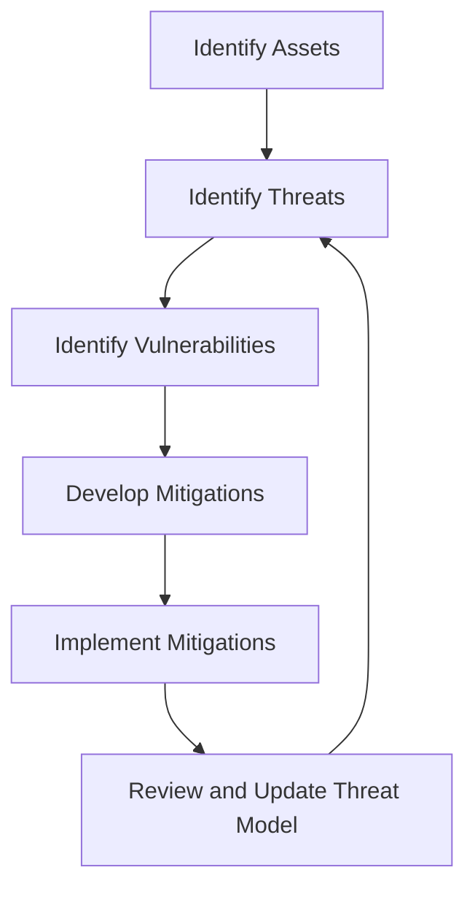

## 23.14. Threat Modeling and Security Testing

In today's digital landscape, security is paramount. As developers, we must be vigilant in identifying and mitigating potential security threats to protect our applications and data. This section delves into the concepts of threat modeling and security testing, providing you with the tools and knowledge to safeguard your Clojure applications effectively.

### Introduction to Threat Modeling

Threat modeling is a structured approach to identifying and evaluating potential security threats to a system. It involves understanding the system's architecture, identifying valuable assets, and determining potential threats and vulnerabilities. The goal is to develop strategies to mitigate these threats and enhance the system's security posture.

#### Key Concepts in Threat Modeling

1. **Assets**: These are valuable components of your system that need protection, such as data, services, and infrastructure.

2. **Threats**: These are potential events or actions that could harm your assets. Threats can be external (e.g., hackers) or internal (e.g., insider threats).

3. **Vulnerabilities**: These are weaknesses in your system that could be exploited by threats to cause harm.

4. **Mitigations**: These are strategies or controls implemented to reduce the risk posed by threats.

### Methodologies for Threat Modeling

Several methodologies can be employed for threat modeling, each with its unique approach and focus. Here are some popular ones:

#### STRIDE

STRIDE is a mnemonic that stands for Spoofing, Tampering, Repudiation, Information Disclosure, Denial of Service, and Elevation of Privilege. It helps identify potential threats by categorizing them into these six types.

#### DREAD

DREAD is a risk assessment model that stands for Damage potential, Reproducibility, Exploitability, Affected users, and Discoverability. It helps prioritize threats based on their potential impact.

#### PASTA

PASTA (Process for Attack Simulation and Threat Analysis) is a seven-step process that focuses on aligning business objectives with technical requirements to identify and mitigate threats.

### Identifying Assets, Threats, and Vulnerabilities

To effectively model threats, you must first identify the assets, threats, and vulnerabilities within your system.

#### Identifying Assets

- **Data**: Sensitive information such as user credentials, financial data, and personal information.
- **Services**: Critical services that your application provides, such as authentication and payment processing.
- **Infrastructure**: The underlying hardware and software that support your application.

#### Identifying Threats

- **External Threats**: These include hackers, malware, and other external actors that could compromise your system.
- **Internal Threats**: These include insider threats, such as disgruntled employees or contractors with access to sensitive data.

#### Identifying Vulnerabilities

- **Software Bugs**: Flaws in your code that could be exploited by attackers.
- **Configuration Errors**: Misconfigurations that could expose your system to threats.
- **Weak Authentication**: Inadequate authentication mechanisms that could be bypassed by attackers.

### Conducting Security Testing

Security testing is the process of evaluating your system's security posture by identifying vulnerabilities and testing the effectiveness of your security controls. It includes various techniques such as penetration testing, vulnerability scanning, and code review.

#### Penetration Testing

Penetration testing, or pen testing, simulates an attack on your system to identify vulnerabilities that could be exploited by attackers. It involves the following steps:

1. **Planning**: Define the scope and objectives of the test, including the systems and assets to be tested.

2. **Reconnaissance**: Gather information about the target system, such as IP addresses, domain names, and network topology.

3. **Scanning**: Use automated tools to scan for vulnerabilities in the target system.

4. **Exploitation**: Attempt to exploit identified vulnerabilities to gain unauthorized access to the system.

5. **Reporting**: Document the findings and provide recommendations for mitigating identified vulnerabilities.

#### Vulnerability Scanning

Vulnerability scanning involves using automated tools to identify known vulnerabilities in your system. These tools compare your system's configuration against a database of known vulnerabilities and provide a report of potential issues.

#### Code Review

Code review involves manually inspecting your code for security vulnerabilities. It can be performed by developers or security experts and is an essential part of the software development lifecycle.

### Tools and Frameworks for Threat Modeling and Security Testing

Several tools and frameworks can assist in threat modeling and security testing. Here are some popular ones:

#### Threat Modeling Tools

- **Microsoft Threat Modeling Tool**: A free tool that helps identify and mitigate potential security threats.
- **OWASP Threat Dragon**: An open-source tool for creating threat models and identifying potential security risks.

#### Security Testing Tools

- **OWASP ZAP**: An open-source penetration testing tool that helps identify vulnerabilities in web applications.
- **Nmap**: A network scanning tool that helps identify open ports and services on a target system.
- **Burp Suite**: A comprehensive web application security testing tool that includes features for scanning, crawling, and exploiting vulnerabilities.

### Keeping the Threat Model Up to Date

Threat modeling is not a one-time activity. As your system evolves, so do the threats and vulnerabilities it faces. It's essential to keep your threat model up to date by regularly reviewing and updating it to reflect changes in your system's architecture, assets, and threat landscape.

### Code Example: Implementing Basic Security Measures in Clojure

Let's explore a simple Clojure code example that demonstrates implementing basic security measures, such as input validation and error handling.

```clojure
(ns myapp.security
  (:require [clojure.string :as str]))

(defn validate-input [input]
  ;; Ensure the input is not empty and does not contain malicious characters
  (and (not (str/blank? input))
       (not (re-find #"[<>\"']" input))))

(defn handle-request [input]
  (if (validate-input input)
    (println "Processing request with input:" input)
    (println "Invalid input detected!")))

;; Example usage
(handle-request "valid-input")   ;; Output: Processing request with input: valid-input
(handle-request "<script>")      ;; Output: Invalid input detected!
```

### Try It Yourself

Experiment with the code example above by modifying the `validate-input` function to include additional security checks, such as checking for SQL injection patterns or other common attack vectors.

### Visualizing the Threat Modeling Process

Below is a flowchart that illustrates the threat modeling process, from identifying assets to implementing mitigations.



**Figure 1**: The Threat Modeling Process

### References and Further Reading

- [OWASP Threat Modeling](https://owasp.org/www-community/Threat_Modeling)
- [Microsoft Threat Modeling Tool](https://www.microsoft.com/en-us/securityengineering/sdl/threatmodeling)
- [OWASP ZAP](https://owasp.org/www-project-zap/)
- [Nmap](https://nmap.org/)
- [Burp Suite](https://portswigger.net/burp)

### Knowledge Check

1. What are the key components of threat modeling?
2. How does the STRIDE methodology help in threat modeling?
3. What is the purpose of penetration testing?
4. Name two tools used for security testing.
5. Why is it important to keep the threat model up to date?

### Embrace the Journey

Remember, security is an ongoing process. As you continue to develop and maintain your Clojure applications, keep security at the forefront of your mind. Stay curious, keep learning, and enjoy the journey of building secure and robust software.

## **Ready to Test Your Knowledge?**



### What is the primary goal of threat modeling?

- [x] To identify and mitigate potential security threats
- [ ] To develop new features for an application
- [ ] To optimize application performance
- [ ] To improve user interface design

> **Explanation:** The primary goal of threat modeling is to identify and mitigate potential security threats to a system.

### Which methodology uses the mnemonic STRIDE?

- [x] STRIDE
- [ ] DREAD
- [ ] PASTA
- [ ] OWASP

> **Explanation:** STRIDE is a threat modeling methodology that uses the mnemonic STRIDE to categorize potential threats.

### What is the first step in penetration testing?

- [x] Planning
- [ ] Scanning
- [ ] Exploitation
- [ ] Reporting

> **Explanation:** The first step in penetration testing is planning, where the scope and objectives of the test are defined.

### Which tool is commonly used for network scanning?

- [x] Nmap
- [ ] Burp Suite
- [ ] OWASP ZAP
- [ ] Microsoft Threat Modeling Tool

> **Explanation:** Nmap is a network scanning tool commonly used to identify open ports and services on a target system.

### Why is it important to keep the threat model up to date?

- [x] To reflect changes in the system's architecture and threat landscape
- [ ] To improve application performance
- [ ] To add new features to the application
- [ ] To enhance user experience

> **Explanation:** Keeping the threat model up to date is important to reflect changes in the system's architecture and threat landscape.

### What is the purpose of vulnerability scanning?

- [x] To identify known vulnerabilities in a system
- [ ] To develop new features for an application
- [ ] To optimize application performance
- [ ] To improve user interface design

> **Explanation:** The purpose of vulnerability scanning is to identify known vulnerabilities in a system using automated tools.

### Which tool is used for web application security testing?

- [x] OWASP ZAP
- [ ] Nmap
- [ ] Microsoft Threat Modeling Tool
- [ ] Burp Suite

> **Explanation:** OWASP ZAP is a tool used for web application security testing to identify vulnerabilities.

### What is the role of mitigations in threat modeling?

- [x] To reduce the risk posed by threats
- [ ] To identify new features for an application
- [ ] To optimize application performance
- [ ] To improve user interface design

> **Explanation:** Mitigations in threat modeling are strategies or controls implemented to reduce the risk posed by threats.

### Which of the following is a threat modeling tool?

- [x] OWASP Threat Dragon
- [ ] Nmap
- [ ] Burp Suite
- [ ] OWASP ZAP

> **Explanation:** OWASP Threat Dragon is a threat modeling tool used to create threat models and identify potential security risks.

### True or False: Threat modeling is a one-time activity.

- [ ] True
- [x] False

> **Explanation:** Threat modeling is not a one-time activity. It should be regularly reviewed and updated to reflect changes in the system's architecture and threat landscape.




