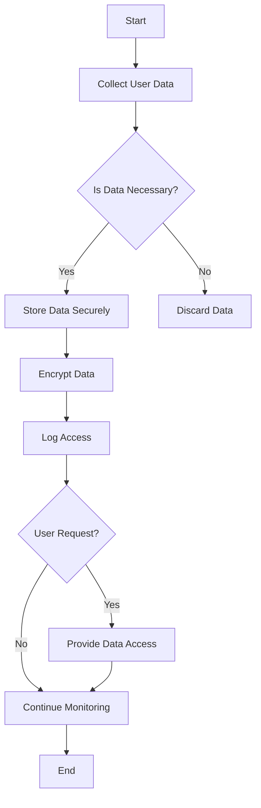

## 23.15. Compliance Standards and Clojure

In today's digital landscape, ensuring that your software applications comply with various regulatory standards is crucial. Compliance standards such as the General Data Protection Regulation (GDPR), Payment Card Industry Data Security Standard (PCI DSS), and Health Insurance Portability and Accountability Act (HIPAA) are designed to protect user data and ensure privacy. This section will guide you through understanding these standards and how to design Clojure applications that comply with them.

### Understanding Compliance Standards

Compliance standards are sets of guidelines and regulations that organizations must follow to protect sensitive information and ensure privacy. These standards are essential in software development as they help mitigate risks associated with data breaches and unauthorized access.

#### Key Compliance Standards

1. **GDPR (General Data Protection Regulation)**: A regulation in EU law on data protection and privacy for individuals. It mandates strict guidelines on data collection, processing, and storage.

2. **PCI DSS (Payment Card Industry Data Security Standard)**: A set of security standards designed to ensure that all companies that accept, process, store, or transmit credit card information maintain a secure environment.

3. **HIPAA (Health Insurance Portability and Accountability Act)**: A US law designed to provide privacy standards to protect patients' medical records and other health information.

### Designing Clojure Applications for Compliance

To ensure compliance with these standards, developers must incorporate specific design strategies into their applications. Let's explore how to achieve this in Clojure.

#### Data Handling and Privacy

Handling data responsibly is at the core of compliance. Here are some best practices:

- **Data Minimization**: Only collect data that is necessary for the application's functionality. Avoid storing sensitive information unless absolutely required.

- **Anonymization and Pseudonymization**: Transform personal data into a format that cannot be easily traced back to an individual. This is crucial for GDPR compliance.

- **Encryption**: Use strong encryption algorithms to protect data both at rest and in transit. Clojure libraries such as [Buddy](https://funcool.github.io/buddy/latest/) can be used for cryptographic operations.

```clojure
(require '[buddy.core.crypto :as crypto])

;; Encrypting data
(defn encrypt-data [data key]
  (crypto/encrypt data key))

;; Decrypting data
(defn decrypt-data [encrypted-data key]
  (crypto/decrypt encrypted-data key))
```

#### Auditing and Logging

Auditing and logging are essential for tracking access and modifications to sensitive data. Ensure that logs are comprehensive and secure:

- **Access Logs**: Maintain detailed logs of who accessed the data, when, and what actions were performed.

- **Immutable Logs**: Use immutable data structures to ensure that logs cannot be tampered with. Clojure's persistent data structures are ideal for this purpose.

- **Log Encryption**: Encrypt logs to prevent unauthorized access.

```clojure
(require '[clojure.java.io :as io])

(defn log-access [user action]
  (let [timestamp (java.time.Instant/now)]
    (spit (io/file "access.log")
          (str timestamp " - " user " performed " action "\n")
          :append true)))
```

#### Privacy by Design

Incorporate privacy into the design of your application from the outset:

- **Default to Privacy**: Ensure that privacy settings are enabled by default.

- **User Consent**: Obtain explicit consent from users before collecting or processing their data.

- **Data Subject Rights**: Implement features that allow users to access, modify, or delete their data.

### Key Considerations for Compliance

While technical measures are crucial, compliance also involves organizational and procedural aspects. Here are some additional considerations:

- **Consult Legal Professionals**: Compliance is a legal matter, and it is essential to consult with legal professionals to ensure that your application meets all regulatory requirements.

- **Regular Audits**: Conduct regular audits to ensure ongoing compliance and identify potential vulnerabilities.

- **Training and Awareness**: Educate your team about compliance standards and the importance of data protection.

### Example: GDPR Compliance in Clojure

Let's explore a practical example of how to implement GDPR compliance in a Clojure application.

#### Data Subject Access Request (DSAR)

GDPR grants individuals the right to access their personal data. Here's how you can implement a DSAR feature:

```clojure
(defn get-user-data [user-id]
  ;; Fetch user data from the database
  (let [user-data (fetch-from-db user-id)]
    ;; Return data to the user
    user-data))

(defn handle-dsar [user-id]
  (let [user-data (get-user-data user-id)]
    ;; Send data to the user
    (send-data-to-user user-data)))
```

#### Data Breach Notification

GDPR requires organizations to notify authorities and affected individuals in the event of a data breach. Implement a notification system:

```clojure
(defn notify-breach [affected-users]
  (doseq [user affected-users]
    (send-notification user "Data breach occurred. Please take necessary precautions.")))

(defn handle-breach [breach-details]
  ;; Log breach details
  (log-breach breach-details)
  ;; Notify affected users
  (notify-breach (:affected-users breach-details)))
```

### Visualizing Compliance Workflow

To better understand the compliance workflow, let's visualize the process using a Mermaid.js flowchart.



**Diagram Description**: This flowchart illustrates the process of handling user data in compliance with GDPR. It emphasizes data minimization, secure storage, encryption, and user access rights.

### Conclusion

Ensuring compliance with standards like GDPR, PCI DSS, and HIPAA is essential for protecting user data and maintaining trust. By incorporating privacy by design, robust data handling practices, and comprehensive auditing, you can build Clojure applications that meet these regulatory requirements. Remember, compliance is an ongoing process that requires regular audits and updates to adapt to changing regulations.

### References and Further Reading

- [GDPR Official Website](https://gdpr.eu/)
- [PCI DSS Quick Reference Guide](https://www.pcisecuritystandards.org/documents/PCI_DSS-QRG-v3_2_1.pdf)
- [HIPAA Compliance Guide](https://www.hhs.gov/hipaa/for-professionals/index.html)
- [Buddy Cryptographic Library](https://funcool.github.io/buddy/latest/)

### Knowledge Check

## **Ready to Test Your Knowledge?**



### What is the primary purpose of compliance standards like GDPR, PCI DSS, and HIPAA?

- [x] To protect sensitive information and ensure privacy
- [ ] To increase software development speed
- [ ] To reduce software development costs
- [ ] To improve user interface design

> **Explanation:** Compliance standards are designed to protect sensitive information and ensure privacy, not to directly impact development speed, costs, or UI design.

### Which Clojure library is commonly used for cryptographic operations?

- [x] Buddy
- [ ] Ring
- [ ] Compojure
- [ ] Aleph

> **Explanation:** Buddy is a Clojure library used for cryptographic operations, providing tools for encryption, hashing, and more.

### What is data minimization?

- [x] Collecting only the data necessary for the application's functionality
- [ ] Collecting as much data as possible for analysis
- [ ] Storing data in multiple locations for redundancy
- [ ] Encrypting data to protect it from unauthorized access

> **Explanation:** Data minimization involves collecting only the data necessary for the application's functionality, reducing the risk of data breaches.

### How can you ensure logs are secure in a Clojure application?

- [x] By encrypting logs
- [ ] By storing logs in plain text
- [ ] By deleting logs regularly
- [ ] By sharing logs with all team members

> **Explanation:** Encrypting logs ensures that they are secure and protected from unauthorized access.

### What is the role of legal professionals in ensuring compliance?

- [x] To provide guidance on regulatory requirements
- [ ] To write code for compliance features
- [ ] To design the user interface
- [ ] To manage the development team

> **Explanation:** Legal professionals provide guidance on regulatory requirements to ensure that applications comply with relevant standards.

### What is a Data Subject Access Request (DSAR)?

- [x] A request by an individual to access their personal data
- [ ] A request by a company to access user data
- [ ] A request by a developer to access application logs
- [ ] A request by a regulator to audit a company

> **Explanation:** A DSAR is a request by an individual to access their personal data, as granted by GDPR.

### Why is regular auditing important for compliance?

- [x] To ensure ongoing compliance and identify vulnerabilities
- [ ] To increase application performance
- [ ] To reduce development costs
- [ ] To improve user interface design

> **Explanation:** Regular auditing is important to ensure ongoing compliance and identify potential vulnerabilities in the application.

### What should you do in the event of a data breach under GDPR?

- [x] Notify authorities and affected individuals
- [ ] Ignore the breach if it is minor
- [ ] Delete all user data immediately
- [ ] Increase encryption levels

> **Explanation:** Under GDPR, organizations must notify authorities and affected individuals in the event of a data breach.

### What is the significance of privacy by design?

- [x] Incorporating privacy into the design of an application from the outset
- [ ] Adding privacy features after the application is developed
- [ ] Ignoring privacy concerns during development
- [ ] Focusing solely on encryption for privacy

> **Explanation:** Privacy by design involves incorporating privacy into the design of an application from the outset, ensuring that privacy is a fundamental aspect of the application.

### True or False: Compliance is a one-time process that does not require updates.

- [ ] True
- [x] False

> **Explanation:** Compliance is an ongoing process that requires regular audits and updates to adapt to changing regulations.



Remember, this is just the beginning. As you progress, you'll build more complex and interactive applications that adhere to compliance standards. Keep experimenting, stay curious, and enjoy the journey!


