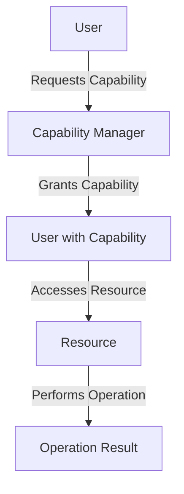

## 23.16. Capability-Security Model in Clojure

In the realm of software security, the capability-security model offers a unique approach to controlling access to resources. Unlike traditional models that rely heavily on identity-based access control, the capability-security model focuses on the possession of capabilities. This section delves into how this model can be effectively applied in Clojure, a language known for its functional programming paradigm and robust concurrency support.

### Understanding the Capability-Security Model

The capability-security model is a paradigm that controls access to resources based on the possession of unforgeable tokens, known as capabilities. A capability is essentially a communicable, unforgeable token of authority that references a resource along with the operations that can be performed on it.

#### Key Characteristics of the Capability-Security Model

- **Possession-Based Access**: Access is granted based on possession of a capability, not on the identity of the user or process.
- **Fine-Grained Control**: Capabilities can be finely tuned to allow specific actions on resources.
- **Delegation**: Capabilities can be easily delegated to other entities, facilitating flexible access control.
- **Least Privilege**: Encourages the principle of least privilege by granting only the necessary capabilities.

### Differences from Traditional Security Models

Traditional security models, such as Role-Based Access Control (RBAC) or Access Control Lists (ACLs), rely on identities and predefined roles to manage access. These models often require complex configurations and can be less flexible in dynamic environments.

#### Comparison Table

| Feature                  | Capability-Security Model | Traditional Models (RBAC/ACL) |
|--------------------------|---------------------------|-------------------------------|
| **Access Basis**         | Possession of capabilities| Identity and roles            |
| **Flexibility**          | High                      | Moderate                      |
| **Delegation**           | Simple                    | Complex                       |
| **Granularity**          | Fine-grained              | Coarse-grained                |
| **Configuration**        | Dynamic                   | Static                        |

### Implementing Capabilities in Clojure

Clojure's functional nature and support for immutable data structures make it an excellent fit for implementing the capability-security model. Let's explore how we can define and use capabilities in Clojure.

#### Defining Capabilities

In Clojure, a capability can be represented as a map or a record that encapsulates the resource and the allowed operations.

```clojure
(defrecord Capability [resource operations])

(defn create-capability [resource operations]
  (->Capability resource operations))
```

#### Using Capabilities

To use a capability, we check if the desired operation is included in the capability's operations before performing the action.

```clojure
(defn perform-operation [capability operation]
  (if (contains? (:operations capability) operation)
    (println "Operation allowed on" (:resource capability))
    (println "Operation not allowed")))
```

#### Example Usage

```clojure
(let [file-capability (create-capability "file.txt" #{:read :write})]
  (perform-operation file-capability :read)   ;; Output: Operation allowed on file.txt
  (perform-operation file-capability :delete) ;; Output: Operation not allowed
)
```

### Use Cases for the Capability-Security Model

The capability-security model is particularly beneficial in scenarios where dynamic and fine-grained access control is required. Here are some use cases where this model enhances security:

- **Microservices Architecture**: In a microservices environment, capabilities can be used to control access between services, ensuring that each service only has access to the resources it needs.
- **IoT Devices**: Capabilities can manage access to IoT devices, allowing specific operations based on the device's current state and context.
- **Cloud Computing**: In cloud environments, capabilities can provide secure access to resources across different cloud services and tenants.

### Challenges in Adopting the Capability-Security Model

While the capability-security model offers numerous advantages, there are challenges to consider:

- **Complexity in Management**: Managing a large number of capabilities can become complex, especially in large systems.
- **Revocation**: Revoking capabilities can be challenging, as it requires tracking and invalidating distributed tokens.
- **Compatibility**: Integrating with existing identity-based systems may require additional effort.

### Visualizing the Capability-Security Model

To better understand how capabilities work, let's visualize the flow of capability-based access control.



**Diagram Description**: This diagram illustrates the flow of capability-based access control. A user requests a capability from the capability manager, which grants the capability. The user then accesses the resource using the capability, and the operation is performed.

### Best Practices for Implementing Capabilities in Clojure

- **Encapsulation**: Encapsulate capabilities within well-defined interfaces to ensure they are used correctly.
- **Immutable Capabilities**: Use immutable data structures to represent capabilities, preventing unauthorized modifications.
- **Audit and Logging**: Implement logging to track capability usage and detect potential security breaches.
- **Capability Revocation**: Design a mechanism for revoking capabilities when they are no longer needed or when security policies change.

### Conclusion

The capability-security model offers a robust and flexible approach to access control, particularly suited to dynamic and distributed systems. By leveraging Clojure's functional programming features, developers can implement this model effectively, enhancing security while maintaining flexibility.

### Ready to Test Your Knowledge?



### What is the primary basis for access control in the capability-security model?

- [x] Possession of capabilities
- [ ] User identity
- [ ] Role assignments
- [ ] Access Control Lists

> **Explanation:** The capability-security model grants access based on the possession of capabilities, not on user identity or roles.

### Which of the following is a key advantage of the capability-security model over traditional models?

- [x] Fine-grained access control
- [ ] Simplicity in configuration
- [ ] Static access policies
- [ ] Identity-based access

> **Explanation:** The capability-security model allows for fine-grained access control, which is more flexible than the static policies of traditional models.

### In Clojure, how can a capability be represented?

- [x] As a map or record
- [ ] As a string
- [ ] As a list
- [ ] As a vector

> **Explanation:** In Clojure, a capability can be represented as a map or record that encapsulates the resource and allowed operations.

### What is a potential challenge of using the capability-security model?

- [x] Complexity in managing capabilities
- [ ] Lack of flexibility
- [ ] Inability to delegate access
- [ ] Coarse-grained access control

> **Explanation:** Managing a large number of capabilities can become complex, especially in large systems.

### Which Clojure feature is beneficial for implementing the capability-security model?

- [x] Immutable data structures
- [ ] Dynamic typing
- [ ] Macros
- [ ] Lazy sequences

> **Explanation:** Immutable data structures are beneficial for implementing capabilities, as they prevent unauthorized modifications.

### What is a common use case for the capability-security model?

- [x] Microservices architecture
- [ ] Single-user applications
- [ ] Static websites
- [ ] Command-line tools

> **Explanation:** The capability-security model is particularly beneficial in microservices architecture, where dynamic and fine-grained access control is required.

### How can capabilities be revoked in a capability-security model?

- [x] By tracking and invalidating distributed tokens
- [ ] By deleting user accounts
- [ ] By changing user roles
- [ ] By updating access control lists

> **Explanation:** Revoking capabilities requires tracking and invalidating distributed tokens, which can be challenging.

### What principle does the capability-security model encourage?

- [x] Least privilege
- [ ] Maximum privilege
- [ ] Role-based access
- [ ] Identity-based access

> **Explanation:** The capability-security model encourages the principle of least privilege by granting only the necessary capabilities.

### True or False: Capabilities in the capability-security model can be easily delegated to other entities.

- [x] True
- [ ] False

> **Explanation:** Capabilities can be easily delegated to other entities, facilitating flexible access control.

### Which diagram best represents the flow of capability-based access control?

- [x] A user requests a capability, which is granted by a manager, and then accesses a resource.
- [ ] A user logs in, checks their role, and accesses a resource.
- [ ] A user submits a form, which is processed by a server, and receives a response.
- [ ] A user sends a message, which is received by another user, and a reply is sent back.

> **Explanation:** The correct diagram represents the flow of capability-based access control, where a user requests a capability, which is granted by a manager, and then accesses a resource.



Remember, this is just the beginning. As you progress, you'll discover more about how Clojure's unique features can enhance security in your applications. Keep experimenting, stay curious, and enjoy the journey!
