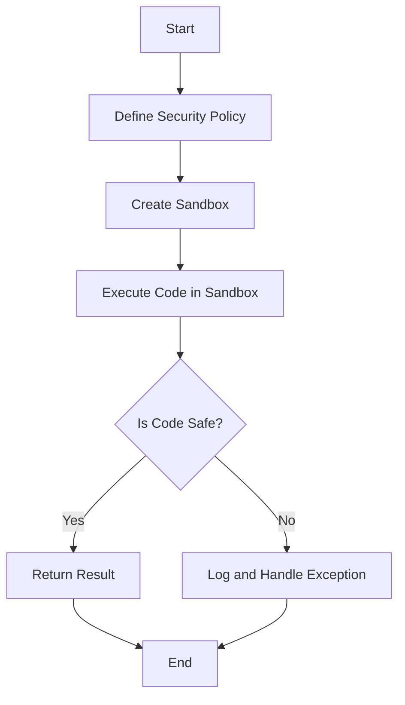

## 23.17. Sandboxing and Isolation Patterns

In the realm of software development, especially when dealing with untrusted code, ensuring the security and stability of your system is paramount. This is where sandboxing and isolation patterns come into play. These techniques allow developers to execute code in a controlled environment, minimizing the risk of malicious actions and unintended consequences. In this section, we will delve into the concepts of sandboxing and isolation, explore tools like Clojail for Clojure, and provide practical examples and best practices for creating secure execution environments.

### Understanding Sandboxing

**Sandboxing** is a security mechanism used to run code in a restricted environment, limiting its access to the system's resources and data. The primary goal is to prevent untrusted code from causing harm, whether through malicious intent or accidental errors. By isolating the execution of code, sandboxing helps maintain the integrity and security of the host system.

#### Why Sandboxing is Important

1. **Security**: Protects the system from malicious code that could steal data, corrupt files, or compromise system integrity.
2. **Stability**: Prevents untrusted code from crashing the host application or affecting other processes.
3. **Resource Management**: Limits the resources (CPU, memory, disk I/O) that untrusted code can consume, ensuring fair resource distribution.
4. **Compliance**: Helps meet security and privacy regulations by controlling how and where code executes.

### Options for Running Untrusted Code Safely

In Clojure, several tools and techniques can be employed to safely execute untrusted code. One of the most prominent tools is **Clojail**, a library designed to provide a sandboxed environment for Clojure code execution.

#### Clojail: A Tool for Sandboxing in Clojure

[Clojail](https://github.com/Raynes/clojail) is a Clojure library that allows developers to execute code in a sandboxed environment. It leverages Java's security features to restrict the capabilities of the code being executed.

##### Key Features of Clojail

- **SecurityManager Integration**: Uses Java's `SecurityManager` to enforce security policies.
- **Resource Limiting**: Controls the amount of CPU time and memory that code can consume.
- **Whitelist/Blacklist**: Allows specifying which classes and methods are accessible to the sandboxed code.
- **Timeouts**: Prevents long-running code from consuming resources indefinitely.

##### Example: Using Clojail for Secure Execution

Let's explore a basic example of using Clojail to execute untrusted code safely.

```clojure
(ns sandbox-example
  (:require [clojail.core :as jail]))

;; Define a security policy
(def policy
  (jail/make-policy
    {:whitelist ["java.lang.Math"]
     :blacklist ["java.io.File" "java.net.Socket"]}))

;; Create a sandbox with the defined policy
(def sandbox (jail/sandbox policy))

;; Execute code in the sandbox
(defn execute-untrusted-code [code]
  (try
    (sandbox code)
    (catch Exception e
      (println "Execution failed:" (.getMessage e)))))

;; Example usage
(execute-untrusted-code "(+ 1 2 3)") ; Safe code
(execute-untrusted-code "(java.io.File. \"/etc/passwd\")") ; Unsafe code
```

In this example, we define a security policy that allows access to `java.lang.Math` but restricts access to file and network operations. The `sandbox` function executes the provided code within these constraints.

### Creating Secure Execution Environments

Beyond using libraries like Clojail, creating a secure execution environment involves several best practices and considerations.

#### Best Practices for Secure Execution

1. **Minimal Permissions**: Grant the least amount of access necessary for the code to function.
2. **Resource Limits**: Set strict limits on CPU, memory, and other resources to prevent abuse.
3. **Input Validation**: Validate all inputs to the sandboxed code to prevent injection attacks.
4. **Logging and Monitoring**: Keep detailed logs of sandboxed executions and monitor for suspicious activity.
5. **Regular Updates**: Keep the sandboxing tools and libraries up to date to patch known vulnerabilities.

#### Limitations and Risks of Sandboxing

While sandboxing is a powerful tool, it is not without its limitations and risks.

1. **Performance Overhead**: Sandboxing can introduce additional overhead, impacting performance.
2. **Complexity**: Implementing and maintaining a sandboxed environment can be complex and error-prone.
3. **Bypassing**: Determined attackers may find ways to bypass sandbox restrictions.
4. **False Sense of Security**: Relying solely on sandboxing without other security measures can lead to vulnerabilities.

### Visualizing Sandboxing and Isolation

To better understand the flow of sandboxed execution, let's visualize the process using a flowchart.



**Figure 1**: This flowchart illustrates the process of executing code in a sandboxed environment, from defining the security policy to handling exceptions.

### Emphasizing Resource Access Restriction

Restricting resource access is a critical aspect of sandboxing. By limiting what resources the sandboxed code can access, we reduce the risk of malicious actions.

#### Techniques for Restricting Resource Access

1. **Class Whitelisting/Blacklisting**: Specify which classes and methods are accessible.
2. **SecurityManager**: Use Java's `SecurityManager` to enforce security policies.
3. **Custom ClassLoaders**: Implement custom class loaders to control class loading.
4. **Network Isolation**: Prevent network access to restrict data exfiltration.

### Conclusion

Sandboxing and isolation patterns are essential tools for executing untrusted code safely in Clojure. By leveraging tools like Clojail and following best practices, we can create secure execution environments that protect our systems from harm. However, it's important to remain vigilant and combine sandboxing with other security measures to ensure comprehensive protection.

### Ready to Test Your Knowledge?



### What is the primary goal of sandboxing?

- [x] To run code in a restricted environment to prevent harm
- [ ] To improve the performance of code execution
- [ ] To simplify code debugging
- [ ] To enhance code readability

> **Explanation:** Sandboxing aims to run code in a restricted environment to prevent untrusted code from causing harm.

### Which library is commonly used for sandboxing in Clojure?

- [x] Clojail
- [ ] Ring
- [ ] Compojure
- [ ] Leiningen

> **Explanation:** Clojail is a library designed for sandboxing in Clojure, providing a secure environment for code execution.

### What is a key feature of Clojail?

- [x] SecurityManager Integration
- [ ] Automatic Code Optimization
- [ ] Built-in Database Support
- [ ] Real-time Collaboration

> **Explanation:** Clojail integrates with Java's SecurityManager to enforce security policies.

### What is a limitation of sandboxing?

- [x] Performance Overhead
- [ ] Increased Code Readability
- [ ] Simplified Debugging
- [ ] Enhanced User Experience

> **Explanation:** Sandboxing can introduce performance overhead due to the additional security checks and restrictions.

### Which practice is important for secure execution?

- [x] Minimal Permissions
- [ ] Unlimited Resource Access
- [ ] Ignoring Input Validation
- [ ] Disabling Logging

> **Explanation:** Granting minimal permissions is crucial for secure execution to limit the potential impact of untrusted code.

### What can be used to restrict class access in a sandbox?

- [x] Class Whitelisting/Blacklisting
- [ ] Automatic Code Formatting
- [ ] Code Minification
- [ ] Syntax Highlighting

> **Explanation:** Class whitelisting/blacklisting specifies which classes and methods are accessible to the sandboxed code.

### What is a risk associated with sandboxing?

- [x] Bypassing
- [ ] Improved Performance
- [ ] Simplified Code Structure
- [ ] Enhanced Security

> **Explanation:** Determined attackers may find ways to bypass sandbox restrictions, posing a security risk.

### What should be combined with sandboxing for comprehensive protection?

- [x] Other Security Measures
- [ ] Code Obfuscation
- [ ] Syntax Highlighting
- [ ] Code Minification

> **Explanation:** Sandboxing should be combined with other security measures to ensure comprehensive protection.

### What is a benefit of sandboxing?

- [x] Protects the system from malicious code
- [ ] Increases code execution speed
- [ ] Simplifies code syntax
- [ ] Enhances user interface design

> **Explanation:** Sandboxing protects the system from malicious code by running it in a restricted environment.

### True or False: Sandboxing eliminates all security risks.

- [ ] True
- [x] False

> **Explanation:** Sandboxing reduces security risks but does not eliminate them entirely; other security measures are also necessary.



Remember, this is just the beginning. As you progress, you'll build more complex and secure applications. Keep experimenting, stay curious, and enjoy the journey!
