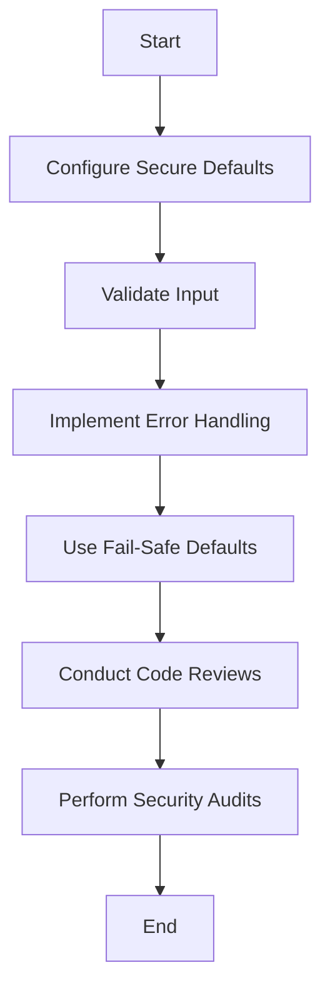

## 23.18. Secure Defaults and Defensive Programming

In the realm of software development, security is paramount. As developers, we must ensure that our applications are not only functional but also resilient against potential threats. This section delves into the concepts of secure defaults and defensive programming, two crucial strategies for minimizing vulnerabilities in Clojure applications.

### Understanding Secure Defaults

**Secure defaults** refer to the practice of configuring software systems in a way that minimizes security risks by default. This means that the default settings of a system should be the most secure possible, requiring users to explicitly opt-in to less secure configurations if necessary.

#### Why Secure Defaults Matter

Secure defaults are essential because they provide a baseline level of security without requiring users to have deep technical knowledge. By ensuring that systems are secure out of the box, we reduce the risk of misconfiguration, which is a common source of vulnerabilities.

**Key Benefits of Secure Defaults:**

- **Reduced Attack Surface:** By limiting exposure to potential threats, secure defaults help protect against unauthorized access and data breaches.
- **Ease of Use:** Users can rely on the system's default settings to be secure, reducing the need for manual configuration.
- **Compliance:** Secure defaults can help organizations meet regulatory requirements and industry standards.

### Implementing Secure Defaults in Clojure

When developing Clojure applications, it's important to configure libraries and frameworks securely from the start. Here are some guidelines to help you achieve secure defaults:

#### 1. Use Secure Libraries

Select libraries that prioritize security and have a track record of timely updates and patches. For example, when handling cryptographic operations, use well-established libraries like [Buddy](https://funcool.github.io/buddy/latest/) for encryption and authentication.

#### 2. Configure Secure Defaults in Libraries

Ensure that any third-party libraries you use are configured securely by default. For instance, when using a web framework like Ring, configure it to use HTTPS by default and enable security headers such as Content Security Policy (CSP) and HTTP Strict Transport Security (HSTS).

#### 3. Limit Permissions

Adopt the principle of least privilege by granting only the necessary permissions to your application components. This reduces the risk of unauthorized access and data leakage.

#### 4. Validate Input

Always validate input from external sources to prevent injection attacks and other vulnerabilities. Use libraries like [clojure.spec](https://clojure.org/guides/spec) to define and enforce data validation rules.

### Defensive Programming Techniques

**Defensive programming** is a methodology that anticipates and handles unexpected conditions in code. By adopting a defensive programming mindset, developers can create robust applications that gracefully handle errors and edge cases.

#### Key Techniques in Defensive Programming

1. **Input Validation**

   Validate all inputs to ensure they meet expected formats and constraints. This prevents malicious data from entering your system.

   ```clojure
   (require '[clojure.spec.alpha :as s])

   (s/def ::username (s/and string? #(re-matches #"\w+" %)))

   (defn validate-username [username]
     (if (s/valid? ::username username)
       username
       (throw (ex-info "Invalid username" {:username username}))))
   ```

2. **Fail-Safe Defaults**

   Design systems to fail in a secure manner. If an error occurs, ensure that the system defaults to a secure state rather than an open or vulnerable one.

   ```clojure
   (defn fetch-data [url]
     (try
       ;; Attempt to fetch data
       (let [response (http/get url)]
         (if (= 200 (:status response))
           (:body response)
           (throw (ex-info "Failed to fetch data" {:url url}))))
       (catch Exception e
         ;; Fail-safe: return an empty response
         (println "Error fetching data:" (.getMessage e))
         nil)))
   ```

3. **Error Handling and Logging**

   Implement comprehensive error handling to capture and log exceptions. This helps in diagnosing issues and preventing them from causing system failures.

   ```clojure
   (defn process-request [request]
     (try
       ;; Process the request
       (do-something request)
       (catch Exception e
         ;; Log the error and return a generic error message
         (log/error e "Error processing request")
         {:status 500 :body "Internal Server Error"})))
   ```

4. **Use of Assertions**

   Use assertions to enforce invariants and assumptions in your code. This helps catch errors early in the development process.

   ```clojure
   (defn divide [numerator denominator]
     (assert (not= denominator 0) "Denominator cannot be zero")
     (/ numerator denominator))
   ```

5. **Graceful Degradation**

   Design systems to degrade gracefully in the event of a failure. This ensures that critical functionality remains available even if some components fail.

   ```clojure
   (defn fetch-user-profile [user-id]
     (try
       ;; Attempt to fetch user profile
       (get-user-profile user-id)
       (catch Exception e
         ;; Graceful degradation: return a default profile
         (println "Error fetching user profile:" (.getMessage e))
         {:name "Guest" :preferences {}})))
   ```

### Encouraging a Security-First Mindset

To build secure applications, it's crucial to foster a security-first mindset within your development team. Here are some strategies to promote security awareness:

- **Regular Training:** Provide ongoing security training to keep developers informed about the latest threats and best practices.
- **Code Reviews:** Conduct regular code reviews with a focus on security to identify and address potential vulnerabilities.
- **Security Audits:** Perform periodic security audits to assess the effectiveness of your security measures and identify areas for improvement.
- **Threat Modeling:** Engage in threat modeling exercises to anticipate potential attack vectors and design appropriate defenses.

### Visualizing Secure Defaults and Defensive Programming

To better understand the relationship between secure defaults and defensive programming, let's visualize these concepts using a flowchart.



**Diagram Description:** This flowchart illustrates the process of implementing secure defaults and defensive programming. It begins with configuring secure defaults, followed by input validation, error handling, and the use of fail-safe defaults. The process continues with code reviews and security audits to ensure ongoing security.

### Try It Yourself

To reinforce your understanding of secure defaults and defensive programming, try modifying the code examples provided in this section. Experiment with different input validation rules, error handling strategies, and fail-safe defaults to see how they affect the security and robustness of your application.

### References and Further Reading

- [OWASP Secure Coding Practices](https://owasp.org/www-project-secure-coding-practices-quick-reference-guide/)
- [Clojure Spec Guide](https://clojure.org/guides/spec)
- [Buddy: Security Library for Clojure](https://funcool.github.io/buddy/latest/)

### Knowledge Check

To test your understanding of secure defaults and defensive programming, complete the following quiz.

## **Ready to Test Your Knowledge?**



### What is the primary benefit of secure defaults?

- [x] Reducing the risk of misconfiguration
- [ ] Increasing application performance
- [ ] Simplifying code complexity
- [ ] Enhancing user interface design

> **Explanation:** Secure defaults reduce the risk of misconfiguration by providing a baseline level of security without requiring users to have deep technical knowledge.

### Which library is recommended for cryptographic operations in Clojure?

- [x] Buddy
- [ ] Ring
- [ ] Compojure
- [ ] Aleph

> **Explanation:** Buddy is a well-established library for encryption and authentication in Clojure.

### What is the principle of least privilege?

- [x] Granting only necessary permissions to application components
- [ ] Allowing unrestricted access to all system resources
- [ ] Providing maximum privileges to administrators
- [ ] Disabling all security features by default

> **Explanation:** The principle of least privilege involves granting only the necessary permissions to application components to reduce the risk of unauthorized access.

### What is a fail-safe default?

- [x] A design that defaults to a secure state in case of an error
- [ ] A configuration that maximizes system performance
- [ ] A setting that allows unrestricted access to resources
- [ ] A feature that automatically updates software

> **Explanation:** A fail-safe default is a design that defaults to a secure state in case of an error, ensuring that the system remains protected.

### How can you validate input in Clojure?

- [x] Using clojure.spec
- [ ] Using Ring
- [ ] Using Aleph
- [ ] Using Compojure

> **Explanation:** Clojure.spec is a library used to define and enforce data validation rules in Clojure.

### What is the purpose of assertions in defensive programming?

- [x] To enforce invariants and assumptions in code
- [ ] To increase code execution speed
- [ ] To simplify error handling
- [ ] To enhance user interface design

> **Explanation:** Assertions are used to enforce invariants and assumptions in code, helping catch errors early in the development process.

### What is graceful degradation?

- [x] Designing systems to maintain critical functionality even if some components fail
- [ ] Allowing systems to fail completely in case of an error
- [ ] Disabling non-essential features to improve performance
- [ ] Automatically updating software to the latest version

> **Explanation:** Graceful degradation involves designing systems to maintain critical functionality even if some components fail, ensuring continued operation.

### What is the role of code reviews in a security-first mindset?

- [x] Identifying and addressing potential vulnerabilities
- [ ] Increasing application performance
- [ ] Simplifying code complexity
- [ ] Enhancing user interface design

> **Explanation:** Code reviews focus on identifying and addressing potential vulnerabilities, promoting a security-first mindset.

### What is the purpose of threat modeling?

- [x] Anticipating potential attack vectors and designing defenses
- [ ] Increasing application performance
- [ ] Simplifying code complexity
- [ ] Enhancing user interface design

> **Explanation:** Threat modeling involves anticipating potential attack vectors and designing appropriate defenses to protect the system.

### True or False: Secure defaults eliminate the need for defensive programming.

- [ ] True
- [x] False

> **Explanation:** Secure defaults provide a baseline level of security, but defensive programming is still necessary to handle unexpected conditions and enhance overall security.



Remember, adopting secure defaults and practicing defensive programming are essential steps in building robust and secure Clojure applications. As you continue your journey, keep experimenting, stay curious, and prioritize security in every aspect of your development process.
