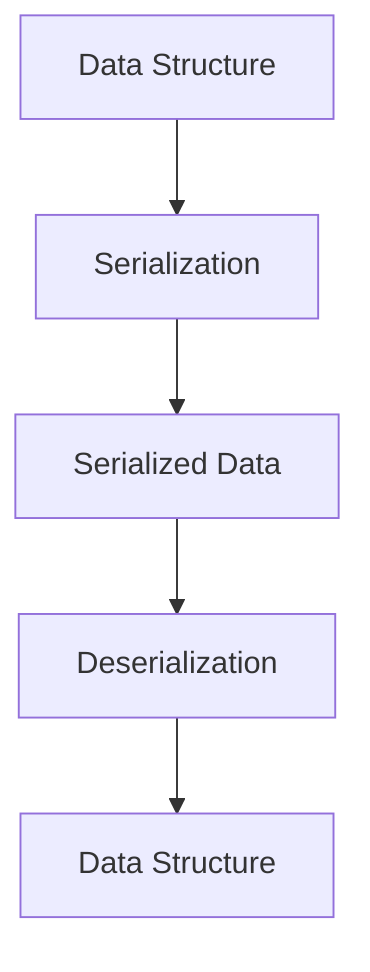

## 23.19. Handling Serialization Safely

Serialization is a crucial process in software development, enabling data to be converted into a format that can be easily stored or transmitted and later reconstructed. However, if not handled carefully, serialization can introduce significant security vulnerabilities, such as remote code execution and data tampering. In this section, we will explore the risks associated with serialization, discuss safe serialization formats and libraries, and provide best practices for securely handling serialized data in Clojure.

### Understanding Serialization Risks

Serialization involves converting an object into a byte stream, while deserialization is the reverse process. These processes are often used in data storage, communication between services, and caching. However, they can be exploited if not properly secured. Here are some common risks:

- **Remote Code Execution (RCE):** Malicious actors can craft serialized data that, when deserialized, executes arbitrary code on the server.
- **Data Tampering:** Serialized data can be intercepted and modified, leading to unauthorized access or data corruption.
- **Denial of Service (DoS):** Large or complex serialized objects can consume excessive resources during deserialization, leading to service disruption.

### Safe Serialization Formats

Choosing the right serialization format is crucial for security. Here are some safe formats commonly used in Clojure:

#### JSON

JSON (JavaScript Object Notation) is a lightweight data interchange format that is easy to read and write. It is widely used due to its simplicity and compatibility with many programming languages.

- **Pros:** Human-readable, widely supported, and easy to use.
- **Cons:** Lacks support for complex data types and can be verbose.

#### Transit

Transit is a format designed for transferring data between applications. It is more efficient than JSON and supports richer data types.

- **Pros:** Efficient, supports complex data types, and is designed for use with Clojure.
- **Cons:** Less human-readable than JSON.

### Secure Serialization Libraries

Using secure libraries for serialization is essential. Here are some libraries that can help ensure safe serialization in Clojure:

#### Cheshire

Cheshire is a fast JSON library for Clojure that provides a simple API for encoding and decoding JSON.

```clojure
(require '[cheshire.core :as json])

;; Encoding a Clojure map to JSON
(def data {:name "Alice" :age 30})
(def json-data (json/generate-string data))

;; Decoding JSON to a Clojure map
(def parsed-data (json/parse-string json-data true))
```

#### Transit-Clojure

Transit-Clojure is a library for encoding and decoding Transit data. It provides a balance between efficiency and expressiveness.

```clojure
(require '[cognitect.transit :as transit])
(require '[clojure.java.io :as io])

;; Encoding a Clojure map to Transit
(def data {:name "Bob" :age 25})
(with-open [out (io/output-stream "data.transit")]
  (transit/write (transit/writer out :json) data))

;; Decoding Transit to a Clojure map
(with-open [in (io/input-stream "data.transit")]
  (def parsed-data (transit/read (transit/reader in :json))))
```

### Best Practices for Secure Serialization

To handle serialization safely, follow these best practices:

#### Validate Input

Always validate serialized input before processing it. Use schemas or specifications to ensure data integrity.

```clojure
(require '[clojure.spec.alpha :as s])

(s/def ::name string?)
(s/def ::age pos-int?)

(defn validate-data [data]
  (s/valid? (s/keys :req [::name ::age]) data))
```

#### Use Whitelisting

When deserializing data, use whitelisting to allow only specific classes or types. This prevents malicious data from being executed.

#### Limit Data Size

Set limits on the size of serialized data to prevent DoS attacks. This can be done by configuring the serialization library or implementing custom checks.

#### Avoid Executing Code

Never execute code during deserialization. Avoid using serialization formats that support code execution, such as Java serialization.

### Versioning and Backwards Compatibility

When evolving your data structures, consider versioning your serialized data to maintain compatibility with older versions. This can be achieved by including a version identifier in your serialized data and handling different versions appropriately.

```clojure
(defn serialize-with-version [data version]
  (json/generate-string (assoc data :version version)))

(defn deserialize-with-version [json-data]
  (let [data (json/parse-string json-data true)]
    (case (:version data)
      1 (handle-version-1 data)
      2 (handle-version-2 data)
      (throw (ex-info "Unknown version" {:data data})))))
```

### Handling Untrusted Serialized Input

When dealing with untrusted serialized input, take extra precautions:

- **Sandbox Deserialization:** Run deserialization in a restricted environment to limit potential damage.
- **Use Immutable Data Structures:** Clojure's immutable data structures can help prevent data tampering.
- **Log and Monitor:** Log deserialization activities and monitor for suspicious patterns.

### Visualizing Serialization and Deserialization

To better understand the serialization and deserialization process, consider the following diagram:



**Figure 1:** The process of converting a data structure to serialized data and back.

### Try It Yourself

Experiment with the provided code examples by modifying the data structures and observing how the serialization and deserialization processes handle different types of data. Try implementing additional security measures, such as data validation and size limits.

### References and Further Reading

- [OWASP Serialization Cheat Sheet](https://cheatsheetseries.owasp.org/cheatsheets/Deserialization_Cheat_Sheet.html)
- [Cheshire GitHub Repository](https://github.com/dakrone/cheshire)
- [Transit-Clojure GitHub Repository](https://github.com/cognitect/transit-clj)

### Key Takeaways

- Serialization is essential for data interchange but can introduce security risks if not handled properly.
- Use safe serialization formats like JSON and Transit, and secure libraries like Cheshire and Transit-Clojure.
- Validate input, use whitelisting, and avoid executing code during deserialization.
- Consider versioning serialized data for backwards compatibility.
- Take extra precautions when handling untrusted serialized input.

Remember, this is just the beginning. As you progress, you'll build more secure and efficient systems. Keep experimenting, stay curious, and enjoy the journey!

## **Ready to Test Your Knowledge?**



### What is a common risk associated with serialization?

- [x] Remote Code Execution
- [ ] Data Compression
- [ ] Data Encryption
- [ ] Data Formatting

> **Explanation:** Remote Code Execution is a common risk associated with serialization, where malicious actors can execute arbitrary code during deserialization.

### Which serialization format is designed for use with Clojure and supports complex data types?

- [ ] JSON
- [x] Transit
- [ ] XML
- [ ] YAML

> **Explanation:** Transit is designed for use with Clojure and supports complex data types, making it a suitable choice for serialization.

### What is a best practice for handling untrusted serialized input?

- [x] Validate input before processing
- [ ] Execute code during deserialization
- [ ] Ignore input size
- [ ] Use blacklisting

> **Explanation:** Validating input before processing is a best practice for handling untrusted serialized input to ensure data integrity and security.

### What should you avoid during deserialization to prevent security risks?

- [x] Executing code
- [ ] Logging activities
- [ ] Using immutable data structures
- [ ] Monitoring patterns

> **Explanation:** Avoid executing code during deserialization to prevent security risks such as remote code execution.

### Which library is recommended for JSON serialization in Clojure?

- [x] Cheshire
- [ ] Transit-Clojure
- [ ] Jackson
- [ ] Gson

> **Explanation:** Cheshire is a recommended library for JSON serialization in Clojure due to its speed and simplicity.

### What is a benefit of using immutable data structures in serialization?

- [x] Prevents data tampering
- [ ] Increases data size
- [ ] Allows code execution
- [ ] Reduces data readability

> **Explanation:** Using immutable data structures helps prevent data tampering, enhancing security during serialization.

### How can you maintain backwards compatibility when evolving data structures?

- [x] Versioning serialized data
- [ ] Ignoring version identifiers
- [ ] Using blacklisting
- [ ] Avoiding data validation

> **Explanation:** Versioning serialized data helps maintain backwards compatibility by allowing different versions to be handled appropriately.

### What is a safe practice when dealing with serialized data size?

- [x] Set limits on data size
- [ ] Allow unlimited data size
- [ ] Ignore data size
- [ ] Use blacklisting

> **Explanation:** Setting limits on data size is a safe practice to prevent Denial of Service (DoS) attacks during serialization.

### Which diagram best represents the serialization and deserialization process?

- [x] Data Structure -> Serialization -> Serialized Data -> Deserialization -> Data Structure
- [ ] Data Structure -> Deserialization -> Serialized Data -> Serialization -> Data Structure
- [ ] Serialized Data -> Serialization -> Data Structure -> Deserialization -> Data Structure
- [ ] Serialization -> Data Structure -> Deserialization -> Serialized Data -> Data Structure

> **Explanation:** The correct process is Data Structure -> Serialization -> Serialized Data -> Deserialization -> Data Structure.

### True or False: JSON is more efficient than Transit for complex data types.

- [ ] True
- [x] False

> **Explanation:** False. Transit is more efficient than JSON for complex data types, as it is designed to support richer data structures.


