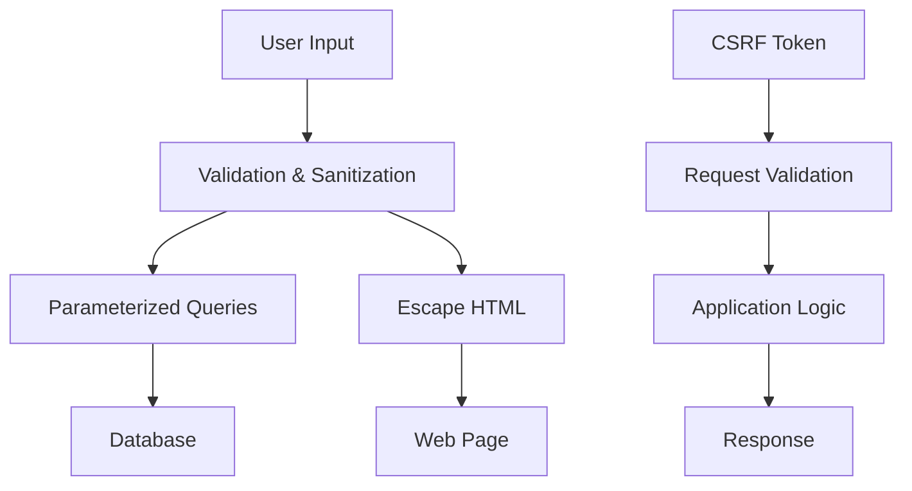

## 23.2. Protecting Against Common Vulnerabilities

In today's digital landscape, securing applications against common vulnerabilities is paramount. Clojure, with its functional programming paradigm and immutable data structures, offers unique advantages in building secure applications. However, developers must still be vigilant against prevalent security threats such as SQL injection, cross-site scripting (XSS), and cross-site request forgery (CSRF). This section explores these vulnerabilities, provides techniques for mitigation, and emphasizes the importance of regular security assessments.

### Understanding Common Vulnerabilities

Before diving into specific mitigation strategies, let's briefly outline the common vulnerabilities that Clojure developers need to be aware of:

1. **SQL Injection**: This occurs when an attacker is able to execute arbitrary SQL code on a database by manipulating input data.
2. **Cross-Site Scripting (XSS)**: This vulnerability allows attackers to inject malicious scripts into web pages viewed by other users.
3. **Cross-Site Request Forgery (CSRF)**: This attack tricks a user into executing unwanted actions on a web application in which they are authenticated.

### Mitigating SQL Injection

SQL injection is a critical vulnerability that can lead to unauthorized access to a database. To protect against SQL injection in Clojure applications, follow these best practices:

#### Use Parameterized Queries

Parameterized queries are a robust defense against SQL injection. They separate SQL logic from data, ensuring that user input is treated as data rather than executable code.

```clojure
(ns myapp.db
  (:require [clojure.java.jdbc :as jdbc]))

(def db-spec {:dbtype "h2" :dbname "test"})

(defn get-user-by-id [user-id]
  ;; Use parameterized queries to prevent SQL injection
  (jdbc/query db-spec
              ["SELECT * FROM users WHERE id = ?" user-id]))
```

In this example, the `?` placeholder is used to safely insert the `user-id` into the query, preventing any malicious input from being executed as SQL.

#### Validate and Sanitize Input

Always validate and sanitize user input before processing it. This reduces the risk of injection attacks by ensuring that input conforms to expected formats.

```clojure
(defn valid-id? [id]
  (re-matches #"\d+" id))

(defn get-user [id]
  (when (valid-id? id)
    (get-user-by-id id)))
```

#### Use ORM Libraries

Object-Relational Mapping (ORM) libraries abstract database interactions and often include built-in protections against SQL injection.

- **Korma**: A popular ORM library for Clojure that simplifies database operations and provides a layer of security.

```clojure
(ns myapp.models
  (:require [korma.core :as korma]))

(defentity users)

(defn find-user [id]
  (korma/select users
                (korma/where {:id id})))
```

### Preventing Cross-Site Scripting (XSS)

XSS attacks can compromise user data and application integrity. To prevent XSS in Clojure applications, consider the following strategies:

#### Escape User Input

Always escape user input before rendering it in HTML. This prevents malicious scripts from being executed in the browser.

```clojure
(ns myapp.views
  (:require [hiccup.core :refer [html]]
            [hiccup.util :refer [escape-html]]))

(defn user-profile [user]
  (html [:div
         [:h1 (escape-html (:name user))]
         [:p (escape-html (:bio user))]]))
```

In this example, `escape-html` ensures that user-provided data is safely rendered as text, not executable code.

#### Use Content Security Policy (CSP)

Implementing a Content Security Policy (CSP) helps mitigate XSS by restricting the sources from which content can be loaded.

```clojure
(ns myapp.middleware
  (:require [ring.middleware.content-security-policy :refer [wrap-content-security-policy]]))

(defn app [request]
  ;; Your application logic here
  )

(defn wrap-csp [handler]
  (wrap-content-security-policy handler
                                {:default-src "'self'"
                                 :script-src "'self'"}))

(def app-with-csp (wrap-csp app))
```

### Defending Against Cross-Site Request Forgery (CSRF)

CSRF attacks exploit the trust a web application has in a user's browser. To defend against CSRF, implement the following measures:

#### Use Anti-CSRF Tokens

Anti-CSRF tokens are unique tokens generated for each session or request, ensuring that requests are legitimate.

```clojure
(ns myapp.middleware
  (:require [ring.middleware.anti-forgery :refer [wrap-anti-forgery]]))

(defn app [request]
  ;; Your application logic here
  )

(def app-with-csrf (wrap-anti-forgery app))
```

#### Validate Referer Headers

Check the `Referer` header to ensure that requests originate from trusted sources.

```clojure
(defn valid-referer? [request]
  (let [referer (get-in request [:headers "referer"])]
    (and referer (clojure.string/starts-with? referer "https://trusted-site.com"))))

(defn app [request]
  (when (valid-referer? request)
    ;; Process request
    ))
```

### Leveraging Security Libraries and Frameworks

Clojure's ecosystem includes several libraries and frameworks that enhance security:

- **Buddy**: A comprehensive security library for Clojure that provides authentication, authorization, and cryptography features.
- **Ring**: A Clojure web application library that includes middleware for handling security concerns such as CSRF and XSS.

### Importance of Regular Security Assessments

Regular security assessments are crucial for identifying and mitigating vulnerabilities. Consider the following practices:

- **Conduct Penetration Testing**: Simulate attacks to identify weaknesses in your application.
- **Perform Code Reviews**: Regularly review code for security flaws and adherence to best practices.
- **Stay Informed**: Keep up-to-date with the latest security threats and mitigation techniques.

### Visualizing Security Measures

To better understand the flow of security measures in a Clojure web application, consider the following diagram:



**Diagram Description**: This flowchart illustrates the process of securing user input through validation, parameterized queries, and escaping HTML. It also shows the use of CSRF tokens for request validation.

### Conclusion

Protecting Clojure applications from common vulnerabilities requires a proactive approach. By implementing parameterized queries, escaping user input, using anti-CSRF tokens, and leveraging security libraries, developers can significantly reduce the risk of attacks. Remember, security is an ongoing process that demands regular assessments and updates.

## **Ready to Test Your Knowledge?**



### What is a primary defense against SQL injection in Clojure?

- [x] Parameterized queries
- [ ] Using raw SQL strings
- [ ] Disabling database logging
- [ ] Increasing server memory

> **Explanation:** Parameterized queries separate SQL logic from data, preventing malicious input from being executed as SQL.

### Which library is commonly used for ORM in Clojure?

- [ ] Ring
- [x] Korma
- [ ] Hiccup
- [ ] Buddy

> **Explanation:** Korma is a popular ORM library in Clojure that helps prevent SQL injection by abstracting database interactions.

### What is the purpose of escaping HTML in web applications?

- [x] To prevent XSS attacks
- [ ] To improve page load speed
- [ ] To enhance SEO
- [ ] To reduce server load

> **Explanation:** Escaping HTML ensures that user input is rendered as text, preventing malicious scripts from executing.

### How can CSRF attacks be mitigated?

- [x] Using anti-CSRF tokens
- [ ] Disabling cookies
- [ ] Increasing server bandwidth
- [ ] Using parameterized queries

> **Explanation:** Anti-CSRF tokens ensure that requests are legitimate by verifying the origin of the request.

### Which header can be checked to validate the origin of a request?

- [ ] Content-Type
- [ ] User-Agent
- [x] Referer
- [ ] Accept-Language

> **Explanation:** The Referer header can be checked to ensure requests originate from trusted sources.

### What does CSP stand for in web security?

- [x] Content Security Policy
- [ ] Cross-Site Protection
- [ ] Client-Side Programming
- [ ] Cookie Security Protocol

> **Explanation:** Content Security Policy (CSP) is a security feature that helps prevent XSS by restricting content sources.

### Which library provides comprehensive security features in Clojure?

- [ ] Hiccup
- [x] Buddy
- [ ] Korma
- [ ] Aleph

> **Explanation:** Buddy is a security library in Clojure that offers authentication, authorization, and cryptography features.

### Why is regular security assessment important?

- [x] To identify and mitigate vulnerabilities
- [ ] To increase application speed
- [ ] To reduce server costs
- [ ] To improve user interface

> **Explanation:** Regular security assessments help identify and mitigate vulnerabilities, ensuring the application remains secure.

### What is a common vulnerability that allows script injection into web pages?

- [ ] SQL Injection
- [x] Cross-Site Scripting (XSS)
- [ ] Cross-Site Request Forgery (CSRF)
- [ ] Buffer Overflow

> **Explanation:** Cross-Site Scripting (XSS) allows attackers to inject malicious scripts into web pages viewed by other users.

### True or False: Using raw SQL strings is a secure way to interact with databases in Clojure.

- [ ] True
- [x] False

> **Explanation:** Using raw SQL strings can lead to SQL injection vulnerabilities. Parameterized queries should be used instead.



Remember, this is just the beginning. As you progress, you'll build more secure and robust Clojure applications. Keep experimenting, stay curious, and enjoy the journey!
