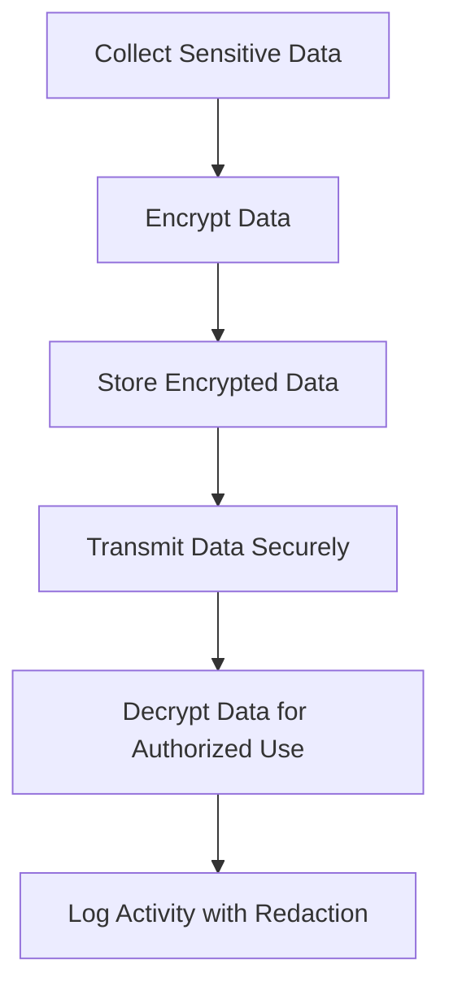

## 23.3. Handling Sensitive Data

In today's digital landscape, the protection of sensitive data is paramount. As developers, we must ensure that our applications handle data such as passwords, encryption keys, and personal information securely. This section will guide you through best practices for managing sensitive data in Clojure applications, including secure storage, encryption, and compliance with regulations like GDPR and HIPAA.

### Understanding Sensitive Data

Sensitive data refers to any information that must be protected from unauthorized access to safeguard the privacy or security of an individual or organization. This includes:

- **Personal Information**: Names, addresses, phone numbers, and email addresses.
- **Financial Information**: Credit card numbers, bank account details, and transaction records.
- **Authentication Credentials**: Passwords, PINs, and security questions.
- **Health Information**: Medical records and health insurance details.

### Secure Storage of Sensitive Data

#### Encryption and Hashing Techniques

Encryption and hashing are fundamental techniques for securing sensitive data. Encryption transforms data into a format that can only be read by someone with the correct decryption key, while hashing converts data into a fixed-size string of characters, which is typically irreversible.

**Encryption Example with Buddy**

Buddy is a popular Clojure library for cryptographic operations. Here's how you can use it to encrypt and decrypt data:

```clojure
(ns example.encryption
  (:require [buddy.core.crypto :as crypto]
            [buddy.core.keys :as keys]))

;; Generate a random key for encryption
(def secret-key (keys/generate-key :aes 256))

;; Encrypt a message
(defn encrypt-message [message]
  (crypto/encrypt message secret-key))

;; Decrypt a message
(defn decrypt-message [encrypted-message]
  (crypto/decrypt encrypted-message secret-key))

;; Usage
(let [message "Sensitive data"
      encrypted (encrypt-message message)]
  (println "Encrypted:" encrypted)
  (println "Decrypted:" (decrypt-message encrypted)))
```

**Hashing Example with Buddy**

Hashing is often used for storing passwords securely. Here's how you can hash a password using Buddy:

```clojure
(ns example.hashing
  (:require [buddy.hashers :as hashers]))

;; Hash a password
(defn hash-password [password]
  (hashers/derive password))

;; Verify a password
(defn verify-password [password hash]
  (hashers/check password hash))

;; Usage
(let [password "my-secret-password"
      hashed (hash-password password)]
  (println "Hashed Password:" hashed)
  (println "Password Verified:" (verify-password password hashed)))
```

### Secure Transmission of Sensitive Data

When transmitting sensitive data over networks, it's crucial to use secure protocols such as HTTPS and TLS to prevent interception by unauthorized parties. Ensure that all data exchanges between clients and servers are encrypted.

### Compliance with Regulations

#### GDPR and HIPAA

Compliance with regulations like GDPR (General Data Protection Regulation) and HIPAA (Health Insurance Portability and Accountability Act) is essential for applications handling sensitive data. These regulations mandate specific practices for data protection, including:

- **Data Minimization**: Collect only the data necessary for your application.
- **Access Controls**: Implement strict access controls to ensure that only authorized personnel can access sensitive data.
- **Data Breach Notification**: Have a plan in place to notify users in the event of a data breach.

### Logging Considerations

Logging is an essential part of application development, but it can inadvertently expose sensitive data if not handled properly. Follow these guidelines to ensure secure logging:

- **Avoid Logging Sensitive Data**: Never log passwords, encryption keys, or personal information.
- **Use Redaction**: If sensitive data must be logged, use redaction techniques to mask it.
- **Secure Log Storage**: Ensure that logs are stored securely and access is restricted.

### Try It Yourself

Experiment with the code examples provided above. Try modifying the encryption key, hashing algorithm, or message content to see how the output changes. This hands-on practice will help reinforce your understanding of these concepts.

### Visualizing Data Protection Workflow

Below is a diagram illustrating a typical workflow for handling sensitive data securely:



This diagram represents the flow from data collection to secure storage, transmission, and logging, emphasizing the importance of encryption and secure protocols at each step.

### References and Further Reading

- [Buddy Cryptographic Library](https://funcool.github.io/buddy-core/latest/)
- [GDPR Compliance](https://gdpr-info.eu/)
- [HIPAA Compliance](https://www.hhs.gov/hipaa/index.html)

### Knowledge Check

To reinforce your understanding, consider the following questions and exercises:

1. What are the key differences between encryption and hashing?
2. How can you ensure compliance with GDPR when handling sensitive data?
3. Modify the encryption example to use a different algorithm supported by Buddy.
4. Implement a logging function that redacts sensitive information before writing to a log file.

### Embrace the Journey

Handling sensitive data is a critical responsibility in software development. By following best practices and leveraging tools like Buddy, you can protect your users' data and build trust in your applications. Remember, this is just the beginning. As you continue to develop your skills, you'll discover even more techniques for securing data. Keep experimenting, stay curious, and enjoy the journey!

## **Ready to Test Your Knowledge?**



### What is the primary purpose of encryption?

- [x] To transform data into a format that can only be read by someone with the correct decryption key
- [ ] To convert data into a fixed-size string of characters
- [ ] To compress data for storage efficiency
- [ ] To remove sensitive information from data

> **Explanation:** Encryption is used to transform data into a secure format that can only be accessed by someone with the correct decryption key.

### Which Clojure library is commonly used for cryptographic operations?

- [x] Buddy
- [ ] Ring
- [ ] Compojure
- [ ] Aleph

> **Explanation:** Buddy is a popular Clojure library for cryptographic operations, including encryption and hashing.

### What is the main difference between encryption and hashing?

- [x] Encryption is reversible with a key, while hashing is typically irreversible
- [ ] Hashing is reversible with a key, while encryption is typically irreversible
- [ ] Both are reversible with a key
- [ ] Neither is reversible

> **Explanation:** Encryption can be reversed with the correct key, while hashing is a one-way process and cannot be reversed.

### Which protocol should be used for secure data transmission over networks?

- [x] HTTPS
- [ ] HTTP
- [ ] FTP
- [ ] SMTP

> **Explanation:** HTTPS is a secure protocol used for transmitting data over networks, ensuring encryption and protection against interception.

### What is a key requirement of GDPR compliance?

- [x] Data minimization
- [ ] Unlimited data collection
- [ ] Storing data in plain text
- [ ] Ignoring data breaches

> **Explanation:** GDPR requires data minimization, meaning only collecting the data necessary for the application.

### How can sensitive data be protected in logs?

- [x] By using redaction techniques to mask sensitive information
- [ ] By logging all data in plain text
- [ ] By ignoring logging altogether
- [ ] By storing logs in an unsecured location

> **Explanation:** Redaction techniques should be used to mask sensitive information in logs to prevent exposure.

### What should be avoided when logging sensitive data?

- [x] Logging passwords and encryption keys
- [ ] Logging general application errors
- [ ] Logging user activity
- [ ] Logging system performance metrics

> **Explanation:** Sensitive data like passwords and encryption keys should never be logged to prevent unauthorized access.

### What is the purpose of hashing passwords?

- [x] To securely store passwords in a way that cannot be easily reversed
- [ ] To encrypt passwords for transmission
- [ ] To compress passwords for storage efficiency
- [ ] To convert passwords into plain text

> **Explanation:** Hashing is used to securely store passwords in a way that cannot be easily reversed, protecting them from unauthorized access.

### Which regulation focuses on the protection of health information?

- [x] HIPAA
- [ ] GDPR
- [ ] PCI DSS
- [ ] CCPA

> **Explanation:** HIPAA focuses on the protection of health information and mandates specific practices for data security.

### True or False: Encryption keys should be stored in the same location as encrypted data.

- [ ] True
- [x] False

> **Explanation:** Encryption keys should be stored separately from encrypted data to enhance security and prevent unauthorized access.


