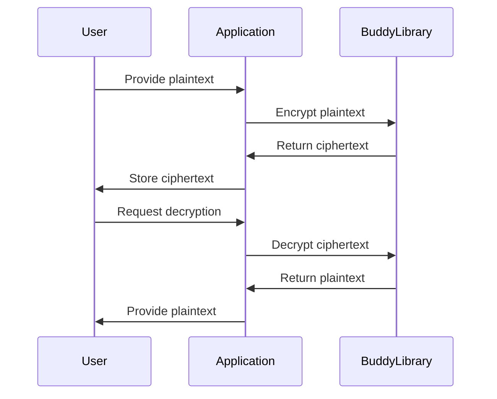

## 23.4. Data Encryption and Cryptography with Buddy

In today's digital landscape, securing data is paramount. Whether it's protecting sensitive user information or ensuring the integrity of communications, cryptography plays a crucial role. In this section, we'll explore how to implement data encryption and cryptographic functions in Clojure using the **[Buddy](https://funcool.github.io/buddy-core/latest/)** library. We'll cover encryption, decryption, key management, and best practices to ensure your data remains secure both at rest and in transit.

### Introduction to Cryptography in Application Development

Cryptography is the practice of securing information by transforming it into an unreadable format, only reversible by authorized parties. It is essential for:

- **Confidentiality**: Ensuring that information is accessible only to those authorized to view it.
- **Integrity**: Assuring that information is accurate and has not been tampered with.
- **Authentication**: Verifying the identity of users and systems.
- **Non-repudiation**: Ensuring that a party cannot deny the authenticity of their signature on a document or a message they sent.

#### Key Concepts

- **Encryption**: The process of converting plaintext into ciphertext using an algorithm and a key.
- **Decryption**: The process of converting ciphertext back into plaintext using a key.
- **Symmetric Encryption**: Uses the same key for encryption and decryption.
- **Asymmetric Encryption**: Uses a pair of keys (public and private) for encryption and decryption.
- **Hashing**: A one-way function that converts data into a fixed-size string of characters, which is typically a digest that represents the data.

### Why Use Buddy for Cryptography in Clojure?

Buddy is a comprehensive security library for Clojure that provides tools for cryptography, authentication, and authorization. It is designed to be easy to use and integrates seamlessly with Clojure applications. Key features include:

- **Support for modern cryptographic algorithms**: AES, RSA, HMAC, and more.
- **Ease of use**: Simple API for common cryptographic operations.
- **Extensibility**: Ability to integrate with other libraries and systems.
- **Active maintenance**: Regular updates to ensure security and compatibility.

### Getting Started with Buddy

To use Buddy in your Clojure project, add the following dependency to your `project.clj` or `deps.edn` file:

```clojure
;; For Leiningen
[buddy/buddy-core "1.10.0"]

;; For deps.edn
{:deps {buddy/buddy-core {:mvn/version "1.10.0"}}}
```

### Symmetric Encryption with Buddy

Symmetric encryption is suitable for scenarios where the same entity encrypts and decrypts data. Buddy provides a straightforward API for symmetric encryption using AES (Advanced Encryption Standard).

#### Example: Encrypting and Decrypting Data

Let's encrypt a piece of sensitive information using AES:

```clojure
(ns myapp.security
  (:require [buddy.core.crypto :as crypto]
            [buddy.core.codecs :as codecs]))

(def secret-key (codecs/hex->bytes "00112233445566778899aabbccddeeff"))

(defn encrypt-data [plaintext]
  (crypto/encrypt plaintext secret-key {:algorithm :aes128-cbc}))

(defn decrypt-data [ciphertext]
  (crypto/decrypt ciphertext secret-key {:algorithm :aes128-cbc}))

;; Usage
(let [plaintext "Sensitive data"
      encrypted (encrypt-data plaintext)
      decrypted (decrypt-data encrypted)]
  (println "Encrypted:" encrypted)
  (println "Decrypted:" decrypted))
```

**Key Points:**

- **Algorithm**: We use AES with CBC (Cipher Block Chaining) mode.
- **Key Management**: The secret key must be securely stored and managed.

### Asymmetric Encryption with Buddy

Asymmetric encryption is ideal for scenarios where data needs to be securely exchanged between parties. It uses a pair of keys: a public key for encryption and a private key for decryption.

#### Example: Generating Keys and Encrypting Data

```clojure
(ns myapp.security
  (:require [buddy.core.keys :as keys]
            [buddy.core.crypto :as crypto]))

(defn generate-key-pair []
  (keys/generate-key-pair {:algorithm :rsa :keysize 2048}))

(defn encrypt-with-public-key [plaintext public-key]
  (crypto/encrypt plaintext public-key {:algorithm :rsa}))

(defn decrypt-with-private-key [ciphertext private-key]
  (crypto/decrypt ciphertext private-key {:algorithm :rsa}))

;; Usage
(let [{:keys [public private]} (generate-key-pair)
      plaintext "Sensitive data"
      encrypted (encrypt-with-public-key plaintext public)
      decrypted (decrypt-with-private-key encrypted private)]
  (println "Encrypted:" encrypted)
  (println "Decrypted:" decrypted))
```

**Key Points:**

- **Key Pair Generation**: Generate a public/private key pair for RSA encryption.
- **Secure Key Storage**: Ensure private keys are stored securely and not exposed.

### Hashing and HMAC

Hashing is used for data integrity and password storage. HMAC (Hash-based Message Authentication Code) provides a way to verify data integrity and authenticity.

#### Example: Hashing a Password

```clojure
(ns myapp.security
  (:require [buddy.hashers :as hashers]))

(defn hash-password [password]
  (hashers/derive password))

(defn verify-password [password hash]
  (hashers/check password hash))

;; Usage
(let [password "mysecretpassword"
      hash (hash-password password)]
  (println "Password Hash:" hash)
  (println "Password Verified:" (verify-password password hash)))
```

**Key Points:**

- **Password Hashing**: Use a secure hashing algorithm to store passwords.
- **Verification**: Check passwords against stored hashes for authentication.

### Secure Handling of Cryptographic Keys and Secrets

Managing cryptographic keys and secrets is critical to maintaining security. Here are some best practices:

- **Use Environment Variables**: Store keys and secrets in environment variables rather than hardcoding them.
- **Key Rotation**: Regularly rotate keys to minimize the impact of a compromised key.
- **Access Control**: Limit access to keys and secrets to only those who need it.
- **Use a Key Management Service (KMS)**: Consider using a KMS for managing keys securely.

### Staying Updated with Cryptography Best Practices

Cryptography is a rapidly evolving field. To ensure your application remains secure:

- **Stay Informed**: Follow updates from reputable sources like the [National Institute of Standards and Technology (NIST)](https://www.nist.gov/).
- **Regularly Update Libraries**: Keep your cryptographic libraries up to date to benefit from security patches and improvements.
- **Conduct Security Audits**: Regularly audit your cryptographic implementations to identify and address vulnerabilities.

### Visualizing Cryptographic Processes

To better understand the flow of cryptographic operations, let's visualize the encryption and decryption process using a sequence diagram.



**Diagram Description**: This sequence diagram illustrates the process of encrypting and decrypting data using the Buddy library. The user provides plaintext to the application, which uses the Buddy library to encrypt it. The ciphertext is stored and later decrypted upon request.

### Try It Yourself

To deepen your understanding, try modifying the code examples:

- Change the encryption algorithm from AES to another supported by Buddy, such as ChaCha20.
- Implement a function to rotate encryption keys and re-encrypt existing data.
- Experiment with different key sizes and observe the impact on performance and security.

### Conclusion

Implementing data encryption and cryptography in Clojure using the Buddy library is a powerful way to secure your applications. By following best practices and staying informed about the latest developments in cryptography, you can protect sensitive data and maintain user trust.

## **Ready to Test Your Knowledge?**



### What is the primary purpose of cryptography in application development?

- [x] To secure information by transforming it into an unreadable format
- [ ] To improve application performance
- [ ] To enhance user interface design
- [ ] To simplify code maintenance

> **Explanation:** Cryptography is primarily used to secure information by transforming it into an unreadable format, ensuring confidentiality, integrity, authentication, and non-repudiation.

### Which cryptographic algorithm does Buddy use for symmetric encryption in the provided example?

- [x] AES
- [ ] RSA
- [ ] SHA-256
- [ ] DES

> **Explanation:** The example uses AES (Advanced Encryption Standard) for symmetric encryption.

### What is the key difference between symmetric and asymmetric encryption?

- [x] Symmetric encryption uses the same key for encryption and decryption, while asymmetric encryption uses a pair of keys.
- [ ] Symmetric encryption is faster than asymmetric encryption.
- [ ] Asymmetric encryption is less secure than symmetric encryption.
- [ ] Symmetric encryption is only used for hashing.

> **Explanation:** Symmetric encryption uses the same key for both encryption and decryption, whereas asymmetric encryption uses a pair of keys (public and private).

### What is the purpose of hashing in cryptography?

- [x] To ensure data integrity and secure password storage
- [ ] To encrypt data for secure transmission
- [ ] To generate random numbers
- [ ] To compress data for storage efficiency

> **Explanation:** Hashing is used to ensure data integrity and secure password storage by converting data into a fixed-size string of characters.

### How can cryptographic keys be securely managed?

- [x] By using environment variables and a Key Management Service (KMS)
- [ ] By hardcoding them in the application code
- [ ] By sharing them with all team members
- [ ] By storing them in plaintext files

> **Explanation:** Cryptographic keys should be securely managed using environment variables and a Key Management Service (KMS) to prevent unauthorized access.

### What is the benefit of using HMAC in cryptography?

- [x] It provides a way to verify data integrity and authenticity.
- [ ] It encrypts data for secure storage.
- [ ] It compresses data for efficient transmission.
- [ ] It generates random keys for encryption.

> **Explanation:** HMAC (Hash-based Message Authentication Code) provides a way to verify data integrity and authenticity.

### Why is it important to regularly update cryptographic libraries?

- [x] To benefit from security patches and improvements
- [ ] To reduce application size
- [ ] To improve user interface design
- [ ] To simplify code syntax

> **Explanation:** Regularly updating cryptographic libraries ensures that you benefit from security patches and improvements, maintaining the security of your application.

### What is the role of a Key Management Service (KMS)?

- [x] To securely manage cryptographic keys
- [ ] To encrypt data for secure transmission
- [ ] To generate random numbers
- [ ] To compress data for storage efficiency

> **Explanation:** A Key Management Service (KMS) securely manages cryptographic keys, ensuring they are stored and accessed securely.

### What is the primary advantage of using asymmetric encryption?

- [x] It allows secure data exchange between parties using a public/private key pair.
- [ ] It is faster than symmetric encryption.
- [ ] It requires less computational power.
- [ ] It is easier to implement than symmetric encryption.

> **Explanation:** Asymmetric encryption allows secure data exchange between parties using a public/private key pair, making it ideal for secure communications.

### True or False: Hashing is a reversible process.

- [ ] True
- [x] False

> **Explanation:** Hashing is a one-way function, meaning it is not reversible. It converts data into a fixed-size string of characters, typically used for data integrity and password storage.



Remember, this is just the beginning. As you progress, you'll build more secure and robust applications. Keep experimenting, stay curious, and enjoy the journey!
