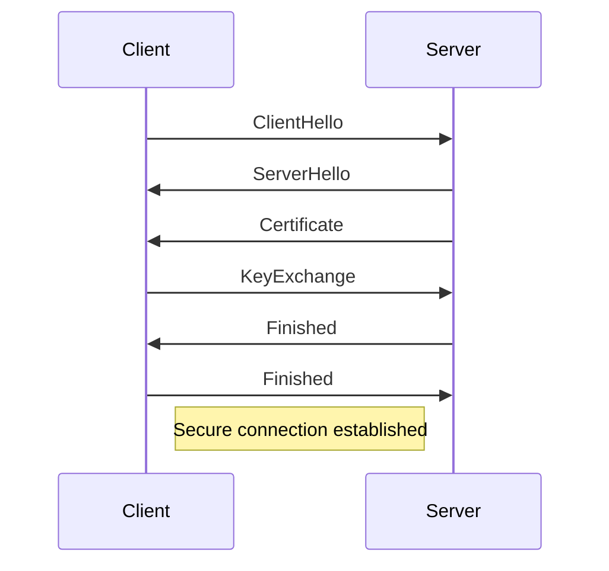

## 23.5. Secure Communication with TLS

In today's digital landscape, ensuring secure communication between clients and servers is paramount. Transport Layer Security (TLS) is the standard protocol for securing data in transit, providing confidentiality, integrity, and authenticity. In this section, we will delve into the importance of TLS, how to configure it in Clojure applications using popular web servers like Ring and HttpKit, and best practices for certificate management and client-side configuration.

### Importance of Securing Data in Transit with TLS

TLS is crucial for protecting sensitive information from eavesdropping, tampering, and forgery. It encrypts the data exchanged between clients and servers, ensuring that only authorized parties can access it. This is especially important for web applications handling personal data, financial transactions, or any confidential information.

#### Key Benefits of TLS:

- **Confidentiality**: Encrypts data to prevent unauthorized access.
- **Integrity**: Ensures data is not altered during transit.
- **Authentication**: Verifies the identity of the communicating parties.

### Configuring HTTPS in Clojure Web Servers

Clojure applications often use web servers like Ring and HttpKit. Configuring these servers to use HTTPS involves setting up TLS, which requires a valid SSL/TLS certificate.

#### Configuring HTTPS in Ring

Ring is a popular Clojure web application library that provides a simple interface for building web applications. To enable HTTPS in a Ring application, you can use the `ring-jetty-adapter` library, which allows you to configure Jetty as the underlying server.

```clojure
(ns myapp.core
  (:require [ring.adapter.jetty :refer [run-jetty]]
            [ring.middleware.defaults :refer [wrap-defaults site-defaults]]))

(defn handler [request]
  {:status 200
   :headers {"Content-Type" "text/plain"}
   :body "Hello, Secure World!"})

(defn -main []
  (run-jetty (wrap-defaults handler site-defaults)
             {:port 8443
              :ssl? true
              :ssl-port 8443
              :keystore "path/to/keystore.jks"
              :key-password "your-keystore-password"}))
```

- **`ssl?`**: Enables SSL/TLS.
- **`ssl-port`**: Specifies the port for HTTPS.
- **`keystore`**: Path to the Java KeyStore file containing the SSL certificate.
- **`key-password`**: Password for the KeyStore.

#### Configuring HTTPS in HttpKit

HttpKit is another lightweight and high-performance web server for Clojure. It supports HTTPS out of the box, and configuration is straightforward.

```clojure
(ns myapp.core
  (:require [org.httpkit.server :refer [run-server]]))

(defn handler [request]
  {:status 200
   :headers {"Content-Type" "text/plain"}
   :body "Hello, Secure World!"})

(defn -main []
  (run-server handler
              {:port 8443
               :ssl? true
               :ssl-port 8443
               :keystore "path/to/keystore.jks"
               :key-password "your-keystore-password"}))
```

- **`ssl?`**: Enables SSL/TLS.
- **`ssl-port`**: Specifies the port for HTTPS.
- **`keystore`**: Path to the Java KeyStore file containing the SSL certificate.
- **`key-password`**: Password for the KeyStore.

### Certificate Management

Managing SSL/TLS certificates is a critical aspect of setting up secure communication. Certificates can be obtained from trusted Certificate Authorities (CAs) or generated for development purposes.

#### Obtaining a Certificate

1. **Choose a Certificate Authority (CA)**: Select a reputable CA like Let's Encrypt, DigiCert, or Comodo.
2. **Generate a Certificate Signing Request (CSR)**: Use tools like OpenSSL to generate a CSR.
3. **Submit the CSR to the CA**: The CA will verify your identity and issue a certificate.
4. **Install the Certificate**: Configure your server to use the issued certificate.

#### Using Let's Encrypt

Let's Encrypt provides free SSL/TLS certificates and is widely used for securing web applications.

- **Install Certbot**: A tool to automate the certificate issuance and renewal process.
- **Run Certbot**: Use Certbot to obtain and install a certificate.

```bash
sudo certbot certonly --standalone -d yourdomain.com
```

- **Configure Your Server**: Update your server configuration to use the new certificate.

#### Managing Certificates in Java KeyStore

Java KeyStore (JKS) is a repository of security certificates. You can use the `keytool` utility to manage certificates in a KeyStore.

- **Create a KeyStore**: Generate a new KeyStore file.

```bash
keytool -genkeypair -alias myapp -keyalg RSA -keystore keystore.jks -keysize 2048
```

- **Import a Certificate**: Add a certificate to the KeyStore.

```bash
keytool -import -alias myapp -file myapp.crt -keystore keystore.jks
```

### Client-Side TLS Configuration

While server-side TLS configuration is crucial, client-side considerations are equally important to ensure secure communication.

#### Verifying Server Certificates

Clients should verify the server's certificate to prevent man-in-the-middle attacks. This involves checking the certificate's validity, issuer, and subject.

- **Use Trusted Certificate Authorities**: Ensure the server's certificate is issued by a trusted CA.
- **Check Certificate Expiry**: Verify that the certificate is not expired.
- **Validate the Certificate Chain**: Ensure the entire certificate chain is valid.

#### Configuring TLS in Clojure HTTP Clients

Clojure provides several libraries for making HTTP requests, such as `clj-http` and `http-kit.client`. These libraries support TLS configuration.

```clojure
(require '[clj-http.client :as client])

(defn fetch-secure-data []
  (client/get "https://secure-api.example.com"
              {:insecure? false
               :ssl-context (ssl/make-context {:trust-store "path/to/truststore.jks"
                                               :trust-store-password "truststore-password"})}))
```

- **`insecure?`**: Set to `false` to enforce certificate validation.
- **`ssl-context`**: Configure the SSL context with a trust store.

### Common Pitfalls and Troubleshooting Tips

Implementing TLS can be challenging, and several common pitfalls can arise.

#### Common Pitfalls

- **Expired Certificates**: Regularly check and renew certificates before they expire.
- **Incorrect KeyStore Configuration**: Ensure the KeyStore path and password are correct.
- **Weak Cipher Suites**: Use strong, modern cipher suites to prevent vulnerabilities.

#### Troubleshooting Tips

- **Check Logs**: Review server logs for TLS-related errors.
- **Test with Online Tools**: Use tools like SSL Labs to test your server's TLS configuration.
- **Update Dependencies**: Ensure your libraries and dependencies are up-to-date to avoid known vulnerabilities.

### Visualizing TLS Handshake Process

To better understand how TLS works, let's visualize the TLS handshake process using a sequence diagram.



- **ClientHello**: The client initiates the handshake by sending supported cipher suites and TLS versions.
- **ServerHello**: The server responds with the chosen cipher suite and TLS version.
- **Certificate**: The server sends its certificate for authentication.
- **KeyExchange**: The client and server exchange keys to establish a secure session.
- **Finished**: Both parties confirm the handshake is complete, and secure communication begins.

### Conclusion

Securing communication with TLS is essential for protecting data in transit. By configuring HTTPS in Clojure web servers, managing certificates effectively, and considering client-side security, you can ensure robust and secure communication in your applications. Remember to stay informed about the latest security practices and regularly update your configurations to mitigate potential vulnerabilities.

### Ready to Test Your Knowledge?



### What is the primary purpose of TLS in web applications?

- [x] To encrypt data in transit
- [ ] To store data securely
- [ ] To manage user authentication
- [ ] To optimize server performance

> **Explanation:** TLS encrypts data in transit to ensure confidentiality, integrity, and authenticity.

### Which library is used to configure HTTPS in a Ring application?

- [x] ring-jetty-adapter
- [ ] clj-http
- [ ] http-kit
- [ ] aleph

> **Explanation:** The `ring-jetty-adapter` library is used to configure Jetty as the server for Ring applications, enabling HTTPS.

### What is the role of a Certificate Authority (CA)?

- [x] To issue and verify digital certificates
- [ ] To encrypt data
- [ ] To manage server configurations
- [ ] To optimize network traffic

> **Explanation:** A CA issues and verifies digital certificates, ensuring the authenticity of the certificate holder.

### How can you obtain a free SSL/TLS certificate?

- [x] Use Let's Encrypt
- [ ] Purchase from a CA
- [ ] Generate a self-signed certificate
- [ ] Use a VPN service

> **Explanation:** Let's Encrypt provides free SSL/TLS certificates for securing web applications.

### What tool is commonly used to manage certificates in Java KeyStore?

- [x] keytool
- [ ] openssl
- [ ] certbot
- [ ] ssh-keygen

> **Explanation:** `keytool` is a utility for managing certificates in Java KeyStore.

### Which option should be set to `false` to enforce certificate validation in `clj-http`?

- [x] `insecure?`
- [ ] `ssl?`
- [ ] `validate-cert?`
- [ ] `secure?`

> **Explanation:** Setting `insecure?` to `false` enforces certificate validation in `clj-http`.

### What is a common pitfall when implementing TLS?

- [x] Using expired certificates
- [ ] Using strong cipher suites
- [ ] Regularly updating dependencies
- [ ] Testing with SSL Labs

> **Explanation:** Using expired certificates is a common pitfall that can lead to security vulnerabilities.

### What does the `ClientHello` message in a TLS handshake contain?

- [x] Supported cipher suites and TLS versions
- [ ] The server's certificate
- [ ] The client's private key
- [ ] The encrypted data

> **Explanation:** The `ClientHello` message contains the supported cipher suites and TLS versions.

### Which tool can automate the issuance and renewal of Let's Encrypt certificates?

- [x] Certbot
- [ ] keytool
- [ ] openssl
- [ ] ssh-keygen

> **Explanation:** Certbot is a tool that automates the issuance and renewal of Let's Encrypt certificates.

### True or False: TLS only provides data encryption.

- [ ] True
- [x] False

> **Explanation:** TLS provides data encryption, integrity, and authentication, ensuring secure communication.



Remember, this is just the beginning. As you progress, you'll build more secure and robust applications. Keep experimenting, stay curious, and enjoy the journey!
