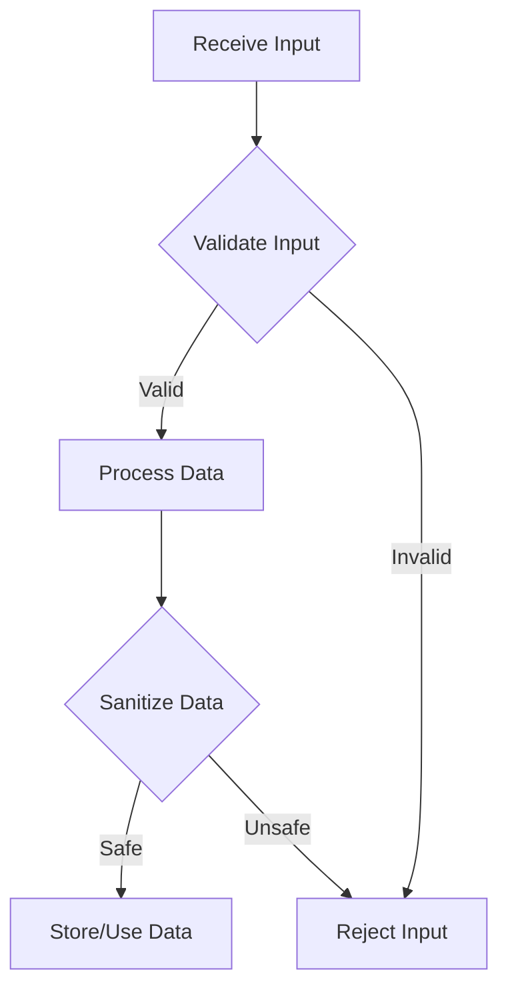

## 23.6. Input Validation and Sanitization

In today's interconnected world, applications are constantly exposed to various forms of user input, making them vulnerable to injection attacks and data corruption. Input validation and sanitization are critical practices in software development, especially in languages like Clojure, which are often used for building robust, scalable systems. This section will guide you through the best practices for validating and sanitizing input in Clojure, using powerful tools like Spec and Schema.

### Understanding the Risks of Unvalidated Input

Before diving into the techniques, it's essential to understand why input validation and sanitization are crucial. Unvalidated input can lead to:

- **Injection Attacks**: Such as SQL injection, where malicious users can manipulate queries to access unauthorized data.
- **Cross-Site Scripting (XSS)**: Where attackers inject scripts into web pages viewed by other users.
- **Data Corruption**: Invalid data can cause application crashes or incorrect processing.
- **Security Breaches**: Exploiting vulnerabilities to gain unauthorized access to systems.

### Key Concepts in Input Validation and Sanitization

- **Validation**: The process of checking if the input meets certain criteria before processing it. This ensures that the data is in the expected format and within acceptable ranges.
- **Sanitization**: The process of cleaning input to remove or escape potentially harmful content, making it safe to use within the application.

### Validation with Clojure Spec

Clojure's Spec library provides a powerful way to define and validate data structures. It allows you to specify the shape of your data and enforce constraints.

#### Defining Specifications

Let's start by defining a simple specification for a user entity:

```clojure
(require '[clojure.spec.alpha :as s])

(s/def ::username (s/and string? #(re-matches #"\w+" %)))
(s/def ::email (s/and string? #(re-matches #".+@.+\..+" %)))
(s/def ::age (s/and int? #(> % 0)))

(s/def ::user (s/keys :req [::username ::email ::age]))
```

- **Explanation**: Here, we define specs for `username`, `email`, and `age`. The `::user` spec combines these into a map with required keys.

#### Validating Data

To validate data against these specs, use `s/valid?`:

```clojure
(defn validate-user [user]
  (if (s/valid? ::user user)
    (println "User data is valid.")
    (println "User data is invalid.")))

(validate-user {:username "john_doe" :email "john@example.com" :age 30})
```

- **Explanation**: This function checks if the user data conforms to the `::user` spec and prints the result.

#### Generating Test Data

Spec can also generate test data, which is useful for testing:

```clojure
(require '[clojure.spec.gen.alpha :as gen])

(gen/sample (s/gen ::user))
```

- **Explanation**: This generates sample data that conforms to the `::user` spec, aiding in testing and development.

### Validation with Schema

Schema is another popular library for data validation in Clojure. It provides a more declarative approach compared to Spec.

#### Defining Schemas

Here's how you can define a schema for a user:

```clojure
(require '[schema.core :as sch])

(def User
  {:username sch/Str
   :email sch/Str
   :age sch/Int})
```

- **Explanation**: We define a `User` schema with string and integer types for the fields.

#### Validating Data

To validate data against a schema, use `sch/validate`:

```clojure
(defn validate-user-schema [user]
  (try
    (sch/validate User user)
    (println "User data is valid.")
    (catch Exception e
      (println "User data is invalid:" (.getMessage e)))))

(validate-user-schema {:username "john_doe" :email "john@example.com" :age 30})
```

- **Explanation**: This function attempts to validate the user data and catches exceptions if the data is invalid.

### Sanitizing Input

Sanitization is crucial for removing or escaping potentially harmful content. Here are some techniques:

#### String Sanitization

For strings, you can remove or escape special characters:

```clojure
(defn sanitize-string [input]
  (clojure.string/escape input {\< "&lt;" \> "&gt;" \& "&amp;" \" "&quot;" \' "&#39;"}))

(sanitize-string "<script>alert('xss');</script>")
```

- **Explanation**: This function escapes HTML special characters to prevent XSS attacks.

#### File Upload Sanitization

When handling file uploads, ensure the file type and size are within acceptable limits:

```clojure
(defn sanitize-file [file]
  (let [allowed-types #{"image/png" "image/jpeg"}
        max-size 1048576] ; 1 MB
    (and (contains? allowed-types (:content-type file))
         (<= (:size file) max-size))))
```

- **Explanation**: This function checks if the file type is allowed and the size is within limits.

### Best Practices for Input Validation and Sanitization

- **Validate at All Entry Points**: Ensure validation occurs at every point where data enters the system, including APIs, user interfaces, and external integrations.
- **Use Whitelisting**: Prefer whitelisting over blacklisting for allowed values, as it's more secure.
- **Keep Validation and Sanitization Separate**: While they are related, keep these processes distinct to maintain clarity and flexibility.
- **Regularly Update Validation Rules**: As your application evolves, so should your validation rules to accommodate new requirements and threats.
- **Test Thoroughly**: Use automated tests to ensure your validation and sanitization logic is robust and handles edge cases.

### Visualizing the Validation and Sanitization Process

To better understand the flow of validation and sanitization, let's visualize it using a flowchart:



- **Description**: This flowchart illustrates the process of receiving input, validating it, sanitizing it, and then either processing or rejecting it based on the outcome.

### References and Further Reading

- [Clojure Spec Guide](https://clojure.org/guides/spec)
- [Schema GitHub Repository](https://github.com/plumatic/schema)
- [OWASP Input Validation Cheat Sheet](https://cheatsheetseries.owasp.org/cheatsheets/Input_Validation_Cheat_Sheet.html)

### Knowledge Check

Let's reinforce what we've learned with some questions and exercises.

## **Ready to Test Your Knowledge?**



### What is the primary purpose of input validation?

- [x] To ensure data is in the expected format and within acceptable ranges
- [ ] To remove harmful content from data
- [ ] To encrypt data before storage
- [ ] To compress data for transmission

> **Explanation:** Input validation checks if the data meets certain criteria, ensuring it is in the expected format and within acceptable ranges.

### Which Clojure library is used for defining and validating data structures?

- [x] Spec
- [ ] Ring
- [ ] Aleph
- [ ] Manifold

> **Explanation:** Clojure's Spec library is used for defining and validating data structures.

### What is the difference between validation and sanitization?

- [x] Validation checks data format; sanitization removes harmful content
- [ ] Validation encrypts data; sanitization compresses data
- [ ] Validation removes harmful content; sanitization checks data format
- [ ] Validation compresses data; sanitization encrypts data

> **Explanation:** Validation ensures data is in the correct format, while sanitization removes or escapes harmful content.

### Which function is used to validate data against a Spec in Clojure?

- [x] s/valid?
- [ ] s/def
- [ ] s/gen
- [ ] s/keys

> **Explanation:** The `s/valid?` function checks if data conforms to a given Spec.

### What is a best practice for handling file uploads?

- [x] Check file type and size
- [ ] Only check file name
- [ ] Allow all file types
- [ ] Ignore file size

> **Explanation:** It's important to check both the file type and size to ensure they are within acceptable limits.

### How can you escape HTML special characters in Clojure?

- [x] Using clojure.string/escape
- [ ] Using clojure.core/escape
- [ ] Using clojure.data/escape
- [ ] Using clojure.xml/escape

> **Explanation:** The `clojure.string/escape` function can be used to escape HTML special characters.

### Which library provides a more declarative approach to data validation in Clojure?

- [x] Schema
- [ ] Spec
- [ ] Ring
- [ ] Aleph

> **Explanation:** Schema provides a more declarative approach to data validation compared to Spec.

### Why is it important to validate input at all entry points?

- [x] To prevent injection attacks and ensure data integrity
- [ ] To improve application performance
- [ ] To reduce code complexity
- [ ] To increase data redundancy

> **Explanation:** Validating input at all entry points helps prevent injection attacks and ensures data integrity.

### What should you prefer for allowed values in input validation?

- [x] Whitelisting
- [ ] Blacklisting
- [ ] Randomization
- [ ] Encryption

> **Explanation:** Whitelisting is preferred over blacklisting as it is more secure.

### True or False: Validation and sanitization should be combined into a single process.

- [ ] True
- [x] False

> **Explanation:** Validation and sanitization should be kept separate to maintain clarity and flexibility.



Remember, mastering input validation and sanitization is a journey. As you continue to build and refine your applications, keep these principles in mind to ensure your systems remain secure and resilient. Happy coding!
