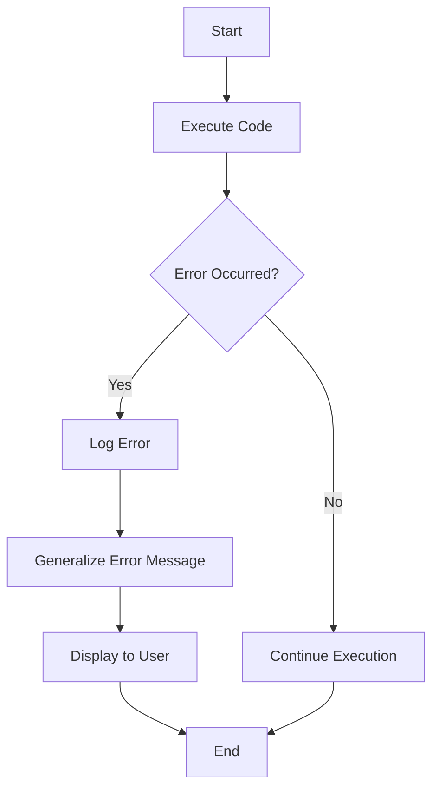

## 23.7. Error Handling and Avoiding Information Leakage

In the realm of software development, error handling is a critical aspect that ensures the robustness and reliability of applications. However, improper error handling can inadvertently lead to information leakage, exposing sensitive data to potential attackers. In this section, we will explore best practices for error handling in Clojure, focusing on preventing information leakage while maintaining effective debugging capabilities.

### Understanding the Risks of Detailed Error Messages

Detailed error messages can be a double-edged sword. While they provide valuable insights during development and debugging, they can also reveal sensitive information when exposed to end-users or attackers. This information might include stack traces, database queries, or even user data, which can be exploited to compromise the system.

#### Example of a Detailed Error Message

Consider the following example of a detailed error message:

```clojure
(try
  (throw (Exception. "Database connection failed: user=admin, password=secret"))
  (catch Exception e
    (println (.getMessage e))))
```

Output:
```
Database connection failed: user=admin, password=secret
```

In this example, sensitive information such as the database username and password is exposed, which could be exploited by an attacker.

### Strategies for Secure Error Handling

To mitigate the risks associated with detailed error messages, we must adopt secure error handling practices. Here are some strategies to consider:

#### 1. Generalize Error Messages

Instead of exposing detailed error information, provide generalized error messages that do not reveal sensitive details.

```clojure
(try
  (throw (Exception. "Database connection failed"))
  (catch Exception e
    (println "An error occurred. Please try again later.")))
```

#### 2. Use Logging for Detailed Errors

While generalized error messages are shown to users, detailed error information should be logged securely for developers to review.

```clojure
(require '[clojure.tools.logging :as log])

(try
  (throw (Exception. "Database connection failed"))
  (catch Exception e
    (log/error e "An error occurred during database connection")))
```

#### 3. Customize Error Responses in Web Applications

In web applications, customize error responses to ensure that users receive friendly messages, while detailed errors are logged for developers.

```clojure
(defn error-handler [request]
  (try
    ;; Simulate an error
    (throw (Exception. "Internal server error"))
    (catch Exception e
      (log/error e "Error processing request")
      {:status 500
       :headers {"Content-Type" "text/plain"}
       :body "An unexpected error occurred. Please contact support."})))
```

### Balancing Debugging Information with Security

While security is paramount, developers also need sufficient information to diagnose and fix issues. Here are some tips for balancing these needs:

#### 1. Use Environment-Specific Error Handling

Implement different error handling strategies for development and production environments. In development, more detailed error information can be shown, while in production, errors should be generalized.

```clojure
(defn handle-error [e]
  (if (= (System/getenv "ENV") "development")
    (println (.getMessage e))
    (println "An error occurred. Please try again later.")))
```

#### 2. Implement Access Controls for Logs

Ensure that only authorized personnel have access to detailed logs. This can be achieved through proper access controls and encryption.

#### 3. Regularly Review and Rotate Logs

Regularly review logs for any sensitive information and rotate them to prevent unauthorized access.

### Secure Exception Handling in Clojure

Clojure provides robust mechanisms for exception handling. Here are some best practices for secure exception handling:

#### 1. Use `try-catch` Blocks Appropriately

Ensure that `try-catch` blocks are used to handle exceptions gracefully without exposing sensitive information.

```clojure
(try
  ;; Code that may throw an exception
  (throw (Exception. "Simulated error"))
  (catch Exception e
    (log/error e "An error occurred")
    (println "An error occurred. Please try again later.")))
```

#### 2. Avoid Catching Generic Exceptions

Avoid catching generic exceptions such as `Throwable` or `Exception` without specific handling logic, as this can mask underlying issues.

#### 3. Use Custom Exception Types

Define custom exception types to handle specific error scenarios, providing more control over error handling.

```clojure
(defrecord DatabaseException [message])

(try
  (throw (->DatabaseException "Database connection failed"))
  (catch DatabaseException e
    (log/error e "Database error occurred")
    (println "An error occurred. Please try again later.")))
```

### Visualizing Error Handling Workflow

To better understand the error handling workflow, let's visualize the process using a flowchart.



**Figure 1:** Error handling workflow in Clojure applications.

### Knowledge Check

Before we conclude, let's reinforce our understanding with a few questions:

- What are the risks of exposing detailed error messages?
- How can we balance the need for debugging information with security?
- What are some best practices for secure exception handling in Clojure?

### Summary

In this section, we've explored the importance of secure error handling to prevent information leakage in Clojure applications. By generalizing error messages, using secure logging practices, and customizing error responses, we can protect sensitive information while maintaining effective debugging capabilities. Remember, security is an ongoing process, and regular reviews of error handling practices are essential to safeguard your applications.

### Ready to Test Your Knowledge?



### What is a key risk of exposing detailed error messages?

- [x] They can reveal sensitive information to attackers.
- [ ] They make debugging more difficult.
- [ ] They improve application performance.
- [ ] They reduce the need for logging.

> **Explanation:** Detailed error messages can expose sensitive information, such as stack traces or user data, which can be exploited by attackers.

### How can we securely log detailed error information?

- [x] Use a logging library to log errors securely.
- [ ] Print errors to the console.
- [ ] Display errors directly to users.
- [ ] Ignore errors to avoid logging them.

> **Explanation:** Using a logging library allows us to securely log detailed error information for developers to review, without exposing it to users.

### What is a recommended practice for error handling in production environments?

- [x] Generalize error messages shown to users.
- [ ] Show detailed error messages to users.
- [ ] Disable error logging.
- [ ] Catch all exceptions with a generic handler.

> **Explanation:** In production environments, it's important to generalize error messages to avoid exposing sensitive information to users.

### Why should we avoid catching generic exceptions without specific handling logic?

- [x] It can mask underlying issues.
- [ ] It improves error handling performance.
- [ ] It simplifies code maintenance.
- [ ] It enhances security.

> **Explanation:** Catching generic exceptions without specific handling logic can mask underlying issues, making it harder to diagnose and fix problems.

### What is a benefit of using custom exception types?

- [x] They provide more control over error handling.
- [ ] They reduce code complexity.
- [ ] They eliminate the need for logging.
- [ ] They improve application performance.

> **Explanation:** Custom exception types allow us to handle specific error scenarios more effectively, providing more control over error handling.

### How can we balance debugging information with security?

- [x] Use environment-specific error handling.
- [ ] Always show detailed errors to users.
- [ ] Disable logging in production.
- [ ] Catch all exceptions with a generic handler.

> **Explanation:** Using environment-specific error handling allows us to show more detailed errors in development while generalizing them in production for security.

### What is a recommended practice for managing access to logs?

- [x] Implement access controls and encryption.
- [ ] Allow all users to access logs.
- [ ] Disable logging to prevent access.
- [ ] Print logs to the console.

> **Explanation:** Implementing access controls and encryption ensures that only authorized personnel can access detailed logs, protecting sensitive information.

### What should be included in a generalized error message?

- [x] A friendly message indicating an error occurred.
- [ ] Detailed stack traces.
- [ ] User data involved in the error.
- [ ] Database connection details.

> **Explanation:** A generalized error message should provide a friendly indication that an error occurred, without revealing sensitive details.

### What is the purpose of regularly reviewing and rotating logs?

- [x] To prevent unauthorized access to sensitive information.
- [ ] To improve application performance.
- [ ] To reduce logging overhead.
- [ ] To simplify code maintenance.

> **Explanation:** Regularly reviewing and rotating logs helps prevent unauthorized access to sensitive information that may be contained in logs.

### True or False: Detailed error messages should always be shown to users for better debugging.

- [ ] True
- [x] False

> **Explanation:** Detailed error messages should not be shown to users, as they can expose sensitive information. Instead, they should be logged securely for developers to review.



Remember, this is just the beginning. As you progress, you'll build more secure and robust applications. Keep experimenting, stay curious, and enjoy the journey!
