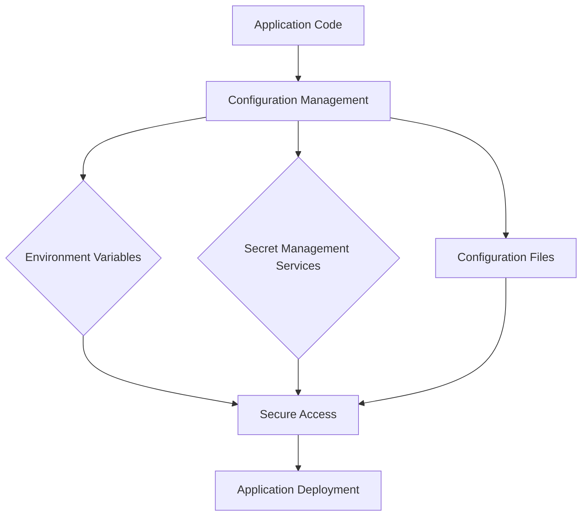

## 23.8. Secure Configuration Management

In the world of software development, managing application configurations securely is crucial. This involves handling secrets, environment-specific settings, and ensuring that sensitive information is not exposed. In this section, we will explore secure configuration management in Clojure, discussing the risks of hardcoding credentials, techniques for externalizing configurations, and best practices for different deployment environments.

### Understanding the Risks of Hardcoding Credentials

Hardcoding credentials and secrets directly into your codebase is a significant security risk. It can lead to unauthorized access, data breaches, and compliance violations. Let's examine why this practice is dangerous:

- **Exposure to Source Control**: Hardcoded secrets can be inadvertently committed to version control systems, making them accessible to anyone with access to the repository.
- **Difficulty in Rotation**: Changing hardcoded credentials requires code changes, which can be time-consuming and error-prone.
- **Environment-Specific Variability**: Different environments (development, testing, production) often require different configurations. Hardcoding makes it challenging to manage these variations.

### Techniques for Externalizing Configurations

To mitigate the risks associated with hardcoding, it's essential to externalize configurations. This involves separating configuration data from the application code. Here are some techniques to achieve this in Clojure:

#### Using Aero for Configuration Management

[Aero](https://github.com/juxt/aero) is a powerful library for managing configurations in Clojure. It allows you to define configurations in a structured and flexible manner. Here's how you can use Aero to externalize configurations:

```clojure
;; config.edn
{:db {:host #env "DB_HOST"
      :port #env "DB_PORT"
      :user #env "DB_USER"
      :password #env "DB_PASSWORD"}}

;; core.clj
(ns myapp.core
  (:require [aero.core :refer [read-config]]))

(defn load-config []
  (read-config (clojure.java.io/resource "config.edn")))

(def config (load-config))
```

In this example, Aero reads the configuration from an EDN file, allowing you to use environment variables for sensitive information like database credentials.

#### Leveraging cprop for Environment-Specific Configurations

[cprop](https://github.com/tolitius/cprop) is another library that simplifies configuration management by merging properties from various sources, such as environment variables, system properties, and configuration files. Here's how you can use cprop:

```clojure
;; deps.edn
{:deps {cprop {:mvn/version "0.1.17"}}}

;; core.clj
(ns myapp.core
  (:require [cprop.core :refer [load-config]]))

(def config (load-config))

;; Access configuration values
(println (:db-host config))
```

cprop automatically merges configurations, giving precedence to environment variables, which is ideal for managing environment-specific settings.

### Using Environment Variables and Secret Management Services

Environment variables are a common way to manage configurations securely. They allow you to keep sensitive information out of your codebase and provide flexibility across different environments.

#### Setting Environment Variables

You can set environment variables in various ways, depending on your operating system and deployment environment. For example, in a Unix-based system, you can set environment variables in the terminal:

```bash
export DB_HOST=localhost
export DB_PORT=5432
export DB_USER=admin
export DB_PASSWORD=secret
```

These variables can then be accessed in your Clojure application using libraries like Aero or cprop, as shown in the previous examples.

#### Secret Management Services

For enhanced security, consider using secret management services such as AWS Secrets Manager, HashiCorp Vault, or Azure Key Vault. These services provide secure storage and access control for sensitive information. Here's how you can integrate AWS Secrets Manager with Clojure:

```clojure
;; deps.edn
{:deps {com.cognitect.aws/api       {:mvn/version "0.8.505"}
        com.cognitect.aws/endpoints {:mvn/version "1.1.11.113"}
        com.cognitect.aws/secretsmanager {:mvn/version "0.8.505"}}}

;; core.clj
(ns myapp.core
  (:require [cognitect.aws.client.api :as aws]))

(def secrets-manager (aws/client {:api :secretsmanager}))

(defn get-secret [secret-id]
  (let [response (aws/invoke secrets-manager {:op :GetSecretValue
                                               :request {:SecretId secret-id}})]
    (:SecretString response)))

(def db-password (get-secret "my-db-password"))
```

In this example, we use the AWS SDK for Clojure to retrieve a secret from AWS Secrets Manager, ensuring that sensitive information is not hardcoded.

### Best Practices for Different Deployment Environments

Managing configurations securely requires different strategies for various deployment environments. Here are some best practices:

#### Development Environment

- **Use Local Configuration Files**: Store non-sensitive configurations in local files and use environment variables for sensitive data.
- **Mock Sensitive Services**: Use mock services or local instances for development to avoid exposing real credentials.

#### Testing Environment

- **Isolate Test Data**: Use separate configurations and databases for testing to prevent interference with production data.
- **Automate Configuration Setup**: Use scripts or tools to automate the setup of test environments, ensuring consistency.

#### Production Environment

- **Use Secret Management Services**: Leverage secret management services to store and retrieve sensitive information securely.
- **Implement Access Controls**: Restrict access to configuration files and secrets to authorized personnel only.
- **Monitor Configuration Changes**: Implement logging and monitoring to detect unauthorized changes to configurations.

### Securing Configuration Files

Configuration files often contain sensitive information and should be secured to prevent unauthorized access. Here are some tips:

- **Restrict File Permissions**: Limit access to configuration files to only those who need it.
- **Encrypt Sensitive Data**: Use encryption to protect sensitive information within configuration files.
- **Version Control Exclusions**: Exclude configuration files containing sensitive data from version control systems.

### Visualizing Secure Configuration Management

To better understand the flow of secure configuration management, let's visualize the process using a Mermaid.js diagram:



**Diagram Description**: This flowchart illustrates how application code interacts with configuration management, utilizing environment variables, secret management services, and configuration files to ensure secure access during deployment.

### Knowledge Check

Let's reinforce our understanding of secure configuration management with some questions and exercises.

#### Questions

1. What are the risks of hardcoding credentials in your codebase?
2. How can Aero help in managing configurations securely?
3. What are the benefits of using environment variables for configuration management?
4. How can secret management services enhance security?
5. What are some best practices for managing configurations in a production environment?

#### Exercises

1. **Experiment with Aero**: Modify the Aero configuration example to include additional environment-specific settings.
2. **Integrate cprop**: Use cprop to manage configurations in a sample Clojure project, experimenting with different sources.
3. **Secure a Configuration File**: Create a configuration file with sensitive information and implement encryption to protect it.

### Summary

In this section, we've explored the importance of secure configuration management in Clojure. By externalizing configurations, using environment variables, and leveraging secret management services, we can protect sensitive information and ensure that our applications are secure across different environments. Remember, secure configuration management is an ongoing process that requires vigilance and best practices to safeguard your applications.

## **Ready to Test Your Knowledge?**



### What is a significant risk of hardcoding credentials in your codebase?

- [x] Exposure to source control
- [ ] Improved performance
- [ ] Easier debugging
- [ ] Simplified deployment

> **Explanation:** Hardcoding credentials can lead to exposure in source control, making them accessible to unauthorized users.

### Which library allows you to define configurations in a structured and flexible manner in Clojure?

- [x] Aero
- [ ] Ring
- [ ] Compojure
- [ ] Leiningen

> **Explanation:** Aero is a library that provides structured and flexible configuration management in Clojure.

### What is a common way to manage configurations securely across different environments?

- [x] Using environment variables
- [ ] Hardcoding in the codebase
- [ ] Storing in plaintext files
- [ ] Embedding in binary files

> **Explanation:** Environment variables allow for secure and flexible configuration management across different environments.

### Which service can be used for secure storage and access control of sensitive information?

- [x] AWS Secrets Manager
- [ ] GitHub
- [ ] Docker Hub
- [ ] Jenkins

> **Explanation:** AWS Secrets Manager provides secure storage and access control for sensitive information.

### What is a best practice for managing configurations in a production environment?

- [x] Use secret management services
- [ ] Hardcode all credentials
- [ ] Share configuration files publicly
- [ ] Ignore access controls

> **Explanation:** Using secret management services is a best practice for managing configurations securely in production.

### How can you protect sensitive information within configuration files?

- [x] Encrypt sensitive data
- [ ] Use plaintext storage
- [ ] Share files with everyone
- [ ] Ignore file permissions

> **Explanation:** Encrypting sensitive data within configuration files helps protect it from unauthorized access.

### What should you do to prevent configuration files from being exposed in version control systems?

- [x] Exclude them from version control
- [ ] Commit them regularly
- [ ] Share them with the team
- [ ] Use default settings

> **Explanation:** Excluding configuration files from version control prevents them from being exposed to unauthorized users.

### Which library automatically merges configurations from various sources in Clojure?

- [x] cprop
- [ ] Ring
- [ ] Compojure
- [ ] Leiningen

> **Explanation:** cprop automatically merges configurations from various sources, giving precedence to environment variables.

### True or False: Hardcoding credentials makes it easier to rotate them.

- [ ] True
- [x] False

> **Explanation:** Hardcoding credentials makes it difficult to rotate them, as it requires code changes.

### True or False: Secret management services can help enhance security by providing access control.

- [x] True
- [ ] False

> **Explanation:** Secret management services enhance security by providing secure storage and access control for sensitive information.



Remember, secure configuration management is a critical aspect of software development. Keep experimenting, stay vigilant, and continue to improve your security practices.
