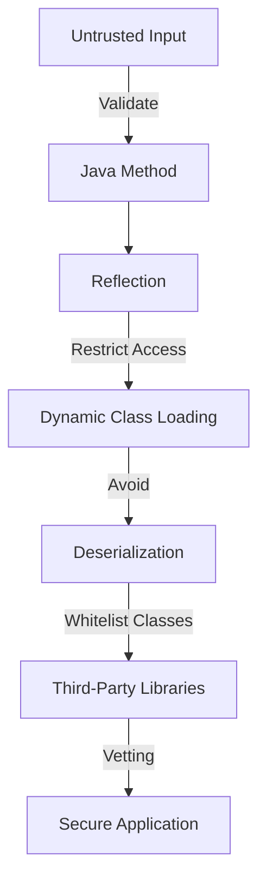

## 23.9. Understanding Java Interop Security Risks

In the world of software development, security is paramount. As Clojure developers, we often leverage Java interoperability to access a vast ecosystem of libraries and tools. However, this interop capability can introduce security vulnerabilities if not handled with care. In this section, we will explore the potential security risks associated with Java interop in Clojure and provide guidelines to mitigate these risks effectively.

### Introduction to Java Interop Security Risks

Java interoperability in Clojure allows developers to seamlessly integrate Java libraries and frameworks into their Clojure applications. While this offers significant advantages, it also opens the door to potential security vulnerabilities. Understanding these risks is crucial for building secure applications.

### How Java Interop Can Introduce Vulnerabilities

Java interop can introduce vulnerabilities in several ways:

1. **Untrusted Input**: Passing untrusted input to Java code can lead to security breaches if the input is not properly validated.
2. **Reflection and Dynamic Class Loading**: Using reflection and dynamic class loading can expose your application to code injection attacks.
3. **Deserialization**: Deserializing untrusted data can lead to remote code execution vulnerabilities.
4. **Third-Party Dependencies**: Relying on third-party Java libraries without thorough vetting can introduce vulnerabilities.

Let's delve deeper into each of these areas and explore how to mitigate the associated risks.

### Validating Untrusted Input Passed to Java Code

When interoperating with Java, it's essential to validate any untrusted input before passing it to Java methods. Unvalidated input can lead to injection attacks, such as SQL injection or command injection, which can compromise your application's security.

#### Guidelines for Input Validation

- **Sanitize Input**: Always sanitize input to remove any potentially harmful characters or patterns.
- **Use Whitelisting**: Prefer whitelisting over blacklisting. Define a set of acceptable input patterns and reject anything that doesn't match.
- **Leverage Java's Built-in Validation**: Use Java's built-in validation mechanisms, such as `Pattern` and `Matcher` classes, to enforce input constraints.

#### Example: Validating Input in Clojure

```clojure
(ns myapp.security
  (:import [java.util.regex Pattern]))

(defn validate-input [input]
  ;; Define a regex pattern for valid input
  (let [pattern (Pattern/compile "^[a-zA-Z0-9]+$")]
    (if (.matches pattern input)
      input
      (throw (IllegalArgumentException. "Invalid input")))))

;; Usage
(try
  (validate-input "safeInput123")
  (println "Input is valid")
  (catch IllegalArgumentException e
    (println (.getMessage e))))
```

### Safely Using Reflection and Dynamic Class Loading

Reflection and dynamic class loading are powerful features in Java, but they can also be dangerous if misused. These features allow you to inspect and modify classes at runtime, which can be exploited by attackers to execute arbitrary code.

#### Guidelines for Safe Reflection

- **Limit Reflection Usage**: Use reflection sparingly and only when absolutely necessary.
- **Restrict Access**: Restrict access to sensitive methods and fields using Java's security manager.
- **Avoid Dynamic Class Loading**: Avoid loading classes dynamically unless you have complete control over the classpath.

#### Example: Safe Reflection in Clojure

```clojure
(ns myapp.reflection
  (:import [java.lang.reflect Method]))

(defn invoke-method [obj method-name]
  (let [method (.getMethod (class obj) method-name (into-array Class []))]
    (.invoke method obj (into-array Object []))))

;; Usage
(let [obj (java.util.Date.)]
  (println (invoke-method obj "toString")))
```

### Addressing Security Concerns with Deserialization

Deserialization is the process of converting a byte stream back into an object. If not handled carefully, deserialization can lead to remote code execution vulnerabilities, where an attacker crafts malicious data to execute arbitrary code during deserialization.

#### Guidelines for Safe Deserialization

- **Avoid Deserializing Untrusted Data**: Never deserialize data from untrusted sources.
- **Use Whitelisting**: Implement a whitelist of classes that are allowed to be deserialized.
- **Leverage Java's Security Features**: Use Java's `ObjectInputFilter` to filter classes during deserialization.

#### Example: Safe Deserialization in Clojure

```clojure
(ns myapp.deserialization
  (:import [java.io ObjectInputStream ByteArrayInputStream]))

(defn safe-deserialize [data]
  (with-open [ois (ObjectInputStream. (ByteArrayInputStream. data))]
    ;; Implement a whitelist of allowed classes
    (.setObjectInputFilter ois (proxy [java.io.ObjectInputFilter] []
                                (checkInput [filterInfo]
                                  (if (contains? #{"java.util.Date"} (.serialClass filterInfo))
                                    java.io.ObjectInputFilter$Status/ALLOWED
                                    java.io.ObjectInputFilter$Status/REJECTED))))
    (.readObject ois)))

;; Usage
(try
  (let [data (byte-array [/* serialized data */])]
    (safe-deserialize data))
  (catch Exception e
    (println "Deserialization failed:" (.getMessage e))))
```

### Thorough Vetting of Third-Party Java Dependencies

Third-party Java libraries can introduce vulnerabilities if not thoroughly vetted. It's crucial to evaluate the security posture of any library you integrate into your application.

#### Guidelines for Vetting Dependencies

- **Review Source Code**: If possible, review the source code of third-party libraries for potential vulnerabilities.
- **Check for Known Vulnerabilities**: Use tools like OWASP Dependency-Check to identify known vulnerabilities in your dependencies.
- **Keep Dependencies Updated**: Regularly update your dependencies to ensure you have the latest security patches.

### Visualizing Java Interop Security Risks

To better understand the flow of potential security risks in Java interop, let's visualize the process using a flowchart.



**Caption**: This flowchart illustrates the potential security risks in Java interop and the steps to mitigate them, leading to a secure application.

### Conclusion

Understanding and mitigating Java interop security risks is crucial for building secure Clojure applications. By validating input, using reflection safely, addressing deserialization concerns, and thoroughly vetting third-party dependencies, you can significantly reduce the attack surface of your application.

### Knowledge Check

To reinforce your understanding of Java interop security risks, let's test your knowledge with a quiz.

## **Ready to Test Your Knowledge?**



### What is a common security risk when passing untrusted input to Java code?

- [x] Injection attacks
- [ ] Memory leaks
- [ ] Performance degradation
- [ ] Increased latency

> **Explanation:** Untrusted input can lead to injection attacks, such as SQL injection or command injection, compromising application security.

### Which of the following is a guideline for safe reflection usage?

- [x] Limit reflection usage
- [ ] Use reflection for all method calls
- [ ] Avoid using Java's security manager
- [ ] Load classes dynamically

> **Explanation:** Limiting reflection usage reduces the risk of code injection attacks, making your application more secure.

### What is a potential vulnerability associated with deserialization?

- [x] Remote code execution
- [ ] Data loss
- [ ] Increased memory usage
- [ ] Network congestion

> **Explanation:** Deserializing untrusted data can lead to remote code execution vulnerabilities, allowing attackers to execute arbitrary code.

### How can you mitigate security risks with third-party Java dependencies?

- [x] Review source code
- [x] Check for known vulnerabilities
- [x] Keep dependencies updated
- [ ] Use outdated libraries

> **Explanation:** Reviewing source code, checking for known vulnerabilities, and keeping dependencies updated are essential steps to mitigate security risks.

### What is the purpose of using a whitelist during deserialization?

- [x] To allow only specific classes to be deserialized
- [ ] To block all classes from being deserialized
- [ ] To increase deserialization speed
- [ ] To reduce memory usage

> **Explanation:** A whitelist ensures that only specific, trusted classes are deserialized, reducing the risk of remote code execution.

### Which tool can help identify known vulnerabilities in dependencies?

- [x] OWASP Dependency-Check
- [ ] Java Security Manager
- [ ] Clojure REPL
- [ ] JVM Profiler

> **Explanation:** OWASP Dependency-Check is a tool that helps identify known vulnerabilities in your project's dependencies.

### What is a best practice for handling untrusted input in Java interop?

- [x] Sanitize input
- [ ] Ignore input validation
- [ ] Use blacklisting
- [ ] Allow all input

> **Explanation:** Sanitizing input is a best practice to remove potentially harmful characters or patterns, ensuring application security.

### Why should dynamic class loading be avoided?

- [x] It can lead to code injection attacks
- [ ] It improves performance
- [ ] It simplifies code
- [ ] It enhances security

> **Explanation:** Dynamic class loading can lead to code injection attacks, compromising application security.

### What is the role of Java's `ObjectInputFilter` in deserialization?

- [x] To filter classes during deserialization
- [ ] To increase deserialization speed
- [ ] To reduce memory usage
- [ ] To enhance network performance

> **Explanation:** `ObjectInputFilter` is used to filter classes during deserialization, allowing only trusted classes to be deserialized.

### True or False: It's safe to deserialize data from any source.

- [ ] True
- [x] False

> **Explanation:** Deserializing data from untrusted sources can lead to remote code execution vulnerabilities, making it unsafe.



Remember, this is just the beginning. As you progress, you'll build more secure and robust applications. Keep experimenting, stay curious, and enjoy the journey!
