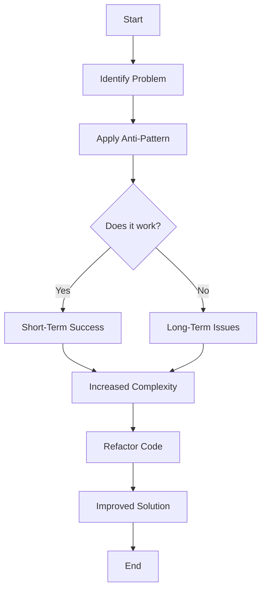

## 24.1. Recognizing Anti-Patterns in Clojure

### Introduction

In the world of software development, **anti-patterns** are like the dark side of design patterns. While design patterns provide proven solutions to common problems, anti-patterns represent common responses to recurring problems that are ineffective and counterproductive. Recognizing and avoiding these anti-patterns is crucial for writing efficient, maintainable, and error-free code, especially in a language like Clojure, which emphasizes simplicity and functional programming.

### What Are Anti-Patterns?

Anti-patterns are practices or patterns that may seem beneficial at first but ultimately lead to negative consequences such as increased complexity, reduced performance, or maintenance challenges. They often arise from misunderstandings of language features, overuse of certain constructs, or attempts to apply paradigms from other languages that do not fit well with Clojure's philosophy.

### The Impact of Anti-Patterns

The presence of anti-patterns in code can have several detrimental effects:

- **Reduced Code Quality**: Anti-patterns often lead to code that is difficult to read, understand, and maintain.
- **Performance Issues**: Inefficient patterns can cause unnecessary computational overhead, leading to slower applications.
- **Increased Complexity**: Anti-patterns can introduce unnecessary complexity, making it harder for developers to reason about the code.
- **Higher Error Rates**: Code that follows anti-patterns is more prone to bugs and errors, increasing the likelihood of defects in production.

### Importance of Recognizing Anti-Patterns in Clojure

Clojure is a functional programming language that emphasizes immutability, simplicity, and concurrency. Recognizing and avoiding anti-patterns in Clojure is essential for leveraging these strengths and writing idiomatic code. By understanding common anti-patterns, developers can:

- **Write Cleaner Code**: Avoiding anti-patterns leads to more readable and maintainable code.
- **Improve Performance**: Recognizing inefficient patterns helps optimize code for better performance.
- **Enhance Maintainability**: Clean, idiomatic code is easier to maintain and extend.
- **Foster Collaboration**: Code that adheres to best practices is easier for teams to work on collaboratively.

### Common Anti-Patterns in Clojure

Let's explore some common anti-patterns in Clojure and how to avoid them:

#### 1. Overusing Macros

**Description**: Macros are a powerful feature in Clojure that allow for code transformation at compile time. However, overusing macros can lead to code that is difficult to understand and debug.

**Impact**: Excessive use of macros can obscure the logic of the code, making it hard to follow and maintain.

**Solution**: Use macros sparingly and only when necessary. Prefer functions over macros for most tasks, as functions are easier to reason about and test.

**Example**:

```clojure
;; Anti-pattern: Overusing macros for simple tasks
(defmacro add [a b]
  `(+ ~a ~b))

;; Better approach: Use a function
(defn add [a b]
  (+ a b))
```

#### 2. Misusing Atoms, Refs, and Agents

**Description**: Clojure provides several concurrency primitives, including atoms, refs, and agents. Misusing these can lead to incorrect handling of state and concurrency issues.

**Impact**: Misuse can result in race conditions, inconsistent state, and difficult-to-debug concurrency problems.

**Solution**: Understand the appropriate use cases for each concurrency primitive. Use atoms for independent state changes, refs for coordinated state changes, and agents for asynchronous updates.

**Example**:

```clojure
;; Anti-pattern: Using an atom for coordinated state changes
(def counter (atom 0))

(defn increment-counter []
  (swap! counter inc))

;; Better approach: Use refs for coordinated state changes
(def counter (ref 0))

(defn increment-counter []
  (dosync (alter counter inc)))
```

#### 3. Inefficient Use of Sequences

**Description**: Sequences are a core part of Clojure, but inefficient use can lead to performance issues, especially with large data sets.

**Impact**: Inefficient sequence operations can cause unnecessary memory consumption and slow down the application.

**Solution**: Use lazy sequences and transducers to process data efficiently. Avoid unnecessary intermediate collections.

**Example**:

```clojure
;; Anti-pattern: Creating intermediate collections
(defn process-data [data]
  (->> data
       (map inc)
       (filter even?)
       (reduce +)))

;; Better approach: Use transducers
(defn process-data [data]
  (transduce (comp (map inc) (filter even?)) + data))
```

#### 4. Blocking Operations in Asynchronous Code

**Description**: Blocking operations in asynchronous code can negate the benefits of concurrency and lead to performance bottlenecks.

**Impact**: Blocking can cause threads to be tied up, reducing the responsiveness and throughput of the application.

**Solution**: Use non-blocking operations and core.async channels to handle asynchronous tasks.

**Example**:

```clojure
;; Anti-pattern: Blocking operation in asynchronous code
(defn fetch-data [url]
  (let [response (http/get url)]
    (:body response)))

;; Better approach: Use core.async for non-blocking I/O
(require '[clojure.core.async :refer [go <!]])

(defn fetch-data [url]
  (go
    (let [response (<! (http/get url))]
      (:body response))))
```

#### 5. Poor Error Handling Practices

**Description**: Error handling is crucial for robust applications. Poor error handling can lead to unhandled exceptions and unpredictable behavior.

**Impact**: Unhandled errors can cause application crashes and data corruption.

**Solution**: Use try-catch blocks and error handling libraries to manage exceptions gracefully. Consider using monads for functional error handling.

**Example**:

```clojure
;; Anti-pattern: Ignoring exceptions
(defn divide [a b]
  (/ a b))

;; Better approach: Handle exceptions
(defn divide [a b]
  (try
    (/ a b)
    (catch ArithmeticException e
      (println "Cannot divide by zero"))))
```

#### 6. Ignoring Lazy Evaluation Consequences

**Description**: Lazy evaluation is a powerful feature in Clojure, but ignoring its consequences can lead to unexpected behavior and resource leaks.

**Impact**: Unintended retention of resources and delayed execution can cause memory leaks and performance issues.

**Solution**: Be mindful of when lazy sequences are realized and ensure they are consumed appropriately.

**Example**:

```clojure
;; Anti-pattern: Ignoring lazy evaluation
(defn process-large-file [file]
  (let [lines (line-seq (clojure.java.io/reader file))]
    (doseq [line lines]
      (println line))))

;; Better approach: Ensure lazy sequences are consumed
(defn process-large-file [file]
  (with-open [rdr (clojure.java.io/reader file)]
    (doseq [line (line-seq rdr)]
      (println line))))
```

#### 7. Premature Optimization

**Description**: Optimizing code before understanding the actual performance bottlenecks can lead to unnecessary complexity and maintenance challenges.

**Impact**: Premature optimization can obscure the code's intent and make it harder to maintain.

**Solution**: Focus on writing clear and correct code first. Use profiling tools to identify actual bottlenecks before optimizing.

**Example**:

```clojure
;; Anti-pattern: Premature optimization
(defn calculate [data]
  (let [result (reduce + (map #(* % %) data))]
    (Math/sqrt result)))

;; Better approach: Write clear code first, then optimize if needed
(defn calculate [data]
  (Math/sqrt (reduce + (map #(* % %) data))))
```

#### 8. Overcomplicating with Unnecessary Abstractions

**Description**: Introducing unnecessary abstractions can make code more complex and harder to understand.

**Impact**: Overcomplicated code can be difficult to maintain and extend.

**Solution**: Keep code simple and use abstractions only when they provide clear benefits.

**Example**:

```clojure
;; Anti-pattern: Unnecessary abstraction
(defn process-data [data]
  (let [processor (fn [x] (* x x))]
    (map processor data)))

;; Better approach: Use simple functions
(defn process-data [data]
  (map #(* % %) data))
```

### Visualizing Anti-Patterns

To better understand the impact of anti-patterns, let's visualize the flow of a common anti-pattern using a Mermaid.js diagram.



**Diagram Description**: This flowchart illustrates the typical lifecycle of an anti-pattern. Initially, a problem is identified, and an anti-pattern is applied. While it may seem to work in the short term, it often leads to long-term issues and increased complexity, necessitating refactoring for an improved solution.

### Benefits of Writing Idiomatic and Clean Clojure Code

Writing idiomatic and clean Clojure code offers numerous benefits:

- **Readability**: Clean code is easier to read and understand, making it accessible to other developers.
- **Maintainability**: Code that follows best practices is easier to maintain and extend over time.
- **Performance**: Avoiding anti-patterns leads to more efficient code execution.
- **Collaboration**: Clean code fosters better collaboration among team members.

### Encouraging Mindfulness in Clojure Programming

As Clojure developers, it's important to be mindful of our programming practices. By recognizing and avoiding anti-patterns, we can write code that is not only functional but also elegant and efficient. Embrace the principles of simplicity, immutability, and functional programming to harness the full power of Clojure.

### Knowledge Check

To reinforce your understanding of anti-patterns in Clojure, consider the following questions and challenges:

- What are anti-patterns, and why are they detrimental to software development?
- How can overusing macros lead to code that is difficult to maintain?
- Why is it important to choose the right concurrency primitive in Clojure?
- How can lazy evaluation lead to unexpected behavior if not handled properly?
- What are the risks of premature optimization, and how can they be mitigated?

### Conclusion

Recognizing and avoiding anti-patterns is a crucial skill for any Clojure developer. By understanding these common pitfalls, you can write code that is efficient, maintainable, and aligned with Clojure's philosophy. Remember, this is just the beginning. As you continue your journey with Clojure, keep experimenting, stay curious, and enjoy the process of writing beautiful, idiomatic code.

## **Ready to Test Your Knowledge?**



### What is an anti-pattern?

- [x] A common but ineffective solution to a recurring problem
- [ ] A proven solution to a common problem
- [ ] A design pattern used in Clojure
- [ ] A type of data structure in Clojure

> **Explanation:** An anti-pattern is a common but ineffective solution to a recurring problem, often leading to negative consequences.

### Why is overusing macros considered an anti-pattern in Clojure?

- [x] It can make code difficult to understand and debug
- [ ] It improves code readability
- [ ] It enhances performance
- [ ] It simplifies code maintenance

> **Explanation:** Overusing macros can obscure the logic of the code, making it hard to follow and maintain.

### Which concurrency primitive should be used for independent state changes in Clojure?

- [x] Atoms
- [ ] Refs
- [ ] Agents
- [ ] Vars

> **Explanation:** Atoms are suitable for independent state changes, as they provide atomic updates.

### What is the impact of blocking operations in asynchronous code?

- [x] It can cause performance bottlenecks
- [ ] It improves concurrency
- [ ] It simplifies code logic
- [ ] It enhances code readability

> **Explanation:** Blocking operations can tie up threads, reducing the responsiveness and throughput of the application.

### How can lazy evaluation lead to unexpected behavior?

- [x] By causing unintended retention of resources
- [ ] By improving performance
- [ ] By simplifying code logic
- [ ] By enhancing code readability

> **Explanation:** Lazy evaluation can lead to unintended retention of resources and delayed execution, causing memory leaks and performance issues.

### What is the risk of premature optimization?

- [x] It can obscure the code's intent and make it harder to maintain
- [ ] It improves code readability
- [ ] It enhances performance
- [ ] It simplifies code logic

> **Explanation:** Premature optimization can lead to unnecessary complexity and maintenance challenges.

### Why is it important to avoid unnecessary abstractions in Clojure?

- [x] They can make code more complex and harder to understand
- [ ] They improve code readability
- [ ] They enhance performance
- [ ] They simplify code logic

> **Explanation:** Unnecessary abstractions can introduce complexity, making the code difficult to maintain and extend.

### What is a benefit of writing idiomatic Clojure code?

- [x] Improved readability and maintainability
- [ ] Increased complexity
- [ ] Higher error rates
- [ ] Reduced performance

> **Explanation:** Idiomatic Clojure code is easier to read, understand, and maintain.

### How can poor error handling practices impact an application?

- [x] They can lead to unhandled exceptions and unpredictable behavior
- [ ] They improve code readability
- [ ] They enhance performance
- [ ] They simplify code logic

> **Explanation:** Poor error handling can cause application crashes and data corruption.

### True or False: Recognizing anti-patterns is not important for Clojure developers.

- [ ] True
- [x] False

> **Explanation:** Recognizing anti-patterns is crucial for writing efficient, maintainable, and error-free code in Clojure.


