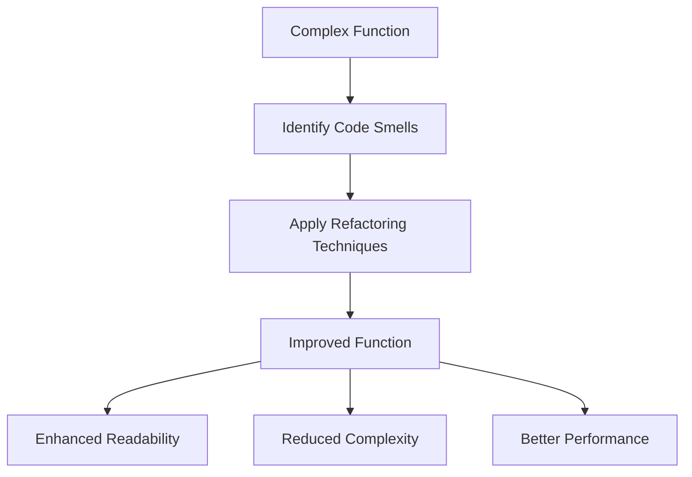

## 24.10. Strategies to Refactor and Avoid Pitfalls

In the dynamic world of software development, maintaining code quality is paramount. Refactoring is a disciplined technique for improving the structure of existing code without changing its external behavior. In Clojure, a language that emphasizes simplicity and immutability, refactoring can be particularly powerful. This section will guide you through strategies to refactor Clojure code effectively and avoid common pitfalls, ensuring your code remains robust, efficient, and maintainable.

### The Importance of Continuous Refactoring

Refactoring is not a one-time task but a continuous process. It helps in:

- **Improving Code Readability**: Clean and well-structured code is easier to understand and maintain.
- **Enhancing Performance**: Refactoring can lead to more efficient algorithms and data structures.
- **Reducing Complexity**: Simplifying code logic makes it less prone to errors.
- **Facilitating Future Changes**: Well-refactored code is more adaptable to new requirements.

### Guidelines for Systematic Code Improvement

To systematically improve your Clojure code, follow these guidelines:

1. **Identify Code Smells**: Look for signs of poor design or implementation, such as duplicated code, long functions, and large classes.
2. **Prioritize Refactoring Tasks**: Focus on areas that will provide the most significant benefit, such as frequently modified code or performance bottlenecks.
3. **Use Automated Tools**: Leverage tools like Eastwood and Kibit for static code analysis to identify potential improvements.
4. **Adopt a Test-Driven Approach**: Ensure you have comprehensive tests before refactoring to verify that behavior remains unchanged.
5. **Refactor Incrementally**: Make small, manageable changes to avoid introducing new bugs.

### Techniques for Identifying Problematic Code Areas

Identifying problematic code areas is crucial for effective refactoring. Here are some techniques:

- **Code Reviews**: Regular code reviews can highlight areas needing improvement.
- **Static Analysis Tools**: Use tools to detect code smells and potential issues.
- **Performance Profiling**: Identify slow or inefficient code using profiling tools.
- **User Feedback**: Pay attention to user-reported bugs or performance issues.

### Examples of Refactored Code

Let's explore some examples of refactored Clojure code to illustrate these concepts.

#### Example 1: Simplifying Nested Functions

**Before Refactoring:**

```clojure
(defn process-data [data]
  (let [result (map (fn [item]
                      (let [processed (process-item item)]
                        (if (valid? processed)
                          (transform processed)
                          nil)))
                    data)]
    (filter some? result)))
```

**After Refactoring:**

```clojure
(defn process-data [data]
  (->> data
       (map process-item)
       (filter valid?)
       (map transform)))
```

**Explanation:** The refactored code uses threading macros (`->>`) to simplify the data processing pipeline, improving readability and reducing nesting.

#### Example 2: Eliminating Code Duplication

**Before Refactoring:**

```clojure
(defn calculate-area [shape]
  (cond
    (= (:type shape) :circle) (* Math/PI (Math/pow (:radius shape) 2))
    (= (:type shape) :rectangle) (* (:width shape) (:height shape))
    (= (:type shape) :triangle) (/ (* (:base shape) (:height shape)) 2)))

(defn calculate-perimeter [shape]
  (cond
    (= (:type shape) :circle) (* 2 Math/PI (:radius shape))
    (= (:type shape) :rectangle) (+ (* 2 (:width shape)) (* 2 (:height shape)))
    (= (:type shape) :triangle) (+ (:side1 shape) (:side2 shape) (:side3 shape))))
```

**After Refactoring:**

```clojure
(defmulti calculate :type)

(defmethod calculate :circle [shape]
  {:area (* Math/PI (Math/pow (:radius shape) 2))
   :perimeter (* 2 Math/PI (:radius shape))})

(defmethod calculate :rectangle [shape]
  {:area (* (:width shape) (:height shape))
   :perimeter (+ (* 2 (:width shape)) (* 2 (:height shape)))})

(defmethod calculate :triangle [shape]
  {:area (/ (* (:base shape) (:height shape)) 2)
   :perimeter (+ (:side1 shape) (:side2 shape) (:side3 shape))})
```

**Explanation:** By using multimethods, we eliminate code duplication and improve extensibility for new shape types.

### Encouraging Adoption of Best Practices and Design Patterns

To avoid pitfalls and ensure high-quality code, adopt these best practices:

- **Embrace Immutability**: Use immutable data structures to avoid unintended side effects.
- **Leverage Functional Patterns**: Utilize higher-order functions, map, reduce, and filter for concise and expressive code.
- **Utilize Clojure's Concurrency Primitives**: Use atoms, refs, and agents to manage state safely in concurrent applications.
- **Document Your Code**: Use docstrings and comments to explain complex logic and decisions.
- **Regularly Review and Refactor**: Make refactoring a regular part of your development process.

### Visualizing Refactoring Concepts

To better understand the refactoring process, let's visualize the transformation of a complex function into a more streamlined version.



**Diagram Description:** This flowchart illustrates the refactoring process from identifying code smells in a complex function to achieving an improved function with enhanced readability, reduced complexity, and better performance.

### Knowledge Check

To reinforce your understanding, consider these questions:

- What are the benefits of continuous refactoring?
- How can you identify code areas that need refactoring?
- What are some common code smells in Clojure?
- How can you use multimethods to eliminate code duplication?

### Try It Yourself

Experiment with the provided code examples by:

- Modifying the threading macros to use different core functions.
- Adding new shape types to the multimethod example.
- Implementing additional refactoring techniques on your existing codebase.

### References and Links

For further reading, explore these resources:

- [Refactoring: Improving the Design of Existing Code](https://martinfowler.com/books/refactoring.html) by Martin Fowler
- [Clojure for the Brave and True](https://www.braveclojure.com/)
- [Clojure Documentation](https://clojure.org/reference/documentation)

### Embrace the Journey

Remember, refactoring is an ongoing journey. As you continue to refine your Clojure skills, you'll discover new ways to enhance your code. Stay curious, keep experimenting, and enjoy the process of continuous improvement!

## **Ready to Test Your Knowledge?**



### What is the primary goal of refactoring?

- [x] Improve code structure without changing external behavior
- [ ] Add new features to the code
- [ ] Increase code complexity
- [ ] Remove all comments from the code

> **Explanation:** Refactoring aims to improve the internal structure of the code without altering its external behavior, making it easier to understand and maintain.

### Which tool can be used for static code analysis in Clojure?

- [x] Eastwood
- [ ] VisualVM
- [ ] YourKit
- [ ] Criterium

> **Explanation:** Eastwood is a Clojure lint tool that helps identify potential issues in the code through static analysis.

### What is a common sign of poor code design?

- [x] Code duplication
- [ ] Use of threading macros
- [ ] Comprehensive documentation
- [ ] Immutable data structures

> **Explanation:** Code duplication is a common code smell indicating poor design, as it can lead to maintenance challenges and inconsistencies.

### How can you ensure behavior remains unchanged during refactoring?

- [x] Use comprehensive tests
- [ ] Remove all tests
- [ ] Add new features
- [ ] Ignore user feedback

> **Explanation:** Having comprehensive tests ensures that the code's behavior remains consistent throughout the refactoring process.

### What is the benefit of using multimethods in Clojure?

- [x] Eliminate code duplication
- [ ] Increase code complexity
- [ ] Reduce code readability
- [ ] Introduce side effects

> **Explanation:** Multimethods allow for polymorphic dispatch based on type, helping eliminate code duplication and improve extensibility.

### What should be prioritized during refactoring?

- [x] Areas with the most significant benefit
- [ ] Least frequently modified code
- [ ] Code with no performance issues
- [ ] Well-documented code

> **Explanation:** Prioritizing areas that will provide the most significant benefit, such as frequently modified code or performance bottlenecks, is crucial during refactoring.

### What is a benefit of using threading macros in Clojure?

- [x] Simplify data processing pipelines
- [ ] Increase code complexity
- [ ] Reduce code readability
- [ ] Introduce side effects

> **Explanation:** Threading macros like `->>` simplify data processing pipelines, making the code more readable and maintainable.

### How can you identify slow or inefficient code?

- [x] Use performance profiling tools
- [ ] Ignore user feedback
- [ ] Remove all comments
- [ ] Add more features

> **Explanation:** Performance profiling tools help identify slow or inefficient code, allowing developers to focus on optimizing critical areas.

### What is the role of docstrings in Clojure?

- [x] Document code logic and decisions
- [ ] Increase code complexity
- [ ] Introduce side effects
- [ ] Remove code duplication

> **Explanation:** Docstrings provide documentation for code logic and decisions, improving code readability and maintainability.

### True or False: Refactoring should be done only once during the development process.

- [ ] True
- [x] False

> **Explanation:** Refactoring is a continuous process that should be integrated into the development lifecycle to maintain code quality and adaptability.




