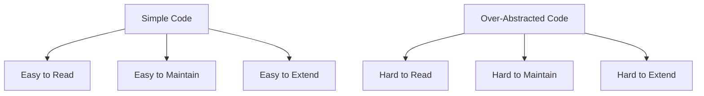

## 24.11. Overcomplicating with Unnecessary Abstractions

In the world of software development, abstraction is a powerful tool that allows us to manage complexity by hiding the intricate details of a system. However, when used excessively or inappropriately, abstraction can lead to overcomplicated code that is difficult to understand, maintain, and extend. In this section, we will explore the pitfalls of overcomplicating with unnecessary abstractions in Clojure, provide examples of how simple code can become complex through excessive abstraction, and discuss strategies for maintaining a balance between abstraction and simplicity.

### Understanding Abstraction in Clojure

Abstraction in programming is the process of reducing complexity by hiding unnecessary details and exposing only the essential features of an object or function. In Clojure, abstraction can be achieved through various means, such as higher-order functions, macros, protocols, and multimethods. While these tools can greatly enhance the expressiveness and flexibility of your code, they can also introduce unnecessary complexity if not used judiciously.

#### The Harmful Effects of Over-Abstraction

1. **Reduced Readability**: Over-abstraction can obscure the logic of your code, making it difficult for others (or even yourself) to understand what the code is doing. This can lead to increased time spent on debugging and maintenance.

2. **Increased Complexity**: Introducing too many layers of abstraction can make the codebase more complex than necessary, leading to a steeper learning curve for new developers and increased potential for bugs.

3. **Performance Overheads**: Some abstractions, especially those involving macros or complex data structures, can introduce performance overheads that may not be justified by the benefits they provide.

4. **Difficulty in Refactoring**: Overly abstract code can be challenging to refactor, as changes in one part of the code may have unforeseen consequences in other parts due to the intricate dependencies created by the abstractions.

### Examples of Over-Abstraction in Clojure

Let's explore some examples where simple code is made complex through excessive use of abstractions like macros or multimethods.

#### Example 1: Overuse of Macros

Macros are a powerful feature in Clojure that allow you to manipulate code as data, enabling you to create new syntactic constructs. However, they can also lead to overcomplicated code if used unnecessarily.

```clojure
;; Overly complex macro for logging
(defmacro log [level message]
  `(println (str "[" ~level "] " ~message)))

;; Usage
(log "INFO" "Application started")
```

In this example, the `log` macro is used to print log messages with a specified log level. While this might seem useful, it introduces unnecessary complexity compared to a simple function:

```clojure
;; Simplified version using a function
(defn log [level message]
  (println (str "[" level "] " message)))

;; Usage
(log "INFO" "Application started")
```

The function version is easier to understand, maintain, and extend, and it avoids the potential pitfalls associated with macros, such as hygiene issues and unexpected behavior.

#### Example 2: Excessive Use of Multimethods

Multimethods in Clojure provide a way to define polymorphic functions based on the value of their arguments. While they can be useful for certain types of problems, they can also lead to over-abstraction if used excessively.

```clojure
;; Overly complex multimethod for handling different shapes
(defmulti area :shape)

(defmethod area :circle [shape]
  (* Math/PI (:radius shape) (:radius shape)))

(defmethod area :rectangle [shape]
  (* (:width shape) (:height shape)))

(defmethod area :triangle [shape]
  (/ (* (:base shape) (:height shape)) 2))

;; Usage
(area {:shape :circle :radius 5})
(area {:shape :rectangle :width 4 :height 6})
(area {:shape :triangle :base 3 :height 4})
```

While this approach is flexible, it can become cumbersome if you have many shapes or if the logic for calculating the area is simple. A more straightforward approach might be to use a simple function with conditionals:

```clojure
;; Simplified version using a function
(defn area [shape]
  (case (:shape shape)
    :circle (* Math/PI (:radius shape) (:radius shape))
    :rectangle (* (:width shape) (:height shape))
    :triangle (/ (* (:base shape) (:height shape)) 2)))

;; Usage
(area {:shape :circle :radius 5})
(area {:shape :rectangle :width 4 :height 6})
(area {:shape :triangle :base 3 :height 4})
```

This version is easier to read and understand, and it avoids the overhead of managing multiple methods.

### Balancing Abstraction and Simplicity

Achieving the right balance between abstraction and simplicity is crucial for writing maintainable and efficient code. Here are some guidelines to help you strike this balance:

1. **Favor Simplicity**: Always start with the simplest solution that works. Avoid introducing abstractions unless they provide clear benefits in terms of code reuse, readability, or maintainability.

2. **Use Abstractions Judiciously**: When using abstractions, ensure that they are justified by the complexity of the problem you are solving. Avoid using abstractions for their own sake or because they seem "cool."

3. **Prioritize Readability**: Write code that is easy to read and understand. Use descriptive names for functions and variables, and provide comments where necessary to explain complex logic.

4. **Refactor Regularly**: Regularly review and refactor your code to eliminate unnecessary abstractions and simplify complex logic. This will help keep your codebase clean and maintainable.

5. **Seek Feedback**: Get feedback from other developers on your code. They may provide valuable insights into areas where your code could be simplified or improved.

### Advocating for Straightforward Solutions

In many cases, straightforward solutions are preferable to complex abstractions. Here are some reasons why:

- **Easier to Debug**: Simple code is easier to debug because it is easier to understand. When issues arise, you can quickly identify the source of the problem without having to navigate through multiple layers of abstraction.

- **Faster to Implement**: Simple solutions are often faster to implement because they require less time to design and develop. This can be especially important in fast-paced development environments where time is of the essence.

- **More Flexible**: Simple code is often more flexible because it is easier to modify and extend. When requirements change, you can quickly adapt your code without having to unravel complex abstractions.

### Clojure's Unique Features and Abstraction

Clojure's unique features, such as its emphasis on immutability and functional programming, can help you avoid unnecessary abstractions. By leveraging these features, you can write code that is both expressive and simple.

- **Immutability**: Clojure's immutable data structures encourage you to think about data transformations in a straightforward way, reducing the need for complex abstractions to manage state.

- **Functional Programming**: Clojure's functional programming paradigm encourages you to write pure functions that are easy to reason about and test. This can help you avoid the pitfalls of over-abstraction by focusing on simple, composable functions.

- **REPL-Driven Development**: Clojure's REPL (Read-Eval-Print Loop) allows you to experiment with code interactively, helping you identify and eliminate unnecessary abstractions early in the development process.

### Visualizing the Impact of Over-Abstraction

To better understand the impact of over-abstraction, let's visualize the difference between a simple and an over-abstracted codebase using a flowchart.



In this diagram, we see that simple code leads to benefits such as readability, maintainability, and extensibility, while over-abstracted code leads to challenges in these areas.

### Knowledge Check

To reinforce your understanding of the concepts covered in this section, consider the following questions:

1. What are some potential drawbacks of over-abstraction in Clojure?
2. How can macros lead to unnecessary complexity in your code?
3. What are some strategies for balancing abstraction and simplicity in your code?
4. Why might straightforward solutions be preferable to complex abstractions?
5. How can Clojure's unique features help you avoid unnecessary abstractions?

### Conclusion

Overcomplicating with unnecessary abstractions is a common pitfall in software development, but it can be avoided by prioritizing simplicity, readability, and maintainability. By leveraging Clojure's unique features and following best practices for abstraction, you can write code that is both expressive and easy to understand. Remember, the goal is to create a codebase that is a joy to work with, not a burden to maintain.

### Try It Yourself

To further explore the concepts covered in this section, try modifying the code examples provided to see how different levels of abstraction impact readability and maintainability. Experiment with simplifying overly abstract code and observe the benefits of a more straightforward approach.

## **Ready to Test Your Knowledge?**



### What is a potential drawback of over-abstraction in Clojure?

- [x] Reduced readability
- [ ] Improved performance
- [ ] Increased simplicity
- [ ] Enhanced maintainability

> **Explanation:** Over-abstraction can obscure the logic of your code, making it difficult to understand and maintain.


### How can macros lead to unnecessary complexity in your code?

- [x] By introducing hygiene issues and unexpected behavior
- [ ] By simplifying the code structure
- [ ] By improving code readability
- [ ] By enhancing performance

> **Explanation:** Macros can introduce hygiene issues and unexpected behavior, leading to unnecessary complexity.


### What is a strategy for balancing abstraction and simplicity in your code?

- [x] Favor simplicity and avoid introducing abstractions unless necessary
- [ ] Use as many abstractions as possible
- [ ] Prioritize abstraction over readability
- [ ] Avoid refactoring code

> **Explanation:** Favoring simplicity and avoiding unnecessary abstractions helps maintain a balance between abstraction and simplicity.


### Why might straightforward solutions be preferable to complex abstractions?

- [x] They are easier to debug and modify
- [ ] They require more time to implement
- [ ] They are harder to understand
- [ ] They introduce more performance overhead

> **Explanation:** Straightforward solutions are easier to debug and modify, making them preferable in many cases.


### How can Clojure's unique features help you avoid unnecessary abstractions?

- [x] By encouraging immutability and functional programming
- [ ] By promoting complex data structures
- [ ] By discouraging the use of pure functions
- [ ] By requiring extensive use of macros

> **Explanation:** Clojure's emphasis on immutability and functional programming helps avoid unnecessary abstractions.


### What is a benefit of using simple code over over-abstracted code?

- [x] Easier to read and maintain
- [ ] More complex to understand
- [ ] Harder to extend
- [ ] Increased performance overhead

> **Explanation:** Simple code is easier to read and maintain, making it beneficial over over-abstracted code.


### What is a potential consequence of introducing too many layers of abstraction?

- [x] Increased complexity and potential for bugs
- [ ] Simplified codebase
- [ ] Enhanced readability
- [ ] Improved performance

> **Explanation:** Too many layers of abstraction can increase complexity and the potential for bugs.


### What is a guideline for using abstractions in your code?

- [x] Use abstractions judiciously and ensure they are justified
- [ ] Use abstractions for their own sake
- [ ] Avoid using abstractions altogether
- [ ] Prioritize abstraction over simplicity

> **Explanation:** Using abstractions judiciously and ensuring they are justified helps maintain code simplicity.


### What is a potential benefit of refactoring code regularly?

- [x] Eliminating unnecessary abstractions and simplifying logic
- [ ] Introducing more complexity
- [ ] Avoiding code changes
- [ ] Increasing performance overhead

> **Explanation:** Regular refactoring helps eliminate unnecessary abstractions and simplify code logic.


### True or False: Over-abstraction can lead to performance overheads that may not be justified.

- [x] True
- [ ] False

> **Explanation:** Over-abstraction can introduce performance overheads that may not be justified by the benefits they provide.



Remember, this is just the beginning. As you progress, you'll build more complex and interactive applications. Keep experimenting, stay curious, and enjoy the journey!

---
