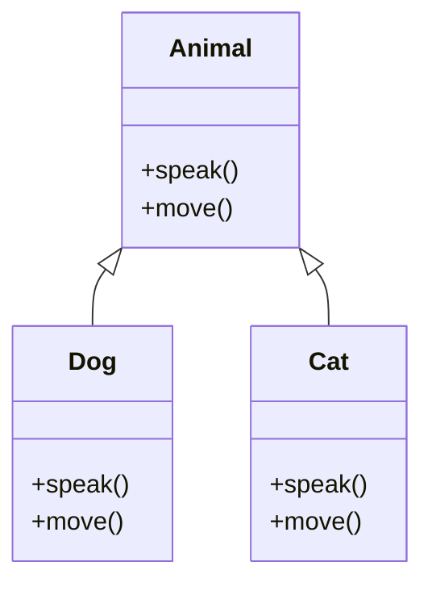
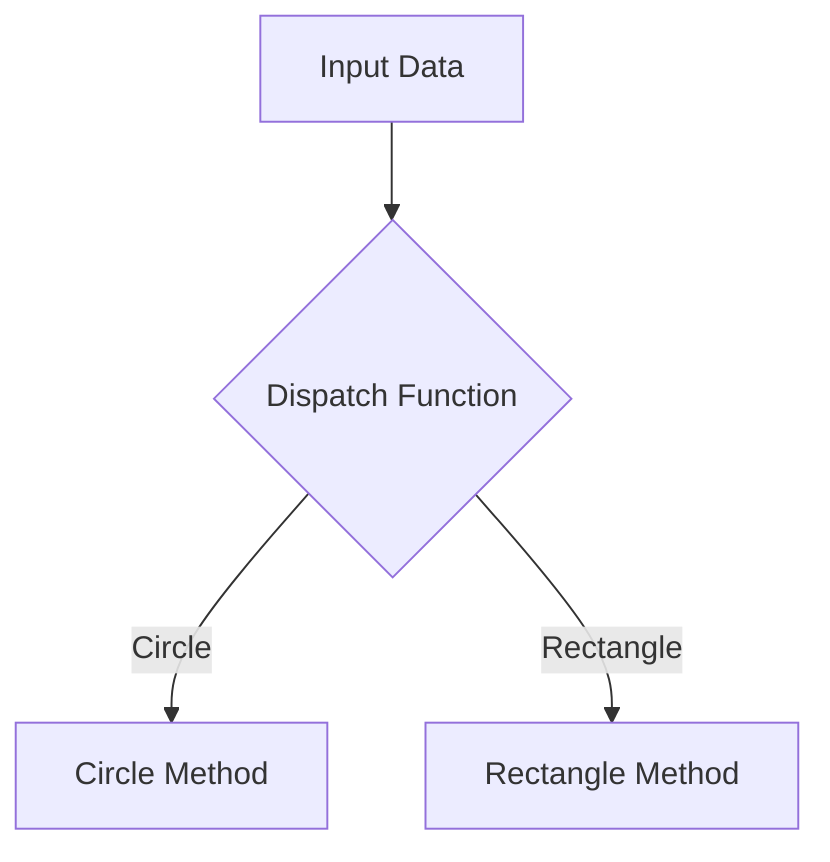

## 24.12. Misusing Protocols and Multimethods

### Introduction

In Clojure, protocols and multimethods are powerful tools for achieving polymorphism and code extensibility. However, their misuse can lead to inefficient, hard-to-maintain code. This section explores common pitfalls associated with protocols and multimethods and provides guidance on how to use them effectively.

### Understanding Protocols and Multimethods

#### Protocols

Protocols in Clojure are a way to define a set of functions that can be implemented by different data types. They are similar to interfaces in object-oriented languages but are more flexible due to Clojure's dynamic nature.

- **Purpose**: Protocols are used to define a common set of operations that can be performed on different types of data.
- **Syntax**: Defined using `defprotocol` and implemented using `extend-type` or `extend-protocol`.

```clojure
(defprotocol Animal
  (speak [this])
  (move [this]))

(extend-type Dog
  Animal
  (speak [this] "Woof!")
  (move [this] "Runs"))

(extend-type Cat
  Animal
  (speak [this] "Meow!")
  (move [this] "Sneaks"))
```

#### Multimethods

Multimethods provide a way to define polymorphic functions based on arbitrary dispatch logic. Unlike protocols, which are tied to types, multimethods can dispatch on any aspect of the arguments.

- **Purpose**: To allow for flexible dispatching based on runtime values.
- **Syntax**: Defined using `defmulti` and `defmethod`.

```clojure
(defmulti area :shape)

(defmethod area :circle [shape]
  (* Math/PI (:radius shape) (:radius shape)))

(defmethod area :rectangle [shape]
  (* (:length shape) (:width shape)))
```

### Common Misuses of Protocols

#### 1. Defining Protocols for Single-Use Cases

**Misuse**: Creating a protocol for a single implementation or use case. This adds unnecessary complexity and overhead.

**Example**:

```clojure
(defprotocol SingleUse
  (do-something [this]))

(extend-type MyType
  SingleUse
  (do-something [this] "Doing something"))
```

**Guideline**: Use protocols when you anticipate multiple implementations. For single-use cases, consider using simple functions or maps.

#### 2. Overusing Protocols for Simple Functions

**Misuse**: Using protocols for simple functions that do not require polymorphism.

**Example**:

```clojure
(defprotocol SimpleMath
  (add [this a b]))

(extend-type Number
  SimpleMath
  (add [this a b] (+ a b)))
```

**Guideline**: Reserve protocols for cases where polymorphism is necessary. For simple operations, use regular functions.

#### 3. Ignoring Protocol Extensibility

**Misuse**: Not leveraging the extensibility of protocols, leading to rigid code structures.

**Example**: Implementing all logic within a single type without considering future extensions.

**Guideline**: Design protocols with future extensibility in mind. Consider how new types might implement the protocol.

### Common Misuses of Multimethods

#### 1. Complex Dispatch Logic

**Misuse**: Implementing overly complex dispatch logic that is hard to understand and maintain.

**Example**:

```clojure
(defmulti complex-dispatch (fn [x] (if (even? x) :even :odd)))

(defmethod complex-dispatch :even [x] (str x " is even"))
(defmethod complex-dispatch :odd [x] (str x " is odd"))
```

**Guideline**: Keep dispatch logic simple and clear. Use multimethods when the dispatch criteria are straightforward.

#### 2. Using Multimethods for Performance-Critical Code

**Misuse**: Applying multimethods in performance-critical sections of code without considering the overhead.

**Example**: Using multimethods for operations that are called frequently in a tight loop.

**Guideline**: Be mindful of the performance implications of multimethods. For high-performance needs, consider alternative approaches.

#### 3. Overloading Multimethods with Too Many Methods

**Misuse**: Defining too many methods for a single multimethod, making it difficult to manage.

**Example**: A multimethod with dozens of methods for different cases.

**Guideline**: Limit the number of methods for a multimethod. If necessary, break it down into smaller, more manageable multimethods.

### Best Practices for Using Protocols and Multimethods

#### Protocols

- **Design for Extensibility**: Anticipate future needs and design protocols to be easily extendable.
- **Use Where Appropriate**: Apply protocols when multiple types need to implement the same set of operations.
- **Avoid Overhead**: Do not use protocols for simple, non-polymorphic functions.

#### Multimethods

- **Keep Dispatch Simple**: Ensure that the dispatch logic is easy to understand and maintain.
- **Consider Performance**: Be aware of the performance trade-offs when using multimethods.
- **Manage Complexity**: Avoid overloading multimethods with too many methods.

### Visualizing Protocols and Multimethods

#### Protocols



*Figure 1: Protocols in Clojure define a set of operations that can be implemented by different types.*

#### Multimethods



*Figure 2: Multimethods use a dispatch function to determine which method to execute based on input data.*

### Try It Yourself

Experiment with the following code examples to deepen your understanding of protocols and multimethods:

1. **Modify the Protocol Example**: Add a new type, `Bird`, to the `Animal` protocol and implement the `speak` and `move` methods.

2. **Simplify the Multimethod Example**: Refactor the `complex-dispatch` multimethod to use a simpler dispatch logic.

3. **Performance Test**: Measure the performance of a multimethod in a loop and compare it with a simple function.

### References and Further Reading

- [Clojure Protocols](https://clojure.org/reference/protocols)
- [Clojure Multimethods](https://clojure.org/reference/multimethods)
- [Clojure Design Patterns](https://SoftwarePatternsLexicon.com)

### Knowledge Check

## **Ready to Test Your Knowledge?**



### What is a common misuse of protocols in Clojure?

- [x] Defining protocols for single-use cases
- [ ] Using protocols for polymorphic behavior
- [ ] Implementing protocols for multiple types
- [ ] Extending protocols with new types

> **Explanation:** Defining protocols for single-use cases adds unnecessary complexity and should be avoided.

### What is the purpose of multimethods in Clojure?

- [x] To allow for flexible dispatching based on runtime values
- [ ] To define a set of operations for different types
- [ ] To implement interfaces
- [ ] To create single-use functions

> **Explanation:** Multimethods provide a way to define polymorphic functions based on arbitrary dispatch logic.

### How should dispatch logic in multimethods be designed?

- [x] Simple and clear
- [ ] Complex and detailed
- [ ] Based on multiple criteria
- [ ] Using nested conditions

> **Explanation:** Dispatch logic should be simple and clear to maintain readability and manageability.

### When should protocols be used in Clojure?

- [x] When multiple types need to implement the same set of operations
- [ ] For single-use functions
- [ ] For performance-critical code
- [ ] For simple operations

> **Explanation:** Protocols are best used when multiple types need to implement the same set of operations.

### What is a potential downside of using multimethods in performance-critical code?

- [x] Overhead
- [ ] Simplicity
- [ ] Flexibility
- [ ] Extensibility

> **Explanation:** Multimethods can introduce overhead, which may not be suitable for performance-critical code.

### What is a key benefit of using protocols in Clojure?

- [x] Extensibility
- [ ] Complexity
- [ ] Overhead
- [ ] Simplicity

> **Explanation:** Protocols offer extensibility, allowing new types to implement the same set of operations.

### How can you manage complexity in multimethods?

- [x] Limit the number of methods
- [ ] Use complex dispatch logic
- [ ] Overload with many methods
- [ ] Avoid breaking down into smaller multimethods

> **Explanation:** Limiting the number of methods helps manage complexity in multimethods.

### What should be avoided when using protocols for simple functions?

- [x] Overhead
- [ ] Simplicity
- [ ] Extensibility
- [ ] Flexibility

> **Explanation:** Using protocols for simple functions can introduce unnecessary overhead.

### What is a common pitfall when using multimethods?

- [x] Complex dispatch logic
- [ ] Simple dispatch logic
- [ ] Extensible methods
- [ ] Clear code structure

> **Explanation:** Complex dispatch logic can make multimethods hard to understand and maintain.

### True or False: Protocols should be used for single-use cases.

- [ ] True
- [x] False

> **Explanation:** Protocols should not be used for single-use cases as they add unnecessary complexity.



Remember, mastering protocols and multimethods in Clojure is a journey. Keep experimenting, stay curious, and enjoy the process of learning and refining your skills!
