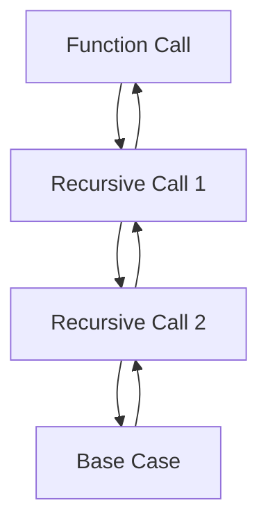

## 24.13. Common Mistakes with Recursion

Recursion is a fundamental concept in functional programming and is widely used in Clojure. However, it can be a source of common pitfalls if not used correctly. In this section, we will explore how recursion works in Clojure, identify common mistakes, and provide best practices to avoid these pitfalls.

### Understanding Recursion in Clojure

Recursion is a technique where a function calls itself to solve a problem. In Clojure, recursion is often used to process lists, trees, and other data structures. Clojure supports recursion through regular function calls and a special form called `recur`, which is used for tail recursion optimization.

#### How Recursion Works

When a function calls itself, it creates a new frame on the call stack for each call. This stack grows with each recursive call, which can lead to a stack overflow if the recursion is too deep. Tail recursion is a special form of recursion where the recursive call is the last operation in the function, allowing the stack frame to be reused.

### Common Mistakes with Recursion

#### 1. Missing `recur` for Tail Recursion

One of the most common mistakes is not using `recur` for tail-recursive functions. Without `recur`, each recursive call adds a new frame to the stack, which can lead to a stack overflow.

```clojure
(defn factorial [n]
  (if (<= n 1)
    1
    (* n (factorial (dec n))))) ; Not tail-recursive

;; Corrected with recur
(defn factorial [n]
  (letfn [(fact [acc n]
            (if (<= n 1)
              acc
              (recur (* acc n) (dec n))))]
    (fact 1 n)))
```

In the corrected version, `recur` is used to ensure that the recursive call is in the tail position, allowing the stack frame to be reused.

#### 2. Inefficient Recursive Patterns

Another common mistake is using inefficient recursive patterns that do not take advantage of Clojure's strengths, such as lazy sequences and higher-order functions.

```clojure
(defn sum-list [lst]
  (if (empty? lst)
    0
    (+ (first lst) (sum-list (rest lst))))) ; Inefficient

;; Alternative using reduce
(defn sum-list [lst]
  (reduce + lst))
```

Using `reduce` is more efficient because it processes the list in a single pass without creating additional stack frames.

#### 3. Not Handling Base Cases Properly

Failing to handle base cases correctly can lead to infinite recursion and stack overflow errors.

```clojure
(defn countdown [n]
  (when (> n 0)
    (println n)
    (countdown (dec n)))) ; Missing base case for n = 0
```

Ensure that all base cases are covered to prevent infinite recursion.

#### 4. Overusing Recursion

While recursion is powerful, it is not always the best solution. Overusing recursion can lead to complex and hard-to-maintain code. Consider using loops or higher-order functions when appropriate.

```clojure
;; Recursive approach
(defn find-max [lst]
  (if (empty? lst)
    nil
    (let [max-rest (find-max (rest lst))]
      (if (or (nil? max-rest) (> (first lst) max-rest))
        (first lst)
        max-rest))))

;; Using reduce
(defn find-max [lst]
  (reduce max lst))
```

### Alternatives to Recursion

#### 1. Using Loops

Clojure provides loop constructs that can be used as an alternative to recursion. The `loop` and `recur` combination allows for efficient iteration without the risk of stack overflow.

```clojure
(defn factorial [n]
  (loop [acc 1, n n]
    (if (<= n 1)
      acc
      (recur (* acc n) (dec n)))))
```

#### 2. Leveraging Higher-Order Functions

Higher-order functions like `map`, `reduce`, and `filter` can often replace recursive solutions with more concise and efficient code.

```clojure
(defn even-numbers [lst]
  (filter even? lst))
```

### Visualizing Recursion

To better understand how recursion works, let's visualize the call stack for a simple recursive function.



This diagram illustrates how each recursive call adds a new frame to the stack until the base case is reached, at which point the stack unwinds.

### Best Practices for Recursion in Clojure

1. **Use `recur` for Tail Recursion**: Always use `recur` for tail-recursive functions to prevent stack overflow.
2. **Prefer Higher-Order Functions**: Use higher-order functions like `map`, `reduce`, and `filter` for common operations.
3. **Handle Base Cases Carefully**: Ensure all base cases are covered to prevent infinite recursion.
4. **Avoid Overusing Recursion**: Consider alternatives like loops or higher-order functions for better readability and performance.

### Try It Yourself

Experiment with the following code examples to deepen your understanding of recursion in Clojure. Try modifying the base cases, using `recur`, and replacing recursion with higher-order functions.

```clojure
;; Recursive Fibonacci
(defn fibonacci [n]
  (if (<= n 1)
    n
    (+ (fibonacci (- n 1)) (fibonacci (- n 2)))))

;; Tail-recursive Fibonacci
(defn fibonacci [n]
  (letfn [(fib [a b n]
            (if (zero? n)
              a
              (recur b (+ a b) (dec n))))]
    (fib 0 1 n)))

;; Using loop and recur
(defn fibonacci [n]
  (loop [a 0, b 1, n n]
    (if (zero? n)
      a
      (recur b (+ a b) (dec n)))))
```

### Knowledge Check

- What is tail recursion, and why is it important in Clojure?
- How can higher-order functions replace recursive solutions?
- What are the risks of not handling base cases properly in recursive functions?

### Summary

Recursion is a powerful tool in Clojure, but it requires careful handling to avoid common pitfalls such as stack overflows and inefficient patterns. By understanding recursion mechanics, using `recur` for tail recursion, and leveraging higher-order functions, you can write efficient and maintainable recursive code.

Remember, recursion is just one tool in your Clojure toolkit. As you continue your journey, explore other functional programming techniques and patterns to enhance your skills.

## **Ready to Test Your Knowledge?**



### What is a common mistake when using recursion in Clojure?

- [x] Not using `recur` for tail-recursive functions
- [ ] Using `loop` instead of recursion
- [ ] Using higher-order functions
- [ ] Handling base cases

> **Explanation:** Not using `recur` for tail-recursive functions can lead to stack overflow errors.

### How can you prevent stack overflow in recursive functions?

- [x] Use `recur` for tail-recursive functions
- [ ] Avoid using recursion
- [ ] Use `loop` without `recur`
- [ ] Increase stack size

> **Explanation:** Using `recur` for tail-recursive functions allows the stack frame to be reused, preventing stack overflow.

### Which of the following is an alternative to recursion?

- [x] Higher-order functions like `reduce`
- [ ] Using `recur` without `loop`
- [ ] Increasing stack size
- [ ] Using `let` for local bindings

> **Explanation:** Higher-order functions like `reduce` can often replace recursive solutions with more efficient code.

### What happens if base cases are not handled properly in recursion?

- [x] Infinite recursion and stack overflow
- [ ] The function returns `nil`
- [ ] The function executes once
- [ ] The function becomes tail-recursive

> **Explanation:** Not handling base cases properly can lead to infinite recursion and stack overflow errors.

### Which function is used for tail recursion optimization in Clojure?

- [x] `recur`
- [ ] `loop`
- [ ] `reduce`
- [ ] `map`

> **Explanation:** `recur` is used for tail recursion optimization in Clojure, allowing the stack frame to be reused.

### What is the benefit of using higher-order functions over recursion?

- [x] More concise and efficient code
- [ ] Easier to write
- [ ] Avoids stack overflow
- [ ] Requires more memory

> **Explanation:** Higher-order functions like `reduce` provide more concise and efficient solutions compared to recursion.

### Which of the following is a tail-recursive function?

- [x] A function where the recursive call is the last operation
- [ ] A function that uses `loop`
- [ ] A function that uses `reduce`
- [ ] A function that handles base cases

> **Explanation:** A tail-recursive function is one where the recursive call is the last operation, allowing for stack frame reuse.

### What is a common pitfall when using recursion?

- [x] Overusing recursion when higher-order functions are more appropriate
- [ ] Using `recur` for non-tail-recursive functions
- [ ] Using `loop` and `recur` together
- [ ] Handling base cases

> **Explanation:** Overusing recursion can lead to complex and hard-to-maintain code when higher-order functions could be more appropriate.

### How can you visualize recursion?

- [x] Using a call stack diagram
- [ ] Using a flowchart
- [ ] Using a sequence diagram
- [ ] Using a class diagram

> **Explanation:** A call stack diagram helps visualize how each recursive call adds a new frame to the stack.

### True or False: Tail recursion is the only way to optimize recursive functions in Clojure.

- [ ] True
- [x] False

> **Explanation:** While tail recursion is important for optimizing recursive functions, higher-order functions and loops can also provide efficient solutions.


