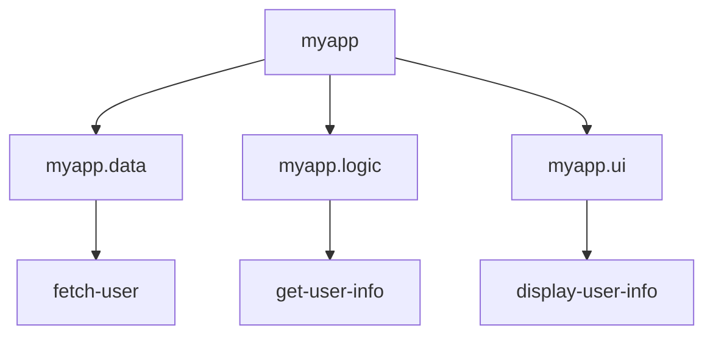

## 24.14. Avoiding Monolithic Namespace Structures

In the world of software development, especially in functional programming languages like Clojure, organizing code effectively is crucial for maintainability, readability, and scalability. One common pitfall developers encounter is the creation of monolithic namespace structures. This section will delve into why large, monolithic namespaces are problematic, the benefits of modularity, and strategies for breaking up large namespaces. We'll also provide examples of effective namespace structures and encourage consistent and logical organization of code.

### Understanding the Problem: Monolithic Namespaces

Monolithic namespaces occur when a single namespace contains a large amount of code, often encompassing multiple functionalities or modules. This can lead to several issues:

1. **Complexity and Maintenance**: As the codebase grows, a monolithic namespace becomes increasingly difficult to navigate and maintain. Finding specific functions or understanding the flow of the code can be challenging.

2. **Lack of Modularity**: Monolithic namespaces often lack clear boundaries between different functionalities, making it difficult to reuse code or test individual components independently.

3. **Collaboration Challenges**: In a team environment, multiple developers working on the same namespace can lead to merge conflicts and coordination issues.

4. **Performance Issues**: Large namespaces can lead to longer load times and increased memory usage, impacting the performance of the application.

### Benefits of Modularity and Namespace Organization

Breaking down monolithic namespaces into smaller, more focused modules offers several advantages:

- **Improved Readability**: Smaller, well-organized namespaces are easier to read and understand, making it simpler for developers to navigate the codebase.

- **Enhanced Maintainability**: With clear separation of concerns, maintaining and updating the code becomes more manageable.

- **Reusability**: Modular code can be reused across different parts of the application or even in different projects, reducing duplication and effort.

- **Better Collaboration**: Smaller namespaces allow multiple developers to work on different parts of the codebase simultaneously, minimizing conflicts and improving productivity.

- **Scalability**: As the application grows, modular namespaces can be extended or modified independently, supporting scalability.

### Strategies for Breaking Up Large Namespaces

To avoid monolithic namespace structures, consider the following strategies:

#### 1. **Identify and Separate Concerns**

Begin by identifying distinct functionalities or concerns within your code. Each concern should ideally be encapsulated within its own namespace. For example, separate namespaces for data access, business logic, and user interface components can help maintain clear boundaries.

#### 2. **Use Descriptive Namespace Names**

Choose descriptive names for your namespaces that reflect their purpose. This not only aids in understanding but also helps in organizing the code logically. For instance, `myapp.data` for data-related functions and `myapp.ui` for user interface components.

#### 3. **Leverage Clojure's Namespace Features**

Clojure provides powerful features for managing namespaces, such as `require`, `use`, and `import`. Use these features to include only the necessary parts of other namespaces, reducing dependencies and improving clarity.

#### 4. **Adopt a Consistent Naming Convention**

Consistency is key in namespace organization. Adopt a naming convention that aligns with your project's structure and stick to it. This could be based on functionality, layers (e.g., `service`, `repository`), or modules.

#### 5. **Refactor Regularly**

Regular refactoring helps keep namespaces manageable. As your codebase evolves, revisit and refactor namespaces to ensure they remain focused and relevant.

#### 6. **Utilize Namespace Aliases**

When working with multiple namespaces, use aliases to simplify references and avoid conflicts. This can make the code more readable and reduce the risk of errors.

### Example: Effective Namespace Structures

Let's explore an example of an effective namespace structure in a hypothetical Clojure project:

```clojure
;; Namespace for data access functions
(ns myapp.data
  (:require [clojure.java.jdbc :as jdbc]))

(defn fetch-user [db id]
  ;; Function to fetch user data from the database
  (jdbc/query db ["SELECT * FROM users WHERE id = ?" id]))

;; Namespace for business logic
(ns myapp.logic
  (:require [myapp.data :as data]))

(defn get-user-info [db id]
  ;; Function to get user information
  (let [user (data/fetch-user db id)]
    ;; Process and return user information
    (process-user user)))

;; Namespace for user interface components
(ns myapp.ui
  (:require [myapp.logic :as logic]))

(defn display-user-info [db id]
  ;; Function to display user information
  (let [user-info (logic/get-user-info db id)]
    (println "User Info:" user-info)))
```

In this example, we have three distinct namespaces: `myapp.data` for data access, `myapp.logic` for business logic, and `myapp.ui` for user interface components. Each namespace has a clear responsibility, making the codebase easier to understand and maintain.

### Encouraging Consistent and Logical Organization

To ensure your code remains well-organized, consider the following best practices:

- **Document Your Code**: Include comments and documentation to explain the purpose and functionality of each namespace and its components.

- **Review and Refactor**: Regularly review your codebase to identify areas for improvement and refactor as needed.

- **Collaborate with Your Team**: Encourage team members to follow the established conventions and provide feedback on the namespace structure.

- **Automate Code Quality Checks**: Use tools to automate code quality checks and enforce consistency across the codebase.

### Visualizing Namespace Organization

To better understand the concept of namespace organization, let's visualize a typical namespace structure using a Mermaid.js diagram:



**Diagram Description**: This diagram illustrates a modular namespace structure in a Clojure application. The root namespace `myapp` contains three sub-namespaces: `myapp.data`, `myapp.logic`, and `myapp.ui`, each responsible for specific functionalities.

### Knowledge Check

Before we conclude, let's test your understanding of avoiding monolithic namespace structures with a few questions:

1. What are the main issues associated with monolithic namespaces?
2. How does modularity improve code maintainability?
3. What strategies can you use to break up large namespaces?
4. Why is it important to use descriptive names for namespaces?
5. How can namespace aliases improve code readability?

### Conclusion

Avoiding monolithic namespace structures is essential for maintaining a clean, efficient, and scalable codebase. By adopting modularity, using descriptive names, and leveraging Clojure's namespace features, you can create a well-organized and maintainable code structure. Remember, this is just the beginning. As you progress, you'll build more complex and interactive applications. Keep experimenting, stay curious, and enjoy the journey!

## **Ready to Test Your Knowledge?**



### What is a primary issue with monolithic namespaces?

- [x] They become difficult to navigate and maintain.
- [ ] They improve code readability.
- [ ] They enhance performance.
- [ ] They simplify collaboration.

> **Explanation:** Monolithic namespaces become difficult to navigate and maintain as they grow, making it challenging to find specific functions or understand the code flow.

### How does modularity benefit a codebase?

- [x] It improves readability and maintainability.
- [ ] It increases complexity.
- [ ] It reduces code reuse.
- [ ] It complicates testing.

> **Explanation:** Modularity improves readability and maintainability by creating clear boundaries between functionalities, making the code easier to understand and manage.

### Which strategy helps in breaking up large namespaces?

- [x] Identifying and separating concerns.
- [ ] Combining all functionalities into one namespace.
- [ ] Ignoring namespace organization.
- [ ] Using random naming conventions.

> **Explanation:** Identifying and separating concerns helps in breaking up large namespaces by encapsulating distinct functionalities within their own namespaces.

### Why is it important to use descriptive names for namespaces?

- [x] To reflect their purpose and aid in understanding.
- [ ] To increase code complexity.
- [ ] To confuse developers.
- [ ] To make the code harder to read.

> **Explanation:** Descriptive names for namespaces reflect their purpose and aid in understanding, making it easier to navigate and organize the code.

### How can namespace aliases improve code readability?

- [x] By simplifying references and avoiding conflicts.
- [ ] By increasing the number of lines of code.
- [ ] By making the code more complex.
- [ ] By reducing code clarity.

> **Explanation:** Namespace aliases simplify references and avoid conflicts, making the code more readable and reducing the risk of errors.

### What is a benefit of regular refactoring?

- [x] It keeps namespaces manageable and relevant.
- [ ] It increases code duplication.
- [ ] It complicates the codebase.
- [ ] It reduces code quality.

> **Explanation:** Regular refactoring keeps namespaces manageable and relevant by ensuring they remain focused and aligned with the project's needs.

### What tool can automate code quality checks?

- [x] Linter
- [ ] Text editor
- [ ] Spreadsheet
- [ ] Email client

> **Explanation:** A linter can automate code quality checks, enforcing consistency and helping maintain a clean codebase.

### What is a common pitfall of monolithic namespaces?

- [x] Lack of clear boundaries between functionalities.
- [ ] Improved performance.
- [ ] Simplified testing.
- [ ] Enhanced collaboration.

> **Explanation:** Monolithic namespaces often lack clear boundaries between functionalities, making it difficult to reuse code or test components independently.

### What is a key takeaway from avoiding monolithic namespaces?

- [x] It enhances code maintainability and scalability.
- [ ] It complicates code organization.
- [ ] It reduces code readability.
- [ ] It increases merge conflicts.

> **Explanation:** Avoiding monolithic namespaces enhances code maintainability and scalability by promoting modularity and clear organization.

### True or False: Monolithic namespaces are beneficial for large teams.

- [ ] True
- [x] False

> **Explanation:** Monolithic namespaces are not beneficial for large teams as they can lead to merge conflicts and coordination issues, hindering collaboration.


