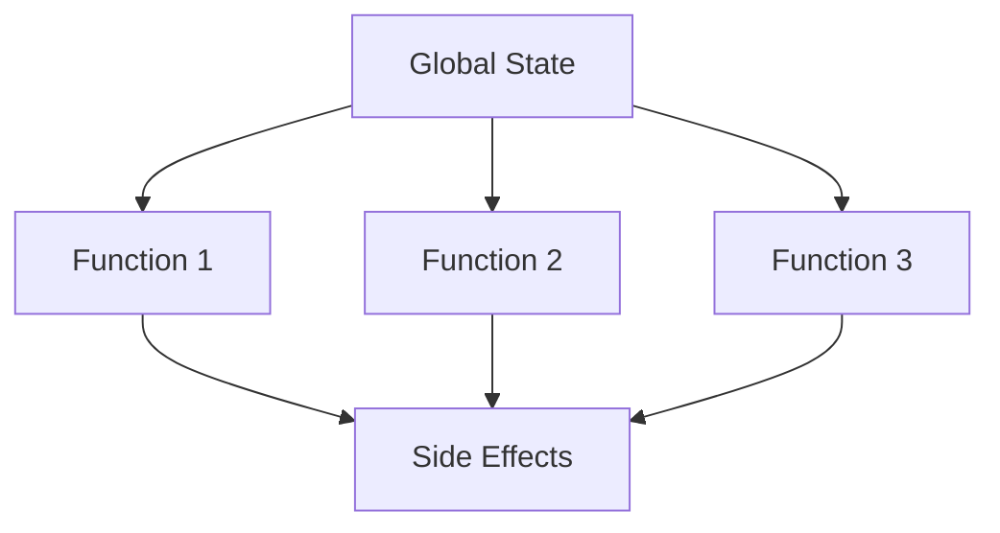
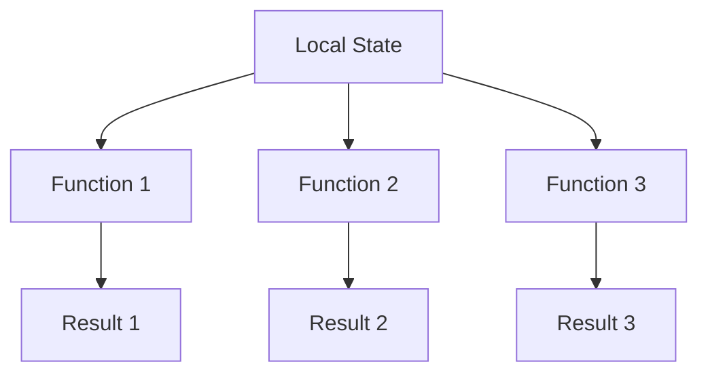

## 24.15. Overreliance on Global State

In the realm of software development, particularly in functional programming languages like Clojure, the concept of global state is often seen as a double-edged sword. While it can provide convenience, overreliance on global state can lead to tightly coupled code, introduce bugs, and make testing and maintenance challenging. In this section, we'll delve into the dangers of global state, explore the benefits of immutability and local state management, and provide techniques for refactoring code to reduce reliance on global state.

### Understanding Global State

Global state refers to variables or data structures that are accessible from anywhere in the program. In Clojure, this often manifests as Vars, which are mutable references to values. While global state can simplify certain tasks by providing a shared resource, it can also lead to several issues:

- **Tight Coupling**: When multiple parts of a program depend on the same global state, changes in one part can inadvertently affect others, leading to tightly coupled code.
- **Hidden Dependencies**: Global state can obscure the dependencies between functions, making it difficult to understand how data flows through the program.
- **Testing Challenges**: Global state can make it difficult to test functions in isolation, as tests may inadvertently affect or be affected by the global state.
- **Concurrency Issues**: In concurrent programs, global state can lead to race conditions and other synchronization problems.

### The Dangers of Overusing Global State

Let's consider an example to illustrate the pitfalls of overusing global state. Suppose we have a simple program that manages a list of users:

```clojure
(def users (atom []))

(defn add-user [user]
  (swap! users conj user))

(defn get-users []
  @users)

(defn remove-user [user]
  (swap! users #(remove #{user} %)))
```

In this example, `users` is a global atom that holds the list of users. While this approach is straightforward, it introduces several issues:

- **Tight Coupling**: All functions that manipulate the user list are tightly coupled to the global `users` atom.
- **Testing Challenges**: Testing these functions in isolation is difficult because they all depend on the global `users` state.
- **Concurrency Issues**: If multiple threads attempt to modify the `users` atom simultaneously, it could lead to race conditions.

### Embracing Immutability and Local State Management

One of the core principles of functional programming is immutability, which can help mitigate the issues associated with global state. By using immutable data structures and managing state locally, we can create more robust and maintainable code.

#### Benefits of Immutability

- **Predictability**: Immutable data structures cannot be changed, making it easier to reason about the behavior of a program.
- **Concurrency**: Immutability eliminates the need for locks and other synchronization mechanisms, as data cannot be modified by multiple threads.
- **Ease of Testing**: Functions that operate on immutable data can be tested in isolation, as they do not depend on external state.

#### Refactoring to Reduce Global State Reliance

Let's refactor the previous example to reduce reliance on global state:

```clojure
(defn add-user [users user]
  (conj users user))

(defn get-users [users]
  users)

(defn remove-user [users user]
  (remove #{user} users))
```

In this refactored version, each function takes the `users` list as an argument and returns a new list. This approach has several advantages:

- **Decoupling**: Functions are no longer tied to a specific global state, making them more reusable and easier to test.
- **Immutability**: The `users` list is treated as immutable, reducing the risk of unintended side effects.
- **Concurrency**: Since the functions do not modify shared state, they are inherently thread-safe.

### Techniques for Managing State Locally

To further reduce reliance on global state, consider the following techniques:

#### Use Local Bindings

Local bindings, created with `let` or `letfn`, allow you to manage state within a specific scope. This can help isolate state changes and prevent unintended side effects.

```clojure
(defn process-users [initial-users]
  (let [users (atom initial-users)]
    (swap! users conj {:name "Alice"})
    (swap! users conj {:name "Bob"})
    @users))
```

In this example, the `users` atom is local to the `process-users` function, preventing other parts of the program from accessing or modifying it.

#### Embrace Pure Functions

Pure functions are functions that do not rely on or modify external state. They always produce the same output for a given input, making them predictable and easy to test.

```clojure
(defn calculate-total [prices]
  (reduce + prices))
```

The `calculate-total` function is pure because it does not depend on any external state and does not produce side effects.

#### Use Higher-Order Functions

Higher-order functions, which take other functions as arguments or return them as results, can help manage state in a more functional way.

```clojure
(defn apply-discount [discount]
  (fn [price]
    (* price (- 1 discount))))

(def apply-10%-discount (apply-discount 0.10))

(apply-10%-discount 100) ; => 90
```

In this example, `apply-discount` returns a new function that applies a discount to a price. This approach allows you to encapsulate state (the discount rate) within a function.

### Visualizing the Impact of Global State

To better understand the impact of global state, let's visualize the flow of data in a program that relies heavily on global state versus one that uses local state management.



**Figure 1: Data Flow with Global State**

In this diagram, multiple functions depend on a single global state, leading to potential side effects and tight coupling.



**Figure 2: Data Flow with Local State Management**

Here, each function operates on a local state, producing independent results without side effects.

### Key Takeaways

- **Avoid Global State**: Minimize the use of global state to reduce tight coupling, hidden dependencies, and testing challenges.
- **Embrace Immutability**: Use immutable data structures to create predictable and thread-safe code.
- **Refactor for Local State**: Refactor code to manage state locally, using techniques like local bindings and pure functions.
- **Visualize Data Flow**: Use diagrams to understand the impact of global versus local state management.

### Try It Yourself

To reinforce these concepts, try refactoring a piece of code that relies on global state. Start by identifying the global variables and consider how you can pass them as arguments to functions instead. Experiment with using immutable data structures and pure functions to manage state locally.

### References and Further Reading

- [Clojure Documentation](https://clojure.org/reference)
- [Functional Programming Principles](https://www.manning.com/books/functional-programming-in-java)
- [Concurrency in Clojure](https://clojure.org/about/concurrency)

## **Ready to Test Your Knowledge?**



### What is a major drawback of using global state in Clojure?

- [x] It can lead to tightly coupled code.
- [ ] It makes code execution faster.
- [ ] It simplifies testing.
- [ ] It enhances code readability.

> **Explanation:** Global state can lead to tightly coupled code because multiple parts of a program may depend on the same global variables, making it difficult to change one part without affecting others.

### How does immutability benefit concurrent programming?

- [x] It eliminates the need for locks.
- [ ] It increases memory usage.
- [ ] It makes code execution slower.
- [ ] It complicates data sharing.

> **Explanation:** Immutability eliminates the need for locks and other synchronization mechanisms because data cannot be modified by multiple threads, making concurrent programming safer and more efficient.

### What is a pure function?

- [x] A function that does not rely on or modify external state.
- [ ] A function that always returns the same output for different inputs.
- [ ] A function that modifies global variables.
- [ ] A function that depends on random values.

> **Explanation:** A pure function does not rely on or modify external state and always produces the same output for a given input, making it predictable and easy to test.

### Which Clojure construct is used to create local bindings?

- [x] `let`
- [ ] `def`
- [ ] `atom`
- [ ] `swap!`

> **Explanation:** The `let` construct in Clojure is used to create local bindings, allowing you to manage state within a specific scope.

### What is a benefit of using higher-order functions?

- [x] They allow encapsulation of state within a function.
- [ ] They increase code complexity.
- [ ] They make code less reusable.
- [ ] They require global state.

> **Explanation:** Higher-order functions can encapsulate state within a function, making code more modular and reusable.

### What is a common issue with testing code that relies on global state?

- [x] Tests may inadvertently affect or be affected by the global state.
- [ ] Tests become easier to write.
- [ ] Tests run faster.
- [ ] Tests require less setup.

> **Explanation:** When code relies on global state, tests may inadvertently affect or be affected by the global state, making it difficult to test functions in isolation.

### How can you refactor code to reduce reliance on global state?

- [x] Pass state as arguments to functions.
- [ ] Use more global variables.
- [ ] Increase the number of side effects.
- [ ] Avoid using functions.

> **Explanation:** Refactoring code to pass state as arguments to functions reduces reliance on global state, making code more modular and easier to test.

### What is a potential issue with using atoms for global state?

- [x] They can lead to race conditions in concurrent programs.
- [ ] They simplify state management.
- [ ] They are immutable.
- [ ] They are thread-safe by default.

> **Explanation:** Atoms can lead to race conditions in concurrent programs if multiple threads attempt to modify the atom simultaneously without proper synchronization.

### What is the role of `swap!` in Clojure?

- [x] It updates the value of an atom.
- [ ] It creates a new global variable.
- [ ] It deletes a global variable.
- [ ] It initializes a new atom.

> **Explanation:** The `swap!` function in Clojure is used to update the value of an atom by applying a function to its current value.

### True or False: Immutability in Clojure makes code less predictable.

- [ ] True
- [x] False

> **Explanation:** Immutability in Clojure makes code more predictable because immutable data structures cannot be changed, making it easier to reason about the behavior of a program.



Remember, this is just the beginning. As you progress, you'll build more complex and interactive applications. Keep experimenting, stay curious, and enjoy the journey!
