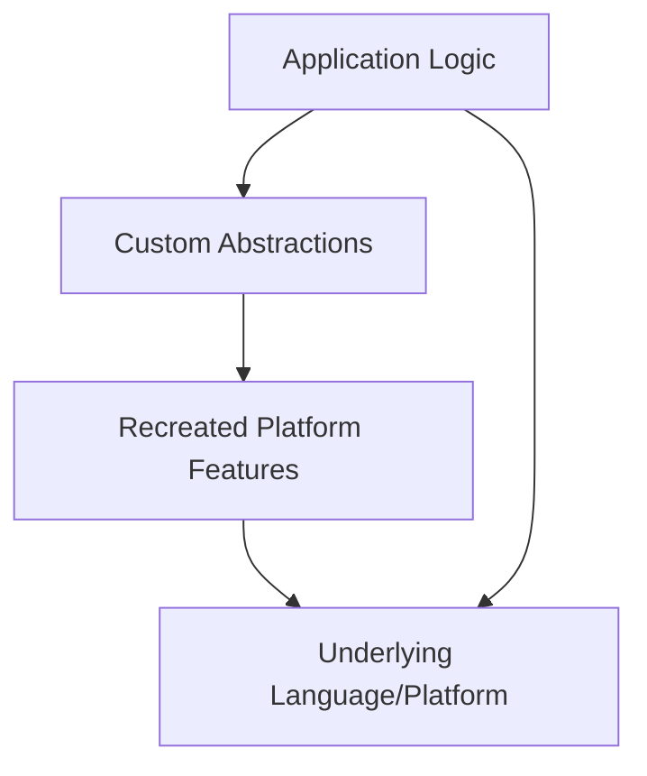

## 24.16. The Inner Platform Effect

In the realm of software development, the quest for creating efficient and elegant solutions often leads developers to explore various design patterns and architectural paradigms. However, in this pursuit, there lies a subtle trap known as the "Inner Platform Effect." This anti-pattern emerges when developers inadvertently recreate features of the programming platform within their applications, leading to unnecessary complexity and inefficiency. In this section, we will delve into the intricacies of the Inner Platform Effect, explore its manifestations in Clojure development, and provide guidance on how to avoid falling into this trap.

### Understanding the Inner Platform Effect

The Inner Platform Effect occurs when a software system is designed with excessive abstraction layers that mimic the capabilities of the underlying platform or language. Instead of leveraging the existing features and libraries provided by the language, developers build their own versions, often resulting in a system that is more complex and difficult to maintain.

#### Definition and Origins

The term "Inner Platform Effect" was popularized by the software development community to describe systems that attempt to replicate the functionality of the platform they are built upon. This phenomenon can be traced back to the desire for flexibility and control, where developers aim to create a system that can handle any possible future requirement. However, this often leads to over-engineering and a bloated codebase.

### Manifestations in Clojure Development

Clojure, with its rich set of features and functional programming paradigms, provides developers with powerful tools to build robust applications. However, the Inner Platform Effect can still manifest in Clojure projects, particularly when developers:

1. **Recreate Core Language Features**: Instead of using Clojure's built-in functions and data structures, developers may implement their own versions, leading to redundant code and increased complexity.

2. **Overuse of Macros**: While macros are a powerful feature in Clojure, overusing them to create abstractions that duplicate existing language constructs can result in code that is difficult to understand and maintain.

3. **Excessive Abstraction Layers**: Building multiple layers of abstraction to achieve flexibility can lead to a system that is hard to navigate and reason about.

### Examples of the Inner Platform Effect

To better understand the Inner Platform Effect, let's explore some examples where developers build abstractions that duplicate language features.

#### Example 1: Reinventing Data Structures

Consider a scenario where a developer decides to implement a custom data structure to manage collections of data, despite Clojure's robust set of immutable data structures like vectors, lists, maps, and sets.

```clojure
;; Custom data structure implementation
(defn custom-collection []
  (atom []))

(defn add-element [coll element]
  (swap! coll conj element))

(defn get-elements [coll]
  @coll)

;; Usage
(def my-collection (custom-collection))
(add-element my-collection 1)
(add-element my-collection 2)
(get-elements my-collection) ; => [1 2]
```

In this example, the developer has created a custom collection using an atom, which essentially duplicates the functionality of Clojure's built-in vector. This not only adds unnecessary complexity but also misses out on the performance optimizations and features provided by the language's core data structures.

#### Example 2: Overusing Macros for Control Flow

Macros in Clojure allow developers to extend the language and create new syntactic constructs. However, using macros to replicate existing control flow constructs can lead to confusion and maintenance challenges.

```clojure
;; Custom control flow macro
(defmacro my-if [condition then else]
  `(if ~condition
     ~then
     ~else))

;; Usage
(my-if true
  (println "Condition is true")
  (println "Condition is false"))
```

Here, the `my-if` macro replicates the functionality of the built-in `if` construct. While this might seem like a harmless exercise, in larger codebases, such practices can lead to a proliferation of custom constructs that make the codebase harder to understand and maintain.

### Negative Impacts on Code Simplicity and Performance

The Inner Platform Effect can have several detrimental effects on a codebase:

1. **Increased Complexity**: By recreating existing features, the codebase becomes more complex, making it harder for new developers to understand and contribute.

2. **Reduced Performance**: Custom implementations may not be as optimized as the language's built-in features, leading to performance bottlenecks.

3. **Maintenance Challenges**: As the codebase grows, maintaining custom implementations becomes increasingly difficult, especially when they deviate from standard practices.

4. **Duplication of Effort**: Developers spend time solving problems that have already been addressed by the language, diverting focus from solving business problems.

### Leveraging Existing Language and Platform Capabilities

To avoid the Inner Platform Effect, developers should focus on leveraging the existing capabilities of the language and platform. Here are some strategies to achieve this:

1. **Embrace Clojure's Core Functions**: Clojure provides a rich set of core functions and data structures that are optimized for performance and ease of use. Familiarize yourself with these features and use them whenever possible.

2. **Use Libraries and Frameworks**: The Clojure ecosystem offers a wide range of libraries and frameworks that address common development needs. Evaluate these options before implementing custom solutions.

3. **Adopt Idiomatic Clojure Practices**: Follow idiomatic Clojure practices and patterns to ensure that your code is consistent with the community's standards. This not only improves code readability but also makes it easier for others to contribute.

4. **Focus on Business Logic**: Concentrate on solving the specific business problems your application is designed to address, rather than reinventing the wheel. This helps keep the codebase focused and aligned with business goals.

### Encouraging a Business-Focused Approach

Ultimately, the goal of software development is to deliver value to users and stakeholders. By avoiding the Inner Platform Effect and focusing on leveraging existing language features, developers can create solutions that are both efficient and maintainable. Here are some final thoughts to keep in mind:

- **Prioritize Simplicity**: Strive for simplicity in your designs and implementations. Simple solutions are often more robust and easier to maintain.

- **Collaborate and Share Knowledge**: Engage with the Clojure community to learn from others' experiences and share your own insights. This collaborative approach can help you avoid common pitfalls and discover best practices.

- **Continuously Evaluate and Refactor**: Regularly review your codebase to identify areas where the Inner Platform Effect may be creeping in. Refactor these areas to align with idiomatic Clojure practices.

- **Stay Informed**: Keep up-to-date with the latest developments in the Clojure ecosystem and the broader software development landscape. This knowledge can help you make informed decisions about when to use existing features and when to innovate.

### Visualizing the Inner Platform Effect

To better understand the Inner Platform Effect, let's visualize how it manifests in a software system. The following diagram illustrates the layers of abstraction that can lead to this anti-pattern:



**Diagram Description**: This diagram shows how application logic can become entangled with custom abstractions that recreate platform features, leading to unnecessary complexity. The direct path from application logic to the underlying language/platform represents the ideal scenario where existing features are leveraged.

### Conclusion

The Inner Platform Effect is a common anti-pattern that can lead to unnecessary complexity and inefficiency in software systems. By understanding its manifestations and impacts, developers can take proactive steps to avoid this trap and create solutions that are both elegant and maintainable. Remember, the key is to leverage the powerful features of Clojure and focus on solving the business problems at hand.

## **Ready to Test Your Knowledge?**



### What is the Inner Platform Effect?

- [x] An anti-pattern where developers recreate platform features within their applications.
- [ ] A design pattern for creating flexible software systems.
- [ ] A method for optimizing performance in Clojure applications.
- [ ] A technique for improving code readability.

> **Explanation:** The Inner Platform Effect is an anti-pattern that occurs when developers build unnecessary abstractions that duplicate the features of the underlying platform.

### Which of the following is a manifestation of the Inner Platform Effect in Clojure?

- [x] Recreating core language features.
- [ ] Using Clojure's built-in functions.
- [ ] Leveraging existing libraries.
- [ ] Writing idiomatic Clojure code.

> **Explanation:** Recreating core language features is a common manifestation of the Inner Platform Effect, leading to redundant code and increased complexity.

### What is a negative impact of the Inner Platform Effect?

- [x] Increased complexity and maintenance challenges.
- [ ] Improved performance and efficiency.
- [ ] Enhanced code readability.
- [ ] Simplified codebase.

> **Explanation:** The Inner Platform Effect increases complexity and makes the codebase harder to maintain, as developers duplicate existing features.

### How can developers avoid the Inner Platform Effect?

- [x] Leverage existing language and platform capabilities.
- [ ] Build custom abstractions for every feature.
- [ ] Avoid using libraries and frameworks.
- [ ] Focus solely on code optimization.

> **Explanation:** Developers can avoid the Inner Platform Effect by leveraging existing language features and focusing on solving business problems.

### Which of the following is a strategy to leverage existing language capabilities?

- [x] Embrace Clojure's core functions.
- [ ] Implement custom data structures.
- [ ] Overuse macros for control flow.
- [ ] Create multiple abstraction layers.

> **Explanation:** Embracing Clojure's core functions helps developers leverage existing language capabilities and avoid unnecessary complexity.

### What should developers focus on to avoid the Inner Platform Effect?

- [x] Solving business problems.
- [ ] Recreating platform features.
- [ ] Building custom control flow constructs.
- [ ] Implementing excessive abstraction layers.

> **Explanation:** Developers should focus on solving business problems rather than recreating platform features, which helps avoid the Inner Platform Effect.

### What is a benefit of avoiding the Inner Platform Effect?

- [x] Simplified and maintainable codebase.
- [ ] Increased code complexity.
- [ ] Reduced performance.
- [ ] Duplication of effort.

> **Explanation:** Avoiding the Inner Platform Effect leads to a simplified and maintainable codebase, as developers leverage existing features.

### What is a common pitfall when using macros in Clojure?

- [x] Overusing them to replicate existing language constructs.
- [ ] Using them to extend the language.
- [ ] Creating new syntactic constructs.
- [ ] Enhancing code readability.

> **Explanation:** Overusing macros to replicate existing language constructs can lead to confusion and maintenance challenges.

### How can developers ensure their code aligns with idiomatic Clojure practices?

- [x] Follow community standards and best practices.
- [ ] Implement custom solutions for common problems.
- [ ] Avoid using Clojure's core functions.
- [ ] Focus on building flexible systems.

> **Explanation:** Following community standards and best practices ensures that code aligns with idiomatic Clojure practices.

### True or False: The Inner Platform Effect is beneficial for creating flexible software systems.

- [ ] True
- [x] False

> **Explanation:** False. The Inner Platform Effect is an anti-pattern that leads to unnecessary complexity and inefficiency, not flexibility.


