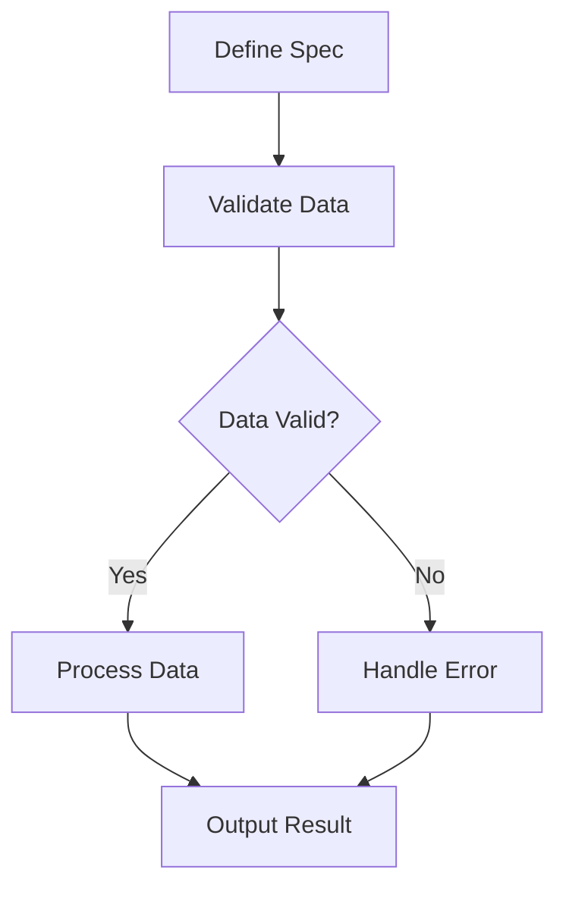

## 24.17. Neglecting Spec and Data Validation

In the world of software development, ensuring that your code is robust and error-free is paramount. One of the most effective ways to achieve this is through data validation. In Clojure, **Spec** is a powerful tool designed to help developers define the structure of data and validate it against these definitions. However, neglecting to use Spec or other data validation mechanisms can lead to brittle code and runtime errors. In this section, we will explore the purpose of data validation, discuss the consequences of neglecting it, and provide best practices for incorporating Spec into your development process.

### Understanding Data Validation and Clojure Spec

Data validation is the process of ensuring that data conforms to a set of rules or constraints before it is processed by your application. This is crucial in preventing unexpected behavior and runtime errors. Clojure Spec is a library that provides a way to describe the structure of data and functions, and to validate data against these descriptions.

#### Purpose of Data Validation

- **Preventing Errors**: By validating data, you can catch errors early in the development process, reducing the likelihood of runtime errors.
- **Ensuring Data Integrity**: Validation ensures that data is consistent and meets the expected format and constraints.
- **Improving Code Quality**: With validation, your code becomes more predictable and easier to maintain.

#### Introduction to Clojure Spec

Clojure Spec allows you to define specifications for data structures and functions. It provides a way to validate data, generate test data, and document your code. Spec is particularly useful in a dynamic language like Clojure, where types are not enforced at compile time.

Here's a simple example of defining a spec for a map representing a person:

```clojure
(require '[clojure.spec.alpha :as s])

(s/def ::name string?)
(s/def ::age pos-int?)

(s/def ::person (s/keys :req [::name ::age]))

(defn validate-person [person]
  (if (s/valid? ::person person)
    (println "Valid person!")
    (println "Invalid person!")))

(validate-person {:name "Alice" :age 30}) ; Valid person!
(validate-person {:name "Bob" :age -5})   ; Invalid person!
```

### Consequences of Neglecting Data Validation

Neglecting data validation can lead to a host of issues that can compromise the reliability and maintainability of your code. Here are some potential consequences:

#### Runtime Errors

Without validation, your application is prone to runtime errors that can be difficult to diagnose and fix. For example, if a function expects a positive integer but receives a negative one, it may result in unexpected behavior or crashes.

#### Data Corruption

Invalid data can lead to corruption, especially when it is stored in a database or used in calculations. This can have far-reaching effects, causing incorrect results and potentially leading to data loss.

#### Security Vulnerabilities

Neglecting validation can open your application to security vulnerabilities, such as injection attacks, where malicious data is processed by your application.

#### Increased Maintenance Costs

Code that lacks validation is harder to maintain and debug. Developers may spend more time fixing bugs and addressing issues that could have been prevented with proper validation.

### Examples of Issues from Neglecting Validation

Let's look at some examples of how neglecting validation can lead to issues in your code.

#### Example 1: Invalid Function Inputs

Consider a function that calculates the square root of a number. Without validation, passing a negative number would result in an error:

```clojure
(defn sqrt [x]
  (Math/sqrt x))

(sqrt -4) ; Throws java.lang.IllegalArgumentException
```

By adding validation, we can prevent this error:

```clojure
(s/def ::non-negative-number (s/and number? (complement neg?)))

(defn sqrt [x]
  (if (s/valid? ::non-negative-number x)
    (Math/sqrt x)
    (throw (IllegalArgumentException. "Input must be non-negative"))))

(sqrt -4) ; Throws IllegalArgumentException with a clear message
```

#### Example 2: Data Structure Validation

Imagine a function that processes a list of orders. Without validation, an order with missing or incorrect fields could cause issues:

```clojure
(defn process-orders [orders]
  (doseq [order orders]
    (println "Processing order:" order)))

(process-orders [{:id 1 :amount 100} {:id 2}]) ; Missing :amount
```

By defining a spec for the order structure, we can ensure that each order is valid:

```clojure
(s/def ::id pos-int?)
(s/def ::amount pos-int?)

(s/def ::order (s/keys :req [::id ::amount]))

(defn process-orders [orders]
  (doseq [order orders]
    (if (s/valid? ::order order)
      (println "Processing order:" order)
      (println "Invalid order:" order))))

(process-orders [{:id 1 :amount 100} {:id 2}]) ; Invalid order: {:id 2}
```

### Encouraging the Use of Spec in Development

Incorporating Spec into your development process can greatly enhance the reliability and maintainability of your code. Here are some best practices for using Spec effectively:

#### Define Specs Early

Define specs for your data structures and functions early in the development process. This helps catch errors early and ensures that your code is built on a solid foundation.

#### Use Specs for Function Inputs and Outputs

Validate function inputs and outputs using Spec. This ensures that functions receive and return data in the expected format, reducing the likelihood of errors.

#### Leverage Spec for Testing

Use Spec to generate test data and validate test cases. This can help automate the testing process and ensure comprehensive test coverage.

#### Document Your Code with Spec

Specs serve as documentation for your code, providing a clear description of the expected structure and constraints of your data. This makes your code more understandable and easier to maintain.

### Best Practices for Validating Function Inputs and Outputs

When validating function inputs and outputs, consider the following best practices:

#### Use Predicate Functions

Use predicate functions to define simple specs. Predicate functions are functions that return a boolean value, indicating whether the data meets the specified condition.

```clojure
(s/def ::positive-number pos-int?)

(defn add [x y]
  (if (and (s/valid? ::positive-number x) (s/valid? ::positive-number y))
    (+ x y)
    (throw (IllegalArgumentException. "Inputs must be positive numbers"))))
```

#### Combine Specs with `s/and` and `s/or`

Use `s/and` and `s/or` to combine multiple specs. This allows you to define complex constraints for your data.

```clojure
(s/def ::age (s/and int? #(<= 0 % 120)))

(s/def ::person (s/keys :req [::name ::age]))

(defn validate-person [person]
  (if (s/valid? ::person person)
    (println "Valid person!")
    (println "Invalid person!")))
```

#### Use `s/conform` for Data Transformation

Use `s/conform` to transform data according to a spec. This is useful for normalizing data before processing it.

```clojure
(s/def ::email (s/and string? #(re-matches #".+@.+\..+" %)))

(defn normalize-email [email]
  (s/conform ::email email))

(normalize-email "user@example.com") ; "user@example.com"
(normalize-email "invalid-email")    ; :clojure.spec.alpha/invalid
```

### Visualizing the Role of Spec in Data Validation

To better understand how Spec fits into the data validation process, let's visualize the workflow:



**Diagram Description**: This flowchart illustrates the role of Spec in data validation. First, a spec is defined for the data. The data is then validated against this spec. If the data is valid, it is processed and the result is output. If the data is invalid, an error is handled, and the process continues.

### References and Further Reading

- [Clojure Spec Guide](https://clojure.org/guides/spec)
- [Clojure Spec API Documentation](https://clojure.github.io/spec.alpha/)
- [Clojure Spec: A Quick Reference](https://clojure.org/guides/spec_quick_start)

### Knowledge Check

Let's reinforce what we've learned with some questions and exercises.

1. What is the purpose of data validation in software development?
2. How does Clojure Spec help in defining and validating data structures?
3. What are the consequences of neglecting data validation?
4. Provide an example of how Spec can be used to validate function inputs.
5. How can Spec be used to generate test data?

### Embrace the Journey

Remember, incorporating Spec and data validation into your development process is just the beginning. As you continue to build more complex applications, you'll find that these practices become invaluable in ensuring the reliability and maintainability of your code. Keep experimenting, stay curious, and enjoy the journey!

## **Ready to Test Your Knowledge?**



### What is the primary purpose of data validation?

- [x] To ensure data integrity and prevent errors
- [ ] To increase code complexity
- [ ] To slow down the development process
- [ ] To make code harder to read

> **Explanation:** Data validation ensures that data is consistent and meets the expected format, preventing errors and improving code quality.

### How does Clojure Spec help in data validation?

- [x] By defining specifications for data structures and functions
- [ ] By automatically fixing errors in code
- [ ] By generating random data
- [ ] By replacing unit tests

> **Explanation:** Clojure Spec allows developers to define specifications for data structures and functions, which can be used to validate data against these specifications.

### What is a consequence of neglecting data validation?

- [x] Increased runtime errors
- [ ] Faster development time
- [ ] Improved code readability
- [ ] Enhanced security

> **Explanation:** Neglecting data validation can lead to increased runtime errors, as invalid data may cause unexpected behavior in the application.

### Which function is used to check if data conforms to a spec in Clojure?

- [x] `s/valid?`
- [ ] `s/conform`
- [ ] `s/def`
- [ ] `s/and`

> **Explanation:** The `s/valid?` function is used to check if data conforms to a spec in Clojure.

### What is the role of `s/conform` in Clojure Spec?

- [x] To transform data according to a spec
- [ ] To define a new spec
- [ ] To generate test data
- [ ] To check if data is valid

> **Explanation:** The `s/conform` function is used to transform data according to a spec, which is useful for normalizing data before processing it.

### How can Spec be used in testing?

- [x] By generating test data and validating test cases
- [ ] By replacing all unit tests
- [ ] By slowing down the testing process
- [ ] By making tests harder to write

> **Explanation:** Spec can be used to generate test data and validate test cases, helping automate the testing process and ensure comprehensive test coverage.

### What is a best practice for using Spec in development?

- [x] Define specs early in the development process
- [ ] Avoid using specs for function inputs
- [ ] Use specs only for complex data structures
- [ ] Ignore specs for testing

> **Explanation:** Defining specs early in the development process helps catch errors early and ensures that your code is built on a solid foundation.

### What is the benefit of using predicate functions in Spec?

- [x] They provide a simple way to define specs
- [ ] They make code harder to read
- [ ] They slow down the validation process
- [ ] They replace all other validation methods

> **Explanation:** Predicate functions provide a simple way to define specs, making it easy to validate data against specific conditions.

### What does the `s/keys` function do in Clojure Spec?

- [x] Defines a spec for a map with required and optional keys
- [ ] Generates random keys for a map
- [ ] Validates a list of keys
- [ ] Replaces all keys in a map

> **Explanation:** The `s/keys` function defines a spec for a map with required and optional keys, allowing for structured data validation.

### True or False: Neglecting data validation can lead to security vulnerabilities.

- [x] True
- [ ] False

> **Explanation:** Neglecting data validation can open your application to security vulnerabilities, such as injection attacks, where malicious data is processed by your application.




