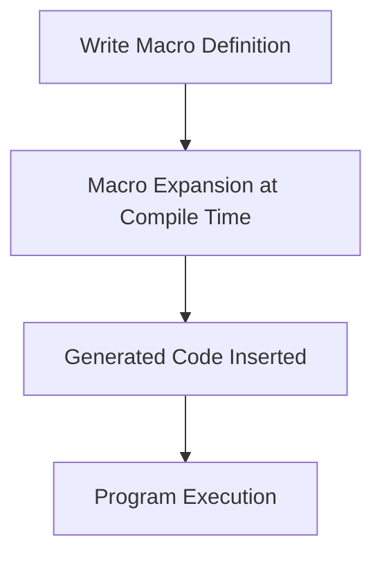

## 24.2. Overusing Macros

### Introduction

In the world of Clojure, macros are a powerful tool that allows developers to extend the language by writing code that writes code. This metaprogramming capability can lead to elegant solutions and significant reductions in boilerplate code. However, with great power comes great responsibility. Overusing macros can lead to complex, unreadable, and difficult-to-maintain code. In this section, we will explore how macros work, their appropriate use cases, and the dangers of overusing them. We will also provide guidelines on when to choose functions over macros to encourage simplicity and clarity in code design.

### Understanding Macros in Clojure

Macros in Clojure are a way to perform transformations on code before it is evaluated. They are written in Clojure itself and operate on the abstract syntax tree (AST) of the code. This allows developers to introduce new syntactic constructs and perform code generation at compile time.

#### How Macros Work

Macros are defined using the `defmacro` keyword. Unlike functions, which are evaluated at runtime, macros are expanded at compile time. This means that the code generated by a macro is inserted into the program before it is executed.

```clojure
(defmacro when-not [test & body]
  `(if (not ~test)
     (do ~@body)))

;; Usage
(when-not false
  (println "This will print because the test is false."))
```

In the example above, the `when-not` macro is a simple transformation that expands into an `if` statement with a negated test condition. The `~` and `~@` are unquote and unquote-splicing operators, respectively, which allow the macro to insert values into the generated code.

#### Appropriate Use Cases for Macros

Macros are best used when you need to:

1. **Introduce New Control Structures**: When you need a new syntactic construct that cannot be achieved with functions alone, macros can be used to create custom control structures.

2. **Avoid Repeated Boilerplate Code**: If a pattern of code is repeated frequently and cannot be abstracted using functions, macros can help reduce redundancy.

3. **Manipulate Code at Compile Time**: When you need to perform transformations on code that must occur before runtime, macros are the tool of choice.

### The Dangers of Overusing Macros

While macros can be incredibly useful, overusing them can lead to several issues:

1. **Reduced Readability**: Macros can obscure the flow of a program, making it difficult for others (or even yourself) to understand what the code is doing.

2. **Increased Complexity**: Macros can introduce complexity that is not immediately apparent, leading to maintenance challenges.

3. **Debugging Challenges**: Since macros are expanded at compile time, debugging them can be more difficult than debugging functions. Errors may not be obvious until runtime, and stack traces can be harder to interpret.

4. **Limited Tool Support**: Many development tools are better equipped to handle functions than macros, which can limit features like code navigation and refactoring.

#### Example of Misapplied Macros

Consider the following example where a macro is used unnecessarily:

```clojure
(defmacro add [a b]
  `(+ ~a ~b))

;; Usage
(add 1 2)
```

In this case, the `add` macro is simply wrapping the `+` function, which could be achieved with a regular function:

```clojure
(defn add [a b]
  (+ a b))

;; Usage
(add 1 2)
```

Using a macro here adds unnecessary complexity without providing any additional benefit.

### Guidelines for Choosing Functions Over Macros

To avoid the pitfalls of overusing macros, consider the following guidelines:

1. **Prefer Functions for Simple Transformations**: If a task can be accomplished with a function, use a function. Functions are easier to understand, test, and debug.

2. **Use Macros for Syntactic Abstraction**: Only use macros when you need to introduce new syntax or perform compile-time transformations that cannot be achieved with functions.

3. **Keep Macros Simple**: When you do use macros, keep them as simple as possible. Avoid complex logic within macros to maintain readability.

4. **Document Macro Behavior**: Clearly document the behavior and purpose of macros to aid understanding and maintenance.

5. **Test Macro Expansions**: Write tests for the code generated by macros to ensure they behave as expected.

### Encouraging Simplicity and Clarity

In Clojure, simplicity and clarity are key principles. By choosing functions over macros when possible, you can create code that is easier to read, maintain, and extend. Remember, macros should be a last resort, not the first tool you reach for.

### Visualizing Macro Expansion

To better understand how macros transform code, let's visualize the process using a simple flowchart:



**Figure 1**: The process of macro expansion in Clojure.

### Try It Yourself

To deepen your understanding of macros, try modifying the `when-not` macro to include an `else` clause. Experiment with different macro definitions and observe how they transform code at compile time.

### References and Further Reading

- [Clojure Macros](https://clojure.org/reference/macros)
- [Metaprogramming in Clojure](https://clojure.org/guides/learn/metaprogramming)

### Knowledge Check

To reinforce your understanding of macros and their appropriate use, consider the following questions:

- What are the key differences between macros and functions in Clojure?
- When is it appropriate to use a macro instead of a function?
- What are some potential pitfalls of overusing macros?

### Conclusion

Macros are a powerful feature of Clojure that can lead to elegant solutions when used appropriately. However, overusing them can result in complex and unreadable code. By understanding when to use macros and when to opt for simpler functions, you can write more maintainable and clear Clojure code. Remember, simplicity is key, and macros should be used judiciously to enhance, not hinder, your code.

## **Ready to Test Your Knowledge?**



### What is the primary purpose of macros in Clojure?

- [x] To perform code transformations at compile time
- [ ] To execute code at runtime
- [ ] To improve runtime performance
- [ ] To handle errors in code

> **Explanation:** Macros in Clojure are used to perform code transformations at compile time, allowing developers to introduce new syntactic constructs and perform code generation before the program is executed.

### When should you prefer functions over macros in Clojure?

- [x] When a task can be accomplished with a function
- [ ] When you need to introduce new syntax
- [ ] When you need to perform compile-time transformations
- [ ] When you want to reduce runtime errors

> **Explanation:** Functions should be preferred over macros when a task can be accomplished with a function, as functions are easier to understand, test, and debug.

### What is a potential drawback of overusing macros?

- [x] Reduced readability
- [ ] Increased runtime performance
- [ ] Simplified code structure
- [ ] Enhanced tool support

> **Explanation:** Overusing macros can lead to reduced readability, making it difficult for others to understand the code.

### How are macros different from functions in Clojure?

- [x] Macros are expanded at compile time, while functions are evaluated at runtime
- [ ] Macros are evaluated at runtime, while functions are expanded at compile time
- [ ] Macros and functions are the same in Clojure
- [ ] Macros are used for error handling, while functions are not

> **Explanation:** Macros are expanded at compile time, allowing for code transformations before execution, while functions are evaluated at runtime.

### What should you do to maintain readability when using macros?

- [x] Keep macros simple
- [ ] Use macros for all code transformations
- [ ] Avoid documenting macro behavior
- [ ] Write complex logic within macros

> **Explanation:** To maintain readability, keep macros simple and avoid complex logic within them.

### What is the role of the `defmacro` keyword in Clojure?

- [x] It defines a macro
- [ ] It defines a function
- [ ] It evaluates a macro at runtime
- [ ] It handles errors in macros

> **Explanation:** The `defmacro` keyword is used to define a macro in Clojure.

### Why is it important to document macro behavior?

- [x] To aid understanding and maintenance
- [ ] To increase runtime performance
- [ ] To reduce compile-time errors
- [ ] To simplify code structure

> **Explanation:** Documenting macro behavior helps others understand the purpose and functionality of the macro, aiding in maintenance and readability.

### What is a common use case for macros in Clojure?

- [x] Introducing new control structures
- [ ] Handling runtime errors
- [ ] Improving runtime performance
- [ ] Simplifying function definitions

> **Explanation:** Macros are commonly used to introduce new control structures that cannot be achieved with functions alone.

### What is the purpose of the `~` and `~@` operators in macros?

- [x] To unquote and unquote-splice values into the generated code
- [ ] To define a macro
- [ ] To handle errors in macros
- [ ] To evaluate macros at runtime

> **Explanation:** The `~` and `~@` operators are used to unquote and unquote-splice values into the generated code within a macro.

### True or False: Macros should be the first tool you reach for when writing Clojure code.

- [ ] True
- [x] False

> **Explanation:** False. Macros should be a last resort, not the first tool you reach for. Functions should be preferred when possible to maintain simplicity and readability.



Remember, this is just the beginning. As you progress, you'll build more complex and interactive Clojure applications. Keep experimenting, stay curious, and enjoy the journey!
