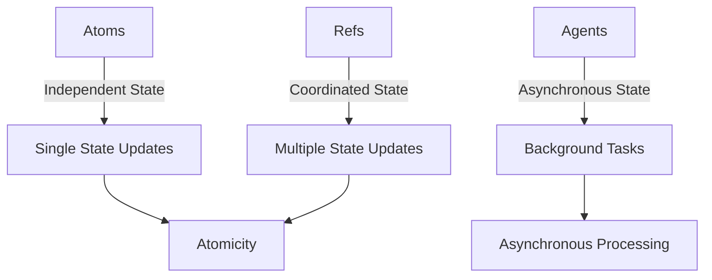

## 24.3. Misusing Atoms, Refs, and Agents

### Introduction

Clojure, a dynamic, functional programming language, offers powerful concurrency primitives: atoms, refs, and agents. These constructs enable developers to manage state changes in a concurrent environment effectively. However, misuse of these tools can lead to complex bugs, performance issues, and incorrect program behavior. In this section, we will explore the common pitfalls associated with atoms, refs, and agents, and provide guidance on how to use them correctly.

### Understanding Atoms, Refs, and Agents

Before diving into the common pitfalls, let's briefly review the purpose and characteristics of atoms, refs, and agents in Clojure.

#### Atoms

Atoms provide a way to manage shared, synchronous, and independent state. They are ideal for situations where you need to update a single piece of state atomically. Atoms use compare-and-swap (CAS) to ensure that updates are applied only if the state has not changed since the last read.

```clojure
(def counter (atom 0))

;; Increment the counter atomically
(swap! counter inc)
```

#### Refs

Refs are used for coordinated, synchronous updates to multiple pieces of state. They leverage Clojure's Software Transactional Memory (STM) system, allowing you to perform a series of updates atomically. Refs are suitable for complex state changes that require consistency across multiple variables.

```clojure
(def account1 (ref 100))
(def account2 (ref 200))

;; Transfer money between accounts atomically
(dosync
  (alter account1 - 50)
  (alter account2 + 50))
```

#### Agents

Agents are designed for asynchronous updates to state. They allow you to perform updates in a separate thread, making them suitable for tasks that do not require immediate consistency. Agents are ideal for handling background tasks or offloading work from the main thread.

```clojure
(def logger (agent []))

;; Log a message asynchronously
(send logger conj "Log message")
```

### Common Misuse Cases

Understanding the intended use of atoms, refs, and agents is crucial to avoid common pitfalls. Let's explore some typical misuse cases and their consequences.

#### Misusing Atoms for Complex State Changes

Atoms are often misused for complex state changes that involve multiple variables. Since atoms are designed for independent state updates, using them for coordinated changes can lead to inconsistent state.

**Example of Incorrect Usage:**

```clojure
(def account1 (atom 100))
(def account2 (atom 200))

;; Attempt to transfer money between accounts
(swap! account1 - 50)
(swap! account2 + 50)
```

**Consequence:** If another thread modifies `account1` or `account2` between the two `swap!` calls, the state can become inconsistent, leading to incorrect balances.

**Best Practice:** Use refs and STM for coordinated updates to multiple pieces of state.

#### Using Refs for Independent State

Refs are sometimes used for independent state updates, which can lead to unnecessary overhead due to the STM system. Since refs are designed for coordinated updates, using them for independent state can degrade performance.

**Example of Incorrect Usage:**

```clojure
(def counter (ref 0))

;; Increment the counter
(dosync
  (alter counter inc))
```

**Consequence:** The STM system introduces overhead that is unnecessary for independent state updates, resulting in reduced performance.

**Best Practice:** Use atoms for independent state updates to avoid the overhead of STM.

#### Misusing Agents for Immediate Consistency

Agents are sometimes misused when immediate consistency is required. Since agents perform updates asynchronously, they are not suitable for tasks that require the state to be immediately consistent after an update.

**Example of Incorrect Usage:**

```clojure
(def balance (agent 100))

;; Attempt to update balance and use immediately
(send balance + 50)
@balance  ;; May not reflect the updated value immediately
```

**Consequence:** The balance may not reflect the updated value immediately, leading to incorrect program behavior.

**Best Practice:** Use atoms or refs when immediate consistency is required.

### Choosing the Right Concurrency Primitive

Selecting the appropriate concurrency primitive is essential for effective state management in Clojure. Here are some guidelines to help you choose the right tool for the job:

- **Use Atoms** for independent, synchronous state updates. They are ideal for simple counters, flags, or any state that does not require coordination with other variables.
- **Use Refs** for coordinated, synchronous updates to multiple pieces of state. They are suitable for transactions that require consistency across multiple variables.
- **Use Agents** for asynchronous state updates. They are perfect for background tasks, logging, or any work that can be offloaded from the main thread.

### Understanding Concurrency Semantics

Understanding the concurrency semantics of atoms, refs, and agents is crucial to using them effectively. Let's explore the key concepts:

#### Atomicity

Atomicity ensures that a series of operations are completed without interruption. Atoms provide atomicity for single state updates, while refs provide atomicity for coordinated updates across multiple variables.

#### Consistency

Consistency ensures that the state remains valid after an update. Refs, with their STM system, provide consistency for complex state changes, while atoms provide consistency for independent updates.

#### Isolation

Isolation ensures that concurrent transactions do not interfere with each other. Refs provide isolation through STM, allowing multiple transactions to occur simultaneously without conflict.

#### Durability

Durability ensures that once a transaction is committed, it remains committed. While Clojure's concurrency primitives do not provide durability in the traditional database sense, they ensure that state changes are persistent within the application's memory.

### Code Examples and Best Practices

Let's explore some code examples to illustrate the best practices for using atoms, refs, and agents.

#### Using Atoms for Independent State

```clojure
(def counter (atom 0))

;; Increment the counter atomically
(swap! counter inc)

;; Decrement the counter atomically
(swap! counter dec)
```

**Key Point:** Use atoms for simple, independent state updates that do not require coordination with other variables.

#### Using Refs for Coordinated State

```clojure
(def account1 (ref 100))
(def account2 (ref 200))

;; Transfer money between accounts atomically
(dosync
  (alter account1 - 50)
  (alter account2 + 50))
```

**Key Point:** Use refs and STM for coordinated updates to multiple pieces of state that require consistency.

#### Using Agents for Asynchronous Tasks

```clojure
(def logger (agent []))

;; Log a message asynchronously
(send logger conj "Log message")

;; Ensure all messages are processed
(await logger)
```

**Key Point:** Use agents for asynchronous tasks that do not require immediate consistency.

### Visualizing Concurrency Primitives

To better understand the relationships and interactions between atoms, refs, and agents, let's visualize these concepts using a Mermaid.js diagram.



**Diagram Description:** This diagram illustrates the relationships between atoms, refs, and agents, highlighting their intended use cases and key characteristics.

### Try It Yourself

Experiment with the code examples provided in this section. Try modifying the examples to see how different concurrency primitives affect program behavior. For instance, attempt to use an atom where a ref is more appropriate and observe the consequences.

### References and Further Reading

- [Clojure Documentation on Atoms](https://clojure.org/reference/atoms)
- [Clojure Documentation on Refs](https://clojure.org/reference/refs)
- [Clojure Documentation on Agents](https://clojure.org/reference/agents)

### Knowledge Check

To reinforce your understanding of atoms, refs, and agents, let's test your knowledge with some quiz questions.

## **Ready to Test Your Knowledge?**



### Which concurrency primitive is best for independent state updates?

- [x] Atoms
- [ ] Refs
- [ ] Agents
- [ ] Vars

> **Explanation:** Atoms are designed for independent, synchronous state updates.

### What is the primary use case for refs in Clojure?

- [ ] Asynchronous updates
- [x] Coordinated state changes
- [ ] Independent state updates
- [ ] Logging tasks

> **Explanation:** Refs are used for coordinated, synchronous updates to multiple pieces of state.

### Which concurrency primitive should you use for asynchronous tasks?

- [ ] Atoms
- [ ] Refs
- [x] Agents
- [ ] Vars

> **Explanation:** Agents are designed for asynchronous state updates.

### What is a common misuse of atoms?

- [ ] Using them for asynchronous tasks
- [x] Using them for coordinated state changes
- [ ] Using them for independent state updates
- [ ] Using them for logging

> **Explanation:** Atoms are often misused for coordinated state changes, which should be handled by refs.

### How do refs ensure consistency?

- [ ] Through asynchronous processing
- [x] Through Software Transactional Memory (STM)
- [ ] Through compare-and-swap (CAS)
- [ ] Through logging

> **Explanation:** Refs use STM to ensure consistency for complex state changes.

### What is the consequence of using refs for independent state updates?

- [ ] Improved performance
- [x] Unnecessary overhead
- [ ] Immediate consistency
- [ ] Asynchronous processing

> **Explanation:** Using refs for independent state updates introduces unnecessary overhead due to the STM system.

### Which concurrency primitive provides atomicity for single state updates?

- [x] Atoms
- [ ] Refs
- [ ] Agents
- [ ] Vars

> **Explanation:** Atoms provide atomicity for single state updates.

### What is a key characteristic of agents?

- [ ] Immediate consistency
- [x] Asynchronous processing
- [ ] Coordinated state changes
- [ ] Independent state updates

> **Explanation:** Agents are characterized by their asynchronous processing capabilities.

### True or False: Agents are suitable for tasks that require immediate consistency.

- [ ] True
- [x] False

> **Explanation:** Agents are not suitable for tasks that require immediate consistency, as they perform updates asynchronously.

### Which concurrency primitive should you use for logging tasks?

- [ ] Atoms
- [ ] Refs
- [x] Agents
- [ ] Vars

> **Explanation:** Agents are ideal for logging tasks, as they can handle asynchronous updates.



### Conclusion

Understanding the proper use of atoms, refs, and agents is crucial for effective state management in Clojure. By avoiding common pitfalls and following best practices, you can harness the full power of Clojure's concurrency primitives to build robust, efficient, and concurrent applications. Remember, this is just the beginning. As you progress, you'll gain deeper insights into Clojure's concurrency model and its unique features. Keep experimenting, stay curious, and enjoy the journey!
