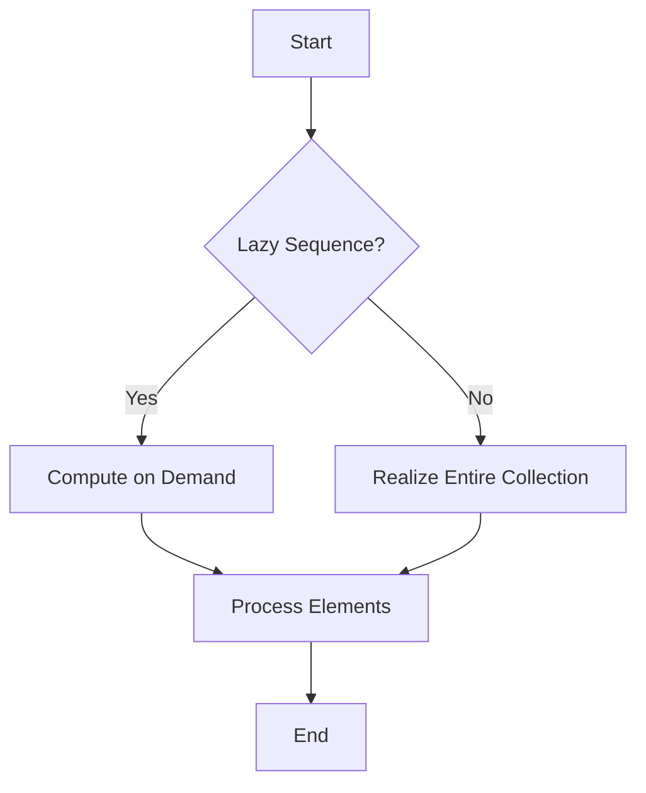

## 24.4. Inefficient Use of Sequences

In Clojure, sequences are a fundamental abstraction for handling collections. They provide a uniform interface for accessing and manipulating data, allowing developers to write expressive and concise code. However, improper use of sequences can lead to significant performance issues, especially when dealing with large datasets or complex transformations. In this section, we will explore how sequences work in Clojure, identify common pitfalls, and provide strategies for optimizing sequence usage.

### Understanding Sequences in Clojure

Clojure sequences are a powerful abstraction that allows for uniform access to various collection types, such as lists, vectors, maps, and sets. Sequences can be either **lazy** or **eager**, and understanding the difference is crucial for writing efficient Clojure code.

#### Lazy Sequences

Lazy sequences in Clojure are evaluated on demand. This means that elements of the sequence are computed only when they are needed. Lazy evaluation can be beneficial for performance, as it allows you to work with potentially infinite data structures and avoid unnecessary computations.

```clojure
;; Example of a lazy sequence
(defn lazy-seq-example []
  (map inc (range 1000000)))

;; Only the first 10 elements are realized
(take 10 (lazy-seq-example))
```

In the example above, the sequence generated by `(range 1000000)` is lazy, and only the first 10 elements are computed due to the `take` function.

#### Eager Sequences

Eager sequences, on the other hand, are fully realized immediately. This means that all elements are computed and stored in memory, which can lead to inefficiencies if the sequence is large or if only a subset of the data is needed.

```clojure
;; Example of an eager sequence
(def eager-seq (vec (range 1000000)))

;; All elements are realized at once
(count eager-seq)
```

### Common Performance Pitfalls

While sequences offer great flexibility, they can also introduce performance pitfalls if not used carefully. Let's explore some common issues and how to avoid them.

#### Unnecessary Laziness

One common mistake is relying too heavily on lazy sequences when eager evaluation would be more appropriate. This can lead to increased memory usage and slower performance, as the overhead of maintaining laziness can outweigh its benefits.

```clojure
;; Inefficient use of laziness
(defn inefficient-lazy []
  (map inc (map inc (range 1000000))))

;; Better approach with eager evaluation
(defn efficient-eager []
  (mapv inc (mapv inc (range 1000000))))
```

In the example above, the nested `map` calls create multiple lazy sequences, which can be inefficient. Using `mapv` instead forces eager evaluation, reducing overhead.

#### Realizing Entire Collections

Another common pitfall is realizing entire collections when only a portion is needed. This can lead to excessive memory consumption and slow performance.

```clojure
;; Inefficient realization of entire collection
(defn inefficient-realization []
  (reduce + (map inc (range 1000000))))

;; Efficient approach using transducers
(defn efficient-transducer []
  (transduce (map inc) + (range 1000000)))
```

In the example above, the `reduce` function realizes the entire sequence before summing the elements. Using a transducer with `transduce` avoids this by applying the transformation and reduction in a single pass.

#### Using `map` Without Realizing the Sequence

Using `map` without realizing the sequence can lead to unexpected behavior, especially when side effects are involved.

```clojure
;; Inefficient use of map with side effects
(defn print-seq []
  (map println (range 10)))

;; Correct approach with doall
(defn print-seq-correct []
  (doall (map println (range 10))))
```

In the first example, `println` is not executed because the sequence is not realized. Using `doall` forces realization, ensuring that side effects occur.

### Optimizing Sequence Usage

To optimize sequence usage in Clojure, consider the following strategies:

#### Use Transducers for Efficient Data Transformation

Transducers provide a way to compose sequence transformations without creating intermediate collections. They are particularly useful for processing large datasets efficiently.

```clojure
;; Using transducers for efficient transformation
(defn transducer-example []
  (transduce (comp (map inc) (filter even?)) conj [] (range 1000000)))
```

In this example, the transducer composes `map` and `filter` operations, applying them in a single pass without intermediate sequences.

#### Profile Your Code to Detect Performance Issues

Profiling is essential for identifying performance bottlenecks in your code. Use tools like [VisualVM](https://visualvm.github.io/) or [YourKit](https://www.yourkit.com/) to analyze memory usage and execution time.

```clojure
;; Example of profiling a function
(defn profile-example []
  (time (reduce + (map inc (range 1000000)))))
```

The `time` function provides a simple way to measure execution time, helping you identify slow operations.

#### Consider Alternative Data Structures

In some cases, using alternative data structures can improve performance. For example, using vectors instead of lists can provide faster access times due to their indexed nature.

```clojure
;; Using vectors for faster access
(defn vector-example []
  (let [v (vec (range 1000000))]
    (nth v 999999)))
```

### Visualizing Sequence Evaluation

To better understand how sequences are evaluated, let's visualize the process using a flowchart.



**Figure 1**: Sequence Evaluation Flowchart

This flowchart illustrates the decision-making process for sequence evaluation, highlighting the differences between lazy and eager sequences.

### Knowledge Check

To reinforce your understanding of sequence optimization, consider the following questions:

1. What is the primary difference between lazy and eager sequences in Clojure?
2. How can using `map` without realizing the sequence lead to inefficiencies?
3. What are transducers, and how do they improve sequence processing?
4. Why is profiling important for optimizing sequence usage?
5. How can alternative data structures enhance performance?

### Try It Yourself

Experiment with the code examples provided in this section. Try modifying the sequences to see how changes affect performance. For instance, replace `map` with `mapv` or use transducers to optimize transformations.

### Conclusion

Efficient use of sequences is crucial for writing performant Clojure code. By understanding the differences between lazy and eager evaluation, avoiding common pitfalls, and leveraging tools like transducers and profiling, you can optimize your sequence handling and improve the overall performance of your applications. Remember, this is just the beginning. As you progress, you'll discover more advanced techniques and patterns to further enhance your Clojure skills. Keep experimenting, stay curious, and enjoy the journey!

## **Ready to Test Your Knowledge?**



### What is the primary difference between lazy and eager sequences in Clojure?

- [x] Lazy sequences are evaluated on demand, while eager sequences are fully realized immediately.
- [ ] Lazy sequences are faster than eager sequences.
- [ ] Eager sequences use less memory than lazy sequences.
- [ ] Lazy sequences are only used for infinite data structures.

> **Explanation:** Lazy sequences are evaluated only when needed, which can save memory and computation time, whereas eager sequences are computed all at once.

### How can using `map` without realizing the sequence lead to inefficiencies?

- [x] It can cause side effects not to occur.
- [ ] It always results in faster execution.
- [ ] It reduces memory usage.
- [ ] It automatically optimizes the sequence.

> **Explanation:** Without realizing the sequence, operations with side effects may not execute, leading to unexpected behavior.

### What are transducers, and how do they improve sequence processing?

- [x] Transducers compose sequence transformations without intermediate collections.
- [ ] Transducers are a type of lazy sequence.
- [ ] Transducers are only used for filtering data.
- [ ] Transducers increase memory usage.

> **Explanation:** Transducers allow for efficient data processing by applying transformations in a single pass, avoiding intermediate collections.

### Why is profiling important for optimizing sequence usage?

- [x] It helps identify performance bottlenecks.
- [ ] It automatically optimizes code.
- [ ] It reduces the need for lazy sequences.
- [ ] It increases code readability.

> **Explanation:** Profiling provides insights into memory usage and execution time, helping developers pinpoint slow operations.

### How can alternative data structures enhance performance?

- [x] They can provide faster access times.
- [ ] They always use less memory.
- [ ] They eliminate the need for lazy sequences.
- [ ] They automatically optimize code.

> **Explanation:** Using data structures like vectors can improve access times due to their indexed nature.

### What is a common pitfall when using lazy sequences?

- [x] Relying on them when eager evaluation is more appropriate.
- [ ] Using them for small datasets.
- [ ] Applying them to infinite data structures.
- [ ] Using them with transducers.

> **Explanation:** Overusing lazy sequences can lead to increased memory usage and slower performance when eager evaluation would be more efficient.

### What function can be used to force the realization of a lazy sequence?

- [x] `doall`
- [ ] `map`
- [ ] `filter`
- [ ] `reduce`

> **Explanation:** `doall` forces the realization of a lazy sequence, ensuring that all elements are computed.

### Which tool can be used for profiling Clojure code?

- [x] VisualVM
- [ ] Transducer
- [ ] LazySeq
- [ ] Map

> **Explanation:** VisualVM is a tool that can be used to profile Clojure code, providing insights into performance.

### What is the benefit of using `mapv` over `map`?

- [x] `mapv` forces eager evaluation.
- [ ] `mapv` is always faster.
- [ ] `mapv` uses less memory.
- [ ] `mapv` is only for vectors.

> **Explanation:** `mapv` forces eager evaluation, which can reduce overhead and improve performance in certain scenarios.

### True or False: Lazy sequences are always more efficient than eager sequences.

- [ ] True
- [x] False

> **Explanation:** Lazy sequences are not always more efficient; they can introduce overhead and inefficiencies when eager evaluation is more appropriate.


