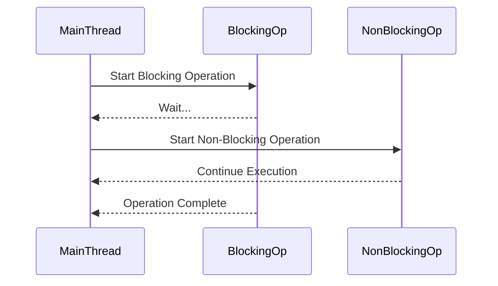

## 24.5. Blocking Operations in Asynchronous Code

In the realm of modern software development, asynchronous programming has become a cornerstone for building responsive and scalable applications. Clojure, with its rich set of concurrency primitives and libraries like `core.async`, provides powerful tools for managing asynchronous tasks. However, one of the common pitfalls developers encounter is the inadvertent use of blocking operations within asynchronous code. This section delves into the intricacies of blocking operations, their impact on asynchronous contexts, and strategies to mitigate their adverse effects.

### Understanding Blocking and Non-Blocking Operations

Before we dive into the specifics, let's clarify the concepts of blocking and non-blocking operations:

- **Blocking Operations**: These operations halt the execution of a program until a particular task is completed. Common examples include file I/O, network requests, and database queries. When a blocking operation is invoked, the thread executing it is paused, waiting for the operation to finish.

- **Non-Blocking Operations**: In contrast, non-blocking operations allow a program to continue executing other tasks while waiting for the completion of an operation. This is achieved through mechanisms like callbacks, promises, or asynchronous I/O, enabling the program to remain responsive.

### The Impact of Blocking Code in Asynchronous Contexts

In asynchronous programming, especially within Clojure's `core.async` library, blocking operations can severely degrade performance and responsiveness. Let's explore why this happens:

#### Core.Async and Go Blocks

Clojure's `core.async` library introduces the concept of **go blocks**, which are lightweight threads that allow for asynchronous operations. These blocks are designed to be non-blocking, enabling efficient concurrency without the overhead of traditional threads.

```clojure
(require '[clojure.core.async :refer [go <! >! chan]])

(defn async-operation []
  (let [c (chan)]
    (go
      (let [result (<! (some-async-function))]
        (>! c result)))
    c))
```

In the example above, the `go` block is used to perform an asynchronous operation. The `<!` operator is non-blocking, allowing the go block to yield control until the operation is complete.

#### Problems with Blocking Operations

When a blocking operation is introduced within a go block, it can lead to several issues:

1. **Thread Starvation**: Go blocks are executed on a limited number of threads. If a blocking operation occupies one of these threads, it can prevent other go blocks from executing, leading to thread starvation.

2. **Increased Latency**: Blocking operations increase the time it takes for a go block to complete, resulting in higher latency and reduced throughput.

3. **Resource Contention**: Blocking operations can cause resource contention, as they hold onto threads and other resources longer than necessary.

### Examples of Blocking Operations to Avoid

To maintain the performance benefits of asynchronous programming, it's crucial to identify and avoid common blocking operations:

- **File I/O**: Reading or writing files synchronously can block the execution of a go block. Use non-blocking I/O libraries or offload file operations to separate threads.

- **Network Requests**: Synchronous HTTP requests can block execution. Consider using asynchronous HTTP clients like `clj-http-async` or `http-kit`.

- **Database Queries**: Synchronous database operations can be a bottleneck. Use asynchronous database clients or execute queries in separate threads.

### Solutions for Avoiding Blocking Operations

To prevent blocking operations from hindering your asynchronous code, consider the following strategies:

#### Use Non-Blocking I/O Libraries

Leverage libraries that provide non-blocking I/O capabilities. For example, `http-kit` offers asynchronous HTTP requests:

```clojure
(require '[org.httpkit.client :as http])

(defn fetch-data []
  (http/get "http://example.com/api"
            {:timeout 2000}
            (fn [{:keys [status body]}]
              (println "Response:" status body))))
```

#### Offload to Separate Threads

For operations that must remain blocking, consider offloading them to separate threads using `future` or `thread`:

```clojure
(defn blocking-operation []
  (future
    ;; Perform blocking operation here
    (Thread/sleep 5000)
    (println "Blocking operation completed")))
```

#### Awareness of Execution Contexts

Understanding the execution context is crucial for managing blocking operations. Ensure that blocking tasks do not interfere with the main execution flow of your application.

### Visualizing Blocking vs. Non-Blocking Operations

To better understand the impact of blocking operations, let's visualize the difference between blocking and non-blocking execution using a sequence diagram:



In this diagram, the `MainThread` initiates both blocking and non-blocking operations. Notice how the non-blocking operation allows the main thread to continue execution, while the blocking operation halts progress until completion.

### Knowledge Check

To reinforce your understanding of blocking operations in asynchronous code, consider the following questions:

1. What is the primary difference between blocking and non-blocking operations?
2. How can blocking operations affect the performance of go blocks in Clojure?
3. Provide an example of a blocking operation that should be avoided in asynchronous code.
4. What strategies can be employed to mitigate the impact of blocking operations?

### Summary and Key Takeaways

- Blocking operations halt the execution of a program, while non-blocking operations allow for continued execution.
- In Clojure's asynchronous contexts, blocking operations can lead to thread starvation, increased latency, and resource contention.
- Avoid common blocking operations like file I/O, network requests, and database queries in go blocks.
- Use non-blocking I/O libraries and offload blocking tasks to separate threads to maintain performance.
- Awareness of execution contexts is crucial for managing blocking operations effectively.

### Embrace the Journey

Remember, mastering asynchronous programming in Clojure is a journey. As you continue to explore and experiment with these concepts, you'll gain a deeper understanding of how to build responsive and efficient applications. Keep experimenting, stay curious, and enjoy the journey!

## **Ready to Test Your Knowledge?**



### What is a blocking operation?

- [x] An operation that halts execution until completion
- [ ] An operation that allows execution to continue
- [ ] An operation that runs in parallel
- [ ] An operation that is always asynchronous

> **Explanation:** A blocking operation halts execution until it completes, preventing other tasks from running.

### How do blocking operations affect go blocks in Clojure?

- [x] They can lead to thread starvation
- [ ] They improve performance
- [ ] They have no impact
- [ ] They make code more readable

> **Explanation:** Blocking operations can occupy threads, leading to thread starvation and reduced performance.

### Which of the following is a blocking operation?

- [x] Synchronous file I/O
- [ ] Asynchronous HTTP request
- [ ] Non-blocking database query
- [ ] Using a callback function

> **Explanation:** Synchronous file I/O is a blocking operation that halts execution until the file operation is complete.

### What is a solution for handling blocking operations?

- [x] Offload to separate threads
- [ ] Use more go blocks
- [ ] Increase thread pool size
- [ ] Ignore them

> **Explanation:** Offloading blocking operations to separate threads can prevent them from affecting the main execution flow.

### What is the benefit of non-blocking I/O libraries?

- [x] They allow continued execution without waiting
- [ ] They make code more complex
- [ ] They are slower than blocking I/O
- [ ] They require more resources

> **Explanation:** Non-blocking I/O libraries enable continued execution without waiting for operations to complete, improving responsiveness.

### Which library can be used for non-blocking HTTP requests in Clojure?

- [x] http-kit
- [ ] clj-http
- [ ] core.async
- [ ] ring

> **Explanation:** `http-kit` provides non-blocking HTTP request capabilities in Clojure.

### What is a common pitfall of using blocking operations in asynchronous code?

- [x] Increased latency
- [ ] Reduced code readability
- [ ] Improved performance
- [ ] Easier debugging

> **Explanation:** Blocking operations can increase latency by halting execution until completion.

### How can you visualize the impact of blocking operations?

- [x] Using sequence diagrams
- [ ] Writing more code
- [ ] Adding more comments
- [ ] Using a debugger

> **Explanation:** Sequence diagrams can help visualize the impact of blocking operations on execution flow.

### What is the role of execution contexts in managing blocking operations?

- [x] Ensuring blocking tasks do not interfere with main execution flow
- [ ] Making code more readable
- [ ] Increasing thread pool size
- [ ] Simplifying code structure

> **Explanation:** Understanding execution contexts helps ensure that blocking tasks do not interfere with the main execution flow.

### True or False: Blocking operations are always detrimental to performance.

- [ ] True
- [x] False

> **Explanation:** While blocking operations can be detrimental in asynchronous contexts, they may be necessary and appropriate in certain scenarios.


