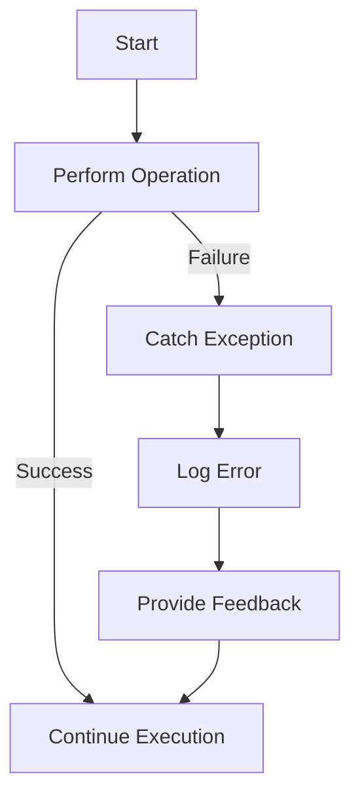

## 24.6. Poor Error Handling Practices

Error handling is a critical aspect of software development, and Clojure, with its functional programming paradigm, offers unique approaches to managing errors. However, developers often fall into common pitfalls that can lead to inadequate error handling. In this section, we will explore these pitfalls, provide examples of poor practices, and offer best practices for effective error handling in Clojure.

### Understanding Common Error Handling Mistakes

Error handling mistakes can lead to software that is difficult to debug, maintain, and extend. Let's discuss some of the most common mistakes developers make when handling errors in Clojure.

#### Swallowing Exceptions

One of the most prevalent mistakes is swallowing exceptions without any logging or handling. This can lead to silent failures, making it difficult to diagnose issues.

```clojure
(try
  (do-something-risky)
  (catch Exception e
    ;; Swallowing the exception without any action
    ))
```

In the example above, the exception is caught, but no action is taken. This can lead to situations where errors go unnoticed, causing unexpected behavior in the application.

#### Overcatching Exceptions

Another common mistake is overcatching exceptions, where a generic `Exception` is caught, potentially masking more specific exceptions that could provide valuable information.

```clojure
(try
  (do-something)
  (catch Exception e
    (println "An error occurred: " (.getMessage e))))
```

While this approach ensures that all exceptions are caught, it can obscure the root cause of the problem. It's often better to catch specific exceptions and handle them appropriately.

#### Empty `try` Blocks

Empty `try` blocks are another poor practice, as they provide no mechanism for handling errors.

```clojure
(try
  ;; Code that might throw an exception
  )
```

This pattern is ineffective and should be avoided. Always ensure that `try` blocks have corresponding `catch` or `finally` blocks to handle exceptions.

### The Importance of Meaningful Error Messages and Logging

Meaningful error messages and logging are crucial for diagnosing and resolving issues. When an error occurs, providing detailed information can help developers understand the context and cause of the problem.

#### Providing Detailed Error Messages

When catching exceptions, it's important to provide detailed error messages that include relevant context.

```clojure
(try
  (do-something-risky)
  (catch Exception e
    (println "Error in do-something-risky: " (.getMessage e))))
```

In this example, the error message includes the context of where the error occurred, making it easier to diagnose the issue.

#### Implementing Logging

Logging is an essential tool for monitoring and debugging applications. Use logging libraries to capture error information and provide insights into application behavior.

```clojure
(require '[clojure.tools.logging :as log])

(try
  (do-something-risky)
  (catch Exception e
    (log/error e "Error in do-something-risky")))
```

By using a logging library, you can capture stack traces and other relevant information, which can be invaluable for troubleshooting.

### Best Practices for Error Handling in Clojure

To avoid common pitfalls and improve error handling in Clojure, consider the following best practices.

#### Using `ex-info` for Custom Exceptions

Clojure provides the `ex-info` function to create custom exceptions with additional context. This can be useful for providing more detailed error information.

```clojure
(defn risky-operation []
  (if (some-condition)
    (throw (ex-info "Operation failed" {:reason "Invalid input"}))
    (do-something)))

(try
  (risky-operation)
  (catch Exception e
    (println "Caught exception:" (.getMessage e))
    (println "Exception data:" (ex-data e))))
```

In this example, `ex-info` is used to create an exception with additional data, which can be accessed using `ex-data`.

#### Thoughtful Design of Error Propagation Strategies

When designing error handling strategies, consider how errors should propagate through your application. Decide whether errors should be handled locally or propagated up the call stack.

```clojure
(defn process-data [data]
  (try
    (validate-data data)
    (process-valid-data data)
    (catch Exception e
      (throw (ex-info "Data processing failed" {:cause e})))))

(try
  (process-data some-data)
  (catch Exception e
    (println "Error processing data:" (.getMessage e))))
```

In this example, errors are propagated up the call stack using `throw`, allowing them to be handled at a higher level.

### Visualizing Error Handling Flow

To better understand the flow of error handling in Clojure, let's visualize the process using a flowchart.



**Figure 1**: Error Handling Flow in Clojure

This flowchart illustrates the typical flow of error handling, where an operation is performed, and in case of failure, an exception is caught, logged, and feedback is provided.

### Knowledge Check

Let's reinforce what we've learned with some questions and exercises.

1. Why is it important to avoid swallowing exceptions?
2. What are the benefits of using `ex-info` for custom exceptions?
3. How can logging improve error handling in Clojure applications?

### Try It Yourself

Experiment with the code examples provided in this section. Try modifying the examples to handle different types of exceptions or to include additional context in error messages. Consider implementing a logging strategy for your own applications.

### Summary

In this section, we've explored common error handling mistakes in Clojure and provided best practices for effective error management. By avoiding pitfalls such as swallowing exceptions and overcatching, and by implementing meaningful error messages and logging, you can improve the robustness and maintainability of your Clojure applications.

Remember, thoughtful error handling is an essential part of software development. As you continue to develop your skills in Clojure, keep these best practices in mind to create more reliable and resilient applications.

## **Ready to Test Your Knowledge?**



### Why is it important to avoid swallowing exceptions in Clojure?

- [x] It can lead to silent failures and make debugging difficult.
- [ ] It makes the code run faster.
- [ ] It is a recommended practice in functional programming.
- [ ] It improves code readability.

> **Explanation:** Swallowing exceptions can lead to silent failures, making it difficult to diagnose and fix issues in the application.

### What is the purpose of using `ex-info` in Clojure?

- [x] To create custom exceptions with additional context.
- [ ] To log errors automatically.
- [ ] To improve performance.
- [ ] To handle all exceptions generically.

> **Explanation:** `ex-info` is used to create custom exceptions with additional context, which can be helpful for debugging and error handling.

### How can logging improve error handling in Clojure applications?

- [x] By capturing error information and providing insights into application behavior.
- [ ] By making the application run faster.
- [ ] By reducing the number of exceptions thrown.
- [ ] By automatically fixing errors.

> **Explanation:** Logging captures error information and provides insights into application behavior, which can be invaluable for troubleshooting.

### What is a common mistake when catching exceptions?

- [x] Overcatching exceptions by catching generic `Exception`.
- [ ] Using `try` blocks.
- [ ] Logging errors.
- [ ] Providing detailed error messages.

> **Explanation:** Overcatching exceptions by catching generic `Exception` can mask more specific exceptions that provide valuable information.

### What should you include in error messages to make them meaningful?

- [x] Relevant context and details about the error.
- [ ] Only the error code.
- [ ] The name of the developer.
- [ ] The current date and time.

> **Explanation:** Including relevant context and details about the error makes error messages meaningful and helpful for diagnosing issues.

### What is the benefit of propagating errors up the call stack?

- [x] It allows errors to be handled at a higher level.
- [ ] It makes the code run faster.
- [ ] It reduces the number of exceptions thrown.
- [ ] It automatically fixes errors.

> **Explanation:** Propagating errors up the call stack allows them to be handled at a higher level, providing more flexibility in error management.

### How can you avoid overcatching exceptions?

- [x] By catching specific exceptions instead of generic `Exception`.
- [ ] By using empty `try` blocks.
- [ ] By swallowing exceptions.
- [ ] By logging all errors.

> **Explanation:** Catching specific exceptions instead of generic `Exception` helps avoid overcatching and provides more precise error handling.

### What is a poor practice when using `try` blocks?

- [x] Using empty `try` blocks without `catch` or `finally`.
- [ ] Logging errors.
- [ ] Providing detailed error messages.
- [ ] Using `ex-info` for custom exceptions.

> **Explanation:** Using empty `try` blocks without `catch` or `finally` is a poor practice as it provides no mechanism for handling errors.

### What is the role of `ex-data` in error handling?

- [x] To retrieve additional context from custom exceptions.
- [ ] To log errors automatically.
- [ ] To improve performance.
- [ ] To handle all exceptions generically.

> **Explanation:** `ex-data` is used to retrieve additional context from custom exceptions, which can be helpful for debugging and error handling.

### True or False: Logging is not necessary if exceptions are caught and handled.

- [ ] True
- [x] False

> **Explanation:** Logging is still necessary even if exceptions are caught and handled, as it provides valuable information for monitoring and debugging applications.



Remember, this is just the beginning. As you progress, you'll build more robust error handling strategies. Keep experimenting, stay curious, and enjoy the journey!
