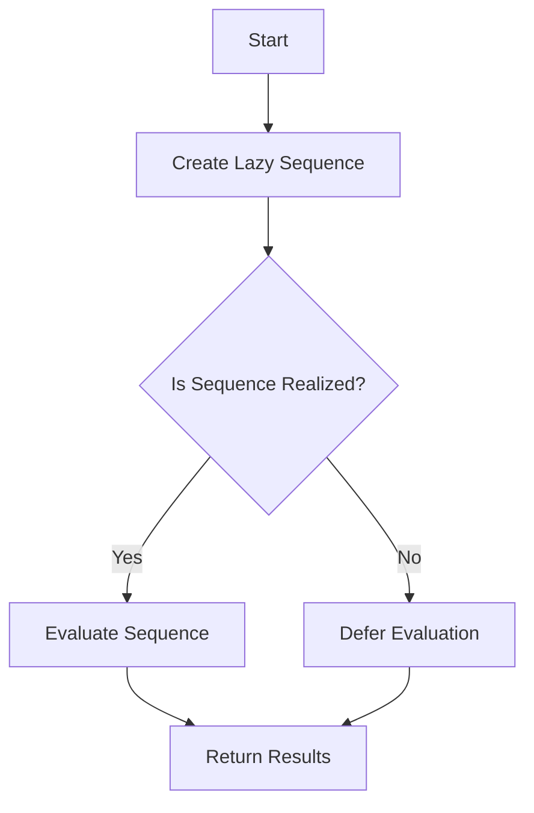

## 24.7. Ignoring Lazy Evaluation Consequences

Lazy evaluation is a powerful feature in Clojure that allows for efficient computation by deferring the evaluation of expressions until their results are needed. While this can lead to significant performance improvements, it can also introduce unintended consequences if not managed properly. In this section, we will explore how lazy evaluation works in Clojure, identify scenarios where ignoring laziness can lead to problems, and provide techniques to control laziness effectively.

### Understanding Lazy Evaluation in Clojure

Lazy evaluation, also known as call-by-need, is a strategy that delays the evaluation of an expression until its value is actually required. This can be particularly beneficial in scenarios where not all elements of a data structure are needed, allowing for potential savings in both time and memory.

In Clojure, lazy sequences are a common manifestation of lazy evaluation. Functions like `map`, `filter`, and `range` return lazy sequences, which are not evaluated until they are consumed.

#### Code Example: Lazy Sequence

```clojure
(defn lazy-numbers []
  (println "Generating numbers...")
  (range 1 10))

(def numbers (lazy-numbers))

;; At this point, "Generating numbers..." has not been printed
;; because the sequence has not been realized.

(println (take 3 numbers))
;; Output: Generating numbers...
;;         (1 2 3)
```

In this example, the `range` function returns a lazy sequence, and the message "Generating numbers..." is not printed until the sequence is realized by `take`.

### Potential Pitfalls of Ignoring Lazy Evaluation

While lazy evaluation can be advantageous, it can also lead to several unintended consequences if not handled carefully:

1. **Memory Consumption**: Holding onto the head of a lazy sequence can lead to increased memory usage, as the entire sequence may be retained in memory.

2. **Deferred Side Effects**: Side effects within lazy sequences may not occur when expected, leading to potential logical errors in the program.

3. **Performance Issues**: In some cases, laziness can introduce performance bottlenecks, especially if sequences are realized multiple times.

#### Scenario: Holding onto the Head of a Lazy Sequence

Consider a scenario where a large lazy sequence is generated, but the head of the sequence is retained, causing the entire sequence to be kept in memory.

```clojure
(defn large-sequence []
  (range 1 1000000))

(def seq-head (first (large-sequence)))

;; The entire sequence is retained in memory because `seq-head` holds onto the head.
```

### Techniques to Control Laziness

To manage the consequences of lazy evaluation, Clojure provides several functions and techniques:

1. **`doall`**: Forces the realization of a lazy sequence, ensuring that all elements are evaluated immediately.

2. **`dorun`**: Similar to `doall`, but discards the realized sequence, useful for sequences with side effects.

3. **Understanding When to Use Laziness**: Recognize scenarios where laziness is beneficial or detrimental, and choose the appropriate strategy accordingly.

#### Code Example: Using `doall` and `dorun`

```clojure
(defn print-numbers []
  (map #(do (println %) %) (range 1 5)))

;; Using `doall` to realize the sequence and print numbers
(doall (print-numbers))
;; Output: 1 2 3 4

;; Using `dorun` to realize the sequence without retaining it
(dorun (print-numbers))
;; Output: 1 2 3 4
```

### Visualizing Lazy Evaluation

To better understand how lazy evaluation works, let's visualize the process using a flowchart.



**Figure 1**: Flowchart illustrating the lazy evaluation process in Clojure.

### Best Practices for Managing Lazy Evaluation

- **Be Mindful of Sequence Realization**: Always be aware of when and how a lazy sequence is realized to avoid unintended memory usage.
- **Use `doall` and `dorun` Judiciously**: Apply these functions when you need to force evaluation or handle side effects.
- **Profile and Optimize**: Use profiling tools to identify performance bottlenecks related to lazy evaluation and optimize accordingly.
- **Educate and Document**: Ensure that team members understand the implications of lazy evaluation and document any potential pitfalls in the codebase.

### Conclusion

Lazy evaluation is a double-edged sword in Clojure, offering both performance benefits and potential pitfalls. By understanding how lazy evaluation works and employing strategies to manage its consequences, developers can harness its power while avoiding common pitfalls. Remember, the key to mastering lazy evaluation is to remain vigilant and proactive in managing its effects.

### Ready to Test Your Knowledge?



### What is lazy evaluation?

- [x] A strategy that delays the evaluation of an expression until its value is needed.
- [ ] A method to evaluate expressions immediately.
- [ ] A technique to optimize memory usage by evaluating all expressions at once.
- [ ] A way to execute expressions in parallel.

> **Explanation:** Lazy evaluation defers the computation of expressions until their results are required, which can save time and resources.

### What function can you use to force the realization of a lazy sequence in Clojure?

- [x] `doall`
- [ ] `map`
- [ ] `filter`
- [ ] `reduce`

> **Explanation:** `doall` forces the realization of a lazy sequence, ensuring all elements are evaluated immediately.

### What is a potential consequence of holding onto the head of a lazy sequence?

- [x] Increased memory consumption.
- [ ] Improved performance.
- [ ] Immediate evaluation of the sequence.
- [ ] Reduced memory usage.

> **Explanation:** Holding onto the head of a lazy sequence can cause the entire sequence to be retained in memory, leading to increased memory usage.

### Which function discards the realized sequence after forcing its evaluation?

- [x] `dorun`
- [ ] `doall`
- [ ] `map`
- [ ] `filter`

> **Explanation:** `dorun` forces the realization of a lazy sequence but discards the results, which is useful for sequences with side effects.

### What is a common pitfall of lazy evaluation related to side effects?

- [x] Deferred side effects may not occur when expected.
- [ ] Side effects are always executed immediately.
- [ ] Side effects are eliminated entirely.
- [ ] Side effects are duplicated.

> **Explanation:** Lazy evaluation can defer side effects, causing them to occur later than expected, which may lead to logical errors.

### How can you visualize the process of lazy evaluation?

- [x] Using a flowchart to illustrate the sequence of events.
- [ ] By writing more code examples.
- [ ] By using a debugger.
- [ ] By reading documentation.

> **Explanation:** A flowchart can effectively illustrate the process of lazy evaluation, showing how sequences are created and realized.

### What should you do to manage lazy evaluation effectively?

- [x] Be mindful of sequence realization and use `doall` or `dorun` judiciously.
- [ ] Avoid using lazy sequences altogether.
- [ ] Always force evaluation immediately.
- [ ] Ignore memory usage concerns.

> **Explanation:** Managing lazy evaluation involves being aware of when sequences are realized and using functions like `doall` or `dorun` to control evaluation.

### What is the benefit of lazy evaluation?

- [x] It can save time and resources by deferring computation.
- [ ] It always improves performance.
- [ ] It eliminates the need for memory management.
- [ ] It simplifies code logic.

> **Explanation:** Lazy evaluation can save time and resources by deferring computation until results are needed, which can be beneficial in many scenarios.

### What is the role of `doall` in lazy evaluation?

- [x] It forces the realization of a lazy sequence.
- [ ] It creates a lazy sequence.
- [ ] It discards a lazy sequence.
- [ ] It optimizes a lazy sequence.

> **Explanation:** `doall` forces the realization of a lazy sequence, ensuring all elements are evaluated immediately.

### True or False: Lazy evaluation always leads to better performance.

- [ ] True
- [x] False

> **Explanation:** While lazy evaluation can improve performance by deferring computation, it can also introduce performance bottlenecks if not managed properly.



Remember, mastering lazy evaluation in Clojure is a journey. As you continue to explore and experiment, you'll gain a deeper understanding of its benefits and challenges. Keep learning, stay curious, and enjoy the process!
