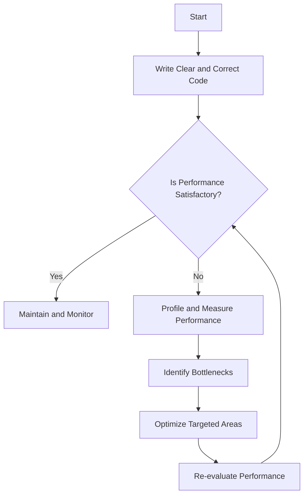

## 24.8. Premature Optimization

Premature optimization is a common pitfall in software development, often leading to complex, unreadable, and unmaintainable code. In this section, we will explore the concept of premature optimization, its pitfalls, and how to avoid it in Clojure development. We will also provide strategies for writing clear and correct code before focusing on optimization, and discuss the importance of profiling and measuring performance.

### Understanding Premature Optimization

**Premature optimization** refers to the practice of trying to improve the performance of a program before it is necessary or before understanding the actual performance bottlenecks. This often results in code that is difficult to read, maintain, and extend. The famous computer scientist Donald Knuth once said, "Premature optimization is the root of all evil," highlighting the potential negative impact of optimizing too early in the development process.

#### Pitfalls of Premature Optimization

1. **Complexity and Obscurity**: Optimized code can become complex and obscure, making it difficult for other developers (or even the original author) to understand and modify. This complexity can lead to bugs and make the codebase harder to maintain.

2. **Misplaced Efforts**: Developers may spend time optimizing parts of the code that do not significantly impact overall performance. Without proper profiling, it's easy to focus on the wrong areas.

3. **Reduced Flexibility**: Optimized code is often less flexible and harder to adapt to changing requirements. This can hinder future development and innovation.

4. **Neglecting Correctness**: Focusing on optimization too early can lead to neglecting the correctness and functionality of the code. It's crucial to ensure that the code works correctly before attempting to optimize it.

### The Importance of Code Readability and Maintainability

Before diving into optimization, it's essential to prioritize code readability and maintainability. Clear and maintainable code is easier to understand, debug, and extend. Here are some best practices to achieve this:

- **Write Self-Documenting Code**: Use meaningful variable names, consistent formatting, and clear comments to make the code self-explanatory.

- **Follow Clojure Conventions**: Adhere to Clojure's idiomatic practices, such as using immutable data structures and functional programming paradigms.

- **Refactor Regularly**: Continuously refactor the code to improve its structure and readability. This includes breaking down large functions into smaller, more manageable ones.

- **Use Descriptive Comments**: While self-documenting code is ideal, comments can provide additional context and explanations for complex logic.

### Examples of Misplaced Optimization Efforts

Let's explore some examples where optimization efforts are misplaced, leading to unnecessary complexity:

#### Example 1: Over-Optimizing a Simple Function

Consider a simple function that calculates the sum of a list of numbers:

```clojure
(defn sum [numbers]
  (reduce + numbers))
```

A premature optimization attempt might involve using a more complex algorithm to improve performance, even though the original function is already efficient for most use cases.

#### Example 2: Optimizing for Rare Edge Cases

Suppose you have a function that processes a list of strings and removes duplicates:

```clojure
(defn remove-duplicates [strings]
  (distinct strings))
```

Optimizing this function for rare edge cases, such as extremely large lists, might lead to unnecessary complexity. Instead, focus on the common use cases and ensure the function is correct and readable.

### Strategies for Avoiding Premature Optimization

To avoid the pitfalls of premature optimization, consider the following strategies:

1. **Focus on Correctness First**: Ensure that the code is correct and meets the requirements before considering optimization. This includes writing tests to verify the functionality.

2. **Profile and Measure Performance**: Use profiling tools to identify actual performance bottlenecks. This data-driven approach ensures that optimization efforts are focused on the right areas.

3. **Optimize Only When Necessary**: Only optimize code when there is a clear performance issue that affects the user experience or system requirements. Avoid optimizing code that is already performant enough.

4. **Keep It Simple**: Strive for simplicity in your code. Simple code is easier to understand, test, and optimize when necessary.

5. **Iterate and Improve**: Adopt an iterative approach to development, where you continuously improve the codebase. This allows you to address performance issues as they arise, rather than trying to predict them in advance.

### Profiling and Measuring Performance

Profiling is a critical step in identifying performance bottlenecks and ensuring that optimization efforts are well-placed. Here are some tools and techniques for profiling Clojure applications:

- **Criterium**: A benchmarking library for Clojure that provides accurate and reliable performance measurements. Use Criterium to benchmark specific functions and identify slow areas.

- **VisualVM**: A monitoring and performance profiling tool for Java applications, including Clojure. VisualVM provides insights into CPU usage, memory consumption, and thread activity.

- **YourKit**: A commercial profiling tool that offers advanced features for analyzing performance and memory usage in Clojure applications.

- **Logging and Metrics**: Implement logging and metrics to monitor the performance of your application in production. This data can help identify performance issues and guide optimization efforts.

### Code Examples and Exercises

Let's explore some code examples and exercises to reinforce the concepts discussed:

#### Code Example: Profiling a Function with Criterium

```clojure
(require '[criterium.core :refer [quick-bench]])

(defn slow-function [n]
  (reduce + (range n)))

;; Profile the function
(quick-bench (slow-function 1000000))
```

In this example, we use Criterium to profile a function that calculates the sum of a range of numbers. Experiment with different input sizes and observe the performance impact.

#### Exercise: Refactor for Readability

Given the following code, refactor it to improve readability and maintainability:

```clojure
(defn process-data [data]
  (let [filtered (filter #(> (count %) 3) data)
        transformed (map clojure.string/upper-case filtered)]
    (reduce str transformed)))
```

Consider breaking down the function into smaller, more descriptive functions and adding comments to explain the logic.

### Visualizing the Impact of Premature Optimization

To better understand the impact of premature optimization, let's visualize the process of identifying and addressing performance bottlenecks:



**Diagram Description**: This flowchart illustrates the process of writing clear and correct code, evaluating performance, and optimizing only when necessary. It emphasizes the importance of profiling and measuring performance before making optimization decisions.

### Key Takeaways

- Premature optimization can lead to complex, unreadable, and unmaintainable code.
- Prioritize code readability and maintainability before focusing on optimization.
- Use profiling tools to identify actual performance bottlenecks.
- Optimize only when necessary and focus on targeted areas.
- Continuously monitor and improve the codebase to address performance issues as they arise.

### Embrace the Journey

Remember, the journey to mastering Clojure and avoiding premature optimization is ongoing. As you continue to develop your skills, focus on writing clear, correct code and use data-driven approaches to guide your optimization efforts. Keep experimenting, stay curious, and enjoy the process of learning and improving your craft.

## **Ready to Test Your Knowledge?**



### What is premature optimization?

- [x] Optimizing code before understanding actual performance bottlenecks
- [ ] Optimizing code after thorough profiling
- [ ] Writing code without any optimization
- [ ] Focusing on code readability over performance

> **Explanation:** Premature optimization refers to optimizing code before understanding the actual performance bottlenecks, often leading to unnecessary complexity.

### Why is premature optimization considered a pitfall?

- [x] It can lead to complex and unreadable code
- [ ] It always improves performance
- [ ] It simplifies code structure
- [ ] It ensures code correctness

> **Explanation:** Premature optimization can lead to complex and unreadable code, making it difficult to maintain and extend.

### What should be prioritized before optimization?

- [x] Code readability and maintainability
- [ ] Code obfuscation
- [ ] Performance tuning
- [ ] Adding more features

> **Explanation:** Prioritizing code readability and maintainability ensures that the code is clear and correct before focusing on optimization.

### Which tool is used for profiling Clojure functions?

- [x] Criterium
- [ ] JUnit
- [ ] Selenium
- [ ] Git

> **Explanation:** Criterium is a benchmarking library for Clojure that provides accurate performance measurements.

### What is the first step in avoiding premature optimization?

- [x] Focus on correctness first
- [ ] Optimize all code immediately
- [ ] Ignore performance issues
- [ ] Use complex algorithms

> **Explanation:** Ensuring code correctness is the first step in avoiding premature optimization, as it ensures the code meets requirements.

### When should optimization be considered?

- [x] When there is a clear performance issue
- [ ] At the start of development
- [ ] After every code change
- [ ] Never

> **Explanation:** Optimization should be considered when there is a clear performance issue affecting user experience or system requirements.

### What is the benefit of simple code?

- [x] Easier to understand and optimize
- [ ] Always faster
- [ ] Requires more comments
- [ ] Less flexible

> **Explanation:** Simple code is easier to understand, test, and optimize when necessary.

### What is the role of profiling in optimization?

- [x] Identifying actual performance bottlenecks
- [ ] Making code more complex
- [ ] Removing all comments
- [ ] Adding more features

> **Explanation:** Profiling helps identify actual performance bottlenecks, ensuring optimization efforts are focused on the right areas.

### What is a common mistake in premature optimization?

- [x] Optimizing for rare edge cases
- [ ] Writing clear code
- [ ] Using profiling tools
- [ ] Following best practices

> **Explanation:** Optimizing for rare edge cases can lead to unnecessary complexity and misplaced efforts.

### True or False: Premature optimization should be avoided in Clojure development.

- [x] True
- [ ] False

> **Explanation:** Premature optimization should be avoided as it can lead to complex, unreadable, and unmaintainable code.


