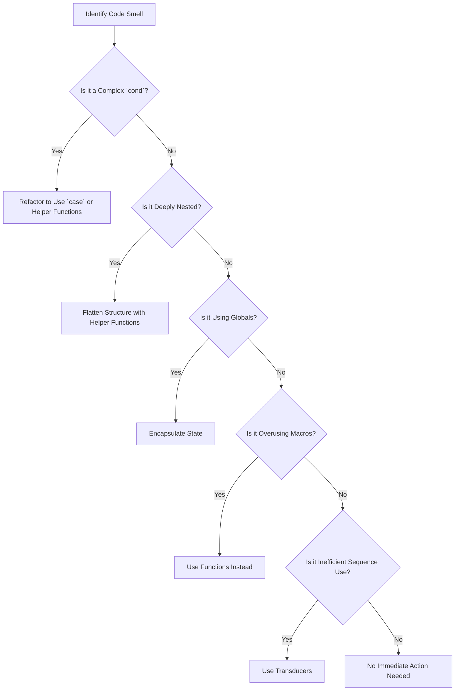

## 24.9. Code Smells in Clojure

### Introduction

In software development, **code smells** are indicators of potential problems in the codebase. They are not bugs or errors but rather symptoms that suggest the presence of deeper issues. Identifying and addressing code smells is crucial for maintaining code quality, readability, and maintainability. In Clojure, a functional programming language known for its simplicity and expressiveness, certain code smells can emerge, particularly when developers are not fully accustomed to its paradigms.

This section will explore common code smells specific to Clojure, provide examples to illustrate each, and offer refactoring suggestions to eliminate these smells. By understanding and addressing these issues, developers can write cleaner, more efficient, and more maintainable Clojure code.

### What Are Code Smells?

Code smells are characteristics of code that may indicate deeper problems. They are often subjective and context-dependent, but they generally point to areas of the code that could be improved. Common characteristics of code smells include:

- **Complexity**: Code that is difficult to understand or modify.
- **Duplication**: Repeated code that could be consolidated.
- **Poor Naming**: Variables or functions with unclear or misleading names.
- **Inconsistency**: Lack of uniformity in coding style or conventions.

In Clojure, code smells can manifest in unique ways due to its functional nature and emphasis on immutability and simplicity.

### Common Clojure Code Smells

#### 1. Overly Complex `cond` Expressions

**Description**: The `cond` expression is a powerful tool in Clojure for handling multiple conditional branches. However, when overused or misused, it can lead to complex and hard-to-read code.

**Example**:

```clojure
(defn process-data [data]
  (cond
    (nil? data) "No data provided"
    (empty? data) "Data is empty"
    (contains? data :error) "Data contains an error"
    (contains? data :success) "Data processed successfully"
    :else "Unknown data state"))
```

**Refactoring Suggestion**: Use `case` or `condp` for simpler conditions, or break down complex logic into smaller functions.

```clojure
(defn process-data [data]
  (cond
    (nil? data) "No data provided"
    (empty? data) "Data is empty"
    :else (process-non-empty-data data)))

(defn process-non-empty-data [data]
  (cond
    (contains? data :error) "Data contains an error"
    (contains? data :success) "Data processed successfully"
    :else "Unknown data state"))
```

#### 2. Deeply Nested Forms

**Description**: Deep nesting of forms can make code difficult to read and understand. This often occurs when multiple functions are composed or when there are many levels of conditional logic.

**Example**:

```clojure
(defn calculate [x]
  (if (pos? x)
    (if (even? x)
      (let [y (* x 2)]
        (if (> y 10)
          (str "Large even number: " y)
          (str "Small even number: " y)))
      (str "Odd number: " x))
    "Negative number"))
```

**Refactoring Suggestion**: Use helper functions to flatten the structure and improve readability.

```clojure
(defn calculate [x]
  (cond
    (neg? x) "Negative number"
    (even? x) (process-even x)
    :else (str "Odd number: " x)))

(defn process-even [x]
  (let [y (* x 2)]
    (if (> y 10)
      (str "Large even number: " y)
      (str "Small even number: " y))))
```

#### 3. Extensive Use of Globals

**Description**: Relying heavily on global variables or state can lead to code that is difficult to test and maintain. In Clojure, this often manifests as excessive use of `def` for mutable state.

**Example**:

```clojure
(def global-counter (atom 0))

(defn increment-counter []
  (swap! global-counter inc))
```

**Refactoring Suggestion**: Encapsulate state within functions or use local bindings to manage state more effectively.

```clojure
(defn create-counter []
  (let [counter (atom 0)]
    (fn [] (swap! counter inc))))

(def increment-counter (create-counter))
```

#### 4. Overuse of Macros

**Description**: Macros are a powerful feature in Clojure, allowing developers to extend the language. However, overusing macros can lead to code that is difficult to understand and maintain.

**Example**:

```clojure
(defmacro with-logging [expr]
  `(do
     (println "Executing:" '~expr)
     ~expr))

(with-logging (+ 1 2))
```

**Refactoring Suggestion**: Use functions instead of macros when possible, and reserve macros for cases where they provide significant benefits.

```clojure
(defn with-logging [expr]
  (println "Executing:" expr)
  expr)

(with-logging (+ 1 2))
```

#### 5. Inefficient Use of Sequences

**Description**: Inefficient sequence operations can lead to performance issues, especially when dealing with large datasets.

**Example**:

```clojure
(defn process-sequence [coll]
  (map inc (filter even? coll)))
```

**Refactoring Suggestion**: Use transducers for more efficient sequence processing.

```clojure
(defn process-sequence [coll]
  (sequence (comp (filter even?) (map inc)) coll))
```

### Encouraging Regular Code Reviews and Refactoring

To maintain high code quality and prevent code smells from accumulating, it's essential to incorporate regular code reviews and refactoring sessions into your development process. Here are some best practices:

- **Conduct Code Reviews**: Regularly review code with peers to identify potential code smells and discuss possible improvements.
- **Schedule Refactoring Sessions**: Allocate time for refactoring to address code smells and improve code structure.
- **Adopt Coding Standards**: Establish and adhere to coding standards to ensure consistency across the codebase.
- **Use Static Analysis Tools**: Leverage tools like Eastwood and Kibit to automatically detect code smells and suggest improvements.

### Conclusion

Code smells in Clojure, like in any programming language, are indicators of potential issues that can affect code quality and maintainability. By identifying and addressing these smells, developers can write cleaner, more efficient, and more maintainable code. Regular code reviews, refactoring sessions, and adherence to coding standards are essential practices for maintaining a healthy codebase.

### Visualizing Code Smells

To better understand how code smells can affect your codebase, let's visualize the process of identifying and refactoring code smells using a flowchart.



### Knowledge Check

## **Ready to Test Your Knowledge?**



### What is a code smell?

- [x] An indicator of potential problems in the codebase
- [ ] A syntax error in the code
- [ ] A runtime exception
- [ ] A feature of the programming language

> **Explanation:** Code smells are characteristics of code that suggest deeper issues, not errors or exceptions.

### Which of the following is a common Clojure code smell?

- [x] Overly complex `cond` expressions
- [ ] Proper use of `let` bindings
- [ ] Efficient use of transducers
- [ ] Clear and concise function names

> **Explanation:** Overly complex `cond` expressions can make code difficult to read and maintain.

### How can you refactor deeply nested forms in Clojure?

- [x] Use helper functions to flatten the structure
- [ ] Add more nesting to clarify logic
- [ ] Use global variables to manage state
- [ ] Convert to a single `cond` expression

> **Explanation:** Helper functions can simplify and flatten deeply nested structures, improving readability.

### What is a downside of extensive use of globals in Clojure?

- [x] It can make code difficult to test and maintain
- [ ] It improves code readability
- [ ] It enhances performance
- [ ] It simplifies state management

> **Explanation:** Extensive use of globals can lead to code that is hard to test and maintain due to shared state.

### How can you improve the efficiency of sequence processing in Clojure?

- [x] Use transducers
- [ ] Use more `map` and `filter` functions
- [ ] Avoid using sequences altogether
- [ ] Use global variables

> **Explanation:** Transducers provide a more efficient way to process sequences by eliminating intermediate collections.

### What is a potential issue with overusing macros in Clojure?

- [x] It can lead to code that is difficult to understand and maintain
- [ ] It simplifies code readability
- [ ] It enhances performance
- [ ] It reduces code complexity

> **Explanation:** Overusing macros can make code harder to understand and maintain due to their complexity.

### Which tool can help automatically detect code smells in Clojure?

- [x] Eastwood
- [ ] Leiningen
- [ ] ClojureScript
- [ ] Ring

> **Explanation:** Eastwood is a static analysis tool that can help detect code smells in Clojure.

### What is the benefit of regular code reviews?

- [x] They help identify potential code smells and improvements
- [ ] They slow down the development process
- [ ] They eliminate the need for refactoring
- [ ] They increase the number of bugs

> **Explanation:** Regular code reviews help identify code smells and discuss improvements with peers.

### What is the purpose of refactoring sessions?

- [x] To address code smells and improve code structure
- [ ] To introduce new features
- [ ] To increase code complexity
- [ ] To write more tests

> **Explanation:** Refactoring sessions focus on addressing code smells and improving the overall structure of the code.

### True or False: Code smells are always syntax errors.

- [ ] True
- [x] False

> **Explanation:** Code smells are not syntax errors; they are indicators of potential issues that suggest areas for improvement.



Remember, identifying and addressing code smells is an ongoing process. By regularly reviewing and refactoring your code, you can maintain a clean and efficient codebase. Keep experimenting, stay curious, and enjoy the journey of mastering Clojure!
