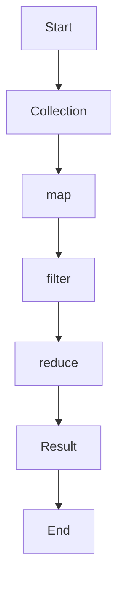

## 25.10. Quick Reference for Clojure Core Functions

Unlock the power of Clojure with this quick reference guide to its core functions. Whether you're manipulating collections, processing strings, or managing concurrency, this guide provides concise explanations and practical examples to enhance your Clojure programming skills.

### Introduction

Clojure, a modern Lisp dialect, offers a rich set of core functions that facilitate functional programming. These functions are designed to work seamlessly with Clojure's immutable data structures, enabling developers to write concise, expressive, and efficient code. In this guide, we will explore essential Clojure core functions across various categories, providing you with a handy reference for your development needs.

### Collection Manipulation

Clojure's collection manipulation functions are central to its functional programming paradigm. They allow you to transform, filter, and aggregate data with ease.

#### `map`

**Description**: Applies a function to each element of a collection, returning a new lazy sequence.

```clojure
;; Example: Increment each number in a list by 1
(map inc [1 2 3 4])
;; => (2 3 4 5)
```

#### `filter`

**Description**: Returns a lazy sequence of elements that satisfy a predicate function.

```clojure
;; Example: Filter even numbers from a list
(filter even? [1 2 3 4 5 6])
;; => (2 4 6)
```

#### `reduce`

**Description**: Reduces a collection to a single value using a binary function.

```clojure
;; Example: Sum all numbers in a list
(reduce + [1 2 3 4 5])
;; => 15
```

#### `conj`

**Description**: Adds an element to a collection, returning a new collection.

```clojure
;; Example: Add an element to a vector
(conj [1 2 3] 4)
;; => [1 2 3 4]
```

#### `assoc`

**Description**: Associates a key with a value in a map, returning a new map.

```clojure
;; Example: Add a key-value pair to a map
(assoc {:a 1 :b 2} :c 3)
;; => {:a 1, :b 2, :c 3}
```

#### `dissoc`

**Description**: Removes a key from a map, returning a new map.

```clojure
;; Example: Remove a key from a map
(dissoc {:a 1 :b 2 :c 3} :b)
;; => {:a 1, :c 3}
```

#### `get`

**Description**: Retrieves the value associated with a key in a map.

```clojure
;; Example: Get the value for a key in a map
(get {:a 1 :b 2 :c 3} :b)
;; => 2
```

#### `merge`

**Description**: Merges multiple maps into a single map.

```clojure
;; Example: Merge two maps
(merge {:a 1 :b 2} {:b 3 :c 4})
;; => {:a 1, :b 3, :c 4}
```

### String Processing

Clojure provides a set of functions for efficient string manipulation, allowing you to handle text data seamlessly.

#### `str`

**Description**: Concatenates its arguments into a string.

```clojure
;; Example: Concatenate strings
(str "Hello, " "world!")
;; => "Hello, world!"
```

#### `subs`

**Description**: Returns a substring of a given string.

```clojure
;; Example: Extract a substring
(subs "Clojure" 0 3)
;; => "Clo"
```

#### `clojure.string/split`

**Description**: Splits a string into a sequence of substrings based on a regular expression.

```clojure
(require '[clojure.string :as str])

;; Example: Split a string by spaces
(str/split "Clojure is fun" #"\s")
;; => ["Clojure" "is" "fun"]
```

#### `clojure.string/join`

**Description**: Joins a sequence of strings into a single string with a separator.

```clojure
;; Example: Join strings with a separator
(str/join ", " ["Clojure" "is" "fun"])
;; => "Clojure, is, fun"
```

#### `clojure.string/replace`

**Description**: Replaces all instances of a substring with another string.

```clojure
;; Example: Replace a substring
(str/replace "Clojure is fun" "fun" "awesome")
;; => "Clojure is awesome"
```

### Concurrency and State Management

Clojure's concurrency model is built around immutable data structures and provides powerful primitives for managing state.

#### `atom`

**Description**: Creates a mutable reference to an immutable value, allowing for safe state changes.

```clojure
;; Example: Create and update an atom
(def counter (atom 0))
(swap! counter inc)
;; => 1
```

#### `ref`

**Description**: Provides coordinated, synchronous access to shared state using Software Transactional Memory (STM).

```clojure
;; Example: Create and update a ref
(def balance (ref 100))
(dosync (alter balance + 50))
;; => 150
```

#### `agent`

**Description**: Manages asynchronous state changes, allowing for independent updates.

```clojure
;; Example: Create and update an agent
(def counter (agent 0))
(send counter inc)
;; => 1
```

#### `future`

**Description**: Executes a task asynchronously, returning a future object representing the result.

```clojure
;; Example: Create a future
(def result (future (+ 1 2 3)))
@result
;; => 6
```

#### `promise`

**Description**: Represents a value that will be delivered in the future, allowing for synchronization.

```clojure
;; Example: Create and deliver a promise
(def p (promise))
(deliver p 42)
@p
;; => 42
```

### Data Structures

Clojure's core data structures are immutable and persistent, providing efficient operations for functional programming.

#### `vector`

**Description**: An indexed, immutable collection that supports efficient random access.

```clojure
;; Example: Create a vector
(def v [1 2 3 4])
(nth v 2)
;; => 3
```

#### `list`

**Description**: A sequential, immutable collection optimized for adding elements to the front.

```clojure
;; Example: Create a list
(def lst '(1 2 3 4))
(first lst)
;; => 1
```

#### `map`

**Description**: An associative, immutable collection of key-value pairs.

```clojure
;; Example: Create a map
(def m {:a 1 :b 2 :c 3})
(get m :b)
;; => 2
```

#### `set`

**Description**: An unordered, immutable collection of unique elements.

```clojure
;; Example: Create a set
(def s #{1 2 3 4})
(contains? s 3)
;; => true
```

### Functional Programming Techniques

Clojure's core functions support functional programming techniques, enabling you to write expressive and concise code.

#### `partial`

**Description**: Creates a new function by partially applying arguments to an existing function.

```clojure
;; Example: Create a partially applied function
(def add5 (partial + 5))
(add5 10)
;; => 15
```

#### `comp`

**Description**: Composes multiple functions into a single function.

```clojure
;; Example: Compose functions
(def add1-and-double (comp #(* 2 %) inc))
(add1-and-double 3)
;; => 8
```

#### `apply`

**Description**: Applies a function to a sequence of arguments.

```clojure
;; Example: Apply a function to a list of arguments
(apply + [1 2 3 4])
;; => 10
```

#### `fn`

**Description**: Creates an anonymous function.

```clojure
;; Example: Create an anonymous function
((fn [x] (* x x)) 5)
;; => 25
```

### Error Handling

Clojure provides mechanisms for handling errors and exceptions in a functional style.

#### `try`, `catch`, `finally`

**Description**: Provides a way to handle exceptions and ensure cleanup.

```clojure
;; Example: Handle exceptions
(try
  (/ 1 0)
  (catch ArithmeticException e
    (println "Cannot divide by zero"))
  (finally
    (println "Cleanup")))
;; => "Cannot divide by zero"
;; => "Cleanup"
```

### Interoperability with Java

Clojure's seamless interoperability with Java allows you to leverage existing Java libraries and frameworks.

#### `import`

**Description**: Imports Java classes for use in Clojure code.

```clojure
;; Example: Import a Java class
(import 'java.util.Date)
(Date.)
;; => #inst "2024-11-25T00:00:00.000-00:00"
```

#### `new`

**Description**: Creates a new instance of a Java class.

```clojure
;; Example: Create a new Java object
(new java.util.Date)
;; => #inst "2024-11-25T00:00:00.000-00:00"
```

#### `.` (dot operator)

**Description**: Calls methods on Java objects.

```clojure
;; Example: Call a method on a Java object
(.toString (new java.util.Date))
;; => "Mon Nov 25 00:00:00 UTC 2024"
```

### Try It Yourself

Experiment with the code examples provided in this guide. Try modifying the arguments, combining functions, or creating new functions to deepen your understanding of Clojure's core functions.

### Visualizing Clojure's Core Function Workflow

Below is a diagram illustrating the workflow of using Clojure's core functions for collection manipulation:



**Diagram Description**: This flowchart represents the typical process of transforming a collection using Clojure's core functions: starting with a collection, applying `map` to transform elements, using `filter` to select elements, reducing the collection to a single value, and obtaining the final result.

### References and Links

- [Clojure Official Documentation](https://clojure.org/reference)
- [Clojure Cheat Sheet](https://clojure.org/api/cheatsheet)
- [Clojure String Library](https://clojure.github.io/clojure/clojure.string-api.html)

### Knowledge Check

To reinforce your understanding of Clojure's core functions, try answering the following questions and challenges.

## **Ready to Test Your Knowledge?**



### Which function is used to apply a function to each element of a collection?

- [x] map
- [ ] filter
- [ ] reduce
- [ ] conj

> **Explanation:** The `map` function applies a given function to each element of a collection, returning a new sequence.

### What does the `filter` function return?

- [x] A lazy sequence of elements that satisfy a predicate
- [ ] A single value
- [ ] An updated collection
- [ ] A new map

> **Explanation:** The `filter` function returns a lazy sequence of elements that satisfy the given predicate function.

### How do you add an element to a vector in Clojure?

- [x] conj
- [ ] assoc
- [ ] dissoc
- [ ] merge

> **Explanation:** The `conj` function adds an element to a collection, such as a vector, returning a new collection.

### Which function is used to create an anonymous function in Clojure?

- [x] fn
- [ ] def
- [ ] let
- [ ] apply

> **Explanation:** The `fn` function is used to create anonymous functions in Clojure.

### What is the purpose of the `reduce` function?

- [x] To reduce a collection to a single value using a binary function
- [ ] To filter elements from a collection
- [ ] To map a function over a collection
- [ ] To join strings

> **Explanation:** The `reduce` function reduces a collection to a single value by applying a binary function.

### Which function is used to handle exceptions in Clojure?

- [x] try
- [ ] catch
- [ ] finally
- [ ] throw

> **Explanation:** The `try` function is used to handle exceptions, often in conjunction with `catch` and `finally`.

### How do you create a new instance of a Java class in Clojure?

- [x] new
- [ ] import
- [ ] def
- [ ] let

> **Explanation:** The `new` function is used to create a new instance of a Java class in Clojure.

### What does the `assoc` function do?

- [x] Associates a key with a value in a map
- [ ] Removes a key from a map
- [ ] Adds an element to a vector
- [ ] Merges two maps

> **Explanation:** The `assoc` function associates a key with a value in a map, returning a new map.

### Which function is used to split a string into a sequence of substrings?

- [x] clojure.string/split
- [ ] clojure.string/join
- [ ] clojure.string/replace
- [ ] str

> **Explanation:** The `clojure.string/split` function splits a string into a sequence of substrings based on a regular expression.

### True or False: Clojure's core functions are designed to work with mutable data structures.

- [ ] True
- [x] False

> **Explanation:** Clojure's core functions are designed to work with immutable data structures, which is a key aspect of its functional programming paradigm.



Remember, this is just the beginning. As you progress, you'll discover more advanced techniques and patterns in Clojure. Keep experimenting, stay curious, and enjoy the journey!
