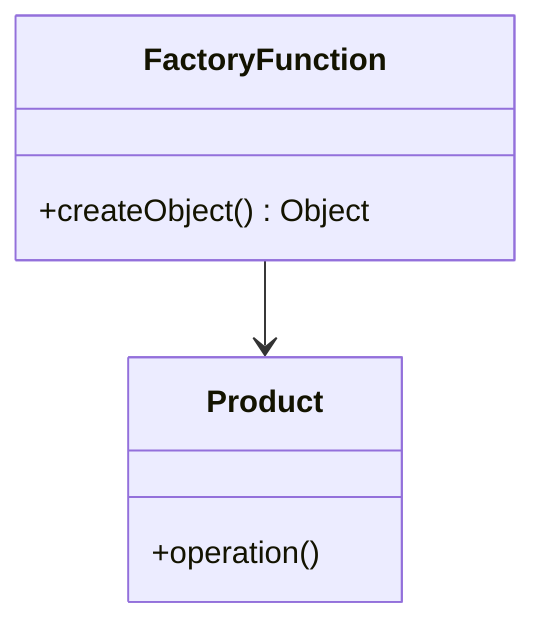
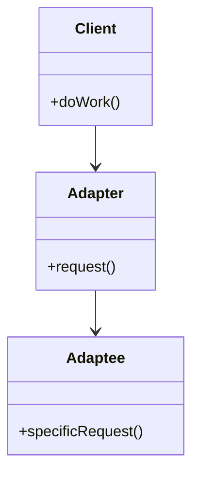

## 25.3. Design Pattern Reference Cheat Sheet

Welcome to the Clojure Design Patterns Reference Cheat Sheet, a quick-reference guide summarizing the design patterns discussed in our comprehensive guide. This section is designed to provide you with a concise overview of each pattern, including its intent, structure, key points, and unique features in Clojure. Whether you're revisiting a pattern or exploring new ones, this cheat sheet will serve as a handy tool for quick recall and application.

### Creational Design Patterns

#### Factory Function Pattern

- **Intent**: Provide a way to create objects without specifying the exact class of object that will be created.
- **Structure**: Use functions to encapsulate the creation logic.
- **Key Participants**: Factory function, product.
- **Applicability**: Use when a system must be independent of how its objects are created.
- **Sample Code Snippet**:
  ```clojure
  (defn create-person [name age]
    {:name name :age age})
  ```
- **Clojure Unique Features**: Leverages Clojure's first-class functions and maps for flexible object creation.

#### Builder Pattern Using Functions and Maps

- **Intent**: Separate the construction of a complex object from its representation.
- **Structure**: Use functions to incrementally build a map.
- **Key Participants**: Builder function, product.
- **Applicability**: Use when you need to construct a complex object step-by-step.
- **Sample Code Snippet**:
  ```clojure
  (defn build-car [make model year]
    {:make make :model model :year year})
  ```
- **Clojure Unique Features**: Utilizes immutable data structures for safe and predictable object construction.

#### Singleton Pattern and Managing Global State

- **Intent**: Ensure a class has only one instance and provide a global point of access to it.
- **Structure**: Use atoms or refs to manage state.
- **Key Participants**: Singleton instance.
- **Applicability**: Use when exactly one instance of a class is needed.
- **Sample Code Snippet**:
  ```clojure
  (defonce instance (atom nil))
  (defn get-instance []
    (when (nil? @instance)
      (reset! instance (create-resource)))
    @instance)
  ```
- **Clojure Unique Features**: Atoms provide a thread-safe way to manage global state.

### Structural Design Patterns

#### Adapter Pattern Using Protocols

- **Intent**: Convert the interface of a class into another interface clients expect.
- **Structure**: Use protocols to define expected behavior.
- **Key Participants**: Adapter, adaptee, client.
- **Applicability**: Use to integrate classes with incompatible interfaces.
- **Sample Code Snippet**:
  ```clojure
  (defprotocol Shape
    (draw [this]))

  (defrecord Circle [radius]
    Shape
    (draw [this] (println "Drawing a circle with radius" radius)))
  ```
- **Clojure Unique Features**: Protocols provide a flexible way to define and implement interfaces.

#### Decorator Pattern with Function Wrapping

- **Intent**: Attach additional responsibilities to an object dynamically.
- **Structure**: Use higher-order functions to wrap behavior.
- **Key Participants**: Component, decorator.
- **Applicability**: Use to add behavior to individual objects.
- **Sample Code Snippet**:
  ```clojure
  (defn logging-decorator [f]
    (fn [& args]
      (println "Calling function with args" args)
      (apply f args)))
  ```
- **Clojure Unique Features**: Higher-order functions make it easy to compose and extend behavior.

### Behavioral Design Patterns

#### Strategy Pattern with Higher-Order Functions

- **Intent**: Define a family of algorithms, encapsulate each one, and make them interchangeable.
- **Structure**: Use higher-order functions to pass algorithms.
- **Key Participants**: Strategy, context.
- **Applicability**: Use when you need to switch between different algorithms.
- **Sample Code Snippet**:
  ```clojure
  (defn execute-strategy [strategy x y]
    (strategy x y))

  (defn add [x y] (+ x y))
  (defn subtract [x y] (- x y))
  ```
- **Clojure Unique Features**: Functions as first-class citizens allow easy strategy swapping.

#### Observer Pattern Using Core.Async Channels

- **Intent**: Define a one-to-many dependency between objects so that when one object changes state, all its dependents are notified.
- **Structure**: Use channels to broadcast changes.
- **Key Participants**: Subject, observer.
- **Applicability**: Use for event-driven systems.
- **Sample Code Snippet**:
  ```clojure
  (require '[clojure.core.async :as async])

  (defn create-observable []
    (let [ch (async/chan)]
      {:channel ch
       :notify (fn [msg] (async/>!! ch msg))}))

  (defn create-observer [observable]
    (async/go-loop []
      (when-let [msg (async/<! (:channel observable))]
        (println "Received update:" msg)
        (recur))))
  ```
- **Clojure Unique Features**: Core.async provides powerful tools for asynchronous programming.

### Concurrency and Parallelism Patterns

#### Software Transactional Memory (STM) with Refs

- **Intent**: Manage shared state with transactions.
- **Structure**: Use refs and transactions to ensure consistency.
- **Key Participants**: Refs, transactions.
- **Applicability**: Use when you need to manage complex state changes.
- **Sample Code Snippet**:
  ```clojure
  (def account (ref 100))

  (dosync
    (alter account + 50))
  ```
- **Clojure Unique Features**: STM provides a robust model for managing concurrency.

#### Core.Async and Channels

- **Intent**: Facilitate asynchronous programming.
- **Structure**: Use channels to communicate between processes.
- **Key Participants**: Channels, go blocks.
- **Applicability**: Use for non-blocking I/O and concurrency.
- **Sample Code Snippet**:
  ```clojure
  (require '[clojure.core.async :as async])

  (defn producer [ch]
    (async/go
      (async/>! ch "Hello, World!")))

  (defn consumer [ch]
    (async/go
      (println "Received:" (async/<! ch))))
  ```
- **Clojure Unique Features**: Core.async channels simplify complex asynchronous workflows.

### Functional Programming Patterns

#### Immutability and Its Benefits

- **Intent**: Ensure data cannot be changed after creation.
- **Structure**: Use immutable data structures.
- **Key Participants**: Immutable collections.
- **Applicability**: Use to avoid side effects and improve concurrency.
- **Sample Code Snippet**:
  ```clojure
  (def my-map {:a 1 :b 2})
  (assoc my-map :c 3) ; Returns a new map
  ```
- **Clojure Unique Features**: Built-in immutable data structures enhance safety and predictability.

#### Higher-Order Functions and Function Composition

- **Intent**: Use functions as first-class citizens.
- **Structure**: Compose functions to build complex behavior.
- **Key Participants**: Functions, composition.
- **Applicability**: Use to build reusable and modular code.
- **Sample Code Snippet**:
  ```clojure
  (defn square [x] (* x x))
  (defn increment [x] (+ x 1))

  (def composed-fn (comp square increment))
  (composed-fn 2) ; Returns 9
  ```
- **Clojure Unique Features**: Clojure's `comp` function makes function composition straightforward.

### Visualizing Design Patterns

#### Factory Function Pattern



#### Adapter Pattern Using Protocols



### Design Considerations

- **When to Use Patterns**: Consider the complexity and scalability of your application. Patterns can introduce overhead if used unnecessarily.
- **Clojure-Specific Features**: Leverage Clojure's functional programming paradigm, immutability, and concurrency models to implement patterns effectively.
- **Common Pitfalls**: Avoid overusing patterns, which can lead to unnecessary complexity. Ensure patterns align with the problem you're solving.

### Differences and Similarities

- **Factory vs. Builder**: Both are creational patterns, but Factory focuses on object creation, while Builder constructs complex objects step-by-step.
- **Adapter vs. Decorator**: Adapter changes an interface, while Decorator adds behavior.

## **Ready to Test Your Knowledge?**



### What is the primary intent of the Factory Function Pattern in Clojure?

- [x] To create objects without specifying the exact class.
- [ ] To manage global state.
- [ ] To define a family of algorithms.
- [ ] To convert the interface of a class into another interface.

> **Explanation:** The Factory Function Pattern is used to create objects without specifying the exact class of object that will be created.

### Which Clojure feature is leveraged in the Builder Pattern?

- [x] Immutable data structures.
- [ ] Core.async channels.
- [ ] Software Transactional Memory.
- [ ] Protocols.

> **Explanation:** The Builder Pattern in Clojure uses immutable data structures to ensure safe and predictable object construction.

### What is the role of protocols in the Adapter Pattern?

- [x] To define expected behavior.
- [ ] To manage state changes.
- [ ] To encapsulate algorithms.
- [ ] To provide a global point of access.

> **Explanation:** Protocols in Clojure are used to define expected behavior, making them ideal for implementing the Adapter Pattern.

### How does the Decorator Pattern add functionality in Clojure?

- [x] By using higher-order functions to wrap behavior.
- [ ] By using atoms to manage state.
- [ ] By using channels for communication.
- [ ] By using refs for transactions.

> **Explanation:** The Decorator Pattern in Clojure uses higher-order functions to dynamically add responsibilities to objects.

### Which pattern uses Core.Async channels for communication?

- [x] Observer Pattern.
- [ ] Factory Function Pattern.
- [ ] Singleton Pattern.
- [ ] Strategy Pattern.

> **Explanation:** The Observer Pattern in Clojure can use Core.Async channels to broadcast changes to observers.

### What is the primary benefit of immutability in Clojure?

- [x] Avoiding side effects and improving concurrency.
- [ ] Simplifying object creation.
- [ ] Managing global state.
- [ ] Defining a family of algorithms.

> **Explanation:** Immutability helps avoid side effects and improves concurrency, making it a key feature in Clojure.

### What is the purpose of the Strategy Pattern?

- [x] To define a family of algorithms and make them interchangeable.
- [ ] To manage shared state with transactions.
- [ ] To convert the interface of a class into another interface.
- [ ] To attach additional responsibilities to an object dynamically.

> **Explanation:** The Strategy Pattern is used to define a family of algorithms, encapsulate each one, and make them interchangeable.

### Which Clojure feature simplifies asynchronous workflows?

- [x] Core.async channels.
- [ ] Immutable data structures.
- [ ] Protocols.
- [ ] Software Transactional Memory.

> **Explanation:** Core.async channels provide powerful tools for asynchronous programming in Clojure.

### What is the main difference between Factory and Builder patterns?

- [x] Factory focuses on object creation, while Builder constructs complex objects step-by-step.
- [ ] Factory changes an interface, while Builder adds behavior.
- [ ] Factory manages state, while Builder defines algorithms.
- [ ] Factory uses channels, while Builder uses refs.

> **Explanation:** Factory is about object creation, while Builder is about constructing complex objects step-by-step.

### True or False: The Singleton Pattern in Clojure uses refs to manage global state.

- [ ] True
- [x] False

> **Explanation:** The Singleton Pattern in Clojure typically uses atoms, not refs, to manage global state.



Remember, this is just the beginning. As you progress, you'll build more complex and interactive applications using these patterns. Keep experimenting, stay curious, and enjoy the journey!
