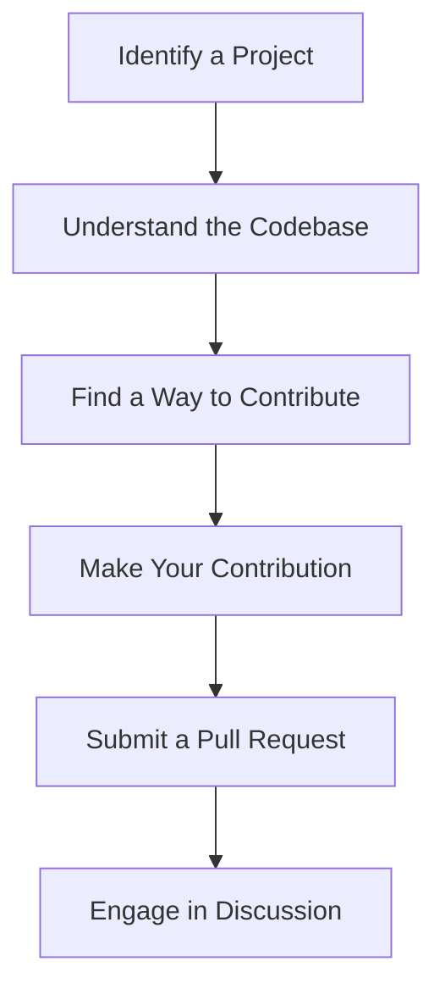

## 25.8. Community and Contribution Guidelines

### Introduction

The Clojure community is a vibrant and dynamic ecosystem that thrives on collaboration, innovation, and shared knowledge. As a Clojure developer, engaging with this community can significantly enhance your learning experience and professional growth. In this section, we will explore the importance of community involvement, provide detailed steps for contributing to open-source projects, and offer guidelines for respectful and productive communication. We will also discuss community standards and codes of conduct, encouraging collaboration and knowledge sharing.

### The Importance of Community Involvement

Community involvement is the backbone of open-source projects and the Clojure ecosystem. By participating in the community, you can:

- **Learn from Others**: Gain insights from experienced developers and learn best practices.
- **Share Knowledge**: Contribute your expertise and help others solve problems.
- **Collaborate on Projects**: Work with others to build and improve software.
- **Stay Updated**: Keep abreast of the latest developments and trends in Clojure.
- **Build a Network**: Connect with like-minded individuals and expand your professional network.

### Steps for Contributing to Open-Source Projects

Contributing to open-source projects is a rewarding way to engage with the Clojure community. Here are the steps to get started:

#### 1. Identify a Project

- **Explore Repositories**: Browse platforms like GitHub to find Clojure projects that interest you.
- **Evaluate Project Activity**: Check the project's activity level, including recent commits and issue discussions, to ensure it is actively maintained.
- **Read the Documentation**: Familiarize yourself with the project's documentation, including the README file, contribution guidelines, and code of conduct.

#### 2. Understand the Codebase

- **Clone the Repository**: Use Git to clone the repository to your local machine.
- **Set Up the Development Environment**: Follow the project's setup instructions to configure your development environment.
- **Explore the Code**: Review the codebase to understand its structure, functionality, and coding style.

#### 3. Find a Way to Contribute

- **Look for Open Issues**: Check the project's issue tracker for open issues that match your skills and interests.
- **Start with Small Tasks**: Begin with small, manageable tasks such as fixing bugs, improving documentation, or writing tests.
- **Propose Enhancements**: If you have ideas for new features or improvements, discuss them with the project maintainers.

#### 4. Make Your Contribution

- **Fork the Repository**: Create a fork of the repository to work on your changes.
- **Create a Branch**: Use Git to create a new branch for your contribution.
- **Implement Changes**: Make your changes, ensuring they adhere to the project's coding standards.
- **Test Your Changes**: Run tests to verify that your changes do not introduce any issues.

#### 5. Submit a Pull Request

- **Push Your Changes**: Push your changes to your forked repository.
- **Create a Pull Request**: Submit a pull request to the original repository, providing a clear and concise description of your changes.
- **Engage in Discussion**: Be prepared to discuss your pull request with the project maintainers and make any necessary revisions.

### Guidelines for Respectful and Productive Communication

Effective communication is essential for successful collaboration in the Clojure community. Here are some guidelines to follow:

- **Be Respectful**: Treat others with respect and kindness, even when you disagree.
- **Be Clear and Concise**: Communicate your ideas clearly and concisely to avoid misunderstandings.
- **Listen Actively**: Pay attention to others' perspectives and be open to feedback.
- **Stay on Topic**: Keep discussions focused on the subject at hand.
- **Be Patient**: Understand that contributors may have different levels of experience and availability.

### Community Standards and Codes of Conduct

Most open-source projects, including those in the Clojure community, have established community standards and codes of conduct to ensure a welcoming and inclusive environment. These typically include:

- **Inclusivity**: Encouraging participation from people of all backgrounds and identities.
- **Respect**: Promoting respectful interactions and discouraging harassment or discrimination.
- **Collaboration**: Fostering a collaborative spirit and valuing diverse perspectives.
- **Transparency**: Maintaining open and transparent communication.

### Encouraging Collaboration and Knowledge Sharing

Collaboration and knowledge sharing are key components of the Clojure community. Here are some ways to contribute:

- **Participate in Forums**: Join forums and mailing lists to engage in discussions and share knowledge.
- **Attend Meetups and Conferences**: Participate in Clojure meetups and conferences to network and learn from others.
- **Contribute to Documentation**: Improve project documentation to help others understand and use the software.
- **Mentor New Contributors**: Offer guidance and support to newcomers in the community.

### Code Example: Submitting a Pull Request

Let's walk through a simple example of submitting a pull request to a Clojure project on GitHub.

```clojure
;; Step 1: Fork the repository on GitHub

;; Step 2: Clone your forked repository
$ git clone https://github.com/your-username/project-name.git

;; Step 3: Create a new branch for your changes
$ cd project-name
$ git checkout -b my-feature-branch

;; Step 4: Make your changes
(defn greet
  "A simple function to greet a user."
  [name]
  (str "Hello, " name "!"))

;; Step 5: Commit your changes
$ git add .
$ git commit -m "Add greet function"

;; Step 6: Push your changes to your forked repository
$ git push origin my-feature-branch

;; Step 7: Create a pull request on GitHub
```

### Try It Yourself

Experiment with the code example by modifying the `greet` function to include a personalized message or by adding additional functionality. This hands-on approach will help you become more comfortable with the process of contributing to open-source projects.

### Visualizing the Contribution Workflow

Below is a diagram illustrating the workflow for contributing to an open-source project.



### References and Links

- [GitHub Guides: How to Contribute to Open Source](https://guides.github.com/activities/contributing-to-open-source/)
- [Clojure Community Guidelines](https://clojure.org/community/community_guidelines)
- [Open Source Guides: Building Welcoming Communities](https://opensource.guide/building-community/)

### Knowledge Check

- What are the benefits of participating in the Clojure community?
- Describe the steps involved in contributing to an open-source project.
- What are some guidelines for respectful and productive communication?
- Why are community standards and codes of conduct important?

### Embrace the Journey

Remember, contributing to the Clojure community is a journey of continuous learning and growth. As you engage with others, you'll gain valuable insights, build meaningful connections, and make a positive impact on the ecosystem. Keep experimenting, stay curious, and enjoy the journey!

## **Ready to Test Your Knowledge?**



### What is the first step in contributing to an open-source project?

- [x] Identify a project
- [ ] Submit a pull request
- [ ] Make your contribution
- [ ] Engage in discussion

> **Explanation:** The first step is to identify a project that interests you and is actively maintained.

### Why is community involvement important in the Clojure ecosystem?

- [x] It enhances learning and professional growth
- [ ] It is mandatory for all developers
- [ ] It only benefits project maintainers
- [ ] It is not important

> **Explanation:** Community involvement enhances learning, allows for knowledge sharing, and helps build a professional network.

### What should you do before making changes to a project?

- [x] Understand the codebase
- [ ] Submit a pull request
- [ ] Engage in discussion
- [ ] Identify a project

> **Explanation:** Understanding the codebase is crucial before making any changes to ensure they align with the project's structure and standards.

### What is a key guideline for respectful communication?

- [x] Be respectful
- [ ] Be aggressive
- [ ] Ignore feedback
- [ ] Dominate discussions

> **Explanation:** Being respectful is essential for productive and positive interactions within the community.

### What is the purpose of a code of conduct in open-source projects?

- [x] To ensure a welcoming and inclusive environment
- [ ] To restrict contributions
- [ ] To enforce strict rules
- [ ] To limit communication

> **Explanation:** A code of conduct ensures a welcoming and inclusive environment, promoting respectful interactions.

### How can you start contributing to a project?

- [x] Look for open issues
- [ ] Submit a pull request immediately
- [ ] Make large changes
- [ ] Ignore the documentation

> **Explanation:** Starting with open issues is a great way to begin contributing, especially with small, manageable tasks.

### What is the role of a pull request?

- [x] To propose changes to a project
- [ ] To delete a repository
- [ ] To clone a repository
- [ ] To create a new branch

> **Explanation:** A pull request is used to propose changes to a project and engage in discussion with maintainers.

### Why is it important to test your changes before submitting a pull request?

- [x] To ensure they do not introduce issues
- [ ] To skip the review process
- [ ] To avoid engaging in discussion
- [ ] To finalize the contribution

> **Explanation:** Testing changes ensures they do not introduce issues and align with the project's standards.

### What is a benefit of attending Clojure meetups and conferences?

- [x] Networking and learning from others
- [ ] Avoiding community involvement
- [ ] Limiting knowledge sharing
- [ ] Restricting collaboration

> **Explanation:** Attending meetups and conferences allows for networking and learning from others in the community.

### True or False: Collaboration and knowledge sharing are discouraged in the Clojure community.

- [ ] True
- [x] False

> **Explanation:** Collaboration and knowledge sharing are highly encouraged in the Clojure community to foster innovation and growth.


