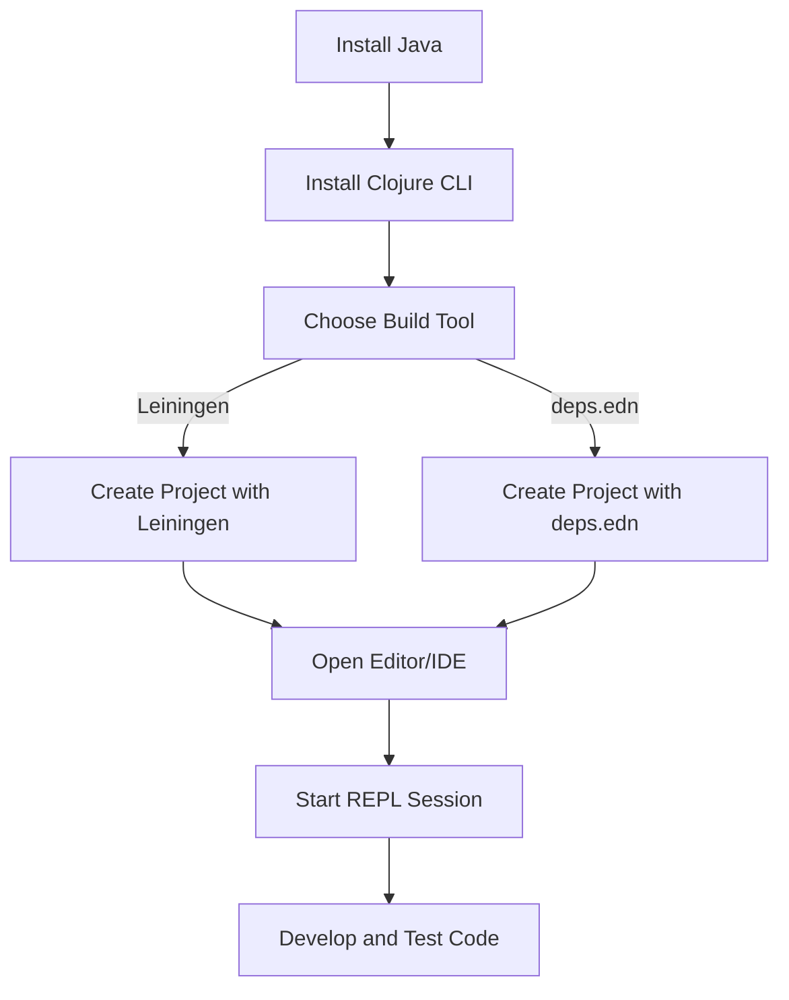

## 25.9. Setting Up Your Development Environment

Setting up a robust development environment is the first step towards mastering Clojure and leveraging its powerful features. This guide will walk you through the process of installing Clojure, configuring essential build tools, and integrating with popular editors and IDEs. By the end of this guide, you'll be equipped with a fully functional Clojure development setup, ready to tackle any project.

### Installing Clojure and the JVM

Clojure runs on the Java Virtual Machine (JVM), so you'll need to have Java installed on your system. Follow these steps to get started:

#### Step 1: Install Java

1. **Download Java**: Visit the [AdoptOpenJDK](https://adoptopenjdk.net/) website and download the latest LTS version of OpenJDK. As of this writing, OpenJDK 17 is recommended.
2. **Install Java**: Follow the installation instructions for your operating system. Ensure that the `JAVA_HOME` environment variable is set correctly.

#### Step 2: Verify Java Installation

Open a terminal and run the following command to verify your Java installation:

```bash
java -version
```

You should see output indicating the Java version installed on your system.

#### Step 3: Install Clojure

Clojure can be installed using the Clojure CLI tools. Follow these steps:

1. **Download Clojure CLI**: Visit the [Clojure website](https://clojure.org/guides/getting_started) and follow the instructions to download the Clojure CLI tools for your operating system.
2. **Install Clojure CLI**: Follow the installation instructions provided on the website.
3. **Verify Clojure Installation**: Run the following command to verify your Clojure installation:

```bash
clojure -M -e "(println \"Hello, Clojure!\")"
```

You should see the output `Hello, Clojure!`.

### Configuring Build Tools

Clojure projects typically use build tools like Leiningen or deps.edn/tools.deps for dependency management and project configuration. Let's explore both options.

#### Leiningen

Leiningen is a popular build automation tool for Clojure. It simplifies project setup, dependency management, and running tasks.

1. **Install Leiningen**: Follow the instructions on the [Leiningen website](https://leiningen.org/) to install Leiningen on your system.
2. **Create a New Project**: Use the following command to create a new Clojure project:

```bash
lein new app my-clojure-app
```

This command creates a new directory `my-clojure-app` with a basic project structure.

3. **Run the Project**: Navigate to the project directory and run the following command:

```bash
lein run
```

This command compiles and runs your Clojure application.

#### deps.edn/tools.deps

The deps.edn/tools.deps approach is a more recent addition to the Clojure ecosystem, offering a flexible way to manage dependencies.

1. **Create a deps.edn File**: In your project directory, create a file named `deps.edn` with the following content:

```clojure
{:deps {org.clojure/clojure {:mvn/version "1.11.1"}}}
```

2. **Run a Clojure REPL**: Use the following command to start a Clojure REPL:

```bash
clojure -M:repl
```

This command starts an interactive Clojure session where you can evaluate expressions.

### Integrating with Editors and IDEs

A good editor or IDE can significantly enhance your productivity when working with Clojure. Let's explore how to set up Clojure with popular editors like Emacs and VSCode.

#### CIDER for Emacs

CIDER is a powerful Clojure development environment for Emacs, providing features like interactive REPL, code navigation, and debugging.

1. **Install Emacs**: Download and install Emacs from the [GNU Emacs website](https://www.gnu.org/software/emacs/).
2. **Install CIDER**: Add the following lines to your Emacs configuration file (`~/.emacs` or `~/.emacs.d/init.el`):

```elisp
(require 'package)
(add-to-list 'package-archives '("melpa" . "https://melpa.org/packages/") t)
(package-initialize)
(unless (package-installed-p 'cider)
  (package-refresh-contents)
  (package-install 'cider))
```

3. **Start a Clojure REPL**: Open a Clojure file in Emacs and run `M-x cider-jack-in` to start a REPL session.

#### Calva for VSCode

Calva is a popular Clojure extension for Visual Studio Code, offering features like REPL integration, code evaluation, and debugging.

1. **Install Visual Studio Code**: Download and install VSCode from the [Visual Studio Code website](https://code.visualstudio.com/).
2. **Install Calva**: Open VSCode, go to the Extensions view (`Ctrl+Shift+X`), and search for "Calva". Click "Install" to add Calva to your editor.
3. **Start a Clojure REPL**: Open a Clojure file and use the command palette (`Ctrl+Shift+P`) to run "Calva: Start a Project REPL and Connect".

### Common Installation Issues and Troubleshooting Tips

Setting up a development environment can sometimes be challenging. Here are some common issues and troubleshooting tips:

- **Java Version Issues**: Ensure that your `JAVA_HOME` environment variable points to the correct Java installation. Use `java -version` to verify the installed version.
- **Clojure CLI Not Found**: Make sure the Clojure CLI tools are installed and added to your system's PATH. Revisit the installation instructions if needed.
- **Leiningen Command Not Found**: Verify that Leiningen is installed and the `lein` command is available in your PATH.
- **Editor Integration Problems**: Ensure that your editor or IDE is configured correctly. Check the documentation for CIDER or Calva for additional setup instructions.

### Try It Yourself

Now that you have set up your Clojure development environment, try creating a simple Clojure project and experiment with the REPL. Modify the code, add new functions, and observe the changes in real-time. This hands-on approach will help you become more comfortable with the tools and workflow.

### Visualizing the Clojure Development Workflow

Below is a diagram illustrating the typical workflow of setting up and using a Clojure development environment:



### References and Links

- [Clojure Getting Started Guide](https://clojure.org/guides/getting_started)
- [Leiningen Official Website](https://leiningen.org/)
- [CIDER for Emacs](https://cider.mx/)
- [Calva for VSCode](https://calva.io/)
- [AdoptOpenJDK](https://adoptopenjdk.net/)

### Knowledge Check

To reinforce your understanding, try answering the following questions:

1. What is the recommended Java version for running Clojure?
2. How do you verify that Clojure is installed correctly?
3. What are the two main build tools used in Clojure projects?
4. How can you start a REPL session in Emacs using CIDER?
5. What is the purpose of the `deps.edn` file in a Clojure project?

### Embrace the Journey

Remember, setting up your development environment is just the beginning. As you progress, you'll explore more advanced features and techniques in Clojure. Keep experimenting, stay curious, and enjoy the journey!

## **Ready to Test Your Knowledge?**



### What is the first step in setting up a Clojure development environment?

- [x] Install Java
- [ ] Install Clojure CLI
- [ ] Install Leiningen
- [ ] Install an IDE

> **Explanation:** Installing Java is the first step because Clojure runs on the Java Virtual Machine (JVM).

### Which command verifies the Java installation?

- [x] `java -version`
- [ ] `clojure -version`
- [ ] `lein version`
- [ ] `emacs --version`

> **Explanation:** The `java -version` command checks the installed Java version, ensuring the JVM is set up correctly.

### What file is used for dependency management in the deps.edn approach?

- [x] `deps.edn`
- [ ] `project.clj`
- [ ] `build.gradle`
- [ ] `pom.xml`

> **Explanation:** The `deps.edn` file is used in the deps.edn/tools.deps approach for managing dependencies in Clojure projects.

### How do you start a REPL session in Emacs with CIDER?

- [x] `M-x cider-jack-in`
- [ ] `M-x start-repl`
- [ ] `M-x run-clojure`
- [ ] `M-x open-repl`

> **Explanation:** The `M-x cider-jack-in` command starts a REPL session in Emacs using CIDER.

### Which tool is used for building and running Clojure projects with Leiningen?

- [x] Leiningen
- [ ] deps.edn
- [ ] Maven
- [ ] Gradle

> **Explanation:** Leiningen is a build automation tool specifically designed for Clojure projects.

### What is the purpose of the `JAVA_HOME` environment variable?

- [x] To specify the location of the Java installation
- [ ] To specify the location of the Clojure installation
- [ ] To specify the location of the Leiningen installation
- [ ] To specify the location of the IDE

> **Explanation:** The `JAVA_HOME` environment variable points to the directory where Java is installed, ensuring the JVM can be accessed by other tools.

### Which editor extension is recommended for Clojure development in VSCode?

- [x] Calva
- [ ] CIDER
- [ ] IntelliJ Clojure
- [ ] Sublime Clojure

> **Explanation:** Calva is a popular extension for Clojure development in Visual Studio Code, providing REPL integration and other features.

### What command is used to create a new Clojure project with Leiningen?

- [x] `lein new app my-clojure-app`
- [ ] `clojure new app my-clojure-app`
- [ ] `gradle new app my-clojure-app`
- [ ] `mvn new app my-clojure-app`

> **Explanation:** The `lein new app my-clojure-app` command creates a new Clojure project using Leiningen.

### Which website provides the official Clojure CLI installation instructions?

- [x] [clojure.org](https://clojure.org/guides/getting_started)
- [ ] [leiningen.org](https://leiningen.org/)
- [ ] [adoptopenjdk.net](https://adoptopenjdk.net/)
- [ ] [cider.mx](https://cider.mx/)

> **Explanation:** The official Clojure CLI installation instructions are available on the Clojure website at clojure.org.

### True or False: Clojure can only be used with Emacs as an editor.

- [ ] True
- [x] False

> **Explanation:** False. Clojure can be used with various editors and IDEs, including Emacs, VSCode, IntelliJ, and others.


