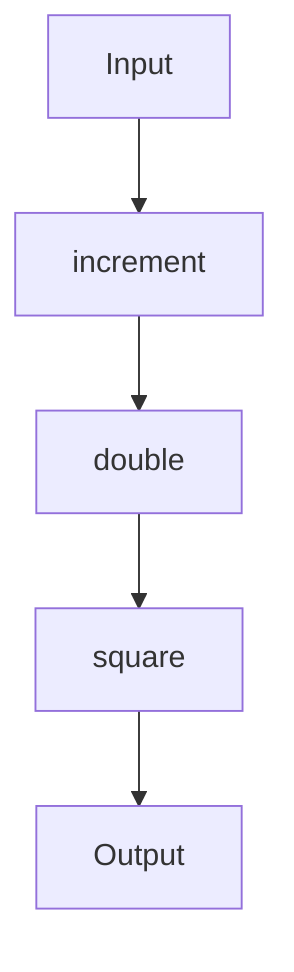

## 3.1 Functional Composition

Functional composition is a cornerstone of functional programming, allowing developers to build complex operations from simple, reusable functions. In Clojure, functional composition is not just a pattern but a paradigm that enhances code readability, maintainability, and reusability. This section delves into the intricacies of functional composition in Clojure, exploring the tools and techniques that make it a powerful approach to software development.

### Introduction to Functional Composition

Functional composition involves combining simple functions to create more complex ones. This approach promotes the development of modular and reusable code, as each function performs a specific task and can be composed with others to achieve more sophisticated functionality.

In Clojure, functional composition is facilitated by several built-in functions and macros, including `comp`, `partial`, and threading macros (`->` and `->>`). These tools allow developers to construct pipelines of operations that transform data in a clear and concise manner.

### The `comp` Function

The `comp` function in Clojure is used to compose multiple functions into a single function. It takes a variable number of functions as arguments and returns a new function that applies each of the original functions in sequence, from right to left.

#### Example of `comp` Usage

```clojure
(defn increment [x] (+ x 1))
(defn double [x] (* x 2))
(defn square [x] (* x x))

(def composed-fn (comp square double increment))

(composed-fn 3) ; => 64
```

In this example, `composed-fn` is a function that first increments its input, then doubles the result, and finally squares it. The composition is equivalent to `(fn [x] (square (double (increment x))))`.

### The `partial` Function

The `partial` function is used for partial application, allowing you to fix some arguments of a function and create a new function with fewer arguments. This is particularly useful for creating specialized versions of more general functions.

#### Example of `partial` Usage

```clojure
(defn add [a b] (+ a b))
(def add5 (partial add 5))

(add5 10) ; => 15
```

Here, `add5` is a new function that adds 5 to its argument, effectively creating a specialized version of the `add` function.

### Threading Macros

Threading macros (`->` and `->>`) are powerful tools for improving the readability of function compositions by explicitly showing the flow of data through a series of transformations.

#### Thread-First Macro (`->`)

The `->` macro threads the result of each expression as the first argument to the next expression.

```clojure
(-> 3
    increment
    double
    square) ; => 64
```

This is equivalent to `(square (double (increment 3)))`, but it reads more naturally as a sequence of transformations.

#### Thread-Last Macro (`->>`)

The `->>` macro threads the result of each expression as the last argument to the next expression.

```clojure
(->> [1 2 3 4]
     (map inc)
     (filter even?)
     (reduce +)) ; => 10
```

This example demonstrates a pipeline that increments each number in a list, filters out the odd numbers, and sums the remaining even numbers.

### Creating Small, Composable Functions

A key principle of functional composition is to create small, focused functions that can be easily composed. This approach not only enhances reusability but also simplifies testing and debugging.

#### Example of Small, Composable Functions

```clojure
(defn sanitize [s] (clojure.string/trim s))
(defn parse-integer [s] (Integer/parseInt s))
(def process (comp parse-integer sanitize))

(process " 42 ") ; => 42
```

In this example, `sanitize` and `parse-integer` are small functions that can be composed to create a `process` function that trims whitespace from a string and converts it to an integer.

### Avoiding Side Effects

To maintain predictability and reliability in composed functions, it is crucial to ensure that they are pure. Pure functions have no side effects and always produce the same output for the same input, making them ideal for composition.

### Visualizing Functional Composition

To better understand functional composition, consider the following diagram that illustrates the flow of data through a composed function:



This diagram shows how the input is transformed by each function in the composition, resulting in the final output.

### Advantages and Disadvantages

**Advantages:**
- **Modularity:** Functions are small and focused, making them easy to understand and test.
- **Reusability:** Functions can be reused in different compositions, reducing code duplication.
- **Readability:** Threading macros and `comp` improve the readability of complex operations.

**Disadvantages:**
- **Overhead:** Excessive composition can lead to performance overhead due to multiple function calls.
- **Complexity:** Deeply nested compositions can become difficult to debug.

### Best Practices for Functional Composition

- **Keep Functions Pure:** Ensure that functions do not have side effects to maintain predictability.
- **Use Descriptive Names:** Name functions clearly to convey their purpose and improve readability.
- **Limit Composition Depth:** Avoid overly deep compositions to prevent complexity and performance issues.

### Conclusion

Functional composition is a powerful technique in Clojure that promotes clean, modular, and reusable code. By leveraging tools like `comp`, `partial`, and threading macros, developers can construct complex operations from simple functions, enhancing both the readability and maintainability of their code.

## Quiz Time!



### What is the primary purpose of functional composition in Clojure?

- [x] To build complex operations from simple functions
- [ ] To optimize performance by reducing function calls
- [ ] To enforce strict typing in function definitions
- [ ] To manage state changes in a program

> **Explanation:** Functional composition allows developers to create complex operations by combining simple, reusable functions, enhancing code readability and maintainability.

### Which Clojure function is used to compose multiple functions into a single function?

- [x] `comp`
- [ ] `partial`
- [ ] `map`
- [ ] `filter`

> **Explanation:** The `comp` function in Clojure is used to compose multiple functions into a single function, applying them in sequence from right to left.

### How does the `partial` function in Clojure work?

- [x] It creates a new function by fixing some arguments of an existing function
- [ ] It applies a function to each element of a collection
- [ ] It filters elements of a collection based on a predicate
- [ ] It reduces a collection to a single value

> **Explanation:** The `partial` function allows for partial application by fixing some arguments of a function, creating a new function with fewer arguments.

### What is the role of threading macros in Clojure?

- [x] To improve readability by showing the flow of data through transformations
- [ ] To enforce immutability in data structures
- [ ] To manage concurrency in multi-threaded applications
- [ ] To optimize memory usage in large datasets

> **Explanation:** Threading macros (`->` and `->>`) enhance readability by explicitly showing how data flows through a series of transformations.

### Which threading macro passes the result of each expression as the first argument to the next?

- [x] `->`
- [ ] `->>`
- [ ] `comp`
- [ ] `partial`

> **Explanation:** The `->` macro threads the result of each expression as the first argument to the next expression, improving readability.

### What is a key advantage of creating small, composable functions?

- [x] They are easy to understand and test
- [ ] They reduce the need for documentation
- [ ] They automatically optimize performance
- [ ] They enforce strict type checking

> **Explanation:** Small, composable functions are modular and focused, making them easy to understand, test, and reuse.

### Why is it important to avoid side effects in composed functions?

- [x] To maintain predictability and reliability
- [ ] To enforce strict typing
- [ ] To optimize memory usage
- [ ] To reduce code duplication

> **Explanation:** Avoiding side effects ensures that functions are pure, maintaining predictability and reliability in compositions.

### What is a potential disadvantage of excessive function composition?

- [x] Performance overhead due to multiple function calls
- [ ] Increased code readability
- [ ] Automatic error handling
- [ ] Simplified debugging

> **Explanation:** Excessive composition can lead to performance overhead due to the additional function calls involved in deeply nested compositions.

### Which of the following is NOT a benefit of using threading macros?

- [ ] Improved readability
- [ ] Clear data flow
- [x] Enhanced type safety
- [ ] Simplified transformations

> **Explanation:** Threading macros improve readability and show clear data flow, but they do not enhance type safety.

### True or False: The `comp` function applies functions from left to right.

- [ ] True
- [x] False

> **Explanation:** The `comp` function applies functions from right to left, meaning the last function in the argument list is applied first.


