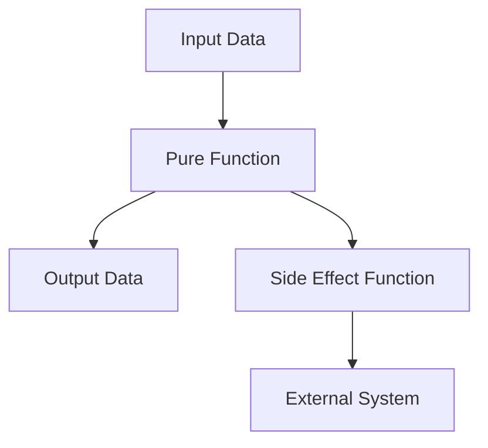

## 3.1. Pure Functions and Side Effects

In the realm of functional programming, pure functions and side effects are fundamental concepts that shape how we write and reason about code. Clojure, as a functional language, emphasizes these principles to enable developers to create robust, maintainable, and efficient software. In this section, we will delve into the characteristics of pure functions, understand the nature of side effects, and explore strategies to minimize them in Clojure code.

### Understanding Pure Functions

**Pure functions** are the building blocks of functional programming. They are functions that, given the same input, will always produce the same output without causing any observable side effects. This predictability makes them easier to test, debug, and reason about.

#### Characteristics of Pure Functions

1. **Deterministic Output**: A pure function always returns the same result for the same set of inputs. This property is known as referential transparency.

2. **No Side Effects**: Pure functions do not alter any external state or interact with the outside world (e.g., modifying a global variable, writing to a file, or printing to the console).

3. **Immutability**: Pure functions operate on immutable data structures, ensuring that the original data remains unchanged.

#### Example of a Pure Function in Clojure

```clojure
;; A simple pure function that adds two numbers
(defn add [x y]
  (+ x y))

;; Calling the function with the same arguments will always return the same result
(add 2 3) ;; => 5
```

In this example, the `add` function is pure because it consistently returns the same result for the same inputs and does not modify any external state.

### The Nature of Side Effects

**Side effects** occur when a function interacts with the outside world or changes the state of the system. While side effects are sometimes necessary (e.g., reading from a database, writing to a file), they can make code harder to understand and test.

#### Common Types of Side Effects

1. **I/O Operations**: Reading from or writing to files, databases, or network sockets.
2. **State Mutation**: Modifying variables or data structures that exist outside the function's scope.
3. **Exception Handling**: Throwing or catching exceptions can be considered a side effect as it alters the normal flow of execution.
4. **Logging and Printing**: Outputting information to the console or logs.

#### Example of an Impure Function in Clojure

```clojure
;; An impure function that prints a message to the console
(defn greet [name]
  (println "Hello," name))

;; Calling the function produces a side effect (printing to the console)
(greet "Alice") ;; => Prints "Hello, Alice"
```

The `greet` function is impure because it performs a side effect by printing to the console.

### Strategies for Minimizing Side Effects

Minimizing side effects is crucial for writing clean and maintainable code. Here are some strategies to achieve this in Clojure:

1. **Isolate Side Effects**: Encapsulate side effects in specific functions or modules, keeping the rest of your code pure.

2. **Use Higher-Order Functions**: Leverage higher-order functions to abstract side effects and keep your core logic pure.

3. **Leverage Immutability**: Use Clojure's immutable data structures to prevent unintended state changes.

4. **Functional Composition**: Compose pure functions to build complex logic without introducing side effects.

5. **Lazy Evaluation**: Use lazy sequences to defer side effects until absolutely necessary.

#### Example: Isolating Side Effects

```clojure
;; Pure function to process data
(defn process-data [data]
  (map inc data))

;; Function to handle side effects
(defn save-to-file [filename data]
  (spit filename (pr-str data)))

;; Main function that combines pure and impure functions
(defn main []
  (let [data [1 2 3 4 5]
        processed-data (process-data data)]
    (save-to-file "output.txt" processed-data)))
```

In this example, `process-data` is a pure function, while `save-to-file` handles the side effect of writing to a file. By separating these concerns, we maintain the purity of our core logic.

### Benefits of Pure Functions

Embracing pure functions offers several advantages:

1. **Easier Testing**: Pure functions are deterministic, making them straightforward to test with unit tests.

2. **Simplified Debugging**: With no side effects, debugging becomes easier as functions behave predictably.

3. **Improved Concurrency**: Pure functions can be executed in parallel without concerns about shared state or race conditions.

4. **Enhanced Readability**: Code that relies on pure functions is often more readable and easier to understand.

5. **Reusability**: Pure functions are highly reusable as they do not depend on external state.

### Visualizing Pure Functions and Side Effects

To better understand the relationship between pure functions and side effects, let's visualize the flow of data and side effects in a typical Clojure program.



**Diagram Description**: This diagram illustrates how input data is processed by a pure function to produce output data. The pure function may also interact with a side effect function, which communicates with an external system.

### Try It Yourself

Experiment with the following code examples to deepen your understanding of pure functions and side effects:

1. Modify the `add` function to include a side effect, such as printing the result. Observe how this changes its purity.

2. Refactor the `greet` function to return a greeting message instead of printing it. Create a separate function to handle the printing.

3. Implement a pure function that filters even numbers from a list and a separate function to log the filtered list.

### Knowledge Check

- What are the key characteristics of a pure function?
- Why are side effects significant in functional programming?
- How can you isolate side effects in your Clojure code?
- What are the benefits of using pure functions?

### Summary

In this section, we explored the concept of pure functions and side effects in Clojure. We learned that pure functions are deterministic and free of side effects, making them easier to test, debug, and reason about. By minimizing side effects, we can write cleaner, more maintainable code that leverages Clojure's strengths in functional programming.

Remember, this is just the beginning. As you progress, you'll build more complex and interactive applications. Keep experimenting, stay curious, and enjoy the journey!

## **Ready to Test Your Knowledge?**



### What is a pure function?

- [x] A function that always returns the same output for the same input and has no side effects.
- [ ] A function that can modify global variables.
- [ ] A function that performs I/O operations.
- [ ] A function that throws exceptions.

> **Explanation:** A pure function is deterministic and does not cause side effects, making it predictable and easier to test.

### Why are side effects significant in functional programming?

- [x] They can make code harder to test and reason about.
- [ ] They improve the performance of pure functions.
- [ ] They are necessary for all functions to work.
- [ ] They simplify debugging.

> **Explanation:** Side effects can complicate testing and reasoning, as they introduce unpredictability and dependencies on external state.

### Which of the following is an example of a side effect?

- [x] Writing to a file.
- [ ] Returning a value.
- [ ] Passing arguments to a function.
- [ ] Using immutable data structures.

> **Explanation:** Writing to a file is a side effect because it interacts with the external environment.

### How can you minimize side effects in Clojure?

- [x] Isolate side effects in specific functions.
- [x] Use immutable data structures.
- [ ] Use global variables extensively.
- [ ] Avoid using functions.

> **Explanation:** Isolating side effects and using immutability helps maintain purity and predictability in code.

### What is the benefit of using pure functions?

- [x] Easier testing and debugging.
- [ ] Increased complexity.
- [ ] More side effects.
- [ ] Less reusability.

> **Explanation:** Pure functions are easier to test and debug due to their deterministic nature and lack of side effects.

### What does referential transparency mean?

- [x] An expression can be replaced with its value without changing the program's behavior.
- [ ] A function that modifies external state.
- [ ] A function that performs I/O operations.
- [ ] A function that has side effects.

> **Explanation:** Referential transparency ensures that expressions can be replaced with their values, maintaining program behavior.

### Which strategy helps in minimizing side effects?

- [x] Functional composition.
- [ ] Using mutable data structures.
- [ ] Extensive use of global state.
- [ ] Ignoring exceptions.

> **Explanation:** Functional composition allows building complex logic from pure functions, minimizing side effects.

### What is an impure function?

- [x] A function that causes side effects or depends on external state.
- [ ] A function that always returns the same output for the same input.
- [ ] A function that uses immutable data structures.
- [ ] A function that is deterministic.

> **Explanation:** An impure function interacts with external state or causes side effects, making it unpredictable.

### How does immutability help in functional programming?

- [x] Prevents unintended state changes and simplifies reasoning.
- [ ] Increases the complexity of code.
- [ ] Makes code harder to test.
- [ ] Encourages the use of global variables.

> **Explanation:** Immutability ensures that data remains unchanged, simplifying reasoning and preventing unintended state changes.

### True or False: Pure functions can be executed in parallel without concerns about shared state.

- [x] True
- [ ] False

> **Explanation:** Pure functions do not rely on shared state, making them suitable for parallel execution without race conditions.


