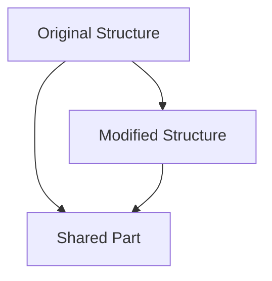

## 3.2 Immutable and Persistent Data Structures

In the realm of functional programming, immutability is a cornerstone that ensures thread safety and reduces side effects. Clojure, a modern Lisp dialect, embraces immutability by default, providing a robust foundation for building reliable and maintainable software. This section delves into the significance of immutable and persistent data structures in Clojure, illustrating how they enhance efficiency and promote best practices in functional programming.

### Introduction

Immutable data structures are those that cannot be altered after their creation. Instead of modifying existing data, operations on immutable structures return new versions, leaving the originals unchanged. This approach is crucial for thread safety, as it eliminates the risks associated with concurrent modifications. Persistent data structures, a subset of immutable structures, efficiently share structure between versions, minimizing memory overhead and enhancing performance.

### Detailed Explanation

#### The Significance of Immutability

Immutability is vital for several reasons:

- **Thread Safety:** Immutable objects can be shared freely between threads without synchronization, as their state cannot change.
- **Predictability:** Functions that operate on immutable data are easier to reason about, as they do not produce side effects.
- **Ease of Testing:** Pure functions that return new data structures are straightforward to test, as they depend solely on their inputs.

#### Understanding Persistent Data Structures

Persistent data structures in Clojure are designed to efficiently share structure when modified. This means that when you perform an operation on a large data structure, only the parts that change are copied, while the rest is shared with the original. This structural sharing is key to achieving both immutability and efficiency.

### Visual Aids

To better understand how persistent data structures work, consider the following conceptual diagram illustrating structural sharing:



In this diagram, the "Original Structure" and "Modified Structure" share a common part, reducing the need for duplication and enhancing performance.

### Incorporating Immutable Data Structures

Clojure provides a rich set of core immutable collections, including lists, vectors, maps, and sets. These collections are designed to be used by default, promoting immutability throughout your codebase.

#### Example: Using Clojure's Core Collections

```clojure
(def numbers [1 2 3]) ; A vector of numbers
```

In this example, `numbers` is a vector, an immutable collection that can be used safely across threads.

### Performing Operations That Return New Structures

When you perform operations on immutable collections, Clojure returns new versions of these collections, leaving the originals intact.

#### Example: Adding an Element to a Vector

```clojure
(def updated-numbers (conj numbers 4)) ; [1 2 3 4]
```

Here, `conj` adds an element to the vector, returning a new vector with the added element.

### Leveraging Persistent Data Structures for Efficiency

Persistent data structures are particularly beneficial when working with large collections, as they minimize the overhead of copying data.

#### Example: Modifying a Large Map

```clojure
(def big-map (into {} (map (fn [i] [i (str "Value" i)]) (range 1000))))
(def updated-map (assoc big-map 1001 "Value1001"))
```

In this example, `big-map` is a large map created using `into` and `map`. The `assoc` function adds a new key-value pair, returning a new map that shares most of its structure with the original.

### Avoiding Mutable Java Collections

While Clojure runs on the JVM and can interoperate with Java, it is advisable to avoid mutable Java collections like `java.util.ArrayList` or `java.util.HashMap`. These collections do not offer the same guarantees of immutability and thread safety as Clojure's core collections.

### Promoting Pure Functions That Return New Data Structures

Pure functions are a hallmark of functional programming. They take inputs and return outputs without side effects, making them predictable and easy to test.

#### Example: A Pure Function in Clojure

```clojure
(defn add-element [coll element]
  (conj coll element))
```

The `add-element` function is pure, as it takes a collection and an element as inputs and returns a new collection with the element added.

### Advantages and Disadvantages

#### Advantages

- **Thread Safety:** Immutable data structures eliminate the need for locks or synchronization.
- **Ease of Reasoning:** Pure functions and immutable data make code easier to understand and maintain.
- **Efficiency:** Persistent data structures optimize memory usage through structural sharing.

#### Disadvantages

- **Initial Learning Curve:** Developers accustomed to mutable data may need time to adjust to immutable paradigms.
- **Performance Overhead:** In some cases, the creation of new data structures can introduce performance overhead, though this is often mitigated by structural sharing.

### Best Practices

- **Default to Immutability:** Use Clojure's core immutable collections by default.
- **Embrace Pure Functions:** Write functions that operate on and return immutable data structures.
- **Leverage Libraries:** Utilize libraries like `clojure.core` for efficient data manipulation.

### Conclusion

Immutable and persistent data structures are foundational to Clojure's approach to functional programming. By embracing immutability, developers can write thread-safe, predictable, and efficient code. As you continue to explore Clojure, consider how these principles can enhance your software design and development practices.

## Quiz Time!



### What is a key benefit of immutable data structures in Clojure?

- [x] Thread safety
- [ ] Increased complexity
- [ ] Reduced performance
- [ ] Mutable state

> **Explanation:** Immutable data structures ensure thread safety by preventing concurrent modifications.

### How do persistent data structures achieve efficiency?

- [x] By sharing structure between versions
- [ ] By duplicating data
- [ ] By using mutable state
- [ ] By avoiding structural sharing

> **Explanation:** Persistent data structures share structure between versions, minimizing memory usage.

### What does the `conj` function do in Clojure?

- [x] Adds an element to a collection
- [ ] Removes an element from a collection
- [ ] Modifies an element in a collection
- [ ] Duplicates a collection

> **Explanation:** The `conj` function adds an element to a collection, returning a new collection.

### Why should mutable Java collections be avoided in Clojure?

- [x] They do not guarantee immutability
- [ ] They are faster than Clojure collections
- [ ] They are easier to use
- [ ] They are thread-safe

> **Explanation:** Mutable Java collections do not guarantee immutability or thread safety.

### What is a pure function?

- [x] A function with no side effects
- [ ] A function that modifies global state
- [ ] A function that uses mutable data
- [ ] A function that returns void

> **Explanation:** A pure function has no side effects and returns consistent results based on its inputs.

### What is the primary advantage of structural sharing?

- [x] Reduces memory overhead
- [ ] Increases memory usage
- [ ] Simplifies code
- [ ] Enhances mutability

> **Explanation:** Structural sharing reduces memory overhead by reusing parts of data structures.

### Which Clojure collection is immutable by default?

- [x] Vector
- [ ] ArrayList
- [ ] HashMap
- [ ] LinkedList

> **Explanation:** Vectors in Clojure are immutable by default, unlike Java's ArrayList.

### What does the `assoc` function do?

- [x] Adds or updates a key-value pair in a map
- [ ] Removes a key-value pair from a map
- [ ] Clears a map
- [ ] Duplicates a map

> **Explanation:** The `assoc` function adds or updates a key-value pair in a map, returning a new map.

### How does immutability affect testing?

- [x] Makes testing easier
- [ ] Makes testing harder
- [ ] Has no effect on testing
- [ ] Requires more complex tests

> **Explanation:** Immutability makes testing easier by ensuring predictable function behavior.

### True or False: Clojure's core collections are mutable.

- [ ] True
- [x] False

> **Explanation:** Clojure's core collections are immutable, promoting thread safety and predictability.


