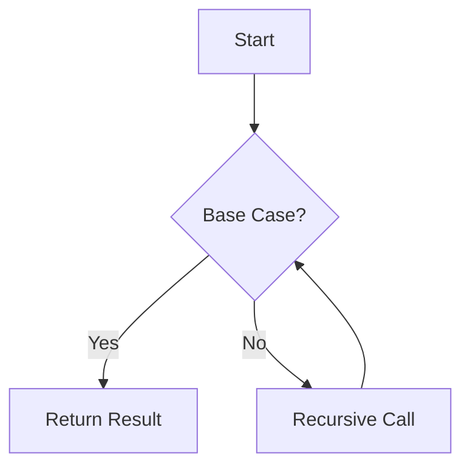

## 3.2. Recursion and Looping Constructs

Recursion is a fundamental concept in functional programming and a primary means of iteration in Clojure. Unlike traditional imperative languages that rely heavily on loops, Clojure leverages recursion to achieve iteration, providing a more expressive and declarative approach. In this section, we will explore recursion in Clojure, discuss looping constructs like `loop` and `recur`, and delve into tail-call optimization to enable efficient recursive calls. We will also compare recursion with traditional looping mechanisms and address potential stack overflow issues and how to avoid them.

### Understanding Recursion in Functional Programming

Recursion is a technique where a function calls itself to solve a problem. In functional programming, recursion is often preferred over iterative loops because it aligns with the paradigm's emphasis on immutability and declarative code. Recursive functions typically consist of two main components:

1. **Base Case**: The condition under which the recursion stops. It prevents the function from calling itself indefinitely.
2. **Recursive Case**: The part of the function where the function calls itself with modified arguments, moving towards the base case.

#### Example: Calculating Factorial Using Recursion

Let's start with a simple example of a recursive function to calculate the factorial of a number:

```clojure
(defn factorial [n]
  (if (<= n 1)
    1
    (* n (factorial (dec n)))))
```

- **Base Case**: When `n` is less than or equal to 1, the function returns 1.
- **Recursive Case**: The function calls itself with `n-1` and multiplies the result by `n`.

### Looping Constructs in Clojure: `loop` and `recur`

Clojure provides the `loop` and `recur` constructs to facilitate recursion and iteration. These constructs help optimize recursive calls by avoiding stack overflow issues through tail-call optimization.

#### The `loop` Construct

The `loop` construct in Clojure is used to define a recursion point. It allows you to bind initial values to variables and provides a way to iterate over them.

```clojure
(loop [i 0]
  (when (< i 10)
    (println i)
    (recur (inc i))))
```

- **Initialization**: The `loop` initializes `i` to 0.
- **Condition**: The `when` clause checks if `i` is less than 10.
- **Iteration**: The `recur` function is used to call the loop with the incremented value of `i`.

#### The `recur` Construct

The `recur` construct is used to make a recursive call to the nearest enclosing `loop` or function. It ensures that the recursive call is in the tail position, allowing Clojure to optimize the call and prevent stack overflow.

```clojure
(defn countdown [n]
  (if (zero? n)
    (println "Blast off!")
    (do
      (println n)
      (recur (dec n)))))
```

- **Tail Position**: The `recur` call is in the tail position, allowing for optimization.
- **Base Case**: When `n` is zero, the function prints "Blast off!" and stops.

### Tail-Call Optimization

Tail-call optimization is a technique used by Clojure to optimize recursive calls that are in the tail position. A tail call is the last operation performed in a function before it returns a result. When a recursive call is in the tail position, Clojure can reuse the current function's stack frame for the recursive call, preventing stack overflow.

#### Example: Tail-Recursive Factorial

Let's rewrite the factorial function using tail recursion:

```clojure
(defn factorial-tail-rec [n]
  (letfn [(fact-helper [acc n]
            (if (<= n 1)
              acc
              (recur (* acc n) (dec n))))]
    (fact-helper 1 n)))
```

- **Accumulator**: The `fact-helper` function uses an accumulator `acc` to store the intermediate result.
- **Tail Position**: The `recur` call is in the tail position, allowing for optimization.

### Comparing Recursion with Traditional Looping Mechanisms

In traditional imperative languages, loops such as `for`, `while`, and `do-while` are commonly used for iteration. These loops rely on mutable state and side effects, which can lead to complex and error-prone code. In contrast, recursion in functional programming promotes immutability and declarative code, making it easier to reason about and maintain.

#### Example: Iterative vs. Recursive Sum

Let's compare an iterative and a recursive approach to summing a list of numbers:

**Iterative Approach**:

```clojure
(defn sum-iterative [numbers]
  (loop [nums numbers
         acc 0]
    (if (empty? nums)
      acc
      (recur (rest nums) (+ acc (first nums))))))
```

**Recursive Approach**:

```clojure
(defn sum-recursive [numbers]
  (if (empty? numbers)
    0
    (+ (first numbers) (sum-recursive (rest numbers)))))
```

- **Iterative Approach**: Uses a `loop` and `recur` to iterate over the list, maintaining an accumulator.
- **Recursive Approach**: Uses recursion to sum the list, with the base case returning 0 for an empty list.

### Addressing Stack Overflow Issues

Recursive functions can lead to stack overflow if the recursion depth is too large. Clojure's `recur` construct helps mitigate this by optimizing tail-recursive calls. However, not all recursive functions can be easily converted to tail-recursive form.

#### Strategies to Avoid Stack Overflow

1. **Tail Recursion**: Ensure recursive calls are in the tail position to enable optimization.
2. **Loop and Recur**: Use `loop` and `recur` for iterative processes that can be expressed as tail-recursive functions.
3. **Trampolining**: Use the `trampoline` function for mutually recursive functions or when tail recursion is not possible.

#### Example: Trampolining

```clojure
(defn even? [n]
  (if (zero? n)
    true
    #(odd? (dec n))))

(defn odd? [n]
  (if (zero? n)
    false
    #(even? (dec n))))

(trampoline even? 1000000)
```

- **Trampoline**: The `trampoline` function repeatedly calls the returned function until a non-function value is obtained.
- **Mutual Recursion**: `even?` and `odd?` are mutually recursive functions.

### Visualizing Recursion and Looping Constructs

To better understand recursion and looping constructs in Clojure, let's visualize the flow of a recursive function using a flowchart.



- **Start**: The function begins execution.
- **Base Case**: The function checks if the base case is met.
- **Return Result**: If the base case is met, the function returns the result.
- **Recursive Call**: If the base case is not met, the function makes a recursive call.

### Try It Yourself

Experiment with the provided code examples by modifying the base case or recursive case. Try implementing your own recursive functions, such as calculating the Fibonacci sequence or reversing a list. Use the `loop` and `recur` constructs to optimize your recursive functions and prevent stack overflow.

### Key Takeaways

- Recursion is a primary means of iteration in functional programming, promoting immutability and declarative code.
- Clojure's `loop` and `recur` constructs enable efficient recursive calls through tail-call optimization.
- Tail-call optimization prevents stack overflow by reusing the current function's stack frame for recursive calls.
- Compare recursion with traditional looping mechanisms to understand the benefits of functional iteration.
- Use strategies like tail recursion, loop and recur, and trampolining to avoid stack overflow issues.

### Further Reading

- [Clojure Documentation on Recursion](https://clojure.org/reference/recursion)
- [Functional Programming Principles in Clojure](https://www.braveclojure.com/functional-programming/)
- [Tail-Call Optimization in Clojure](https://clojure.org/reference/recur)

## **Ready to Test Your Knowledge?**



### What is recursion in functional programming?

- [x] A technique where a function calls itself to solve a problem.
- [ ] A technique where a function iterates over a loop to solve a problem.
- [ ] A technique where a function uses mutable state to solve a problem.
- [ ] A technique where a function uses side effects to solve a problem.

> **Explanation:** Recursion is a technique where a function calls itself to solve a problem, commonly used in functional programming.

### What are the two main components of a recursive function?

- [x] Base Case and Recursive Case
- [ ] Loop and Condition
- [ ] Initialization and Iteration
- [ ] Input and Output

> **Explanation:** A recursive function consists of a base case, which stops the recursion, and a recursive case, which calls the function itself.

### What is the purpose of the `loop` construct in Clojure?

- [x] To define a recursion point and bind initial values to variables.
- [ ] To create a traditional for loop.
- [ ] To handle exceptions in recursive functions.
- [ ] To optimize memory usage in recursive functions.

> **Explanation:** The `loop` construct defines a recursion point and binds initial values to variables, facilitating iteration.

### How does the `recur` construct optimize recursive calls?

- [x] By ensuring the recursive call is in the tail position, allowing for stack frame reuse.
- [ ] By converting recursive calls into iterative loops.
- [ ] By caching the results of recursive calls.
- [ ] By using mutable state to store intermediate results.

> **Explanation:** The `recur` construct ensures the recursive call is in the tail position, allowing Clojure to reuse the stack frame and prevent stack overflow.

### What is tail-call optimization?

- [x] A technique that optimizes recursive calls in the tail position by reusing the stack frame.
- [ ] A technique that converts recursive calls into iterative loops.
- [ ] A technique that caches the results of recursive calls.
- [ ] A technique that uses mutable state to store intermediate results.

> **Explanation:** Tail-call optimization is a technique that optimizes recursive calls in the tail position by reusing the stack frame, preventing stack overflow.

### How can you avoid stack overflow in recursive functions?

- [x] Use tail recursion, loop and recur, and trampolining.
- [ ] Use mutable state and side effects.
- [ ] Use traditional for loops.
- [ ] Use exception handling.

> **Explanation:** To avoid stack overflow, use tail recursion, loop and recur, and trampolining to optimize recursive calls.

### What is the difference between iterative and recursive approaches?

- [x] Iterative approaches use loops and mutable state, while recursive approaches use function calls and immutability.
- [ ] Iterative approaches use function calls and immutability, while recursive approaches use loops and mutable state.
- [ ] Iterative approaches use side effects, while recursive approaches use loops.
- [ ] Iterative approaches use recursion, while recursive approaches use iteration.

> **Explanation:** Iterative approaches use loops and mutable state, while recursive approaches use function calls and immutability, aligning with functional programming principles.

### What is trampolining in Clojure?

- [x] A technique that uses the `trampoline` function to repeatedly call returned functions until a non-function value is obtained.
- [ ] A technique that converts recursive calls into iterative loops.
- [ ] A technique that caches the results of recursive calls.
- [ ] A technique that uses mutable state to store intermediate results.

> **Explanation:** Trampolining uses the `trampoline` function to repeatedly call returned functions until a non-function value is obtained, useful for mutually recursive functions.

### What is a base case in a recursive function?

- [x] The condition under which the recursion stops.
- [ ] The initial value of the recursive function.
- [ ] The part of the function that calls itself.
- [ ] The final result of the recursive function.

> **Explanation:** The base case is the condition under which the recursion stops, preventing infinite recursion.

### True or False: Tail-call optimization is automatically applied to all recursive functions in Clojure.

- [ ] True
- [x] False

> **Explanation:** Tail-call optimization is only applied to recursive calls in the tail position, such as those using the `recur` construct.



Remember, mastering recursion and looping constructs in Clojure is just the beginning. As you progress, you'll build more complex and efficient functional programs. Keep experimenting, stay curious, and enjoy the journey!
