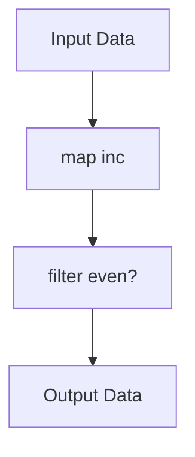

## 3.3 Transducers

In the world of functional programming, Clojure stands out with its elegant approach to data transformation through transducers. Transducers provide a powerful way to compose transformations without being tied to specific input or output collections. This decoupling of transformation logic from data context not only enhances code reusability but also significantly improves performance by eliminating the need for intermediate collections.

### Introduction to Transducers

Transducers are a core concept in Clojure that allow you to build composable and reusable data transformation pipelines. Unlike traditional sequence operations that create intermediate collections, transducers operate directly on the data, making them highly efficient. They can be applied to various data sources, including sequences, channels, and streams, providing a unified approach to data processing.

### Defining Transducers

Transducers are defined using the `comp` function, which composes multiple transformation functions into a single transducer. Here's a simple example:

```clojure
(def xf (comp (map inc) (filter even?)))
```

In this example, `xf` is a transducer that first increments each element and then filters out the odd numbers.

### Applying Transducers with `transduce`

The `transduce` function applies a transducer to a collection, combining the results using a reducing function. This process avoids the creation of intermediate collections, leading to performance gains:

```clojure
(transduce xf + 0 [1 2 3 4]) ; => 6
```

Here, the transducer `xf` is applied to the vector `[1 2 3 4]`, and the results are summed up using the `+` function, starting from an initial value of `0`.

### Transducers with `core.async` Channels

Transducers can also be applied to channels in Clojure's `core.async` library, allowing for efficient asynchronous data processing:

```clojure
(require '[clojure.core.async :refer [chan transduce <! go]])

(def input (chan))
(def output (chan 10 xf))
```

In this setup, `output` is a channel that applies the transducer `xf` to the data flowing through it, demonstrating how transducers can be seamlessly integrated with asynchronous workflows.

### Using Transducers with Sequence Functions

Transducers can be used with sequence functions like `into`, which collects the results into a specified collection type:

```clojure
(into [] xf [1 2 3 4]) ; => [2 4]
```

This example shows how the transducer `xf` is applied to the vector `[1 2 3 4]`, resulting in a new vector `[2 4]` without creating intermediate collections.

### Creating Custom Transducers

Custom transducers can be created by defining transformation functions that can be composed. Here's an example of a custom transducer that multiplies each element by a given number:

```clojure
(defn multiply-by [n]
  (map (fn [x] (* x n))))

(def xf (comp (multiply-by 2) (filter odd?)))
```

In this case, `multiply-by` is a function that returns a transducer, which is then composed with a filtering operation to create `xf`.

### Avoiding Unnecessary Data Materialization

One of the key benefits of transducers is their ability to process data efficiently without creating intermediate sequences. This is particularly useful in scenarios involving large datasets or performance-critical applications.

### Visualizing Transducer Workflow

To better understand how transducers work, consider the following diagram illustrating the flow of data through a transducer pipeline:



This diagram shows how data is transformed step-by-step through the composed transducer, from input to output, without intermediate collections.

### Advantages and Disadvantages

**Advantages:**
- **Efficiency:** Transducers eliminate intermediate collections, reducing memory usage and improving performance.
- **Reusability:** Transducers can be applied to different data sources, enhancing code modularity.
- **Composability:** Transducers can be easily composed to create complex transformation pipelines.

**Disadvantages:**
- **Complexity:** Understanding and debugging transducer pipelines can be challenging for beginners.
- **Limited Debugging Tools:** Since transducers don't materialize intermediate collections, traditional debugging techniques may not apply.

### Best Practices for Using Transducers

- **Start Simple:** Begin with simple transducer compositions and gradually build more complex pipelines.
- **Leverage Libraries:** Use existing Clojure libraries that support transducers to simplify implementation.
- **Profile Performance:** Measure the performance benefits of transducers in your specific use case to ensure they meet your needs.

### Conclusion

Transducers in Clojure offer a powerful and efficient way to handle data transformations across various contexts. By decoupling transformation logic from data sources and eliminating intermediate collections, transducers provide both performance and flexibility. As you explore transducers further, consider their potential to streamline your data processing tasks and enhance the efficiency of your Clojure applications.

## Quiz Time!



### What is a primary advantage of using transducers in Clojure?

- [x] They eliminate intermediate collections, improving performance.
- [ ] They automatically parallelize data processing.
- [ ] They are easier to debug than traditional sequence operations.
- [ ] They provide built-in error handling.

> **Explanation:** Transducers improve performance by eliminating intermediate collections, reducing memory usage.

### How are transducers defined in Clojure?

- [x] Using the `comp` function to compose transformation functions.
- [ ] By creating new data types.
- [ ] Through macros that generate transformation code.
- [ ] Using the `deftransducer` keyword.

> **Explanation:** Transducers are defined using the `comp` function, which composes multiple transformation functions.

### Which function applies a transducer to a collection in Clojure?

- [x] `transduce`
- [ ] `reduce`
- [ ] `map`
- [ ] `filter`

> **Explanation:** The `transduce` function applies a transducer to a collection, combining results with a reducing function.

### What is a key benefit of using transducers with `core.async` channels?

- [x] They allow for efficient asynchronous data processing.
- [ ] They automatically handle channel closing.
- [ ] They simplify error handling in channels.
- [ ] They provide built-in logging for channel operations.

> **Explanation:** Transducers can be applied to `core.async` channels for efficient asynchronous data processing.

### How can transducers be used with sequence functions?

- [x] By using functions like `into` to collect results.
- [ ] By directly modifying the sequence in place.
- [ ] By creating new sequence types.
- [ ] By using the `seq-transduce` function.

> **Explanation:** Transducers can be used with sequence functions like `into` to collect results into a specified collection type.

### What is a common challenge when working with transducers?

- [x] Understanding and debugging transducer pipelines.
- [ ] Ensuring compatibility with older Clojure versions.
- [ ] Managing stateful transformations.
- [ ] Handling large datasets efficiently.

> **Explanation:** Understanding and debugging transducer pipelines can be challenging, especially for beginners.

### What is a custom transducer in Clojure?

- [x] A transducer created by defining and composing transformation functions.
- [ ] A transducer that modifies data types.
- [ ] A transducer that automatically parallelizes operations.
- [ ] A transducer that handles errors internally.

> **Explanation:** Custom transducers are created by defining and composing transformation functions.

### What does the `transduce` function require besides a transducer and a collection?

- [x] A reducing function and an initial value.
- [ ] A sequence function and a predicate.
- [ ] A channel and a buffer size.
- [ ] A macro and a transformation rule.

> **Explanation:** The `transduce` function requires a reducing function and an initial value to combine results.

### What is a disadvantage of using transducers?

- [x] They can be complex and challenging to debug.
- [ ] They require more memory than traditional sequence operations.
- [ ] They are slower than using loops.
- [ ] They are not compatible with Clojure's core libraries.

> **Explanation:** Transducers can be complex and challenging to debug, especially for those new to the concept.

### Transducers can be applied to which of the following data sources?

- [x] Sequences, channels, and streams
- [ ] Only sequences
- [ ] Only channels
- [ ] Only streams

> **Explanation:** Transducers can be applied to sequences, channels, and streams, providing a unified approach to data processing.


