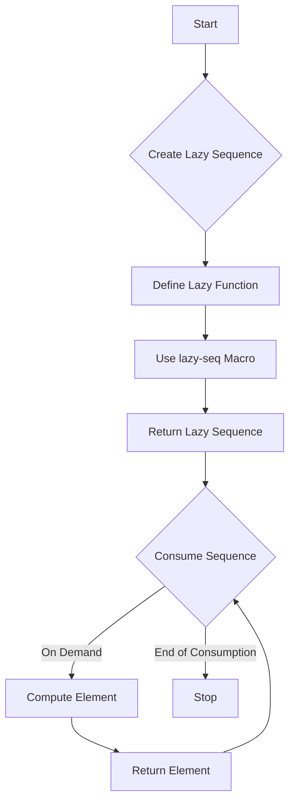

## 3.3. Lazy Sequences and Infinite Data Structures

In the world of functional programming, Clojure stands out with its robust support for lazy sequences, a feature that allows developers to handle potentially infinite data structures efficiently. This section delves into the concept of lazy sequences, their creation, manipulation, and the advantages they offer in terms of resource management and performance optimization.

### Understanding Lazy Sequences

Lazy sequences in Clojure are sequences where the elements are computed on demand. This means that the computation of elements is deferred until they are actually needed, allowing for efficient handling of large datasets and even infinite sequences. This concept is crucial in functional programming, where immutability and statelessness are key principles.

#### Purpose of Lazy Sequences

The primary purpose of lazy sequences is to enable the processing of large or infinite data structures without the need to load the entire dataset into memory. This is achieved by evaluating elements only when they are accessed, thus conserving memory and computational resources.

### Creating Lazy Sequences

Clojure provides several ways to create lazy sequences. The most common method is using the `lazy-seq` macro, which allows you to define a sequence where each element is computed only when needed.

```clojure
(defn lazy-numbers [n]
  (lazy-seq
    (cons n (lazy-numbers (inc n)))))

;; Usage
(take 5 (lazy-numbers 0)) ; => (0 1 2 3 4)
```

In this example, `lazy-numbers` generates an infinite sequence of numbers starting from `n`. The `lazy-seq` macro ensures that each subsequent number is computed only when required.

#### Using Built-in Functions

Clojure's standard library includes several functions that return lazy sequences. Functions like `map`, `filter`, and `range` are inherently lazy, meaning they produce sequences that are evaluated lazily.

```clojure
;; Using range to create a lazy sequence of numbers
(def numbers (range 1000000))

;; Only the first 10 numbers are realized
(take 10 numbers) ; => (0 1 2 3 4 5 6 7 8 9)
```

### Working with Infinite Sequences

One of the most powerful applications of lazy sequences is the ability to work with infinite sequences. Since elements are computed on demand, you can define sequences that conceptually have no end.

#### Example: Fibonacci Sequence

The Fibonacci sequence is a classic example of an infinite sequence that can be elegantly expressed using lazy sequences in Clojure.

```clojure
(defn fib
  ([] (fib 0 1))
  ([a b] (lazy-seq (cons a (fib b (+ a b))))))

;; Usage
(take 10 (fib)) ; => (0 1 1 2 3 5 8 13 21 34)
```

In this example, the `fib` function generates an infinite sequence of Fibonacci numbers. The use of `lazy-seq` ensures that each number is computed only when needed.

### Benefits of Laziness

Lazy sequences offer several benefits, particularly in terms of resource management and performance:

- **Memory Efficiency**: By computing elements only when needed, lazy sequences reduce memory usage, especially when dealing with large datasets.
- **Improved Performance**: Laziness allows for optimizations such as short-circuiting operations, where the computation stops as soon as the result is determined.
- **Composability**: Lazy sequences can be easily composed with other functions, enabling powerful data processing pipelines.

### Potential Pitfalls

While lazy sequences are powerful, they come with certain pitfalls that developers need to be aware of:

- **Holding onto Head References**: If a reference to the head of a lazy sequence is retained, it can prevent the garbage collector from reclaiming memory, leading to potential memory leaks.
- **Realization of Entire Sequences**: Operations that require the realization of the entire sequence, such as `count`, can negate the benefits of laziness by forcing the computation of all elements.

### Visualizing Lazy Sequences

To better understand how lazy sequences work, let's visualize the process of creating and consuming a lazy sequence using a flowchart.



**Figure 1**: This flowchart illustrates the process of creating and consuming a lazy sequence in Clojure. The sequence is defined using the `lazy-seq` macro and elements are computed only when needed.

### Try It Yourself

Experiment with lazy sequences by modifying the examples provided. Try creating your own infinite sequences or use lazy sequences to process large datasets efficiently.

- **Challenge**: Modify the Fibonacci sequence example to generate a sequence of prime numbers.
- **Experiment**: Use lazy sequences to filter and transform large datasets without loading them entirely into memory.

### References and Further Reading

- [Clojure Documentation on Lazy Sequences](https://clojure.org/reference/sequences)
- [Functional Programming in Clojure](https://www.braveclojure.com/functional-programming/)
- [Understanding Lazy Evaluation](https://en.wikipedia.org/wiki/Lazy_evaluation)

### Knowledge Check

To reinforce your understanding of lazy sequences and infinite data structures, try answering the following questions.

## **Ready to Test Your Knowledge?**



### What is the primary purpose of lazy sequences in Clojure?

- [x] To enable processing of large or infinite data structures without loading them entirely into memory.
- [ ] To speed up the computation of sequences.
- [ ] To allow sequences to be mutable.
- [ ] To simplify the syntax of sequence operations.

> **Explanation:** Lazy sequences allow for efficient handling of large or infinite data structures by computing elements only when needed, thus conserving memory.

### Which Clojure macro is commonly used to define lazy sequences?

- [x] `lazy-seq`
- [ ] `defn`
- [ ] `let`
- [ ] `loop`

> **Explanation:** The `lazy-seq` macro is used to define sequences where elements are computed on demand.

### What is a potential pitfall of using lazy sequences?

- [x] Holding onto head references can lead to memory leaks.
- [ ] Lazy sequences are always slower than eager sequences.
- [ ] Lazy sequences cannot be composed with other functions.
- [ ] Lazy sequences require more memory than eager sequences.

> **Explanation:** Retaining references to the head of a lazy sequence can prevent memory from being reclaimed, leading to memory leaks.

### How can you create an infinite sequence of numbers in Clojure?

- [x] By using a recursive function with `lazy-seq`.
- [ ] By using a `for` loop.
- [ ] By using the `range` function without arguments.
- [ ] By using the `map` function.

> **Explanation:** A recursive function with `lazy-seq` can generate an infinite sequence by deferring computation of elements.

### What is the result of `(take 5 (range))` in Clojure?

- [x] `(0 1 2 3 4)`
- [ ] `(1 2 3 4 5)`
- [ ] `(0 1 2 3 4 5)`
- [ ] `(1 2 3 4)`

> **Explanation:** The `range` function generates a lazy sequence of numbers starting from 0, and `take 5` retrieves the first five elements.

### What is a benefit of using lazy sequences?

- [x] Improved memory efficiency.
- [ ] Increased code complexity.
- [ ] Faster computation of all elements.
- [ ] Easier debugging.

> **Explanation:** Lazy sequences improve memory efficiency by computing elements only when needed.

### Which function is inherently lazy in Clojure?

- [x] `map`
- [ ] `reduce`
- [ ] `apply`
- [ ] `assoc`

> **Explanation:** The `map` function returns a lazy sequence, computing elements only when accessed.

### What happens when you call `count` on a lazy sequence?

- [x] The entire sequence is realized.
- [ ] Only the first element is computed.
- [ ] The sequence remains lazy.
- [ ] An error is thrown.

> **Explanation:** Calling `count` on a lazy sequence forces the realization of all elements, negating the benefits of laziness.

### Can lazy sequences be composed with other functions?

- [x] True
- [ ] False

> **Explanation:** Lazy sequences can be easily composed with other functions, enabling powerful data processing pipelines.

### What is the result of `(take 3 (repeat 42))`?

- [x] `(42 42 42)`
- [ ] `(42 42)`
- [ ] `(42)`
- [ ] `(42 42 42 42)`

> **Explanation:** The `repeat` function generates an infinite lazy sequence of the given element, and `take 3` retrieves the first three elements.



Remember, mastering lazy sequences and infinite data structures in Clojure opens up a world of possibilities for efficient data processing. Keep exploring and experimenting to fully harness the power of laziness in your Clojure applications!
